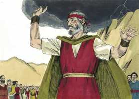

# Êxodo Cap 35

**1** 	ENTÃO Moisés convocou toda a congregação dos filhos de Israel, e disse-lhes: Estas são as palavras que o Senhor ordenou que se cumprissem.

> **Cmt MHenry**: *Versículos 1-3* O jugo leve e fácil de Cristo tem feito mais deliciosos nossos deveres, e menos irritantes as restrições de nosso dia de repouso que as do repouso judaico; porém nós somos mais culpáveis por descuidá-lo. Certamente a sabedoria de Deus ao dar-nos o dia de repouso com toda a misericórdia de seus propósitos são pecaminosamente deixados de lado. É nada marcar com o desprezo o dia bendito, que nos foi dado por um Deus generoso para que cresçamos em graça com a igreja aqui embaixo, a fim de preparar-nos para a felicidade com a igreja no alto?

 

**2** 	Seis dias se trabalhará, mas o sétimo dia vos será santo, o sábado do repouso ao Senhor; todo aquele que nele fizer qualquer trabalho morrerá.

 

**3** 	Não acendereis fogo em nenhuma das vossas moradas no dia do sábado.

**4** 	Falou mais Moisés a toda a congregação dos filhos de Israel, dizendo: Esta é a palavra que o Senhor ordenou, dizendo:

> **Cmt MHenry**: *Versículos 4-19* O tabernáculo estaria dedicado à honra de Deus, e se usaria para seu serviço; portanto, o que se trouxer para sua construção era uma oferta para o Senhor. A regra é: Todo generoso de coração a trará. Todos os que têm destreza devem trabalhar. Deus dispensa seus dons; e cada homem, segundo tenha recebido, assim deve ministrar ([1 Pe 4.10](../60N-1Pe/04.md#10)). Os que eram ricos deviam trazer materiais para trabalhá-los; os que eram hábeis, deviam servir o tabernáculo com suas habilidades; como necessitavam uns dos outros, assim o tabernáculo os necessitava a ambos ([1 Co 12.7-21](../46N-1Co/12.md#7)).

 

**5** 	Tomai do que tendes, uma oferta para o Senhor; cada um, cujo coração é voluntariamente disposto, a trará por oferta alçada ao Senhor: ouro, prata e cobre,

**6** 	Como também azul, púrpura, carmesim, linho fino, pêlos de cabras,

**7** 	E peles de carneiros, tintas de vermelho, e peles de texugos, madeira de acácia,

**8** 	E azeite para a luminária, e especiarias para o azeite da unção, e para o incenso aromático.

**9** 	E pedras de ônix, e pedras de engaste, para o éfode e para o peitoral.

**10** 	E venham todos os sábios de coração entre vós, e façam tudo o que o Senhor tem mandado;

**11** 	O tabernáculo, a sua tenda e a sua coberta, os seus colchetes e as suas tábuas, as suas barras, as suas colunas, e as suas bases;

**12** 	A arca e os seus varais, o propiciatório e o véu de cobertura,

**13** 	A mesa e os seus varais, e todos os seus pertences; e os pães da proposição,

**14** 	E o candelabro da luminária, e os seus utensílios, e as suas lâmpadas, e o azeite para a luminária,

**15** 	E o altar do incenso e os seus varais, e o azeite da unção, e o incenso aromático, e a cortina da porta para a entrada do tabernáculo,

**16** 	O altar do holocausto, e o crivo de cobre, os seus varais, e todos os seus pertences, a pia e a sua base,

**17** 	As cortinas do pátio, as suas colunas e as suas bases, e o reposteiro da porta do pátio,

**18** 	As estacas do tabernáculo, e as estacas do pátio, e as suas cordas,

**19** 	As vestes do ministério para ministrar no santuário, as vestes santas de Arão o sacerdote, e as vestes de seus filhos, para administrarem o sacerdócio.

**20** 	Então toda a congregação dos filhos de Israel saiu da presença de Moisés,

> **Cmt MHenry**: *Versículos 20-29* Sem uma mente voluntária seriam aborrecíveis as ofertas custosas; com ela, até a mais pequena será aceitável. Nosso coração está disposto quando assistimos alegremente a promover a causa de Deus. Os que são diligentes e estão contentes com empregos considerados baixos, são tão aceitáveis por Deus como os que estão em serviços esplêndidos. As mulheres que fiaram o pelo de cabra eram de coração sábio, porque o fizeram de todo coração para o Senhor. Assim o lavrador, o mecânico ou o servo que atende seu trabalho na fé e temor de Deus, pode ser tão sábio, em seu lugar, como o ministro mais útil, e ser igualmente aceito pelo Senhor. nossa sabedoria e dever consistem em dar a Deus a glória e a utilidade de nossos talentos, sejam muitos ou poucos.

**21** 	E veio todo o homem, a quem o seu coração moveu, e todo aquele cujo espírito voluntariamente o excitou, e trouxeram a oferta alçada ao Senhor para a obra da tenda da congregação, e para todo o seu serviço, e para as vestes santas.

**22** 	Assim vieram homens e mulheres, todos dispostos de coração; trouxeram fivelas, e pendentes, e anéis, e braceletes, todos os objetos de ouro; e todo o homem fazia oferta de ouro ao Senhor;

**23** 	E todo o homem que se achou com azul, e púrpura, e carmesim, e linho fino, e pêlos de cabras, e peles de carneiro tintas de vermelho, e peles de texugos, os trazia;

**24** 	Todo aquele que fazia oferta alçada de prata ou de metal, a trazia por oferta alçada ao Senhor; e todo aquele que possuía madeira de acácia, a trazia para toda a obra do serviço.

**25** 	E todas as mulheres sábias de coração fiavam com as suas mãos, e traziam o que tinham fiado, o azul e a púrpura, o carmesim e o linho fino.

**26** 	E todas as mulheres, cujo coração as moveu em habilidade fiavam os pêlos das cabras.

**27** 	E os príncipes traziam pedras de ônix e pedras de engastes para o éfode e para o peitoral,

**28** 	E especiarias, e azeite para a luminária, e para o azeite da unção, e para o incenso aromático.

**29** 	Todo homem e mulher, cujo coração voluntariamente se moveu a trazer alguma coisa para toda a obra que o Senhor ordenara se fizesse pela mão de Moisés; assim os filhos de Israel trouxeram por oferta voluntária ao Senhor.

**30** 	Depois disse Moisés aos filhos de Israel: Eis que o Senhor tem chamado por nome a Bezalel, filho de Uri, filho de Hur, da tribo de Judá.

> **Cmt MHenry**: *Versículos 30-35* Aqui está a nomeação divina dos mestres para que não houvesse contenda pelo ofício, e todos os que estivessem empregados na obra pudessem receber ordens deles e serem responsáveis diante deles. Aos que Deus chamou para seu serviço, Ele os encheu com o Espírito de Deus. A destreza, ainda em empregos mundanos, é dom de Deus e vem do alto. Mas há muitos bastante dispostos a organizar o trabalho dos outros, e podem dizer o que deve realizar este ou aquele homem; mas eles não tocariam nem com um dedo as cargas que amarram sobre os outros. Os tais ficarão sob a categoria de servos negligentes. Estes homens não estavam somente para desenhar e trabalhar; além disso, deviam ensinar aos outros. os que dirigem, devem ensinar; e aqueles aos que Deus tem dado conhecimentos devem estar dispostos a dá-los a conhecer para benefício do próximo.

**31** 	E o Espírito de Deus o encheu de sabedoria, entendimento, ciência e em todo o lavor,

**32** 	E para criar invenções, para trabalhar em ouro, e em prata, e em cobre,

**33** 	E em lapidar de pedras para engastar, e em entalhar madeira, e para trabalhar em toda a obra esmerada.

**34** 	Também lhe dispôs o coração para ensinar a outros; a ele e a Aoliabe, o filho de Aisamaque, da tribo de Dã.

**35** 	Encheu-os de sabedoria do coração, para fazer toda a obra de mestre, até a mais engenhosa, e a do gravador, em azul, e em púrpura, em carmesim, e em linho fino, e do tecelão; fazendo toda a obra, e criando invenções.

> **Cmt MHenry**: *CAPÍTULO 35A-Hc

> **Cmt MHenry** Intro: *• Versículos 1-3*> *Observância do dia de repouso*> *• Versículos 4-19*> 28A-Os donativos voluntários para o tabernáculo*> *• Versículos 20-29*> *A disposição do povo em geral*> *• Versículos 30-35*> *Bezaleel e Aoliabe chamados à obra*