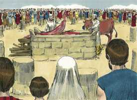

# Levítico Cap 01

**1** 	E CHAMOU o Senhor a Moisés, e falou com ele da tenda da congregação, dizendo:

> **Cmt MHenry**: *Versículos 1-2* A oferta de sacrifícios era uma ordenança para a religião verdadeira, desde a queda do homem até a vinda de Cristo. Porém parece que não houve regulamentos muito detalhados até que os israelitas estiveram no deserto. O desígnio geral destas leis é claro. Os sacrifícios tipificavam a Cristo; também eram sombras do dever, caráter, privilégio e comunhão do crente com Deus. quase não há algo que a Escritura diga Deus Senhor Jesus que, também, não faça referência a seu povo. este livro começa com as leis dos sacrifícios; os mais antigos eram os holocaustos, sobre os quando Deus dá ordens a Moisés nesta passagem. Se dá por sentado que o povo estava disposto a trazer ofertas ao Senhor. a luz mesma da natureza dirige o homem de uma ou outra forma para honrar a seu Criador como seu Senhor. os sacrifícios foram ordenados imediatamente depois da queda.

> **Cmt MHenry**: *CAPÍTULO 10A-2Sm 11A-1Rs 12A-2Rs 13A-1Cr 14A-2Cr 15A-Es 16A-Ne 17A-Et 18A-Jo 19A-Sl

**2** 	Fala aos filhos de Israel, e dize-lhes: Quando algum de vós oferecer oferta ao Senhor, oferecerá a sua oferta de gado, isto é, de gado vacum e de ovelha.

**3** 	Se a sua oferta for holocausto de gado, oferecerá macho sem defeito; à porta da tenda da congregação a oferecerá, de sua própria vontade, perante o Senhor.

> **Cmt MHenry**: *Versículos 3-9* Na correta execução das ordenanças levíticas, os mistérios do mundo espiritual são representados pelos objetos naturais correspondentes. Em seus ritos se exibem acontecimentos futuros. Sem isto, todo o conjunto parecerá um cerimonial sem sentido. Há nestas coisas um tipo dos sofrimentos do Filho de Deus, que seria o sacrifício pelos pecados de todo mundo? Queimar o corpo de um animal somente era uma fraca representação da miséria eterna que todos merecemos, e que nosso bendito Senhor levou em seu corpo e em sua alma, quando morreu sob a carga de nossas iniqüidades. Observe-se: 1) O animal que se oferecia devia ser sem defeito. Isto significava a força e pureza que havia em Cristo e a vida santa que deve haver em seu povo. 2) O proprietário devia oferecê-lo por própria e livre vontade. O que se faz na religião para agradar a Deus deve fazer-se por amor. Cristo se ofereceu voluntariamente por nós. 3) Devia oferecer-se na porta do tabernáculo onde estava o altar de bronze do holocausto, que santificava a dádiva: devia oferecê-lo na porta, como quem é indigno de entrar, e reconhecendo que um pecador não pode ter comunhão com Deus, senão por meio do sacrifício. 4) O ofrendante devia colocar sua mão sobre a cabeça da oferta, significando com isso seu desejo e esperança de ser aceito, de sua parte, cristianismo expiação por ele. 5) O sacrifício devia ser morto diante do Senhor, em forma ordenada e para honrar a Deus. significava também que no cristão deve ser crucificada a carne com seus afetos corruptos e suas concupiscências. 6) Os sacerdotes deviam aspergir o sangue sobre o altar; já que o sangue é a vida, é ele o que faz expiação. Isto representa a pacificação e purificação de nossa consciência, por meio da aspersão do sangue de Jesus Cristo sobre ela, por fé. 7) O animal devia ser partido em vários pedaços e, depois, queimado sobre o altar. A queima do sacrifício representa os agudos sofrimentos de Cristo e o afeto devoto com que, como fogo santo, o cristão deve oferecer-se completamente —espírito, alma e corpo— a Deus. 8) Se diz que isto era uma oferta de cheiro grato. Como ato de obediência a um mandado divino, e como tipo de Cristo, era agradável a Deus; os sacrifícios espirituais dos crentes são aceitáveis para Deus por meio de Cristo ([1 Pe 2.5](../60N-1Pe/02.md#5)).

 

**4** 	E porá a sua mão sobre a cabeça do holocausto, para que seja aceito a favor dele, para a sua expiação.

**5** 	Depois degolará o bezerro perante o Senhor; e os filhos de Arão, os sacerdotes, oferecerão o sangue, e espargirão o sangue em redor sobre o altar que está diante da porta da tenda da congregação.

**6** 	Então esfolará o holocausto, e o partirá nos seus pedaços.

**7** 	E os filhos de Arão, o sacerdote, porão fogo sobre o altar, pondo em ordem a lenha sobre o fogo.

**8** 	Também os filhos de Arão, os sacerdotes, porão em ordem os pedaços, a cabeça e o redenho sobre a lenha que está no fogo em cima do altar;

**9** 	Porém a sua fressura e as suas pernas lavar-se-ão com água; e o sacerdote tudo isso queimará sobre o altar; holocausto é, oferta queimada, de cheiro suave ao Senhor.

**10** 	E se a sua oferta for de gado miúdo, de ovelhas ou de cabras, para holocausto, oferecerá macho sem defeito.

> **Cmt MHenry**: *Versículos 10-17* Os que não podiam oferecer um bovino, deviam trazer uma ovelha ou cabra; os que não podiam isso eram aceitos por Deus se traziam uma rola ou um pombinho. As criaturas escolhidas para o sacrifício deviam ser mansas, delicadas e inofensivas, para mostrar a inocência e mansidão que houve em Cristo, e que deve haver nos cristãos. A oferta do pobre é tão tipo da expiação de Cristo como os sacrifícios mais caros, e expressava tão completamente como os outros o arrependimento, fé e devoção a Deus. Não temos escusa se recusamos o culto ao Deus agradável e racional agora requerido. Mas não podemos oferecer o sacrifício de um coração quebrantado, ou de louvor e ação de graças, assim como um israelita não podia oferecer um bovino ou cabra, se Deus não se dava a si mesmo primeiro. Quanto mais façamos no serviço do Senhor, mais obrigados estaremos com Ele, por sua vontade, a capacitação e a oportunidade. Em muitas coisas Deus deixa que nós fixemos o que deverá gastar-se em seu serviço, seja de nosso tempo ou de nossa substância; contudo, quando a providência de Deus tenha dado muito a um homem, não se aceitarão ofertas magras, pois não são expressões corretas de uma mente bem disposta. Consagremo-nos a Seu serviço em corpo e alma, seja o que for que nos peça que demos, aventuremos, façamos ou soframos por amor que Ele.

**11** 	E o degolará ao lado do altar que dá para o norte, perante o Senhor; e os filhos de Arão, os sacerdotes, espargirão o seu sangue em redor sobre o altar.

**12** 	Depois o partirá nos seus pedaços, como também a sua cabeça e o seu redenho; e o sacerdote os porá em ordem sobre a lenha que está no fogo sobre o altar;

**13** 	Porém a fressura e as pernas lavar-se-ão com água; e o sacerdote tudo oferecerá, e o queimará sobre o altar; holocausto é, oferta queimada, de cheiro suave ao Senhor.

**14** 	E se a sua oferta ao Senhor for holocausto de aves, oferecerá a sua oferta de rolas ou de pombinhos;

**15** 	E o sacerdote a oferecerá sobre o altar, e tirar-lhe-á a cabeça, e a queimará sobre o altar; e o seu sangue será espremido na parede do altar;

**16** 	E o seu papo com as suas penas tirará e o lançará junto ao altar, para o lado do oriente, no lugar da cinza;

**17** 	E fendê-la-á junto às suas asas, porém não a partirá; e o sacerdote a queimará em cima do altar sobre a lenha que está no fogo; holocausto é, oferta queimada de cheiro suave ao Senhor.

> **Cmt MHenry** Intro: *• Versículos 1-2*> *As ofertas*> *• Versículos 3-9*> *De rebanhos*> *• Versículos 10-17*> *De manadas e aves*