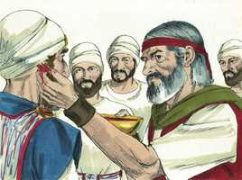
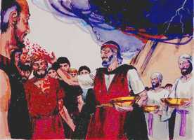

# Levítico Cap 08

**1** 	FALOU mais o Senhor a Moisés, dizendo:

> **Cmt MHenry**: *Versículos 1-13* A consagração de Arão e seus filhos tinha sido postergada até que o tabernáculo estivesse terminado, e entregadas as leis dos sacrifícios. Arão e seus filhos deviam ser lavados com água para significar que deviam purificar-se de todas as disposições pecaminosas e manter-se sempre puros. Cristo lava de seus pecados com seu próprio sangue aos que Ele faz reis e sacerdotes para nosso Deus ([Ap 1.5-6](../66N-Ap/01.md#5)); e os que se aproximam a Deus devem ser lavados em água pura ([Hb 10.22](../58N-Hb/10.md#22)). A unção de Arão era tipo da unção de Cristo com o Espírito, que não lhe foi dada por medida. Todos os crentes têm recebido a unção.

**2** 	Toma a Arão e a seus filhos com ele, e as vestes, e o azeite da unção, como também o novilho da expiação do pecado, e os dois carneiros, e o cesto dos pães ázimos,

**3** 	E reúne toda a congregação à porta da tenda da congregação.

**4** 	Fez, pois, Moisés como o Senhor lhe ordenara, e a congregação reuniu-se à porta da tenda da congregação.

**5** 	Então disse Moisés à congregação: Isto é o que o Senhor ordenou que se fizesse.

**6** 	E Moisés fez chegar a Arão e a seus filhos, e os lavou com água.

**7** 	E vestiu-lhe a túnica, e cingiu-o com o cinto, e pôs sobre ele o manto; também pôs sobre ele o éfode, e cingiu-o com o cinto de obra esmerada do éfode e o apertou com ele.

**8** 	Depois pôs-lhe o peitoral, pondo no peitoral o Urim e o Tumim;

> **Cmt MHenry**: *CAPÍTULO 8*

**9** 	E pôs a mitra sobre a sua cabeça; e sobre esta, na parte dianteira, pôs a lâmina de ouro, a coroa da santidade, como o Senhor ordenara a Moisés.

**10** 	Então Moisés tomou o azeite da unção, e ungiu o tabernáculo, e tudo o que havia nele, e o santificou;

**11** 	E dele espargiu sete vezes sobre o altar, e ungiu o altar e todos os seus utensílios, como também a pia e a sua base, para santificá-las.

**12** 	Depois derramou do azeite da unção sobre a cabeça de Arão, e ungiu-o, para santificá-lo.

**13** 	Também Moisés fez chegar os filhos de Arão, e vestiu-lhes as túnicas, e cingiu-os com o cinto, e apertou-lhes as tiaras, como o Senhor ordenara a Moisés.

**14** 	Então fez chegar o novilho da expiação do pecado; e Arão e seus filhos puseram as suas mãos sobre a cabeça do novilho da expiação do pecado;

> **Cmt MHenry**: *Versículos 14-36* Nestes tipos vemos a nosso grande Sumo Sacerdote, Cristo Jesus, solenemente nomeado, ungido e revestido com seu ofício sacro por seu sangue e pela influência de seu Espírito Santo; Ele santifica as ordenanças da religião para benefício de seu povo e para honra de Deus Pai que, por amor a Ele, aceita nossa adoração embora esteja contaminada com pecado. também podemos regozijar-nos em que Ele é misericordioso e fiel Sumo Sacerdote, cheio de compaixão pela alma de mente fraca e sacudida pela tormenta. Todos os verdadeiros cristãos têm sido consagrados para serem sacerdotes espirituais. Devemos perguntar-nos seriamente: Em nosso diário andar, estudamos para manter este caráter? E, abundamos em sacrifícios espirituais aceitáveis para Deus por meio de Cristo? De ser assim, ainda não há razão para jactar-se. Não desprezemos a nosso próximo pecador; senão que, lembrando o que temos feitos, e como fomos lavados, procuremos e oremos por sua salvação.

**15** 	E o degolou; e Moisés tomou o sangue, e pôs dele com o seu dedo sobre as pontas do altar em redor, e purificou o altar; depois derramou o restante do sangue à base do altar, e o santificou, para fazer expiação por ele.

**16** 	Depois tomou toda a gordura que está na fressura, e o redenho do fígado, e os dois rins e a sua gordura; e Moisés queimou-os sobre o altar.

**17** 	Mas o novilho com o seu couro, e a sua carne, e o seu esterco, queimou com fogo fora do arraial, como o Senhor ordenara a Moisés.

**18** 	Depois fez chegar o carneiro do holocausto; e Arão e seus filhos puseram as suas mãos sobre a cabeça do carneiro;

**19** 	E degolou-o; e Moisés espargiu o sangue sobre o altar em redor.

**20** 	Partiu também o carneiro nos seus pedaços; e Moisés queimou a cabeça, e os pedaços e a gordura.

**21** 	Porém a fressura e as pernas lavou com água; e Moisés queimou todo o carneiro sobre o altar; holocausto de cheiro suave, uma oferta queimada ao Senhor, como o Senhor ordenou a Moisés.

**22** 	Depois fez chegar o outro carneiro, o carneiro da consagração; e Arão com seus filhos puseram as suas mãos sobre a cabeça do carneiro.

**23** 	E degolou-o; e Moisés tomou do seu sangue, e o pôs sobre a ponta da orelha direita de Arão, e sobre o polegar da sua mão direita, e sobre o polegar do seu pé direito.

 

**24** 	Moisés também fez chegar os filhos de Arão, e pôs daquele sangue sobre a ponta da orelha direita deles, e sobre o polegar da sua mão direita, e sobre o polegar do seu pé direito; e Moisés espargiu o restante do sangue sobre o altar em redor.

**25** 	E tomou a gordura, e a cauda, e toda a gordura que está na fressura, e o redenho do fígado, e ambos os rins, e a sua gordura e a espádua direita.

**26** 	Também do cesto dos pães ázimos, que estava diante do Senhor, tomou um bolo ázimo, e um bolo de pão azeitado, e um coscorão, e os pôs sobre a gordura e sobre a espádua direita.

**27** 	E tudo isto pôs nas mãos de Arão e nas mãos de seus filhos; e os ofereceu por oferta movida perante o Senhor.

**28** 	Depois Moisés tomou-os das suas mãos, e os queimou no altar sobre o holocausto; estes foram uma consagração, por cheiro suave, oferta queimada ao Senhor.

**29** 	E tomou Moisés o peito, e ofereceu-o por oferta movida perante o Senhor. Aquela foi a porção de Moisés do carneiro da consagração, como o Senhor ordenara a Moisés.

**30** 	Tomou Moisés também do azeite da unção, e do sangue que estava sobre o altar, e o espargiu sobre Arão e sobre as suas vestes, e sobre os seus filhos, e sobre as vestes de seus filhos com ele; e santificou a Arão e as suas vestes, e seus filhos, e as vestes de seus filhos com ele.

 

**31** 	E Moisés disse a Arão, e a seus filhos: Cozei a carne diante da porta da tenda da congregação, e ali a comereis com o pão que está no cesto da consagração, como tenho ordenado, dizendo: Arão e seus filhos a comerão.

**32** 	Mas o que sobejar da carne e do pão, queimareis com fogo.

**33** 	Também da porta da tenda da congregação não saireis por sete dias, até ao dia em que se cumprirem os dias da vossa consagração; porquanto por sete dias ele vos consagrará.

**34** 	Como se fez neste dia, assim o Senhor ordenou se fizesse, para fazer expiação por vós.

**35** 	Ficareis, pois, à porta da tenda da congregação dia e noite por sete dias, e guardareis as ordenanças do Senhor, para que não morrais; porque assim me foi ordenado.

**36** 	E Arão e seus filhos fizeram todas as coisas que o Senhor ordenara pela mão de Moisés.

> **Cmt MHenry** Intro: *• Versículos 1-13*> *A consagração de Arão e seus filhos*> *• Versículos 14-36*> *As ofertas de consagração*