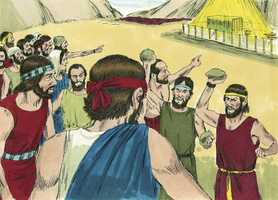
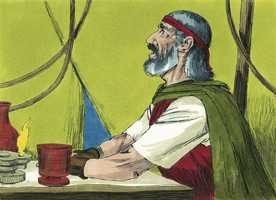
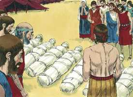
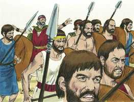
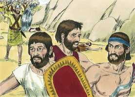

# Números Cap 14

**1** 	ENTÃO toda a congregação levantou a sua voz; e o povo chorou naquela noite.

> **Cmt MHenry**: *Versículos 1-4* Os que não confiam em Deus continuamente se desconcertam a si mesmos. A tristeza do mundo produz morte. Os israelitas murmuraram contra Moisés e Arão e, neles, recriminavam ao Senhor. Olharam para trás com descontentamento sem causa. Veja-se a loucura das paixões desenfreadas que fazem que os homens desprezem o que a natureza conta como mais querido: a vida mesma. Eles desejam morrer como criminosos sob a justiça de Deus antes de viver em seu favor como vencedores. Por último, resolvem que, em lugar de seguir adiante a Canaã, preferem regressar ao Egito. Os que não andam no conselho de Deus procuram sua própria ruína. Podiam esperar que a nuvem de Deus os guiasse ou que seu maná os assistisse? Supondo que as dificuldades para conquistar Canaã fossem como as imaginavam, ainda as de retornar ao Egito eram muito piores. Nos queixamos de nosso lugar e sorte e gostaríamos de mudá-los; porém, existe neste mundo algum lugar ou situação que não tenha algo em si que nos incomode se estamos predispostos a isso? A forma de melhorar nossa condição é colocar nossos espíritos num marco melhor. Veja-se a tolice de afastar-se dos caminhos de Deus. mas os homens correm para as seguras conseqüências fatais de um rumo pecaminoso.

**2** 	E todos os filhos de Israel murmuraram contra Moisés e contra Arão; e toda a congregação lhes disse: Quem dera tivéssemos morrido na terra do Egito! ou, mesmo neste deserto!

**3** 	E por que o Senhor nos traz a esta terra, para cairmos à espada, e para que nossas mulheres e nossas crianças sejam por presa? Não nos seria melhor voltarmos ao Egito?

**4** 	E diziam uns aos outros: Constituamos um líder, e voltemos ao Egito.

**5** 	Então Moisés e Arão caíram sobre os seus rostos perante toda a congregação dos filhos de Israel.

> **Cmt MHenry**: *Versículos 5-10* Moisés e Arão ficaram atônitos ao ver a um povo que despreza as misericórdias que lhe pertencem. Calebe e Josué asseguram a gente da bondade da terra. Minimizam as dificuldades para consegui-la. Se os homens se convencessem do desejável que são os ganhos da religião, não se deteriam ante os requerimentos dela. Embora os cananeus habitavam em cidades amuralhadas, seu amparo tinha-se afastado deles. Os outros espias atentaram para a força deles, mas estes perceberam sua maldade. Ninguém pode estar a salvo quando provocam que Deus os abandone. Embora Israel more em tendas, eles estão fortificados. Enquanto tenhamos a presença de Deus conosco, não devemos temer a força mais poderosa que se levantar em nossa contra. Os pecadores são destruídos por sua própria rebelião. Todavia quem, como Calebe e Josué, se expõem fielmente por amor a Deus, é seguro que serão colocados sob sua proteção especial e serão escondidos, sob o céu ou no céu, da ira dos homens.

**6** 	E Josué, filho de Num, e Calebe filho de Jefoné, dos que espiaram a terra, rasgaram as suas vestes.

**7** 	E falaram a toda a congregação dos filhos de Israel, dizendo: A terra pela qual passamos a espiar é terra muito boa.

**8** 	Se o Senhor se agradar de nós, então nos porá nesta terra, e no-la dará; terra que mana leite e mel.

**9** 	Tão-somente não sejais rebeldes contra o Senhor, e não temais o povo dessa terra, porquanto são eles nosso pão; retirou-se deles o seu amparo, e o Senhor é conosco; não os temais.

**10** 	Mas toda a congregação disse que os apedrejassem; porém a glória do Senhor apareceu na tenda da congregação a todos os filhos de Israel.

 

**11** 	E disse o Senhor a Moisés: Até quando me provocará este povo? e até quando não crerá em mim, apesar de todos os sinais que fiz no meio dele?

> **Cmt MHenry**: *Versículos 11-19* Moisés fez uma humilde intercessão por Israel. Aqui ele é tipo de Cristo, que orou por aqueles que o trataram desdenhosamente. O país do pecado de uma nação é o afastamento do castigo da nação; por isso Moisés é aqui tão fervoroso. Ele alega que, coerentemente com seu caráter, Deus poderia perdoá-los em suas abundantes misericórdias.

**12** 	Com pestilência o ferirei, e o rejeitarei; e te farei a ti povo maior e mais forte do que este.

**13** 	E disse Moisés ao Senhor: Assim os egípcios o ouvirão; porquanto com a tua força fizeste subir este povo do meio deles.

 

**14** 	E dirão aos moradores desta terra, os quais ouviram que tu, ó Senhor, estás no meio deste povo, que face a face, ó Senhor, lhes apareces, que tua nuvem está sobre ele e que vais adiante dele numa coluna de nuvem de dia, e numa coluna de fogo de noite.

> **Cmt MHenry**: *CAPÍTULO 14A-2Cr

**15** 	E se matares este povo como a um só homem, então as nações, que antes ouviram a tua fama, falarão, dizendo:

**16** 	Porquanto o Senhor não podia pôr este povo na terra que lhe tinha jurado; por isso os matou no deserto.

**17** 	Agora, pois, rogo-te que a força do meu Senhor se engrandeça; como tens falado, dizendo:

**18** 	O Senhor é longânimo, e grande em misericórdia, que perdoa a iniqüidade e a transgressão, que o culpado não tem por inocente, e visita a iniqüidade dos pais sobre os filhos até a terceira e quarta geração.

**19** 	Perdoa, pois, a iniqüidade deste povo, segundo a grandeza da tua misericórdia; e como também perdoaste a este povo desde a terra do Egito até aqui.

**20** 	E disse o Senhor: Conforme à tua palavra lhe perdoei.

> **Cmt MHenry**: *Versículos 20-35* O Senhor concedeu a oração de Moisés de não destruir de imediato a congregação, porém não acreditar na promessa proíbe o benefício. Os que desprezaram a terra desejável não poderão entrar nela. A promessa de Deus deverá cumprir-se em seus filhos. Eles desejaram morrer no deserto; Deus fez que seu pecado fosse sua ruína, lhes tomou a palavra e seus cadáveres caíram no deserto. Tiveram que gemer sob a carga de seu próprio pecado, que era demasiado pesada para que eles a suportassem. Conhecerão a ruptura de Sua promessa, e também o *fundamento* disso, conseguido pelo pecado deles —porque Deus nunca abandona a ninguém até que eles o abandonam primeiro a Ele—, e suas *conseqüências*, que provocarão sua ruína. Porém suas crianças, agora menores de vinte anos, que em sua incredulidade disseram que seriam presas, a eles fará entrar. Deus lhes fará saber que Ele pode distinguir entre o culpável e o inocente, e cortá-los sem tocar seus filhos. Deste modo Deus não tira por completo sua amorosa bondade.

**21** 	Porém, tão certamente como eu vivo, e como a glória do Senhor encherá toda a terra,

**22** 	E que todos os homens que viram a minha glória e os meus sinais, que fiz no Egito e no deserto, e me tentaram estas dez vezes, e não obedeceram à minha voz,

**23** 	Não verão a terra de que a seus pais jurei, e nenhum daqueles que me provocaram a verá.

**24** 	Porém o meu servo Calebe, porquanto nele houve outro espírito, e perseverou em seguir-me, eu o levarei à terra em que entrou, e a sua descendência a possuirá em herança.

**25** 	Ora, os amalequitas e os cananeus habitam no vale; tornai-vos amanhã e caminhai para o deserto pelo caminho do Mar Vermelho.

**26** 	Depois falou o Senhor a Moisés e a Arão dizendo:

**27** 	Até quando sofrerei esta má congregação, que murmura contra mim? Tenho ouvido as murmurações dos filhos de Israel, com que murmuram contra mim.

**28** 	Dize-lhes: Vivo eu, diz o Senhor, que, como falastes aos meus ouvidos, assim farei a vós outros.

**29** 	Neste deserto cairão os vossos cadáveres, como também todos os que de vós foram contados segundo toda a vossa conta, de vinte anos para cima, os que dentre vós contra mim murmurastes;

**30** 	Não entrareis na terra, pela qual levantei a minha mão que vos faria habitar nela, salvo Calebe, filho de Jefoné, e Josué, filho de Num.

**31** 	Mas os vossos filhos, de que dizeis: Por presa serão, porei nela; e eles conhecerão a terra que vós desprezastes.

**32** 	Porém, quanto a vós, os vossos cadáveres cairão neste deserto.

**33** 	E vossos filhos pastorearão neste deserto quarenta anos, e levarão sobre si as vossas infidelidades, até que os vossos cadáveres se consumam neste deserto.

**34** 	Segundo o número dos dias em que espiastes esta terra, quarenta dias, cada dia representando um ano, levareis sobre vós as vossas iniqüidades quarenta anos, e conhecereis o meu afastamento.

**35** 	Eu, o Senhor, falei; assim farei a toda esta má congregação, que se levantou contra mim; neste deserto se consumirão, e aí falecerão.

**36** 	E os homens que Moisés mandara a espiar a terra, e que, voltando, fizeram murmurar toda a congregação contra ele, infamando a terra,

> **Cmt MHenry**: *Versículos 36-39* Aqui está a morte súbita dos dez maus espiões. Pecaram ao caluniar a terra prometida. Provocam enormemente a Deus os que falam mal da religião, que produzem aversão pela fé na mente doa homens, ou que dão oportunidade para que o façam os que procuram a ocasião. Os murmuradores, com justiça, se convertem em lamentadores. Se tivessem lamentado o pecado quando foram repreendidos com fidelidade, teriam-se evitado a sentença; porém como se lamentaram somente pelo juízo, isso não serviu. No inferno estão os que assim se lamentam, mas as lágrimas não apagam as chamas, nem refrescam as línguas.

 

**37** 	Aqueles mesmos homens que infamaram a terra, morreram de praga perante o Senhor.

**38** 	Mas Josué, filho de Num, e Calebe, filho de Jefoné, que eram dos homens que foram espiar a terra, ficaram com vida.

**39** 	E falou Moisés estas palavras a todos os filhos de Israel; então o povo se contristou muito.

**40** 	E levantaram-se pela manhã de madrugada, e subiram ao cume do monte, dizendo: Eis-nos aqui, e subiremos ao lugar que o Senhor tem falado; porquanto havemos pecado.

> **Cmt MHenry**: *Versículos 40-45* Alguns dos israelitas agora queriam sinceramente ir e entrar em Canaã, mas já era demasiado tarde. Se os homens anelassem tão fervorosamente o céu enquanto durar seu dia de graça, como o anelarão quando seja demasiado tarde, quão bom seria para eles! Isso que foi dever em seu momento, quando fora de tempo, pode tornar-se pecado. os que estão fora do caminho do dever, não estão sob a proteção de Deus e andam a seu próprio risco. Deus os mandou ir, e não foram; Ele os proibiu de ir, e foram. Assim é a inimizade da mente carnal contra Deus. Desconfiaram do poder de Deus; agora presumiam de seu próprio poder, sem o dEle. Conseqüentemente, a expedição fracassa; agora começa a executar-se a sentença, que seus cadáveres cairiam no deserto. Nunca termina bem o que começa com pecado. o caminho para conseguir paz com nossos amigos e êxito contra nossos inimigos, é termos a Deus como Amigo nosso e manter-nos em seu amor. Tomemos como advertência o destino de Israel, não seja que pereçamos pelo mesmo exemplo de incredulidade. Vamos adiante dependendo da misericórdia, poder, promessa e verdade de Deus; Ele estará conosco, e conduzirá a nossa alma ao repouso eterno.

**41** 	Mas Moisés disse: Por que transgredis o mandado do Senhor? Pois isso não prosperará.

 

**42** 	Não subais, pois o Senhor não estará no meio de vós, para que não sejais feridos diante dos vossos inimigos.

**43** 	Porque os amalequitas e os cananeus estão ali diante da vossa face, e caireis à espada; pois, porquanto vos desviastes do Senhor, o Senhor não estará convosco.

**44** 	Contudo, temerariamente, tentaram subir ao cume do monte; mas a arca da aliança do Senhor e Moisés não se apartaram do meio do arraial.

**45** 	Então desceram os amalequitas e os cananeus, que habitavam na montanha, e os feriram, derrotando-os até Hormá.

 

> **Cmt MHenry** Intro: *• Versículos 1-4*> *O povo murmura ante o relato dos espias*> *• Versículos 5-10*> *Josué e Calebe se esforçam por tranqüilizar o povo*> *• Versículos 11-19*> *Ameaças divinas – Intercessão de Moisés*> *• Versículos 20-35*> *Impede-se que os murmuradores entrem na terra prometida*> *• Versículos 36-39*> *A morte dos maus espias*> *• Versículos 40-45*> *A derrota do povo que agora quis invadir a terra*