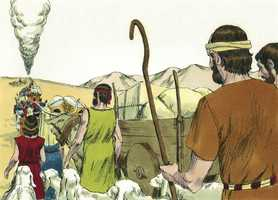
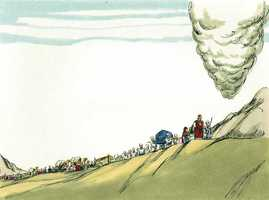

# Números Cap 21

**1** 	OUVINDO o cananeu, rei de Arade, que habitava para o lado sul, que Israel vinha pelo caminho dos espias, pelejou contra Israel, e dele levou alguns prisioneiros.

> **Cmt MHenry**: *Versículos 1-3* Antes que o povo começasse a dar um rodeio para passar Edom, o rei cananeu de Arade, a habitava no sul do país, os atacou no deserto e tomou alguns prisioneiros. Isto fez com que os israelitas olhassem em forma mais completa ao Senhor.

**2** 	Então Israel fez um voto ao Senhor, dizendo: Se de fato entregares este povo na minha mão, destruirei totalmente as suas cidades.

**3** 	O Senhor, pois, ouviu a voz de Israel, e lhe entregou os cananeus; e os israelitas destruíram totalmente, a eles e às suas cidades; e o nome daquele lugar chamou Hormá.

**4** 	Então partiram do monte Hor, pelo caminho do Mar Vermelho, a rodear a terra de Edom; porém a alma do povo angustiou-se naquele caminho.

> **Cmt MHenry**: *Versículos 4-9* Os filhos de Israel estavam fatigados pela longa marcha rodeando a terra de Edom. Falam descontentes do que Deus tinha feito por eles, e desconfiando do que Ele faria. Com que será agradado, quem não estaria feliz com o maná? Que o desprezo de alguns pela palavra de Deus não nos faça valorizá-la menos. É o pão de vida, o pão essencial que nutre aos que pela fé se alimentam dele para vida eterna, embora alguém o chame de pão leviano. Vemos o justo juízo de Deus sobre eles por murmurar. Ele enviou serpentes ardentes que morderam mortalmente a muitos. É de temer que não tivessem reconhecido o pecado de não ter sido pelo ardor da picada, mas transigiram sob a vara. Deus fez uma provisão maravilhosa para seu alívio. Os próprios judeus dizem que não era ver a serpente de bronze o que curava, senão que ao olhá-la, olhavam a Deus como o Senhor que os sarava. Havia muito do evangelho nisto, nosso Salvador declarou ([Jo 3.14-15](../43N-Joa/03.md#14)) que como Moisés levantou a serpente no deserto, assim era necessário que o Filho do homem fosse levantado para que todo aquele que nEle crê não se perca. Compare-se a *doença* deles com a nossa. O pecado morde como uma serpente, e pica como uma víbora venenosa. Compare-se a *aplicação* do remédio deles e o nosso, eles olharam e viveram; e nós, se crermos, não pereceremos. Pela fé olhamos a Jesus ([Hb 12.2](../58N-Hb/12.md#2)). Todo aquele que olhava, por desesperado que fosse seu caso, débil sua visão ou longe seu lugar, era curado, certa e completamente. O Senhor pode aliviar-nos de perigos e mal-estares por médios que a razão humana nunca teria concebido. Oh, que o veneno da serpente antiga, que inflama as paixões dos homens e os faz cometer pecados que desembocam na destruição eterna deles, fora tão sensivelmente sentido, e o perigo visto com tanta clareza, como os israelitas sentiram a dor da mordida das serpentes ardentes, e como temiam a subseqüente morte! Então, ninguém fecharia seus olhos a Cristo ou se afastaria de Seu evangelho. Então o Salvador crucificado seria tão valorizado como todo o resto seria contado como perda por Ele; então, sem demora, e com fervor e simplicidade, todos lhe suplicaríamos a Ele na forma indicada, clamando: Senhor, salva-nos, que perecemos! Ninguém abusaria da *liberdade* da salvação de Cristo, embora reconheceriam o preço que lhe *custou*.

 

**5** 	E o povo falou contra Deus e contra Moisés: Por que nos fizestes subir do Egito para que morrêssemos neste deserto? Pois aqui nem pão nem água há; e a nossa alma tem fastio deste pão tão vil.

**6** 	Então o Senhor mandou entre o povo serpentes ardentes, que picaram o povo; e morreu muita gente em Israel.

**7** 	Por isso o povo veio a Moisés, e disse: Havemos pecado, porquanto temos falado contra o Senhor e contra ti; ora ao Senhor que tire de nós estas serpentes. Então Moisés orou pelo povo.

**8** 	E disse o Senhor a Moisés: Faze-te uma serpente ardente, e põe-na sobre uma haste; e será que viverá todo o que, tendo sido picado, olhar para ela.

**9** 	E Moisés fez uma serpente de metal, e pô-la sobre uma haste; e sucedia que, picando alguma serpente a alguém, quando esse olhava para a serpente de metal, vivia.

**10** 	Então os filhos de Israel partiram, e alojaram-se em Obote.

> **Cmt MHenry**: *Versículos 10-20* Aqui temos as jornadas dos filhos de Israel até que chegam às planícies do Moabe, onde cruzaram o rio Jordão rumo a Canaã. A final de sua peregrinação estava perto. "Partiram". Bom seria que nós fossemos assim: quanto mais perto do céu cheguemos, sejamos muito mais ativos e abundantes na obra do Senhor. Aqui se fala do êxito maravilhoso que Deus concedeu a seu povo e, entre outras, suas ações no rio Arnom, em Vaebe, em Sufa e em outros lugares ribeirinhos desse rio. Em cada etapa de nossa vida, não, em cada passo, devemos advertir o que Deus nos trouxe; o que Ele fez em tal momento e em tal lugar, deve ser lembrado claramente. Deus bendisse a sua gente com provisão de água. Quando cheguemos ao céu, iremos a fonte da vida, a fonte das águas vivas. Eles a receberam com gozo e gratidão, o que fez duplamente doce essa misericórdia. Devemos tirar com gozo águas das fontes de salvação ([Is 12.3](../23A-Is/12.md#3)). Como a serpente de bronze era uma figura de Cristo, que é levantado para nossa sanidade, assim esta fonte é uma figura do Espírito, derramado para nosso consolo, e desde a qual correm rios de água viva ([Jo 8.38-39](../43N-Joa/08.md#38)). Brota esta fonte em nossa alma? De ser assim, devemos receber o consolo para nós e dar a glória a Deus. Ele prometeu dar água, mas eles devem abrir o terreno. Devem esperar-se os favores de Deus no uso de médios que estejam dentro de nosso alcance, mas de todos modos o poder continua sendo somente de Deus.

 

**11** 	Depois partiram de Obote e alojaram-se nos outeiros de Ije-Abarim, no deserto que está defronte de Moabe, ao nascente do sol.

**12** 	Dali partiram, e alojaram-se junto ao ribeiro de Zerede.

**13** 	E dali partiram e alojaram-se no lado de Arnom, que está no deserto e sai dos termos dos amorreus; porque Arnom é o termo de Moabe, entre Moabe e os amorreus.

**14** 	Por isso se diz no livro das guerras do Senhor: O que fiz no Mar Vermelho e nos ribeiros de Arnom,

**15** 	E à corrente dos ribeiros, que descendo para a situação de Ar, se encosta aos termos de Moabe.

**16** 	E dali partiram para Beer; este é o poço do qual o Senhor disse a Moisés: Ajunta o povo e lhe darei água.

**17** 	Então Israel cantou este cântico: Brota, ó poço! Cantai dele:

**18** 	Tu, poço, que cavaram os príncipes, que escavaram os nobres do povo, e o legislador com os seus bordões; e do deserto partiram para Mataná;

**19** 	E de Mataná a Naaliel, e de Naaliel a Bamote.

**20** 	E de Bamote ao vale que está no campo de Moabe, no cume de Pisga, e à vista do deserto.

**21** 	Então Israel mandou mensageiros a Siom, rei dos amorreus, dizendo:

> **Cmt MHenry**: *Versículos 21-35* Siom saiu com suas forças contra Israel, fora de suas fronteiras, sem provocação, e assim se precipitou a sua própria ruína. Os inimigos da igreja de Deus amiúde perecem pelos conselhos que tem considerado como muito sábios. Ogue, rei de Basã, em lugar de considerar a advertência que era o destino de seus vizinhos, para fazer a paz com Israel, vai e faz a guerra, o que provoca de igual modo sua destruição. Os perversos fazem o que podem para assegurar-se eles e seus pertences contra os juízos de Deus, porém tudo é em vão, quando chega o dia em que devem cair. Deus deu êxito a Israel enquanto Moisés esteve com eles para que pudesse ver o começo da obra gloriosa, embora não viveria para vê-la consumada. Em comparação, era somente o dia das coisas pequenas, mas era a garantia de grandes coisas. Devemos preparar-nos para conflitos e inimigos novos. Não devemos fazer a paz nem estabelecer trégua com a potestade das trevas, nem sequer tratar com eles; tampouco devemos esperar pausa em nossa contenda. Contudo, confiando em Deus e obedecendo seus mandamentos, seremos mais que vencedores de todo inimigo. "

> **Cmt MHenry**: *CAPÍTULO 21A-Ec

**22** 	Deixa-me passar pela tua terra; não nos desviaremos pelos campos nem pelas vinhas; as águas dos poços não beberemos; iremos pela estrada real até que passemos os teus termos.

**23** 	Porém Siom não deixou passar a Israel pelos seus termos; antes Siom congregou todo o seu povo, e saiu ao encontro de Israel no deserto, e veio a Jaza, e pelejou contra Israel.

**24** 	Mas Israel o feriu ao fio da espada, e tomou a sua terra em possessão, desde Arnom até Jaboque, até aos filhos de Amom; porquanto o termo dos filhos de Amom era forte.

**25** 	Assim Israel tomou todas as cidades; e habitou em todas elas, em Hesbom e em todas as suas aldeias.

**26** 	Porque Hesbom era cidade de Siom, rei dos amorreus, que tinha pelejado contra o precedente rei dos moabitas, e tinha tomado da sua mão toda a sua terra até Arnom.

**27** 	Por isso dizem os que falam em provérbios: Vinde a Hesbom; edifique-se e estabeleça-se a cidade de Siom.

**28** 	Porque fogo saiu de Hesbom, e uma chama da cidade de Siom; e consumiu a Ar dos moabitas, e os senhores dos altos de Arnom.

**29** 	Ai de ti, Moabe! perdido és, povo de Quemós! entregou seus filhos, que iam fugindo, e suas filhas, como cativas a Siom, rei dos amorreus.

**30** 	E nós os derribamos; Hesbom perdida é até Dibom, e os assolamos até Nofá, que se estende até Medeba.

**31** 	Assim Israel habitou na terra dos amorreus.

**32** 	Depois mandou Moisés espiar a Jazer, e tomaram as suas aldeias, e daquela possessão lançaram os amorreus que estavam ali.

**33** 	Então viraram-se, e subiram o caminho de Basã; e Ogue, rei de Basã, saiu contra eles, ele e todo o seu povo, à peleja em Edrei.

**34** 	E disse o Senhor a Moisés: Não o temas, porque eu o tenho dado na tua mão, a ele, e a todo o seu povo, e a sua terra, e far-lhe-ás como fizeste a Siom, rei dos amorreus, que habitava em Hesbom.

**35** 	E de tal maneira o feriram, a ele e a seus filhos, e a todo o seu povo, que nenhum deles escapou; e tomaram a sua terra em possessão.

> **Cmt MHenry** Intro: *• Versículos 1-3*> *Destruição dos cananeus de Arade*> *• Versículos 4-9*> *A gente murmuradora atacada por uma praga de serpentes*> *ardentes – Eles se arrependem, são sarados por meio da*> *serpente de bronze*