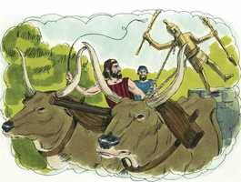

# Deuteronomio Cap 12

**1** 	ESTES são os estatutos e os juízos que tereis cuidado em cumprir na terra que vos deu o Senhor Deus de vossos pais, para a possuir todos os dias que viverdes sobre a terra.

> **Cmt MHenry**: *Versículos 1-3* Moisés passa aos estatutos que tinha de encarregar a Israel; começa com os que têm a ver com a adoração de Deus. Encarrega-se aos israelitas que não introduzam ritos nem costumes idólatras no culto de Deus. não podemos servir a Deus e a Mamom; nem adorar ao Deus verdadeiro e aos ídolos; nem confiar em Jesus Cristo e nas superstições e na justiça própria.

**2** 	Totalmente destruireis todos os lugares, onde as nações que possuireis serviram os seus deuses, sobre as altas montanhas, e sobre os outeiros, e debaixo de toda a árvore frondosa;

 

**3** 	E derrubareis os seus altares, e quebrareis as suas estátuas, e os seus bosques queimareis a fogo, e destruireis as imagens esculpidas dos seus deuses, e apagareis o seu nome daquele lugar.

**4** 	Assim não fareis ao Senhor vosso Deus;

> **Cmt MHenry**: *Versículos 4-32* O mandamento de levar TODOS os sacrifícios à porta do tabernáculo se explica agora com referência à terra prometida. Em quanto ao serviço moral, então como agora, os homens podiam orar e adorar em qualquer lugar, como o faziam em suas sinagogas. O lugar que Deus escolheria, é o lugar onde Ele colocaria Seu nome. Seria sua habitação onde, como Rei de Israel, o encontrariam todos os que o buscassem reverentemente. Agora, no evangelho, não temos templo nem altar que santifique o dom, senão somente a Cristo; e em quanto aos lugares de culto, os profetas anunciaram que em todo lugar se ofereceria o incenso espiritual ([Ml 1.11](../39A-Ml/01.md#11)). Nosso Salvador declara que os aceitos como adoradores verdadeiros são os que adoram a Deus em espírito e verdade, sem considerar este monte ou Jerusalém ([Jo 4.21](../43N-Joa/04.md#21)). O israelita devoto pode honrar a Deus, manter a comunhão com Ele e obter misericórdia dEle, embora não tenha tido a oportunidade de oferecer um sacrifício em seu altar. A obra de Deus deve fazer-se com santo gozo e alegria. Até os filhos e os servos devem regozijar-se ante Deus; os serviços da religião têm de ser um deleite, e não um trabalho ou uma obrigação tediosa. Dever da gente é mostrar-se bondosos com os ministros que os ensinam bem e lhes dão bons exemplos. Na medida em que vivamos, necessitamos da ajuda deles, até que cheguemos àquele mundo onde não serão necessárias as ordenanças. Seja que comamos ou bebamos, ou que façamos qualquer coisa, se nos ordena fazê-lo todo para a glória de Deus. devemos fazer todo no nome do Senhor Jesus Cristo, dando graças ao Pai por meio dEle. Nem sequer devem perguntar sobre as modalidades e formas da adoração idólatra. Que bem faria conhecer essas profundezas de Satanás? E nossa satisfação interior será cada vez maior se abundarmos em amor e boas obras, que surgem da fé e do Espírito de Cristo que mora em nós.

**5** 	Mas o lugar que o Senhor vosso Deus escolher de todas as vossas tribos, para ali pôr o seu nome, buscareis, para sua habitação, e ali vireis.

**6** 	E ali trareis os vossos holocaustos, e os vossos sacrifícios, e os vossos dízimos, e a oferta alçada da vossa mão, e os vossos votos, e as vossas ofertas voluntárias, e os primogênitos das vossas vacas e das vossas ovelhas.

**7** 	E ali comereis perante o Senhor vosso Deus, e vos alegrareis em tudo em que puserdes a vossa mão, vós e as vossas casas, no que abençoar o Senhor vosso Deus.

**8** 	Não fareis conforme a tudo o que hoje fazemos aqui, cada qual tudo o que bem parece aos seus olhos.

**9** 	Porque até agora não entrastes no descanso e na herança que vos dá o Senhor vosso Deus.

**10** 	Mas passareis o Jordão, e habitareis na terra que vos fará herdar o Senhor vosso Deus; e vos dará repouso de todos os vossos inimigos em redor, e morareis seguros.

**11** 	Então haverá um lugar que escolherá o Senhor vosso Deus para ali fazer habitar o seu nome; ali trareis tudo o que vos ordeno; os vossos holocaustos, e os vossos sacrifícios, e os vossos dízimos, e a oferta alçada da vossa mão, e toda a escolha dos vossos votos que fizerdes ao Senhor.

**12** 	E vos alegrareis perante o Senhor vosso Deus, vós, e vossos filhos, e vossas filhas, e os vossos servos, e as vossas servas, e o levita que está dentro das vossas portas; pois convosco não tem parte nem herança.

> **Cmt MHenry**: *CAPÍTULO 12A-2Rs

**13** 	Guarda-te, que não ofereças os teus holocaustos em todo o lugar que vires;

**14** 	Mas no lugar que o Senhor escolher numa das tuas tribos ali oferecerás os teus holocaustos, e ali farás tudo o que te ordeno.

**15** 	Porém, conforme a todo o desejo da tua alma, matarás e comerás carne, dentro das tuas portas, segundo a bênção do Senhor teu Deus, que te dá em todas as tuas portas; o imundo e o limpo dela comerá, como do corço e do veado;

**16** 	Tão-somente o sangue não comereis; sobre a terra o derramareis como água.

**17** 	Dentro das tuas portas não poderás comer o dízimo do teu grão, nem do teu mosto, nem do teu azeite, nem os primogênitos das tuas vacas, nem das tuas ovelhas; nem nenhum dos teus votos, que houveres prometido, nem as tuas ofertas voluntárias, nem a oferta alçada da tua mão.

**18** 	Mas os comerás perante o Senhor teu Deus, no lugar que escolher o Senhor teu Deus, tu, e teu filho, e a tua filha, e o teu servo, e a tua serva, e o levita que está dentro das tuas portas; e perante o Senhor teu Deus te alegrarás em tudo em que puseres a tua mão.

**19** 	Guarda-te, que não desampares ao levita todos os teus dias na terra.

**20** 	Quando o Senhor teu Deus dilatar os teus termos, como te disse, e disseres: Comerei carne; porquanto a tua alma tem desejo de comer carne; conforme a todo o desejo da tua alma, comerás carne.

**21** 	Se estiver longe de ti o lugar que o Senhor teu Deus escolher, para ali pôr o seu nome, então matarás das tuas vacas e das tuas ovelhas, que o Senhor te tiver dado, como te tenho ordenado; e comerás dentro das tuas portas, conforme a todo o desejo da tua alma.

**22** 	Porém, como se come o corço e o veado, assim comerás; o imundo e o limpo também comerão deles.

**23** 	Somente esforça-te para que não comas o sangue; pois o sangue é vida; pelo que não comerás a vida com a carne;

**24** 	Não o comerás; na terra o derramarás como água.

**25** 	Não o comerás; para que bem te suceda a ti, e a teus filhos, depois de ti, quando fizeres o que for reto aos olhos do Senhor.

**26** 	Porém, as coisas santas que tiveres, e os teus votos tomarás, e virás ao lugar que o Senhor escolher.

**27** 	E oferecerás os teus holocaustos, a carne e o sangue sobre o altar do Senhor teu Deus; e o sangue dos teus sacrifícios se derramará sobre o altar do Senhor teu Deus; porém a carne comerás.

**28** 	Guarda e ouve todas estas palavras que te ordeno, para que bem te suceda a ti e a teus filhos depois de ti para sempre, quando fizeres o que for bom e reto aos olhos do Senhor teu Deus.

**29** 	Quando o Senhor teu Deus desarraigar de diante de ti as nações, aonde vais a possuí-las, e as possuíres e habitares na sua terra,

**30** 	Guarda-te, que não te enlaces seguindo-as, depois que forem destruídas diante de ti; e que não perguntes acerca dos seus deuses, dizendo: Assim como serviram estas nações os seus deuses, do mesmo modo também farei eu.

**31** 	Assim não farás ao Senhor teu Deus; porque tudo o que é abominável ao Senhor, e que ele odeia, fizeram eles a seus deuses; pois até seus filhos e suas filhas queimaram no fogo aos seus deuses.

**32** 	Tudo o que eu te ordeno, observarás para fazer; nada lhe acrescentarás nem diminuirás.

> **Cmt MHenry** Intro: *• Versículos 1-3*> 28A-Os monumentos à idolatria devem destruir-se*> *• Versículos 4-32*> *O lugar do serviço de Deus deve guardar-se*