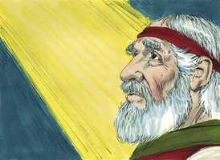
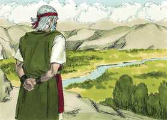

# Deuteronomio Cap 32

**1** 	INCLINAI os ouvidos, ó céus, e falarei; e ouça a terra as palavras da minha boca.

> **Cmt MHenry**: *Versículos 1-2* Moisés começa com uma apelação solene ao céu e terra em quanto à verdade e importância do que diria. Sua doutrina é o evangelho, o discurso de Deus, a doutrina de Cristo; a doutrina da graça e misericórdia por meio dEle, e da vida e salvação por Ele. Versículos 3-6 "Ele é uma Rocha!". Esta é a primeira vez que se chama assim a Deus na Escritura. a expressão denota que o poder, a fidelidade e o amor divino, revelados em Cristo e no evangelho, formam um fundamento que não pode ser mudado nem movido, sobre o qual podemos edificar nossas esperanças de felicidade. Sob sua proteção podemos encontrar refúgio de todos nossos inimigos e em todos nossos problemas; como as rochas daqueles países escudavam contra os raios abrasadores do sol e contra as tempestades, ou eram fortalezas contra o inimigo. "Sua obra é perfeita": a de redenção e salvação em que se expõe completa a perfeição divina em todas suas partes. Todos os tratos de Deus com suas criaturas estão regulados por uma sabedoria que não pode errar e por sua perfeita justiça. certamente Ele é justo e reto; Ele cuida que nenhum se perca por Ele. É apresentada uma grande acusação contra Israel. Até os filhos de Deus têm suas máculas enquanto estão neste mundo imperfeito; pois se dizermos que não temos pecado, nenhuma mácula, nos enganamos a nós mesmos. Mas o pecado de Israel não era habitual, notável e impenitente, o qual é característico dos filhos de Satanás. Foram néscios ao abandonar suas misericórdias em troca das vaidades mentirosas. Todos os pecadores voluntários, especialmente os pecadores de Israel, são néscios e ingratos.

**2** 	Goteje a minha doutrina como a chuva, destile a minha palavra como o orvalho, como chuvisco sobre a erva e como gotas de água sobre a relva.

**3** 	Porque apregoarei o nome do Senhor; engrandecei a nosso Deus.

**4** 	Ele é a Rocha, cuja obra é perfeita, porque todos os seus caminhos justos são; Deus é a verdade, e não há nele injustiça; justo e reto é.

**5** 	Corromperam-se contra ele; não são seus filhos, mas a sua mancha; geração perversa e distorcida é.

**6** 	Recompensais assim ao Senhor, povo louco e ignorante? Não é ele teu pai que te adquiriu, te fez e te estabeleceu?

**7** 	Lembra-te dos dias da antiguidade, atenta para os anos de muitas gerações: pergunta a teu pai, e ele te informará; aos teus anciãos, e eles te dirão.

> **Cmt MHenry**: *Versículos 7-14* Moisés dá exemplos particulares da bondade de Deus e sua preocupação por eles. O cuidado que a águia dá a seus filhotes é um belo emblema do amor de Cristo que veio mediar entre a justiça divina e nossa alma culpável, e a levar nossos pecados em seu próprio corpo sobre o madeiro. Por meio da predicação do evangelho e a influência do Espírito Santo, Ele estimula os pecadores e prevalece sobre eles para que deixem a escravidão de Satanás. Nos versículos 13 e 14 se encontram os símbolos da vitória que os crentes têm, em e por meio de Cristo, sobre seus inimigos espirituais: o pecado, Satanás e o mundo. Também da seguridade e triunfo deles nEle; do marco de felicidade de sua alma quando está sobre o mundo e suas coisas. Este será o caso bendito do Israel espiritual em todo sentido no último dia.

**8** 	Quando o Altíssimo distribuía as heranças às nações, quando dividia os filhos de Adão uns dos outros, estabeleceu os termos dos povos, conforme o número dos filhos de Israel.

**9** 	Porque a porção do Senhor é o seu povo; Jacó é a parte da sua herança.

**10** 	Achou-o numa terra deserta, e num ermo solitário cheio de uivos; cercou-o, instruiu-o, e guardou-o como a menina do seu olho.

**11** 	Como a águia desperta a sua ninhada, move-se sobre os seus filhos, estende as suas asas, toma-os, e os leva sobre as suas asas,

**12** 	Assim só o Senhor o guiou; e não havia com ele deus estranho.

**13** 	Ele o fez cavalgar sobre as alturas da terra, e comer os frutos do campo, e o fez chupar mel da rocha e azeite da dura pederneira.

**14** 	Manteiga de vacas, e leite de ovelhas, com a gordura dos cordeiros e dos carneiros que pastam em Basã, e dos bodes, com o mais escolhido trigo; e bebeste o sangue das uvas, o vinho puro.

**15** 	E, engordando-se Jesurum, deu coices (engordaste-te, engrossaste-te, e de gordura te cobriste) e deixou a Deus, que o fez, e desprezou a Rocha da sua salvação.

> **Cmt MHenry**: *Versículos 15-18* Eis aqui dois exemplos da iniqüidade de Israel; cada um foi uma apostasia contra Deus. Esta gente era chamada Jesurum, "um povo reto" por alguns, "um povo visionário" para outros; porém logo perderam a reputação de seu saber e de sua retidão. Deram-se o gosto em quanto aos apetites como se não tivessem nada a fazer senão realizar provisão para a carne, a fim de satisfazer suas concupiscências. Os que se endeusam e fazem um ídolo de seu estômago, com orgulho e jactância, e não toleram que lhes falem disso, abandonam por isso a Deus, com o que demonstram que o estimam em pouco. Há somente um caminho para a aceitação e santificação do pecador, embora sejam diferentes os modos em que a falta de religião ou a falsa religião mostra consideração para atraí-lo a outros caminhos, atitude que amiúde se qualifica mal como candidez. Quão loucos estão os idólatras que abandonam a Rocha de salvação para correr sobre a rocha de perdição!

**16** 	Com deuses estranhos o provocaram a zelos; com abominações o irritaram.

**17** 	Sacrifícios ofereceram aos demônios, não a Deus; aos deuses que não conheceram, novos deuses que vieram há pouco, aos quais não temeram vossos pais.

**18** 	Esqueceste-te da Rocha que te gerou; e em esquecimento puseste o Deus que te formou;

**19** 	O que vendo o Senhor, os desprezou, por ter sido provocado à ira contra seus filhos e suas filhas;

> **Cmt MHenry**: *Versículos 19-25* A rebelião de Israel se descreveu nos versículos anteriores, e aqui se seguem as resoluções da justiça divina sobre eles. Nos enganamos se pensamos que Deus pode ser burlado por um povo infiel. O pecado nos faz odiosos à vista do santo Deus. Observe-se quanta maldade faz o pecado, e contem-se como néscios os que zombam disto.

**20** 	E disse: Esconderei o meu rosto deles, verei qual será o seu fim; porque são geração perversa, filhos em quem não há lealdade.

**21** 	A zelos me provocaram com aquilo que não é Deus; com as suas vaidades me provocaram à ira: portanto eu os provocarei a zelos com o que não é povo; com nação louca os despertarei à ira.

**22** 	Porque um fogo se acendeu na minha ira, e arderá até ao mais profundo do inferno, e consumirá a terra com a sua colheita, e abrasará os fundamentos dos montes.

**23** 	Males amontoarei sobre eles; as minhas setas esgotarei contra eles.

**24** 	Consumidos serão de fome, comidos pela febre ardente e de peste amarga; e contra eles enviarei dentes de feras, com ardente veneno de serpentes do pó.

**25** 	Por fora devastará a espada, e por dentro o pavor; ao jovem, juntamente com a virgem, assim à criança de peito como ao homem encanecido.

**26** 	Eu disse: Por todos os cantos os espalharei; farei cessar a sua memória dentre os homens,

> **Cmt MHenry**: *Versículos 26-38* A idolatria e as rebeliões de Israel mereciam, como o exige a justiça de Deus, que eles fossem desarraigados. Mas Ele perdoa a Israel e os deixa que continuem sendo as testemunhas vivas da verdade da Bíblia, para silenciar os incrédulos. Têm sido preservados para propósitos sábios e santos, e as profecias nos dão uma idéia de quais são esses propósitos. O Senhor nunca trará vergonha sobre o trono de sua Gl. Muito sábio é, e ajudará ao regresso dos pecadores a Deus, a consideração séria do final ou o estado futuro deles. Isto refere-se particularmente ao que Deus anunciou por meio de Moisés, no concernente a seu povo nos dias últimos; mas pode dar-se uma aplicação mais geral. Oh, que os homens considerassem a felicidade que perderão e a desgraça em que certamente afundarão se continuam em suas transgressões! Qual será o fim deles? ([Jr 5.31](../24A-Jr/05.md#31)). Porque o Senhor derrotará em seu devido tempo os inimigos da igreja, desagradado por sua maldade. Quando os pecadores se considerem mais seguros, virá sobre eles destruição repentina. E o tempo de Deus para vir a liberar a seu povo é quando as coisas estão piores para eles. Mas os que confiam em qualquer rocha que não é Deus, acharão que lhes falha quando mais a necessitam. A rejeição do Messias por parte da nação judaica é a continuidade de sua antiga idolatria, apostasia e rebelião. Serão levados a humilhar-se ante o Salvador, a arrepender-se de seus pecados e a confiar em seu longamente rejeitado Mediador para salvação. Então Ele os livrará e fará que sua prosperidade seja grande.

**27** 	Se eu não receasse a ira do inimigo, para que os seus adversários não se iludam, e para que não digam: A nossa mão está exaltada; o Senhor não fez tudo isto.

**28** 	Porque são gente falta de conselhos, e neles não há entendimento.

**29** 	Quem dera eles fossem sábios! Que isto entendessem, e atentassem para o seu fim!

**30** 	Como poderia ser que um só perseguisse mil, e dois fizessem fugir dez mil, se a sua Rocha os não vendera, e o Senhor os não entregara?

**31** 	Porque a sua rocha não é como a nossa Rocha, sendo até os nossos inimigos juízes disto.

**32** 	Porque a sua vinha é a vinha de Sodoma e dos campos de Gomorra; as suas uvas são uvas venenosas, cachos amargos têm.

> **Cmt MHenry**: *CAPÍTULO 32A-Jn

**33** 	O seu vinho é ardente veneno de serpentes, e peçonha cruel de víboras.

**34** 	Não está isto guardado comigo? Selado nos meus tesouros?

**35** 	Minha é a vingança e a recompensa, ao tempo que resvalar o seu pé; porque o dia da sua ruína está próximo, e as coisas que lhes hão de suceder, se apressam a chegar.

**36** 	Porque o Senhor fará justiça ao seu povo, e se compadecerá de seus servos; quando vir que o poder deles se foi, e não há preso nem desamparado.

**37** 	Então dirá: Onde estão os seus deuses? A rocha em quem confiavam,

**38** 	De cujos sacrifícios comiam a gordura, e de cujas libações bebiam o vinho? Levantem-se, e vos ajudem, para que haja para vós esconderijo.

**39** 	Vede agora que eu, eu o sou, e mais nenhum deus há além de mim; eu mato, e eu faço viver; eu firo, e eu saro, e ninguém há que escape da minha mão.

> **Cmt MHenry**: *Versículos 39-43* A conclusão do cântico diz: 1) Glória a Deus. Não pode haver escapatória de seu poder. 2) Terror a seus inimigos. Sem dúvida terror para aqueles que o odeiam. A ira de Deus se revela aqui desde o céu contra eles. 3) Consolo a seu povo. O cântico conclui com palavras de gozo. Quaisquer sejam os juízos trazidos contra os pecadores, o povo de Deus se dará bem.

**40** 	Porque levantarei a minha mão aos céus, e direi: Eu vivo para sempre.

**41** 	Se eu afiar a minha espada reluzente, e se a minha mão travar o juízo, retribuirei a vingança sobre os meus adversários, e recompensarei aos que me odeiam.

**42** 	Embriagarei as minhas setas de sangue, e a minha espada comerá carne; do sangue dos mortos e dos prisioneiros, desde a cabeça, haverá vinganças do inimigo.

**43** 	Jubilai, ó nações, o seu povo, porque ele vingará o sangue dos seus servos, e sobre os seus adversários retribuirá a vingança, e terá misericórdia da sua terra e do seu povo.

**44** 	E veio Moisés, e falou todas as palavras deste cântico aos ouvidos do povo, ele e Josué, filho de Num.

> **Cmt MHenry**: *Versículos 44-47* Aqui está a solene entrega deste cântico a Israel com o encargo de dar importância a todas as boas palavras que Moisés tinha-lhes falado. Não é coisa trivial, senão questão de vida ou morte: dêem importância a estejam prontos para sempre; descuidem-no e estarão destruídos para sempre. Oh, que os homens fossem plenamente persuadidos de que a religião é a vida deles, até a vida de suas almas!

**45** 	E, acabando Moisés de falar todas estas palavras a todo o Israel,

**46** 	Disse-lhes: Aplicai o vosso coração a todas as palavras que hoje testifico entre vós, para que as recomendeis a vossos filhos, para que tenham cuidado de cumprir todas as palavras desta lei.

**47** 	Porque esta palavra não vos é vã, antes é a vossa vida; e por esta mesma palavra prolongareis os dias na terra a qual, passando o Jordão, ides a possuir.

**48** 	Depois falou o Senhor a Moisés, naquele mesmo dia, dizendo:

> **Cmt MHenry**: *Versículos 48-52* Agora que Moisés tinha acabado sua obra, por que iria desejar viver mais um dia? Deus o lembra do pecado pelo qual era culpável, o que o impediu de entrar em Canaã. bom é para o melhor dos homens morrer arrependido dos males dos que estiver ciente. Mas podem morrer consolados e tranqüilos quando Deus os chamar, apesar dos pecados que lembram contra si mesmos, porque têm a perspectiva do crente e a esperança de vida eterna além da morte bem cimentada. "

 

**49** 	Sobe ao monte de Abarim, ao monte Nebo, que está na terra de Moabe, defronte de Jericó, e vê a terra de Canaã, que darei aos filhos de Israel por possessão.

**50** 	E morre no monte ao qual subirás; e recolhe-te ao teu povo, como Arão teu irmão morreu no monte Hor, e se recolheu ao seu povo.

**51** 	Porquanto transgredistes contra mim no meio dos filhos de Israel, às águas de Meribá de Cades, no deserto de Zim; pois não me santificastes no meio dos filhos de Israel.

**52** 	Pelo que verás a terra diante de ti, porém não entrarás nela, na terra que darei aos filhos de Israel.

 

> **Cmt MHenry** Intro: *• Versículos 1-2*> *O cântico de Moisés*> *• Versículos 3-6*> *O caráter de Deus – O caráter de Israel*> *• Versículos 7-14*> *As coisas grandes que Deus fez por Israel*> *• Versículos 15-18*> *A iniqüidade de Israel*> *• Versículos 19-25*> 28A-Os juízos que lhes sobrevirão por seus pecados*> *• Versículos 26-38*> *Suspensão da vingança merecida*> *• Versículos 39-43*> *A liberação de Deus para seu povo*> *• Versículos 44-47*> *A exortação com que foi entregue o cântico*> *• Versículos 48-52*> *Moisés sobe ao monte Nebo a morrer*