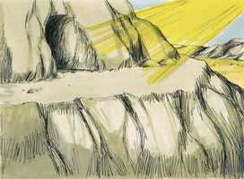

# Deuteronomio Cap 33

**1** 	ESTA, porém, é a bênção com que Moisés, homem de Deus, abençoou os filhos de Israel antes da sua morte.

> **Cmt MHenry**: *Versículos 1-5* Moisés agrega uma bênção solene a todos seus preceitos, advertências e profecias. Começa escrevendo as aparições gloriosas de Deus para dar a lei. Sua lei opera como o fogo. Se for recebida, derrete, esquenta, purifica e queima a escoria da corrupção; se for rejeitada, endurece, sela, dói e destrói. O Espírito Santo desceu em línguas como de fogo; pois o Evangelho também é uma lei candente. A Lei de Deus escrita no coração é a prova certa do amor de Deus derramado nele: devemos reconhecer sua lei como uma das dádivas de Sua graça.

**2** 	Disse pois: O Senhor veio de Sinai, e lhes subiu de Seir; resplandeceu desde o monte Parã, e veio com dez milhares de santos; à sua direita havia para eles o fogo da lei.

**3** 	Na verdade ama os povos; todos os seus santos estão na sua mão; postos serão no meio, entre os teus pés, e cada um receberá das tuas palavras.

**4** 	Moisés nos deu a lei, como herança da congregação de Jacó.

**5** 	E foi rei em Jesurum, quando se congregaram os cabeças do povo com as tribos de Israel.

**6** 	Viva Rúben, e não morra, e que os seus homens não sejam poucos.

> **Cmt MHenry**: *Versículos 6-23* A ordem em que as tribos são aqui abençoadas não é a mesma observada em outras partes. A bênção de Judá pode referir-se a toda a tribo em geral ou a Davi como tipo de Cristo. Moisés abençoa grandemente a tribo de Levi. A aceitação de Deus é ao que todos devemos apontar e desejar, em todas nossas devoções, seja que os homens nos aceitem ou não ([2 Co 5.9](../47N-2Co/05.md#9)). esta oração é uma profecia de que Deus manterá seu ministério em sua igreja até o fim do tempo. A tribo de Benjamim tinha sua herdade perto do Monte Sião. Estar situado perto das ordenanças é um presente precioso do Senhor, privilégio que não deve trocar-se por nenhuma vantagem ou indulgência humana. Devemos receber agradecidos as bênçãos terrenas enviadas a nós por meio da sucessão das estações. Mas aquelas boas dádivas que descem desde o Pai das luzes por meio da ascensão do Sol de Justiça e o derramamento de seu Espírito como a chuva que fertiliza, são infinitamente mais preciosas como sinais de seu amor especial, as coisas preciosas pelas que aqui se ora são figuras das bênçãos espirituais nas coisas celestiais por Cristo, os dons, as graças e os consolos do Espírito. Quando Moisés orou pela boa vontade dAquele que esteve na sarça, se referia ao pacto sobre o qual devem cimentar-se todas nossas esperanças do favor de Deus. A providência de Deus designa as habitações dos homens e dispõe sabiamente os homens para diferentes empregos em prol do bem público. Qualquer seja o nosso lugar e negócio, é nossa sabedoria e dever aplicar-nos a ele, sendo felicidade estarmos contentes com isso. não só devemos convidar os outros ao serviço de Deus, senão abundar neste. A bênção de Naftali. O favor de Deus é o único favor que satisfaz a alma. são sem dúvida bem-aventurados os que têm o favor de Deus; o terão os que reconhecem que lhes basta com tê-lo e não desejam mais.

**7** 	E isto é o que disse de Judá: Ouve, ó Senhor, a voz de Judá, e introduze-o no seu povo; as suas mãos lhe bastem, e tu lhe sejas em ajuda contra os seus inimigos.

**8** 	E de Levi disse: Teu Tumim e teu Urim são para o teu amado, que tu provaste em Massá, com quem contendeste junto às águas de Meribá.

**9** 	Aquele que disse a seu pai, e à sua mãe: Nunca os vi; e não conheceu a seus irmãos, e não estimou a seus filhos; pois guardaram a tua palavra e observaram a tua aliança.

**10** 	Ensinaram os teus juízos a Jacó, e a tua lei a Israel; puseram incenso no teu nariz, e o holocausto sobre o teu altar.

**11** 	Abençoa o seu poder, ó Senhor, e aceita a obra das suas mãos; fere os lombos dos que se levantam contra ele e o odeiam, para que nunca mais se levantem.

**12** 	E de Benjamim disse: O amado do Senhor habitará seguro com ele; todo o dia o cobrirá, e morará entre os seus ombros.

**13** 	E de José disse: Bendita do Senhor seja a sua terra, com o mais excelente dos céus, com o orvalho e com o abismo que jaz abaixo.

**14** 	E com os mais excelentes frutos do sol, e com as mais excelentes produções das luas,

**15** 	E com o mais excelente dos montes antigos, e com o mais excelente dos outeiros eternos.

**16** 	E com o mais excelente da terra, e da sua plenitude, e com a benevolência daquele que habitava na sarça, venha sobre a cabeça de José, e sobre o alto da cabeça daquele que foi separado de seus irmãos.

**17** 	Ele tem a glória do primogênito do seu touro, e os seus chifres são chifres de boi selvagem; com eles rechaçará todos os povos até às extremidades da terra; estes pois são os dez milhares de Efraim, e estes são os milhares de Manassés.

**18** 	E de Zebulom disse: Zebulom, alegra-te nas tuas saídas; e tu, Issacar, nas tuas tendas.

**19** 	Eles chamarão os povos ao monte; ali apresentarão ofertas de justiça, porque chuparão a abundância dos mares e os tesouros escondidos da areia.

**20** 	E de Gade disse: Bendito aquele que faz dilatar a Gade; habita como a leoa, e despedaça o braço e o alto da cabeça.

**21** 	E se proveu da melhor parte, porquanto ali estava escondida a porção do legislador; por isso veio com os chefes do povo, executou a justiça do Senhor e os seus juízos para com Israel.

**22** 	E de Dã disse: Dã é cria de leão; que salta de Basã.

**23** 	E de Naftali disse: Farta-te, ó Naftali, da benevolência, e enche-te da bênção do Senhor; possui o ocidente e o sul.

**24** 	E de Aser disse: Bendito seja Aser com seus filhos; agrade a seus irmãos, e banhe em azeite o seu pé.

> **Cmt MHenry**: *Versículos 24-25* Todo será santificado para o crente verdadeiro; se o caminho deles é duro, seus pés serão suavizados com a preparação do evangelho da paz. Como teus dias, assim será tua força. O "dia" costuma ser na Escritura um dizer pelos fatos do dia; é uma promessa de que Deus respaldará, bondosa e constantemente, quando alguém estiver sob provações e tribulações, quaisquer que sejam. É uma promessa segura para toda a semente espiritual de Abraão. Têm trabalho designado? Terão a força para realizá-lo. Têm tribulações? Terão forças e nunca serão tentados além do que possam resistir.

**25** 	Seja de ferro e de metal o teu calçado; e a tua força seja como os teus dias.

**26** 	Não há outro, ó Jesurum, semelhante a Deus, que cavalga sobre os céus para a tua ajuda, e com a sua majestade sobre as mais altas nuvens.

> **Cmt MHenry**: *Versículos 26-29* Ninguém teve um Deus como Israel. Não há povo como o Israel de Deus. o que aqui se diz da igreja de Israel deve aplicar-se à igreja espiritual. nunca houve povo *tão bem assentado e escudado*. Os que fazem de Deus sua morada, terão todos os consolos e benefícios de uma habitação nEle ([Sl 91.1](../19A-Sl/91.md#1)). Nunca houve povo *tão bem respaldado e sustentado*. Por baixo que o povo de Deus chegue num momento dado, os braços eternos estão embaixo deles para impedir que o espírito afunde, desfaleça, e que sua fé falhe. A graça divina é suficiente para eles ([2 Co 12.9](../47N-2Co/12.md#9)). Nunca houve povo *tão bem mandado*. Assim, pois, os crentes são mais que vencedores a respeito de seus inimigos espirituais, por meio de Cristo que os amou. Nunca houve povo *tão bem assegurado e protegido*. Israel habitará nesta só segurança. Todos os que estão perto de Deus serão mantidos a salvo por Ele. Nunca houve povo *tão bem provido*. Cada israelita verdadeiro olha com fé para a pátria melhor, a Canaã celestial, que está cheia de coisas melhores que o trigo e o vinho. Nunca houve povo *tão ajudado*. Se correrem o risco de qualquer dano, ou falta algo de bom, tinham um Deus eterno ao qual acudir. Nada poderia prejudicar aos que Deus ajudava, nem tampouco era possível que perecesse o povo salvo pelo Senhor. Nunca houve povo *tão bem assegurado da vitória* sobre seus inimigos. Assim, pois, o Deus de paz calcou Satanás sob os pés de todos os crentes, e o fará daqui a muito pouco ([Rm 16.20](../45N-Rm/16.md#20)). Que Deus nos ajude a procurar e estabelecer nossos afetos nas coisas do alto; e a afastar nossas almas dos objetos terrenos que perecem; para que não tenhamos nossa sorte entre os inimigos de Israel nas regiões das trevas e desesperação, senão com o Israel de Deus nos âmbitos do amor e da felicidade eterna. "

**27** 	O Deus eterno é a tua habitação, e por baixo estão os braços eternos; e ele lançará o inimigo de diante de ti, e dirá: Destrói-o.

**28** 	Israel, pois, habitará só, seguro, na terra da fonte de Jacó, na terra de grão e de mosto; e os seus céus gotejarão orvalho.

**29** 	Bem-aventurado tu, ó Israel! Quem é como tu? Um povo salvo pelo Senhor, o escudo do teu socorro, e a espada da tua majestade; por isso os teus inimigos te serão sujeitos, e tu pisarás sobre as suas alturas.

 

> **Cmt MHenry** Intro: *CAPÍTULO 33A-Mq> *• Versículos 1-5*> *A majestade gloriosa de Deus*> *• Versículos 6-23*> *A bênção das doze tribos*> *• Versículos 24-25*> *Fortaleza para os crentes*> *• Versículos 26-29*> *A excelência de Israel*