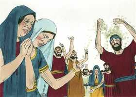
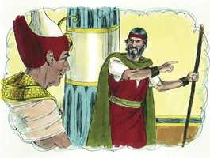

# Deuteronomio Cap 34

**1** 	ENTÃO subiu Moisés das campinas de Moabe ao monte Nebo, ao cume de Pisga, que está em frente a Jericó e o Senhor mostrou-lhe toda a terra desde Gileade até Dã;

> **Cmt MHenry**: *Versículos 1-4* Moisés parecia não desejoso de deixar sua obra mas, acabada esta, não manifestou incômodo por morrer. Deus tinha declarado que não entraria em Canaã, mas o Senhor também tinha prometido que Moisés a veria e que Ele lhe mostraria toda essa boa terra. Agora os crentes vêem, por meio da graça, a bênção e a glória de seu estado futuro. Às vezes, Deus reserva os descobrimentos mais esplendorosos de Sua graça para apoiar a Seu povo nos momentos de morte. Os que morrem na fé de Cristo e na esperança do céu costumam deixar com júbilo este mundo.

**2** 	E todo Naftali, e a terra de Efraim, e Manassés e toda a terra de Judá, até ao mar ocidental;

**3** 	E o sul, e a campina do vale de Jericó, a cidade das palmeiras, até Zoar.

**4** 	E disse-lhe o Senhor: Esta é a terra que jurei a Abraão, Isaque, e Jacó, dizendo: À tua descendência a darei; eu te faço vê-la com os teus olhos, porém lá não passarás.

**5** 	Assim morreu ali Moisés, servo do Senhor, na terra de Moabe, conforme a palavra do Senhor.

> **Cmt MHenry**: *Versículos 5-8* Moisés obedeceu esta ordem de Deus com a mesma disposição com que obedeceu qualquer outra, embora esta parecesse mais dura. Isto se parece com nosso Senhor Jesus Cristo. Entretanto, Moisés morreu com honra, em paz e de uma maneira mais fácil; o Salvador morreu sobre a desgraçada e torturante cruz. Moisés morreu com toda facilidade; Ele morreu "conforme a palavra de Jeová", segundo a vontade de Deus. Quando os servos do Senhor têm feito todas suas outras obras, devem morrer por fim, e estar dispostos a ir a casa, quando seu Amo manda por eles ([At 21.13](../44N-At/21.md#13)). Não se conhece o lugar do túmulo. Se a alma está repousando com Deus, tem pouca importância onde repouse seu corpo. Não houve declinação na força de seu corpo, nem no vigor e atividade de sua mente; seu entendimento e sua memória eram tão claros como sempre. esta foi a recompensam por seus serviços, o efeito de sua mansidão extraordinária. Façamos luto solene por ele. Contudo, por grande que seja nossa perda, não devemos entregar-nos à dor. Se esperamos ir ao céu regozijando-nos, por que iremos ao túmulo lamentando-nos?

**6** 	E o sepultou num vale, na terra de Moabe, em frente de Bete-Peor; e ninguém soube até hoje o lugar da sua sepultura.

**7** 	Era Moisés da idade de cento e vinte anos quando morreu; os seus olhos nunca se escureceram, nem perdeu o seu vigor.

**8** 	E os filhos de Israel prantearam a Moisés trinta dias, nas campinas de Moabe; e os dias do pranto no luto de Moisés se cumpriram.

 

**9** 	E Josué, filho de Num, foi cheio do espírito de sabedoria, porquanto Moisés tinha posto sobre ele as suas mãos; assim os filhos de Israel lhe deram ouvidos, e fizeram como o Senhor ordenara a Moisés.

> **Cmt MHenry**: *Versículos 9-12* Moisés levou a Israel até as fronteiras de Canaã e, depois, morreu e os deixou. Isto significa que nada aperfeiçoou a lei ([Hb 7.19](../58N-Hb/07.md#19)). Leva os homens a um deserto de convicção de pecado, mas não à Canaã do repouso e paz estável. Essa honra foi reservada para Josué, nosso Senhor Jesus, do qual Josué era um tipo (e o nome é o mesmo), que faz por nós o que a lei não podia fazer ([Rm 8.3](../45N-Rm/08.md#3)). Por Ele entramos no repouso espiritual de consciência e no repouso eterno no céu. Moisés foi maior que qualquer outro profeta do Antigo Testamento. Todavia, nosso Senhor Jesus foi além dele, muito além dos outros profetas que ficaram para trás a respeito dEle. E vemos aqui um forte parecido entre o redentor dos filhos de Israel e o Redentor da humanidade. Moisés foi enviado por Deus a liberar os israelitas de uma cruel escravidão; ele os tirou e venceu seus inimigos. Ele chegou a ser não só o libertador deles, senão seu legislador; não só seu legislador, senão seu juiz; e, finalmente, os conduziu à fronteira da terra prometida. nosso bendito Salvador veio resgatar-nos da escravidão do diabo e a restaurar-nos para a liberdade e a felicidade. Ele veio a confirmar cada preceito moral do primeiro legislador; e a escrevê-los não sobre tábuas de pedra, senão sobre as tábuas de carne do coração. Ele veio para ser nosso Juiz também, por quanto tem designando um dia em que julgará todos os segredos dos homens recompensará ou castigará conforme a isso. Esta grandeza de Cristo por acima de Moisés é uma razão pela qual os cristãos devem ser obedientes e fiéis à santa religião pela qual professam serem seguidores de Cristo. Deus nos faça a todos assim por Sua graça! "

**10** 	E nunca mais se levantou em Israel profeta algum como Moisés, a quem o Senhor conhecera face a face;

**11** 	Nem semelhante em todos os sinais e maravilhas, que o Senhor o enviou para fazer na terra do Egito, a Faraó, e a todos os seus servos, e toda a sua terra.

 

**12** 	E em toda a mão forte, e em todo o grande espanto, que praticou Moisés aos olhos de todo o Israel.

> **Cmt MHenry** Intro: *CAPÍTULO 34A-Na> *• Versículos 1-4*> *Moisés vê a terra prometida desde o monte Nebo*> *• Versículos 5-8*> *A morte e sepultamento de Moisés – O luto do povo*> *• Versículos 9-12*> *Josué sucede a Moisés – Elogio de Moisés*