# Josué Cap 02

**1** 	E JOSUÉ, filho de Num, enviou secretamente, de Sitim, dois homens a espiar, dizendo: Ide reconhecer a terra e a Jericó. Foram, pois, e entraram na casa de uma mulher prostituta, cujo nome era Raabe, e dormiram ali.

> **Cmt MHenry**: *Versículos -1 - 7* A fé nas promessas de Deus não deve terminar nossa diligência para usar os médios adequados, senão estimulá-la. A providência de Deus dirigiu os espias à casa de Raabe. Deus sabia onde havia alguém que seria leal com eles, ainda que eles não. Raabe parece ter sido uma dona de pousada; e se anteriormente tinha levado uma má vida, o qual é duvidoso, ela tinha abandonado seus maus caminhos. Isso que nos parecem mais acidental está, amiúde, mandado pela providência divina para servir a grandes finalidades. Foi *por fé que* Raabe recebeu em paz a esses contra os quais estavam e guerra o rei e sua pátria. Estamos seguros de que esta foi uma boa obra; assim é qualificada pelo apóstolo ([Tg 2.25](../59N-Tg/02.md#25)); e ela o fez *pela fé*, fé que a colocou por acima do medo ao homem. São unicamente crentes verdadeiros aqueles que, em seus corações, acham o aventurar-se por Deus; eles tomam a Seu povo por povo deles, e correm a sorte com eles. Os espias foram dirigidos pela providência especial de Deus, e Raabe os atendeu por consideração a Israel e ao Deus de Israel, e não por lucro ou com nenhum propósito malvado. Embora possam oferecer-se desculpas para a culpa da mentira de Raabe, é melhor não admitir nada que trate de explicá-la. Os enfoques de Raabe no que diz respeito à lei divina devem ter sido muito difusos: uma mentira como esta, cometida pelos que desfrutam da luz da revelação, qualquer seja o motivo, teria merecido dura censura.

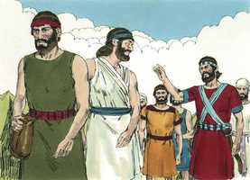 

**2** 	Então deu-se notícia ao rei de Jericó, dizendo: Eis que esta noite vieram aqui uns homens dos filhos de Israel, para espiar a terra.

> **Cmt MHenry**: *CAPÍTULO 20A-Pv 21A-Ec 22A-Ct 23A-Is 24A-Jr 25A-Lm 26A-Ez 27A-Dn 28A-Os 29A-Jl

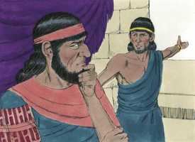 

**3** 	Por isso mandou o rei de Jericó dizer a Raabe: Tira fora os homens que vieram a ti e entraram na tua casa, porque vieram espiar toda a terra.

**4** 	Porém aquela mulher tomou os dois homens, e os escondeu, e disse: É verdade que vieram homens a mim, porém eu não sabia de onde eram.

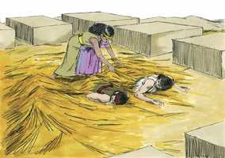 

**5** 	E aconteceu que, havendo-se de fechar a porta, sendo já escuro, aqueles homens saíram; não sei para onde aqueles homens se foram; ide após eles depressa, porque os alcançareis.

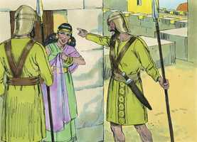 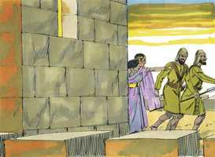 

**6** 	Porém ela os tinha feito subir ao eirado, e os tinha escondido entre as canas do linho, que pusera em ordem sobre o eirado.

**7** 	E foram-se aqueles homens após eles pelo caminho do Jordão, até aos vaus; e, havendo eles saído, fechou-se a porta.

**8** 	E, antes que eles dormissem, ela subiu a eles no eirado;

> **Cmt MHenry**: *Versículos 8-21* Raabe tinha ouvido dos milagres que o Senhor operava por Israel. Ela acreditava que Suas promessas certamente se cumpririam e que Suas ameaças se efetuariam; e que não havia forma de fugir, senão submeter-se a Ele e unir-se a Seu povo. A conduta de Raabe demonstrou que ela tinha o princípio real da fé divina. Observe as promessas que os espias fizeram a ela. A bondade de Deus se expressa amiúde por sua bondade e verdade ([Sl 117.2](../19A-Sl/117.md#2)); em ambos casos devemos ser seguidores dEle. Aqueles que serão cientes para cumprir as promessas, são cautos para formulá-las. Os espias estipulam condições necessárias. O cordão de fio de escarlata, como o sangue sobre o umbral da porta na Páscoa, volta a lembrar a seguridade do pecador sob o Senhor expiatório de Cristo; e que temos que fugir lá para refugiar-nos da ira do Deus justo ofendido. A mesma corda que Raabe usou para a salvação desses israelitas seria usada para a seguridade dela. Podemos esperar que aquilo com que servimos e honramos a Deus, seja abençoado por Ele e feito útil para nós.

**9** 	E disse aos homens: Bem sei que o Senhor vos deu esta terra e que o pavor de vós caiu sobre nós, e que todos os moradores da terra estão desfalecidos diante de vós.

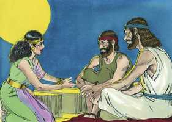 

**10** 	Porque temos ouvido que o Senhor secou as águas do Mar Vermelho diante de vós, quando saíeis do Egito, e o que fizestes aos dois reis dos amorreus, a Siom e a Ogue, que estavam além do Jordão, os quais destruístes.

**11** 	O que ouvindo, desfaleceu o nosso coração, e em ninguém mais há ânimo algum, por causa da vossa presença; porque o Senhor vosso Deus é Deus em cima nos céus e em baixo na terra.

**12** 	Agora, pois, jurai-me, vos peço, pelo Senhor, que, como usei de misericórdia convosco, vós também usareis de misericórdia para com a casa de meu pai, e dai-me um sinal seguro,

**13** 	De que conservareis com a vida a meu pai e a minha mãe, como também a meus irmãos e a minhas irmãs, com tudo o que têm e de que livrareis as nossas vidas da morte.

**14** 	Então aqueles homens responderam-lhe: A nossa vida responderá pela vossa até à morte, se não denunciardes este nosso negócio, e será, pois, que, dando-nos o Senhor esta terra, usaremos contigo de misericórdia e de fidelidade.

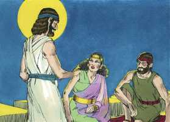 

**15** 	Ela então os fez descer por uma corda pela janela, porquanto a sua casa estava sobre o muro da cidade, e ela morava sobre o muro.

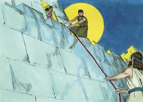 

**16** 	E disse-lhes: Ide-vos ao monte, para que, porventura, não vos encontrem os perseguidores, e escondei-vos lá três dias, até que voltem os perseguidores, e depois ide pelo vosso caminho.

**17** 	E, disseram-lhe aqueles homens: Desobrigados seremos deste juramento que nos fizeste jurar.

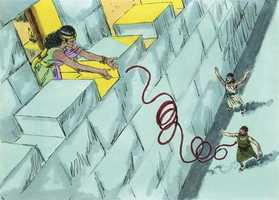 

**18** 	Eis que, quando nós entrarmos na terra, atarás este cordão de fio de escarlata à janela por onde nos fizeste descer; e recolherás em casa contigo a teu pai, e a tua mãe, e a teus irmãos e a toda a família de teu pai.

**19** 	Será, pois, que qualquer que sair fora da porta da tua casa, o seu sangue será sobre a sua cabeça, e nós seremos inocentes; mas qualquer que estiver contigo, em casa, o seu sangue seja sobre a nossa cabeça, se alguém nele puser mão.

**20** 	Porém, se tu denunciares este nosso negócio, seremos desobrigados do juramento que nos fizeste jurar.

**21** 	E ela disse: Conforme as vossas palavras, assim seja. Então os despediu; e eles se foram; e ela atou o cordão de escarlata à janela.

 

**22** 	Foram-se, pois, e chegaram ao monte, e ficaram ali três dias, até que voltaram os perseguidores, porque os perseguidores os buscaram por todo o caminho, porém não os acharam.

> **Cmt MHenry**: *Versículos 22-24* O informe que levaram os espias foi alentador. Toda a gente do país desfalecia devido a Israel; não tinham sabedoria para render-se nem valor para pelejar. Aqueles terrores de consciência e essa sensação da ira divina que fazem desmaiar o ímpio mas não o levam ao arrependimento, são antecipações temíveis da destruição que se aproxima. Mas a graça abunda, contudo, para o principal dos pecadores. Que eles fujam a Cristo sem demora e tudo dará certo.

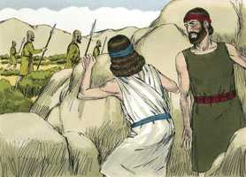 

**23** 	Assim aqueles dois homens voltaram, e desceram do monte, e passaram, e chegaram a Josué, filho de Num, e contaram-lhe tudo quanto lhes acontecera;

**24** 	E disseram a Josué: Certamente o Senhor tem dado toda esta terra nas nossas mãos, pois até todos os moradores estão atemorizados diante de nós.

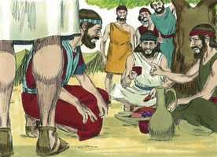 

> **Cmt MHenry** Intro: *• Versículos 1-7*> *Raabe recebe e esconde a dois israelitas*> *• Versículos 8-21*> *Raabe e os espias*> *• Versículos 22-24*> *O retorno dos espias*