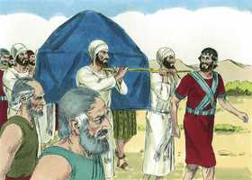

# Josué Cap 03

**1** 	LEVANTOU-SE, pois, Josué de madrugada, e partiram de Sitim, ele e todos os filhos de Israel; e vieram até ao Jordão, e pousaram ali, antes que passassem.

> **Cmt MHenry**: *Versículos 1-6* Os israelitas chegaram ao Jordão com fé, tendo-lhes sido dito que deviam cruzá-lo. No caminho do dever, prossigamos tão longe como possamos e dependamos do Senhor. Josué os guiava. Nota-se em particular que acorda cedo, o qual demonstra, assim como depois em outras ocasiões, quão pouco buscava sua própria comodidade. Aqueles que farão acontecer grandes coisas, devem acordar cedo. Não ame o dormir, não seja que fique pobre. Todos os que estão em lugares públicos sempre devem atender ao dever de sua posição. O povo tinha que seguir a arca. Assim, pois, nós devemos andar em todo conforme com a regra da Palavra e com a direção do Espírito; assim será a paz sobre nós, como sobre o Israel de Deus; porém, devemos seguir os nossos ministros somente em quanto eles sigam a Cristo. Todo o caminho deles pelo deserto foi uma senda não trilhada, mas principalmente esta pelo Jordão. Enquanto estivermos aqui devemos esperar e preparar-nos para passar por caminhos que não passamos antes; entretanto, na senda do dever devemos proceder com ousadia e alegria. Seja que estejamos chamados a sofrer pobreza, dor, trabalhos, perseguição, rejeição ou morte, estamos seguindo ao Autor e Consumador de nossa fé; nem podemos assentar o pé em nenhum ponto perigoso ou difícil de toda a nossa viagem, pois a fé verá ali as pegadas dos pés do Redentor, que passou por essa mesma senda rumo à glória do alto, e que nos chama a segui-lo, para que onde Ele está nós também possamos estar. Eles deviam santificar-se. Se quisermos experimentar os efeitos do amor e poder de Deus, devemos abandonar o pecado e ter cuidado de não contristar o Espírito Santo de Deus.

 

**2** 	E sucedeu, ao fim de três dias, que os oficiais passaram pelo meio do arraial;

**3** 	E ordenaram ao povo, dizendo: Quando virdes a arca da aliança do Senhor vosso Deus, e que os sacerdotes levitas a levam, partireis vós também do vosso lugar, e a seguireis.

> **Cmt MHenry**: *CAPÍTULO 30A-Am 31A-Ob 32A-Jn 33A-Mq 34A-Na 35A-Hc 36A-Sf 37A-Ag 38A-Zc 39A-Ml

**4** 	Haja contudo, entre vós e ela, uma distância de dois mil côvados; e não vos chegueis a ela, para que saibais o caminho pelo qual haveis de ir; porquanto por este caminho nunca passastes antes.

**5** 	Disse Josué também ao povo: Santificai-vos, porque amanhã fará o Senhor maravilhas no meio de vós.

**6** 	E falou Josué aos sacerdotes, dizendo: Levantai a arca da aliança, e passai adiante deste povo. Levantaram, pois, a arca da aliança, e foram andando adiante do povo.

 

**7** 	E o Senhor disse a Josué: Hoje começarei a engrandecer-te perante os olhos de todo o Israel, para que saibam que, assim como fui com Moisés, assim serei contigo.

> **Cmt MHenry**: *Versículos 7-13* As águas do Jordão serão cortadas. Isto deve ser feito em forma tal que nunca se fez, salvo a partir do Mar Vermelho. Aqui se repete o milagre; Deus tem o mesmo poder para finalizar a salvação de Seu povo como para começá-la; a Palavra do Senhor estava tão verdadeiramente com Josué como com Moisés. As aparições de Deus para Seu povo deveriam estimular a fé e a esperança. A obra de Deus é perfeita, Ele guardará a Seu povo. A inundação do Jordão não pôde manter fora a Israel, a força de Canaã não pôde fazê-los voltar.

**8** 	Tu, pois, ordenarás aos sacerdotes que levam a arca da aliança, dizendo: Quando chegardes à beira das águas do Jordão, parareis aí.

**9** 	Então disse Josué aos filhos de Israel: Chegai-vos para cá, e ouvi as palavras do Senhor vosso Deus.

 

**10** 	Disse mais Josué: Nisto conhecereis que o Deus vivo está no meio de vós; e que certamente lançará de diante de vós aos cananeus, e aos heteus, e aos heveus, e aos perizeus, e aos girgaseus, e aos amorreus, e aos jebuseus.

**11** 	Eis que a arca da aliança do Senhor de toda a terra passa o Jordão diante de vós.

**12** 	Tomai, pois, agora doze homens das tribos de Israel, de cada tribo um homem;

**13** 	Porque há de acontecer que, assim que as plantas dos pés dos sacerdotes, que levam a arca do Senhor, o Senhor de toda a terra, repousem nas águas do Jordão, se separarão as águas do Jordão, e as águas, que vêm de cima, pararão amontoadas.

**14** 	E aconteceu que, partindo o povo das suas tendas, para passar o Jordão, levavam os sacerdotes a arca da aliança adiante do povo.

> **Cmt MHenry**: *Versículos 14-17* O Jordão alagava todas suas ribeiras. Isto magnificava o poder de Deus e Sua bondade para com Israel. Apesar de que aqueles que se opõem à salvação do Povo de Deus tenham todas as vantagens, contudo, Deus pode vencer e o fará. Este cruzamento do Jordão, como entrada em Canaã, depois de suas longas vagabundagens extenuantes pelo deserto, são uma sombra da passagem do crente pela morte a caminho do céu, depois de ter terminado seu deambular por este mundo pecador. Jesus, tipificado pela arca, tinha ido adiante e cruzou o rio quando mais inundava o território que o rodeava. Entesouremos as experiências de Seu cuidado fiel e doce, para que possamos assistir a nossa fé e esperança no conflito final.

 

**15** 	E quando os que levavam a arca, chegaram ao Jordão, e os seus pés se molharam na beira das águas (porque o Jordão transbordava sobre todas as suas ribanceiras, todos os dias da ceifa),

**16** 	Pararam-se as águas, que vinham de cima; levantaram-se num montão, mui longe da cidade de Adão, que está ao lado de Zaretã; e as que desciam ao mar das campinas, que é o Mar Salgado, foram de todo separadas; então passou o povo em frente de Jericó.

 

**17** 	Porém os sacerdotes, que levavam a arca da aliança do Senhor, pararam firmes, em seco, no meio do Jordão, e todo o Israel passou a seco, até que todo o povo acabou de passar o Jordão.

> **Cmt MHenry** Intro: *• Versículos 1-6*> 28A-Os israelitas chegam ao Jordão*> *• Versículos 7-13*> *O Senhor exorta a Josué – Josué exorta ao povo*> *• Versículos 14-17*> 28A-Os israelitas cruzam a seco o Jordão*