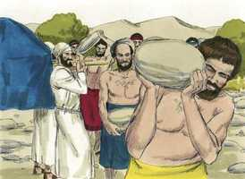
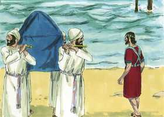
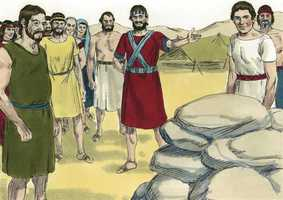
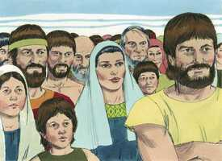

# Josué Cap 04

**1** 	SUCEDEU que, acabando todo o povo de passar o Jordão, falou o Senhor a Josué, dizendo:

> **Cmt MHenry**: *Versículos 1-9* As obras do Senhor são tão dignas de ser lembradas, e o coração do homem é tão propenso a esquecê-las, que se necessitam vários métodos para refrescar nossas lembranças, para a glória de Deus, para vantagem nossa e de nossos filhos. Deus deu ordens de preparar este lembrança.

**2** 	Tomai do povo doze homens, de cada tribo um homem;

**3** 	E mandai-lhes, dizendo: Tirai daqui, do meio do Jordão, do lugar onde estavam firmes os pés dos sacerdotes, doze pedras; e levai-as convosco à outra margem e depositai-as no alojamento em que haveis de passar esta noite.

**4** 	Chamou, pois, Josué os doze homens, que escolhera dos filhos de Israel; de cada tribo um homem;

> **Cmt MHenry**: *CAPÍTULO 40N-Mt 41N-Mc 42N-Lc 43N-Joa 44N-At 45N-Rm 46N-1Co 47N-2Co 48N-Gl 49N-Ef

**5** 	E disse-lhes Josué: Passai adiante da arca do Senhor vosso Deus, ao meio do Jordão; e cada um levante uma pedra sobre o ombro, segundo o número das tribos dos filhos de Israel;

**6** 	Para que isto seja por sinal entre vós; e quando vossos filhos no futuro perguntarem, dizendo: Que significam estas pedras?

**7** 	Então lhes direis que as águas do Jordão se separaram diante da arca da aliança do Senhor; passando ela pelo Jordão, separaram-se as águas do Jordão; assim estas pedras serão para sempre por memorial aos filhos de Israel.

**8** 	Fizeram, pois, os filhos de Israel assim como Josué tinha ordenado, e levantaram doze pedras do meio do Jordão como o Senhor dissera a Josué, segundo o número das tribos dos filhos de Israel; e levaram-nas consigo ao alojamento, e as depositaram ali.

 

**9** 	Levantou Josué também doze pedras no meio do Jordão, no lugar onde estiveram parados os pés dos sacerdotes, que levavam a arca da aliança; e ali estão até ao dia de hoje.

**10** 	Pararam, pois, os sacerdotes, que levavam a arca, no meio do Jordão, em pé, até que se cumpriu tudo quanto o Senhor mandara Josué dizer ao povo, conforme a tudo quanto Moisés tinha ordenado a Josué; e apressou-se o povo, e passou.

> **Cmt MHenry**: *Versículos 10-19* Os sacerdotes com a arca não se mexeram até que lhes foi ordenado. Que nenhum se canse de esperar, enquanto tiver consigo os sinais da presença de Deus, neste caso a arca da aliança, embora esteja nas profundidades da adversidade. Observe-se a honra outorgada a Josué. São respeitados, no melhor sentido, aqueles que demonstram que Deus está com eles, e o colocam na frente de si.

**11** 	E sucedeu que, assim que todo o povo acabou de passar, então passou a arca do Senhor, e os sacerdotes, à vista do povo.

**12** 	E passaram os filhos de Rúben, e os filhos de Gade, e a meia tribo de Manassés, armados na frente dos filhos de Israel, como Moisés lhes tinha falado;

**13** 	Uns quarenta mil homens de guerra, armados, passaram diante do Senhor para batalha, às campinas de Jericó.

**14** 	Naquele dia o Senhor engrandeceu a Josué diante dos olhos de todo o Israel; e temeram-no, como haviam temido a Moisés, todos os dias da sua vida.

**15** 	Falou, pois, o Senhor a Josué, dizendo:

**16** 	Dá ordem aos sacerdotes, que levam a arca do testemunho, que subam do Jordão.

**17** 	E deu Josué ordem aos sacerdotes, dizendo: Subi do Jordão.

**18** 	E aconteceu que, como os sacerdotes, que levavam a arca da aliança do Senhor, subiram do meio do Jordão, e as plantas dos pés dos sacerdotes se puseram em seco, as águas do Jordão se tornaram ao seu lugar, e corriam, como antes, sobre todas as suas ribanceiras.

 

**19** 	Subiu, pois, o povo, do Jordão no dia dez do mês primeiro; e alojaram-se em Gilgal, do lado oriental de Jericó.

**20** 	E as doze pedras, que tinham tomado do Jordão, levantou-as Josué em Gilgal.

> **Cmt MHenry**: *Versículos 20-24* É dever dos pais falar reiteradamente a seus filhos das palavras e obras de Deus para que se preparem no caminho pelo que devem andar. Em todas as instruções que os pais dêem a seus filhos, devem ensiná-lhes a temer a Deus. A piedade sincera é o melhor ensino. Não estamos chamados, assim como os israelitas, a louvar a bondade de nosso Deus? não erigiremos um altar a nosso Deus, que nos tirou de entre perigos e problemas em forma tão maravilhosa? Porque até agora o Senhor nos tem ajudado, tanto como o fez com os santos da antigüidade. Que enorme estupidez e ingratidão dos homens que não percebem sua mão e não reconhecem sua bondade em suas freqüentes liberações!

 

**21** 	E falou aos filhos de Israel, dizendo: Quando no futuro vossos filhos perguntarem a seus pais, dizendo: Que significam estas pedras?

 

**22** 	Fareis saber a vossos filhos, dizendo: Israel passou em seco este Jordão.

 

**23** 	Porque o Senhor vosso Deus fez secar as águas do Jordão diante de vós, até que passásseis, como o Senhor vosso Deus fez ao Mar Vermelho que fez secar perante nós, até que passássemos.

**24** 	Para que todos os povos da terra conheçam a mão do Senhor, que é forte, para que temais ao Senhor vosso Deus todos os dias.

> **Cmt MHenry** Intro: *• Versículos 1-9*> *Pedras tomadas do Jordão*> *• Versículos 10-19*> *O povo cruza o Jordão*> *• Versículos 20-24*> *As doze pedras colocadas em Gilgal*