# Josué Cap 06

**1** 	ORA Jericó estava rigorosamente fechada por causa dos filhos de Israel; ninguém saía nem entrava.

> **Cmt MHenry**: *Versículos 1-5* Jericó resolve que Israel não será seu amo. Encerrou-se poderosamente fortificada pela técnica e a natureza. Assim de néscios eram, e endureceram o coração para destruição deles; é o caso miserável de todos os que se fazem os fortes contra o Todo Poderoso. Deus resolve que Israel seja o amo, e pronto. não havia que realizar preparativos bélicos. Pelo método nada corrente de dar voltas em torno da cidade, o Senhor honrou a arca como símbolo de sua presença, e demonstrou que todas as vitórias eram Suas. A fé e a paciência do povo foram provadas e aumentadas. Versículos 6-16 Onde quer que irmã a arca, o povo a atendia. Os ministros de Deus, pela trombeta do evangelho eterno, que proclama liberdade e vitória, devem exortar os seguidores de Cristo em sua guerra espiritual. Assim como as prometidas liberações devem ser esperadas à maneira de Deus, também devem ser esperadas em Seu tempo. Por último, o povo devia gritar: assim o fizeram, e os muros derruíram. Este foi um grito de fé; eles criam que as muralhas de Jericó cairiam. Foi um grito de oração; clamaram ao céu por ajuda, e chegou o socorro.

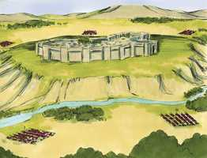 

**2** 	Então disse o Senhor a Josué: Olha, tenho dado na tua mão a Jericó, ao seu rei e aos seus homens valorosos.

**3** 	Vós, pois, todos os homens de guerra, rodeareis a cidade, cercando-a uma vez; assim fareis por seis dias.

**4** 	E sete sacerdotes levarão sete buzinas de chifres de carneiros adiante da arca, e no sétimo dia rodeareis a cidade sete vezes, e os sacerdotes tocarão as buzinas.

**5** 	E será que, tocando-se prolongadamente a buzina de carneiro, ouvindo vós o seu sonido, todo o povo gritará com grande brado; e o muro da cidade cairá abaixo, e o povo subirá por ele, cada um em frente.

**6** 	Então Josué, filho de Num, chamou aos sacerdotes e disse-lhes: Levai a arca da aliança; e sete sacerdotes levem sete buzinas de chifres de carneiros, adiante da arca do Senhor.

> **Cmt MHenry**: *CAPÍTULO 60N-1Pe 61N-2Pe 62N-1Jo 63N-2Jo 64N-3Jo 65N-Jd 66N-Ap

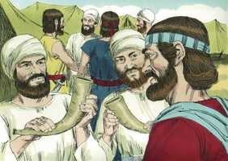 

**7** 	E disse ao povo: Passai e rodeai a cidade; e quem estiver armado, passe adiante da arca do Senhor.

**8** 	E assim foi que, como Josué dissera ao povo, os sete sacerdotes, levando as sete buzinas de carneiros diante do Senhor, passaram e tocaram as buzinas; e a arca da aliança do Senhor os seguia.

**9** 	E os homens armados iam adiante dos sacerdotes, que tocavam as buzinas; e a retaguarda seguia após a arca; andando e tocando as buzinas iam os sacerdotes.

**10** 	Porém ao povo Josué tinha dado ordem, dizendo: Não gritareis, nem fareis ouvir a vossa voz, nem sairá palavra alguma da vossa boca até ao dia que eu vos diga: Gritai. Então gritareis.

**11** 	E fez a arca do Senhor rodear a cidade, contornando-a uma vez; e entraram no arraial, e ali passaram a noite.

**12** 	Depois Josué se levantou de madrugada, e os sacerdotes levaram a arca do Senhor.

**13** 	E os sete sacerdotes, que levavam as sete buzinas de chifres de carneiros, adiante da arca do Senhor, iam andando, e tocavam as buzinas, e os homens armados iam adiante deles e a retaguarda seguia atrás da arca do Senhor; os sacerdotes iam andando e tocando as buzinas.

 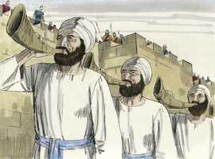 

**14** 	Assim rodearam outra vez a cidade no segundo dia e voltaram para o arraial; e assim fizeram seis dias.

**15** 	E sucedeu que, ao sétimo dia, madrugaram ao subir da alva, e da mesma maneira rodearam a cidade sete vezes; naquele dia somente rodearam a cidade sete vezes.

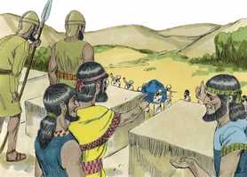 

**16** 	E sucedeu que, tocando os sacerdotes pela sétima vez as buzinas, disse Josué ao povo: Gritai, porque o Senhor vos tem dado a cidade.

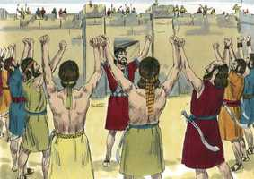 

**17** 	Porém a cidade será anátema ao Senhor, ela e tudo quanto houver nela; somente a prostituta Raabe viverá; ela e todos os que com ela estiverem em casa; porquanto escondeu os mensageiros que enviamos.

> **Cmt MHenry**: *Versículos 17-27* Jericó seria um sacrifício solene e espantoso à justiça de Deus, sobre aqueles que tinham enchido a medida de seus pecados. Deste modo, Ele indica de Quem, como criaturas, receberam a vida e a Quem, como pecadores, tinham abandonado. Raabe não pereceu com os que não creram ([Hb 11.31](../58N-Hb/11.md#31)). Toda sua família foi salva com ela; assim, a fé em Cristo traz salvação à casa ([Atos 16.31](../44N-At/16.md#31)). Ela, e eles com ela, foram tirados como brasas da fogueira. A nossa porção deve estar, bem com Raabe, bem com os homens de Jericó, segundo recebemos ou rejeitamos o sinal da salvação: a fé em Cristo, que opera por amor. Lembremo-nos o que depende de nossa eleição e escolhamos de forma adequada. Deus mostra o peso de uma maldição divina; onde esta repousa, não há forma de escapar dela, porque traz ruína irremediável.

**18** 	Tão-somente guardai-vos do anátema, para que não toqueis nem tomeis alguma coisa dele, e assim façais maldito o arraial de Israel, e o perturbeis.

**19** 	Porém toda a prata, e o ouro, e os vasos de metal, e de ferro são consagrados ao Senhor; irão ao tesouro do Senhor.

**20** 	Gritou, pois, o povo, tocando os sacerdotes as buzinas; e sucedeu que, ouvindo o povo o sonido da buzina, gritou o povo com grande brado; e o muro caiu abaixo, e o povo subiu à cidade, cada um em frente de si, e tomaram a cidade.

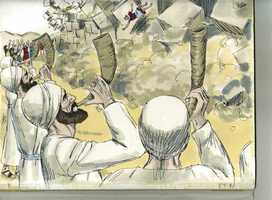 

**21** 	E tudo quanto havia na cidade destruíram totalmente ao fio da espada, desde o homem até à mulher, desde o menino até ao velho, e até ao boi e gado miúdo, e ao jumento.

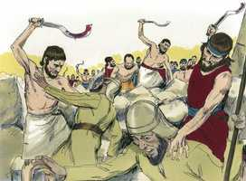 

**22** 	Josué, porém, disse aos dois homens que tinham espiado a terra: Entrai na casa da mulher prostituta, e tirai-a de lá com tudo quanto tiver, como lhe tendes jurado.

**23** 	Então entraram os jovens espias, e tiraram a Raabe e a seu pai, e a sua mãe, e a seus irmãos, e a tudo quanto tinha; tiraram também a toda a sua parentela, e os puseram fora do arraial de Israel.

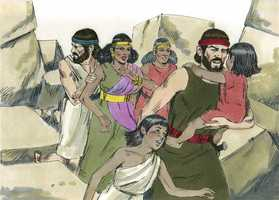 

**24** 	Porém a cidade e tudo quanto havia nela queimaram a fogo; tão-somente a prata, e o ouro, e os vasos de metal e de ferro, deram para o tesouro da casa do Senhor.

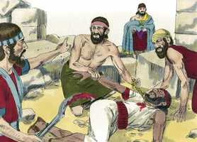 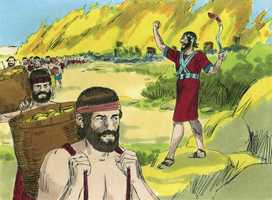 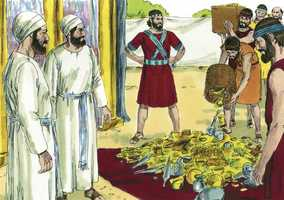 

**25** 	Assim deu Josué vida à prostituta Raabe e à família de seu pai, e a tudo quanto tinha; e habitou no meio de Israel até ao dia de hoje; porquanto escondera os mensageiros que Josué tinha enviado a espiar a Jericó.

**26** 	E naquele tempo Josué os esconjurou, dizendo: Maldito diante do Senhor seja o homem que se levantar e reedificar esta cidade de Jericó; sobre seu primogênito a fundará, e sobre o seu filho mais novo lhe porá as portas.

**27** 	Assim era o Senhor com Josué; e corria a sua fama por toda a terra.

> **Cmt MHenry** Intro: *• Versículos 1-5*> *O cerco de Jericó*> *• Versículos 6-16*> *Marcha em torno da cidade*> *• Versículos 17-27*> *Raabe e sua família salvados*