# Josué Cap 08

**1** 	ENTÃO disse o Senhor a Josué: Não temas, e não te espantes; toma contigo toda a gente de guerra, e levanta-te, sobe a Ai; olha que te tenho dado na tua mão o rei de Ai e o seu povo, e a sua cidade, e a sua terra.

> **Cmt MHenry**: *Versículos 1-2* Quando temos eliminado fielmente o pecado, essa coisa maldita que nos separa de Deus, então e somente então podemos esperar ouvir de Deus para nosso consolo; e o fato de que Deus nos guie na continuação de nossa obra e guerra cristã, é uma boa evidência de Sua reconciliação conosco. Deus animou a Josué a continuar. O botim de Ai não devia ser destruído como o de Jericó, portanto, não havia perigo de que a gente cometesse essa transgressão. Acã, que tomou o botim proibido, perdeu isso, a vida e tudo mais; porém o resto da gente que se manteve longe da coisa maldita foi rapidamente recompensada por sua obediência. A forma de ter o consolo do que Deus nos permite, é afastar-nos do que nos proíbe. Ninguém perde por negar a si mesmo.

**2** 	Farás, pois, a Ai e a seu rei, como fizeste a Jericó, e a seu rei; salvo que, para vós, tomareis os seus despojos, e o seu gado; põe emboscadas à cidade, por detrás dela.

**3** 	Então Josué levantou-se, e toda a gente de guerra, para subir contra Ai; e escolheu Josué trinta mil homens valorosos, e enviou-os de noite.

> **Cmt MHenry**: *Versículos 3-22* Observe-se a conduta e a prudência de Josué. Os que desejam manter suas lutas espirituais, não devem amar sua comodidade. Provavelmente ele foi sozinho ao vale a orar a Deus pedindo uma bênção, e não procurou em vão. Ele nunca retrocedeu até terminar a obra. Os que têm estendido suas mãos contra seus inimigos espirituais nunca devem retroceder.

**4** 	E deu-lhes ordem, dizendo: Olhai! Ponde-vos de emboscadas contra a cidade, por detrás dela; não vos alongueis muito da cidade; e estai todos vós atentos.

**5** 	Porém eu e todo o povo que está comigo nos aproximaremos da cidade; e será que, quando nos saírem ao encontro, como antes, fugiremos diante deles.

**6** 	Deixai-os, pois, sair atrás de nós, até que os tiremos da cidade; porque dirão: Fogem diante de nós como antes. Assim fugiremos diante deles.

**7** 	Então saireis vós da emboscada, e tomareis a cidade; porque o Senhor vosso Deus vo-la dará nas vossas mãos.

**8** 	E será que tomando vós a cidade, pôr-lhe-eis fogo; conforme a palavra do Senhor fareis; olhai que vo-lo tenho mandado.

> **Cmt MHenry**: *CAPÍTULO 8*

**9** 	Assim Josué os enviou, e eles se foram à emboscada; e ficaram entre Betel e Ai, ao ocidente de Ai; porém Josué passou aquela noite no meio do povo.

**10** 	E levantou-se Josué de madrugada, e contou o povo; e subiram ele e os anciãos de Israel adiante do povo contra Ai.

**11** 	E subiram também todos os homens de guerra, que estavam com ele; e aproximaram-se, e chegaram defronte da cidade; e alojaram-se do lado norte de Ai, e havia um vale entre eles e Ai.

**12** 	Tomou também uns cinco mil homens, e pô-los de emboscada entre Betel e Ai, ao ocidente da cidade.

**13** 	E puseram o povo, todo o arraial que estava ao norte da cidade, e a emboscada ao ocidente da cidade; e foi Josué aquela noite até ao meio do vale.

**14** 	E sucedeu que, vendo-o o rei de Ai, ele e todo o seu povo se apressaram, e se levantaram de madrugada, e os homens da cidade saíram ao encontro de Israel ao combate, ao tempo determinado, defronte das campinas; porém ele não sabia que se achava uma emboscada contra ele atrás da cidade.

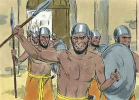 

**15** 	Josué, pois, e todo o Israel se houveram como feridos diante deles, e fugiram pelo caminho do deserto.

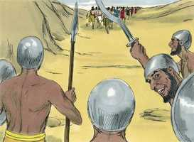 

**16** 	Por isso todo o povo, que estava na cidade, foi convocado para os seguir; e seguiram a Josué e foram afastados da cidade.

**17** 	E nem um só homem ficou em Ai, nem em Betel, que não saísse após Israel; e deixaram a cidade aberta, e seguiram a Israel.

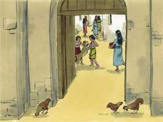 

**18** 	Então o Senhor disse a Josué: Estende a lança que tens na tua mão, para Ai, porque a darei na tua mão. E Josué estendeu a lança, que estava na sua mão, para a cidade.

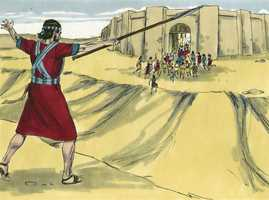 

**19** 	Então a emboscada se levantou apressadamente do seu lugar, e, estendendo ele a sua mão, correram e entraram na cidade, e a tomaram; e apressando-se, puseram fogo na cidade.

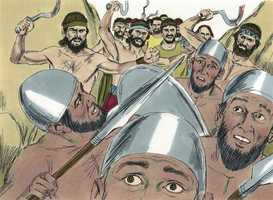 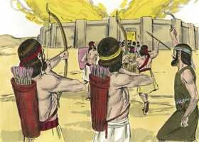 

**20** 	E virando-se os homens de Ai para trás, olharam, e eis que a fumaça da cidade subia ao céu, e não puderam fugir nem para uma parte nem para outra, porque o povo, que fugia para o deserto, se tornou contra os que os seguiam.

**21** 	E vendo Josué e todo o Israel que a emboscada tomara a cidade, e que a fumaça da cidade subia, voltaram, e feriram os homens de Ai.

**22** 	Também aqueles da cidade lhes saíram ao encontro, e assim ficaram no meio dos israelitas, uns de uma, e outros de outra parte; e feriram-nos, até que nenhum deles sobreviveu nem escapou.

**23** 	Porém ao rei de Ai tomaram vivo, e o trouxeram a Josué.

> **Cmt MHenry**: *Versículos 23-29* Deus, o justo Juiz, tinha sentenciado os cananeus por sua impiedade; os israelitas somente executaram a sentença. Nada da conduta deles pode ser mostrada como exemplo para os outros. Sem dúvida, houve razão especial para a severidade com o rei de Ai; provavelmente tenha sido notavelmente ímpio, vil e blasfemo contra o Deus de Israel.

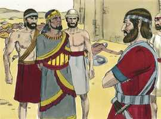 

**24** 	E sucedeu que, acabando os israelitas de matar todos os moradores de Ai no campo, no deserto, onde os tinham seguido, e havendo todos caído ao fio da espada, até serem consumidos, todo o Israel se tornou a Ai e a feriu ao fio de espada.

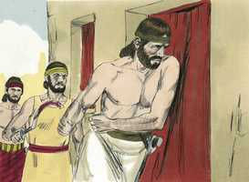 

**25** 	E todos os que caíram aquele dia, assim homens como mulheres, foram doze mil, todos moradores de Ai.

**26** 	Porque Josué não retirou a sua mão, que estendera com a lança, até destruir totalmente a todos os moradores de Ai.

**27** 	Tão-somente os israelitas tomaram para si o gado e os despojos da cidade, conforme à palavra do Senhor, que tinha ordenado a Josué.

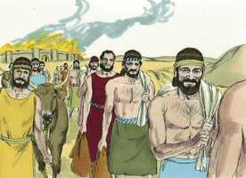 

**28** 	Queimou, pois, Josué a Ai e a tornou num montão perpétuo, em ruínas, até ao dia de hoje.

**29** 	E ao rei de Ai enforcou num madeiro, até à tarde; e ao pôr do sol ordenou Josué que o seu corpo fosse tirado do madeiro; e o lançaram à porta da cidade, e levantaram sobre ele um grande montão de pedras, até o dia de hoje.

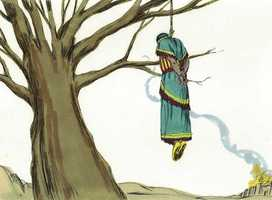 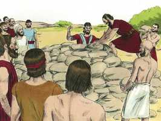 

**30** 	Então Josué edificou um altar ao Senhor Deus de Israel, no monte Ebal.

> **Cmt MHenry**: *Versículos 30-35* Assim que Josué chegou aos montes Ebal e Gerizim, sem demora e sem preocupar-se pelo estado de Israel, que ainda não se estabelecia, nem de seus inimigos, confirmou a aliança do Senhor com seu povo, segundo tinha-se indicado ([Dt 11](../05A-Dt/11.md#0) e 28). Não devemos pensar em diferir o pactuar com Deus até estarmos estabelecidos no mundo; tampouco nenhum assunto deve impedir que demos importância e busquemos a única coisa necessária. A forma de prosperar é começar por Deus ([Mt 6.33](../40N-Mt/06.md#33)). Eles edificaram um altar e ofereceram sacrifício a Deus, como sinal de sua dedicação a Deus, como sacrifício vivo em Sua honra, em um Mediador e por meio dEle. Pelo sacrifício do mesmo Cristo por nós, temos paz com Deus. Grande misericórdia para qualquer povo é ter a lei de Deus por escrito e é próprio que a lei escrita esteja em língua conhecida, para que possa ser vista e lida por todos os homens.

**31** 	Como Moisés, servo do Senhor, ordenara aos filhos de Israel, conforme ao que está escrito no livro da lei de Moisés, a saber: um altar de pedras inteiras, sobre o qual não se moverá instrumento de ferro; e ofereceram sobre ele holocaustos ao Senhor, e sacrificaram ofertas pacíficas.

**32** 	Também escreveu ali, em pedras, uma cópia da lei de Moisés, que este havia escrito diante dos filhos de Israel.

**33** 	E todo o Israel, com os seus anciãos, e os seus príncipes, e os seus juízes, estavam de um e de outro lado da arca, perante os sacerdotes levitas, que levavam a arca da aliança do Senhor, assim estrangeiros como naturais; metade deles em frente do monte Gerizim, e a outra metade em frente do monte Ebal, como Moisés, servo do Senhor, ordenara, para abençoar primeiramente o povo de Israel.

**34** 	E depois leu em alta voz todas as palavras da lei, a bênção e a maldição, conforme a tudo o que está escrito no livro da lei.

**35** 	Palavra nenhuma houve, de tudo o que Moisés ordenara, que Josué não lesse perante toda a congregação de Israel, e as mulheres, e os meninos, e os estrangeiros, que andavam no meio deles.

> **Cmt MHenry** Intro: *• Versículos 1-2*> *Deus anima a Josué*> *• Versículos 3-22*> *A conquista de Ai*> *• Versículos 23-29*> *A destruição de Ai e seu rei*> *• Versículos 30-35*> *Leitura da lei em Ebal e Gerizim*