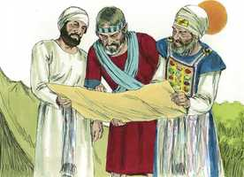
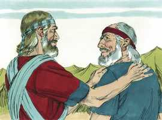

# Josué Cap 14

**1** 	ISTO, pois, é o que os filhos de Israel tiveram em herança, na terra de Canaã, o que Eleazar, o sacerdote, e Josué, filho de Num, e os cabeças dos pais das tribos dos filhos de Israel lhes fizeram repartir,

> **Cmt MHenry**: *Versículos 1-5* Os israelitas devem ocupar as novas conquistas. Canaã teria sido submetida em vão se não tiver sido habitada. Mas não todo homem pode ir a instalar-se onde lhe pareça. Deus escolhe nossa herança por nós. Revistemos nossa herança de misericórdia atual, nossa perspectiva da terra prometida, eterna, nos céus. Deus faz acepção de pessoas? Não é melhor que nosso lugar, em quanto a bem ou tristeza terrena, seja determinado pela infinita sabedoria de nosso Pai celestial e não por nossa própria ignorância? Não deveriam aqueles para os quais foi revelado o grande mistério da piedade, aqueles cuja redenção foi comprada por Jesus Cristo, com gratidão, atribuir seus interesses terrenos a Sua designação?

 

**2** 	Por sorte da sua herança, como o Senhor ordenara, pelo ministério de Moisés, acerca das nove tribos e da meia tribo.

**3** 	Porquanto às duas tribos e à meia tribo já dera Moisés herança além do Jordão; mas aos levitas não tinha dado herança entre eles.

**4** 	Porque os filhos de José eram duas tribos, Manassés e Efraim, e aos levitas não se deu herança na terra, senão cidades em que habitassem, e os seus arrabaldes para seu gado e para seus bens.

**5** 	Como o Senhor ordenara a Moisés, assim fizeram os filhos de Israel, e repartiram a terra.

**6** 	Então os filhos de Judá chegaram a Josué em Gilgal; e Calebe, filho de Jefoné o quenezeu, lhe disse: Tu sabes o que o Senhor falou a Moisés, homem de Deus, em Cades-Barnéia por causa de mim e de ti.

> **Cmt MHenry**: *Versículos 6-15* O pedido de Calebe é "dá-me este monte", ou Hebrom, porque estava anteriormente na promessa de Deus para ele, e faria saber a Israel quanto valorava a promessa. Os que vivem pela fé valorizam o dado por promessa de Deus muito mais que o dado somente por sua providência. Agora isso era possessão dos anaquins e Calebe deixaria que Israel soubesse quão pouco temia ao inimigo, e que os animaria a continuar adiante com suas conquistas. Calebe respondia a seu nome, que significa "todo coração". Hebrom foi dada a Calebe e seus herdeiros, porque ele seguiu completamente ao Senhor Deus de Israel. Somos felizes se o seguirmos. A piedade extraordinária será coroada com favor extraordinário "

**7** 	Quarenta anos tinha eu, quando Moisés, servo do Senhor, me enviou de Cades-Barnéia a espiar a terra; e eu lhe trouxe resposta, como sentia no meu coração;

**8** 	Mas meus irmãos, que subiram comigo, fizeram derreter o coração do povo; eu porém perseverei em seguir ao Senhor meu Deus.

**9** 	Então Moisés naquele dia jurou, dizendo: Certamente a terra que pisou o teu pé será tua, e de teus filhos, em herança perpetuamente; pois perseveraste em seguir ao Senhor meu Deus.

**10** 	E agora eis que o Senhor me conservou em vida, como disse; quarenta e cinco anos são passados, desde que o Senhor falou esta palavra a Moisés, andando Israel ainda no deserto; e agora eis que hoje tenho já oitenta e cinco anos;

**11** 	E ainda hoje estou tão forte como no dia em que Moisés me enviou; qual era a minha força então, tal é agora a minha força, tanto para a guerra como para sair e entrar.

**12** 	Agora, pois, dá-me este monte de que o Senhor falou aquele dia; pois naquele dia tu ouviste que estavam ali os anaquins, e grandes e fortes cidades. Porventura o Senhor será comigo, para os expulsar, como o Senhor disse.

**13** 	E Josué o abençoou, e deu a Calebe, filho de Jefoné, a Hebrom em herança.

 

**14** 	Portanto Hebrom ficou sendo herança de Calebe, filho de Jefoné o quenezeu, até ao dia de hoje, porquanto perseverara em seguir ao Senhor Deus de Israel.

> **Cmt MHenry**: *Capítulo 14A-2Cr

**15** 	E antes o nome de Hebrom era Quiriate-Arba, porque Arba foi o maior homem entre os anaquins. E a terra repousou da guerra.

> **Cmt MHenry** Intro: *• Versículos 1-5*> *As nove tribos e meia recebem sua herança*> *• Versículos 6-15*> *Calebe obtém Hebrom*