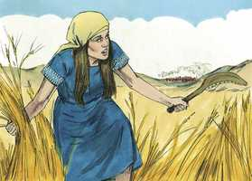
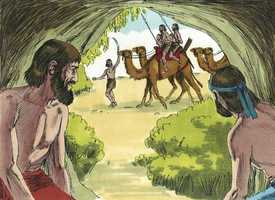

# Juízes Cap 06

**1** 	PORÉM os filhos de Israel fizeram o que era mau aos olhos do Senhor; e o Senhor os deu nas mãos dos midianitas por sete anos.

> **Cmt MHenry**: *Versículos 1-6* O pecado de Israel se renovou e se repetiram as aflições de Israel. Todos os que pecam esperem sofrer. Os israelitas se ocultaram em cavernas e guaridas; tal foi o efeito de uma consciência culpável. O pecado deprime os homens. Os invasores não deixaram comida para Israel, salvo a levada às cavernas. Prepararam para Baal aquilo com que deveriam ter servido a Deus, assim que agora Deus, justamente, envia um inimigo para tirá-lo deles na estação correspondente.

**2** 	E, prevalecendo a mão dos midianitas sobre Israel, fizeram os filhos de Israel para si, por causa dos midianitas, as covas que estão nos montes, as cavernas e as fortificações.

**3** 	Porque sucedia que, semeando Israel, os midianitas e os amalequitas, e também os do oriente, contra ele subiam.

 

**4** 	E punham-se contra ele em campo, e destruíam os frutos da terra, até chegarem a Gaza; e não deixavam mantimento em Israel, nem ovelhas, nem bois, nem jumentos.

**5** 	Porque subiam com os seus gados e tendas; vinham como gafanhotos, em grande multidão que não se podia contar, nem a eles nem aos seus camelos; e entravam na terra, para a destruir.

**6** 	Assim Israel empobreceu muito pela presença dos midianitas; então os filhos de Israel clamaram ao Senhor.

> **Cmt MHenry**: *CAPÍTULO 60N-1Pe 61N-2Pe 62N-1Jo 63N-2Jo 64N-3Jo 65N-Jd 66N-Ap

**7** 	E sucedeu que, clamando os filhos de Israel ao Senhor por causa dos midianitas,

> **Cmt MHenry**: *Versículos 7-10* Eles clamaram a Deus por um libertador e Ele lhes enviou um profeta para ensiná-los. Quando Deus dá a nação ministros fiéis, é um sinal de que lhe tem reservada misericórdia. Os acusa de rebelião contra o Senhor; sua intenção é levá-los ao arrependimento. O arrependimento é real quando se lamenta a devassidão do pecado, como desobediência a Deus.

**8** 	Enviou o Senhor um profeta aos filhos de Israel, que lhes disse: Assim diz o Senhor Deus de Israel: Do Egito eu vos fiz subir, e vos tirei da casa da servidão;

**9** 	E vos livrei da mão dos egípcios, e da mão de todos quantos vos oprimiam; e os expulsei de diante de vós, e a vós dei a sua terra.

**10** 	E vos disse: Eu sou o Senhor vosso Deus; não temais aos deuses dos amorreus, em cuja terra habitais; mas não destes ouvidos à minha voz.

**11** 	Então o anjo do Senhor veio, e assentou-se debaixo do carvalho que está em Ofra, que pertencia a Joás, abiezrita; e Gideão, seu filho, estava malhando o trigo no lagar, para o salvar dos midianitas.

> **Cmt MHenry**: *Versículos 11-24* Gideão era um homem de espírito valente e esforçado, mas na escuridão de sua época; aqui ele é estimulado a empreender algo grande. Era seguro que Jeová estava com ele, quando seu Anjo esteve com ele. Gideão era de fé fraca, o qual lhe dificulta reconciliar a seguridade da presença de Deus com a aflição à qual está submetido Israel. O Anjo responde a suas objeções. Lhe diz que se apresente e aja como o libertador de Israel, que não necessitava mais. O bispo Hall diz: Embora Deus qualifica de valente a Gideão, é Ele quem o faz assim. Deus se deleita em fazer progredir o humilde. Gideão deseja que sua fé seja confirmada. Agora, sob a influência do Espírito, nós não temos que esperar sinais ante nossos olhos como os que Gideão deseja aqui; antes devemos orar fervorosamente a Deus que, se temos achado graça ante seus olhos, Ele envie um sinal a nosso coração pela obra poderosa de seu Espírito. O Anjo converteu a carne numa oferta apresentada pelo fogo; demonstrando assim que Ele não era homem que necessitasse carne, senão o Filho de Deus que seria servido e honrado pelo sacrifício e que, no cumprimento do tempo, se ofereceria a Si mesmo em sacrifício. Aqui se dá a Gideão um sinal de que tinha achado graça aos olhos de Deus. Desde que o homem tem estado exposto à ira e maldição de Deus, tem sido aterrador para ele uma mensagem do céu, porque dificilmente se atreve a esperar boas notícias de lá. Neste mundo é muito espantoso ter qualquer relação com o mundo dos espíritos, ao qual somos tão alheios. O valor faltou a Gideão, mas Deus lhe falou de paz.

 

**12** 	Então o anjo do Senhor lhe apareceu, e lhe disse: O Senhor é contigo, homem valoroso.

 

**13** 	Mas Gideão lhe respondeu: Ai, Senhor meu, se o Senhor é conosco, por que tudo isto nos sobreveio? E que é feito de todas as suas maravilhas que nossos pais nos contaram, dizendo: Não nos fez o Senhor subir do Egito? Porém agora o Senhor nos desamparou, e nos deu nas mãos dos midianitas.

**14** 	Então o Senhor olhou para ele, e disse: Vai nesta tua força, e livrarás a Israel das mãos dos midianitas; porventura não te enviei eu?

**15** 	E ele lhe disse: Ai, Senhor meu, com que livrarei a Israel? Eis que a minha família é a mais pobre em Manassés, e eu o menor na casa de meu pai.

**16** 	E o Senhor lhe disse: Porquanto eu hei de ser contigo, tu ferirás aos midianitas como se fossem um só homem.

**17** 	E ele disse: Se agora tenho achado graça aos teus olhos, dá-me um sinal de que és tu que falas comigo.

**18** 	Rogo-te que daqui não te apartes, até que eu volte e traga o meu presente, e o ponha perante ti. E disse: Eu esperarei até que voltes.

**19** 	E entrou Gideão e preparou um cabrito e pães ázimos de um efa de farinha; a carne pôs num cesto e o caldo pôs numa panela; e trouxe-lho até debaixo do carvalho, e lho ofereceu.

**20** 	Porém o anjo de Deus lhe disse: Toma a carne e os pães ázimos, e põe-nos sobre esta penha e derrama-lhe o caldo. E assim fez.

**21** 	E o anjo do Senhor estendeu a ponta do cajado, que estava na sua mão, e tocou a carne e os pães ázimos; então subiu o fogo da penha, e consumiu a carne e os pães ázimos; e o anjo do Senhor desapareceu de seus olhos.

 

**22** 	Então viu Gideão que era o anjo do Senhor e disse: Ah, Senhor Deus, pois vi o anjo do Senhor face a face.

**23** 	Porém o Senhor lhe disse: Paz seja contigo; não temas; não morrerás.

 

**24** 	Então Gideão edificou ali um altar ao Senhor, e chamou-lhe: O SENHOR É PAZ; e ainda até o dia de hoje está em Ofra dos abiezritas.

**25** 	E aconteceu naquela mesma noite, que o Senhor lhe disse: Toma o boi que pertence a teu pai, a saber, o segundo boi de sete anos, e derruba o altar de Baal, que é de teu pai; e corta o bosque que está ao pé dele.

> **Cmt MHenry**: *Versículos 25-32* Veja-se aqui o poder da graça de Deus, que levantará um reformador; e a bondade de sua graça que levantará o libertador da família de um líder da idolatria. Gideão não deve pensar que é suficiente não adorar nesse altar; deve demoli-lo e oferecer sacrifício num outro. Era necessário que fizesse a paz com Deus antes de ir à guerra contra Midiã. Enquanto o pecado não tenha sido perdoado pelo grande Sacrifício, não deve esperar-se nenhum bem. Deus, que tem todos os corações em sua mão, influi sobre Joás para que compareça em favor de seu filho contra os defensores de Baal, embora anteriormente se tiver unido ao culto de Baal. façamos nosso dever e confiemos a Deus nossa segurança. Aqui há um desafio a Baal para que faça bem ou mal; o resultado convence a seus adoradores de sua estultícia de pedir socorro àquele que não podia sequer vingar a si mesmo.

**26** 	E edifica ao Senhor teu Deus um altar no cume deste lugar forte, num lugar conveniente; e toma o segundo boi, e o oferecerás em holocausto com a lenha que cortares do bosque.

**27** 	Então Gideão tomou dez homens dentre os seus servos, e fez como o Senhor lhe dissera; e sucedeu que, temendo ele a casa de seu pai, e os homens daquela cidade, não o fez de dia, mas fê-lo de noite.

 

**28** 	Levantando-se, pois, os homens daquela cidade, de madrugada, eis que estava o altar de Baal derrubado, e o bosque estava ao pé dele, cortado; e o segundo boi oferecido no altar que fora edificado.

**29** 	E uns aos outros disseram: Quem fez esta coisa? E, esquadrinhando, e inquirindo, disseram: Gideão, o filho de Joás, fez esta coisa.

**30** 	Então os homens daquela cidade disseram a Joás: Tira para fora a teu filho; para que morra; pois derribou o altar de Baal, e cortou o bosque que estava ao pé dele.

**31** 	Porém Joás disse a todos os que se puseram contra ele: Contendereis vós por Baal? Livrá-lo-eis vós? Qualquer que por ele contender ainda esta manhã será morto; se é deus, por si mesmo contenda; pois derrubaram o seu altar.

 

**32** 	Por isso naquele dia lhe chamaram Jerubaal, dizendo: Baal contenda contra ele, pois derrubou o seu altar.

**33** 	E todos os midianitas e amalequitas, e os filhos do oriente se ajuntaram, e passaram, e acamparam no vale de Jizreel.

> **Cmt MHenry**: *Versículos 33-40* Os sinais são verdadeiramente miraculosos e muito significativos. Gideão e seus homens lutariam contra os midianitas, poderia Deus distinguir entre um pequeno velo de lã de Israel e o extenso solo de Midiã? Se faz saber a Gideão que Deus podia fazê-lo. Desejava Gideão que o orvalho da graça divina descesse em particular sobre ele mesmo? Vê o velo de lã molhado pelo orvalho para dar-lhe seguridade. Deseja que Deus seja como o orvalho para todo Israel? Eis ali, todo o solo está úmido. Quanta causa temos nós, pecadores dos gentios, para abençoar o Senhor pelo fato de que o orvalho das bênçãos celestiais, uma vez limitado a Israel, agora é enviado a todos os habitantes da terra! Mas até os médios de graça se dão em diferentes medidas conforme com os propósitos de Deus. na mesma congregação, a alma de um homem é como o velo de lã umedecido de Gideão, o outro é como o solo seco.

**34** 	Então o Espírito do Senhor revestiu a Gideão, o qual tocou a buzina, e os abiezritas se ajuntaram após ele.

**35** 	E enviou mensageiros por toda a tribo de Manassés, que também se ajuntou após ele; também enviou mensageiros a Aser, e a Zebulom, e a Naftali, que saíram-lhe ao encontro.

 

**36** 	E disse Gideão a Deus: Se hás de livrar a Israel por minha mão, como disseste,

**37** 	Eis que eu porei um velo de lã na eira; se o orvalho estiver somente no velo, e toda a terra ficar seca, então conhecerei que hás de livrar a Israel por minha mão, como disseste.

**38** 	E assim sucedeu; porque no outro dia se levantou de madrugada, e apertou o velo; e do orvalho que espremeu do velo, encheu uma taça de água.

 

**39** 	E disse Gideão a Deus: Não se acenda contra mim a tua ira, se ainda falar só esta vez; rogo-te que só esta vez faça a prova com o velo; rogo-te que só o velo fique seco, e em toda a terra haja o orvalho.

**40** 	E Deus assim fez naquela noite; pois só o velo ficou seco, e sobre toda a terra havia orvalho.

> **Cmt MHenry** Intro: *• Versículos 1-6*> *Israel oprimido pelos midianitas*> *• Versículos 7-10*> *Um profeta repreende a Israel*> *• Versículos 11-24*> *Gideão colocado para liberar a Israel*> *• Versículos 25-32*> *Gideão destrói o altar de Baal*> *• Versículos 33-40*> *Sinais dados a Gideão*