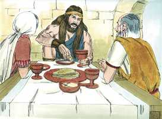
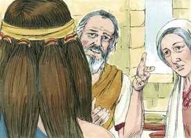

# Juízes Cap 14

**1** 	E DESCEU Sansão a Timnate; e, vendo em Timnate uma mulher das filhas dos filisteus,

> **Cmt MHenry**: *Versículos 1-4* Já que o matrimônio de Sansão era coisa comum, era fraqueza e tolice de sua parte pôr seus afetos numa filistéia. Um israelita, e mais ainda um nazireu consagrado ao Senhor, pode ter anelo de chegar a ser um com uma adoradora de Dagom? Não parece que Ele tivesse alguma razão para pensar que ela era sabia e virtuosa ou, em alguma forma, fosse uma provável ajuda idônea para ele; somente viu nela algo que agradou sua imaginação. Quem se guia somente pelo que vê ao escolher esposa, e for dirigido por sua fantasia caprichosa, depois terá de agradecer só a si mesmo quando se encontrar com uma filistéia em seus braços. Todavia, Sansão agiu bem no fato de ter dado a conhecer a seus pais acerca do assunto. Os filhos não devem casar-se, nem sequer pensar a esse respeito, sem o conselho e consentimento de seus pais. Os pais de Sansão fizeram bem em dissuadi-lo de unir-se em jugo desigual com uma incrédula. Parece que aprouve a Deus deixar que Sansão seguisse suas próprias inclinações, com a intenção de obter algo bom de sua conduta; e seus pais consentiram porque ele estava decidido. Contudo, seu exemplo não ficou registrado para que nós o imitemos.

**2** 	Subiu, e declarou-o a seu pai e a sua mãe, e disse: Vi uma mulher em Timnate, das filhas dos filisteus; agora, pois, tomai-ma por mulher.

 

**3** 	Porém seu pai e sua mãe lhe disseram: Não há, porventura, mulher entre as filhas de teus irmãos, nem entre todo o meu povo, para que tu vás tomar mulher dos filisteus, daqueles incircuncisos? E disse Sansão a seu pai: Toma-me esta, porque ela agrada aos meus olhos.

 

**4** 	Mas seu pai e sua mãe não sabiam que isto vinha do Senhor; pois buscava ocasião contra os filisteus; porquanto naquele tempo os filisteus dominavam sobre Israel.

**5** 	Desceu, pois, Sansão com seu pai e com sua mãe a Timnate; e, chegando às vinhas de Timnate eis que um filho de leão, rugindo, lhe saiu ao encontro.

> **Cmt MHenry**: *Versículos 5-9* Ao dar poder para matar o leão, Deus fez saber a Sansão o que podia fazer com o poder do Espírito de Jeová, e que não tivesse medo jamais de olhar direto à cara as dificuldades maiores. Estava somente caminhando pelos vinhedos. A gente jovem não considera quanto se expõem ao leão rugidor que anda buscando a quem devorar, quando se afastam da prudência e piedade de seus pais. Tampouco os homens consideram os leões que podem estar a espreita nos vinhedos do vinho que brilha vermelho. Tendo vencido nosso Senhor Jesus a Satanás, esse leão rugidor, os crentes como Sansão encontram mel no cadáver, força e satisfação abundantes, suficientes para eles e para todos seus amigos.

**6** 	Então o Espírito do Senhor se apossou dele tão poderosamente que despedaçou o leão, como quem despedaça um cabrito, sem ter nada na sua mão; porém nem a seu pai nem a sua mãe deu a saber o que tinha feito.

**7** 	E desceu, e falou àquela mulher, e ela agradou aos olhos de Sansão.

**8** 	E depois de alguns dias voltou ele para tomá-la; e, apartando-se do caminho para ver o corpo do leão morto, eis que nele havia um enxame de abelhas com mel.

 

**9** 	E tomou-o nas suas mãos, e foi andando e comendo dele; e foi a seu pai e a sua mãe, e deu-lhes do mel, e comeram; porém não lhes deu a saber que tomara o mel do corpo do leão.

**10** 	Descendo, pois, seu pai àquela mulher, fez Sansão ali um banquete; porque assim os moços costumavam fazer.

> **Cmt MHenry**: *Versículos 10-20* O enigma de Sansão literalmente não significa outra coisa senão que Ele tinha achado mel para comer e gostar no leão, que em sua força e fúria estava prestes a devorá-lo. porém parece aludir diretamente à vitória de Cristo sobre Satanás, por meio de sua humilhação, agonia e morte, e sua exaltação subseqüente, com a glória que tinha do Pai, e as vantagens espirituais para seu povo. Até a morte, monstro devorador, despojada de seu aguilhão e de seu horror, leva a alma ao reino da bênção. Neste e em outros sentidos, do devorador saiu comida, e do forte, doçura. Os companheiros de Sansão obrigaram a sua esposa que conseguisse de parte dele a explicação. Uma esposa mundana ou uma amizade mundana, é para um homem santo um inimigo em seu campo, que buscará toda oportunidade para traí-lo. Nenhuma união pode ser cômoda ou duradoura, se não podem confiar-se segredos, sem risco de que a outra parte os divulgue. Satanás, com suas tentações, não poderia fazer-nos o dano que nos faz se não arasse com o boi de nossa natureza corrupta. Sua principal vantagem contra nós surge de sua correspondência com nosso coração enganoso e nossa luxúria inata. Isto resultou ser ocasião de afastar a Sansão de seus novos parentes. Bom seria para nós se a maldade que encontramos no mundo e nossa desilusão nos obrigassem, por fé e oração, a voltar à casa de nosso Pai e repousar ali. Veja quão pouca é a confiança que se pode ter num homem. Qualquer tenha sido a pretensão de amizade feita, o verdadeiro filisteu logo se cansará de um verdadeiro israelita.

**11** 	E sucedeu que, como o vissem, trouxeram trinta companheiros para estarem com ele.

**12** 	Disse-lhes, pois, Sansão: Eu vos darei um enigma para decifrar; e, se nos sete dias das bodas o decifrardes e descobrirdes, eu vos darei trinta lençóis e trinta mudas de roupas.

 

**13** 	E, se não puderdes decifrar, vós me dareis a mim trinta lençóis e as trinta mudas de roupas. E eles lhe disseram: Dá-nos o teu enigma a decifrar, para que o ouçamos.

**14** 	Então lhes disse: Do comedor saiu comida, e do forte saiu doçura. E em três dias não puderam decifrar o enigma.

> **Cmt MHenry**: *CAPÍTULO 14A-2Cr

**15** 	E sucedeu que, ao sétimo dia, disseram à mulher de Sansão: Persuade a teu marido que nos declare o enigma, para que porventura não queimemos a fogo a ti e à casa de teu pai; chamastes-nos aqui para vos apossardes do que é nosso, não é assim?

 

**16** 	E a mulher de Sansão chorou diante dele, e disse: Tão-somente me desprezas, e não me amas; pois deste aos filhos do meu povo um enigma para decifrar, e ainda não o declaraste a mim. E ele lhe disse: Eis que nem a meu pai nem a minha mãe o declarei, e to declararia a ti?

 

**17** 	E chorou diante dele os sete dias em que celebravam as bodas; sucedeu, pois, que ao sétimo dia lho declarou, porquanto o importunava; então ela declarou o enigma aos filhos do seu povo.

**18** 	Disseram, pois, a Sansão os homens daquela cidade, ao sétimo dia, antes de se pôr o sol: Que coisa há mais doce do que o mel? E que coisa há mais forte do que o leão? E ele lhes disse: Se vós não lavrásseis com a minha novilha, nunca teríeis descoberto o meu enigma.

 

**19** 	Então o Espírito do Senhor tão poderosamente se apossou dele, que desceu aos ascalonitas, e matou deles trinta homens, e tomou as suas roupas, e deu as mudas de roupas aos que declararam o enigma; porém acendeu-se a sua ira, e subiu à casa de seu pai.

 

**20** 	E a mulher de Sansão foi dada ao seu companheiro que antes o acompanhava.

> **Cmt MHenry** Intro: *• Versículos 1-4*> *Sansão deseja uma esposa filistéia*> *• Versículos 5-9*> *Sansão mata um leão*> *• Versículos 1-20*> *O enigma de Sansão*