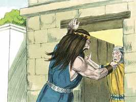
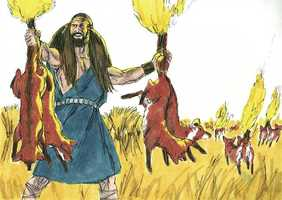
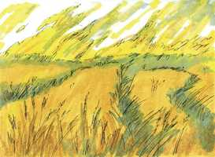
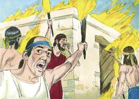
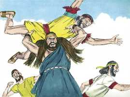
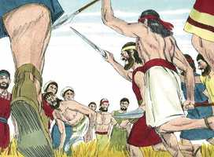
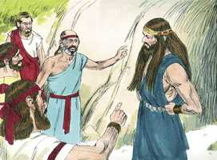
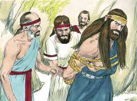
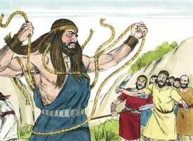
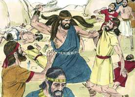

# Juízes Cap 15

**1** 	E ACONTECEU, depois de alguns dias, que, na sega do trigo, Sansão visitou a sua mulher, com um cabrito, e disse: Entrarei na câmara de minha mulher. Porém o pai dela não o deixou entrar.

> **Cmt MHenry**: *Versículos 1-8* Quando há diferenças entre familiares, contem-se como os mais sábios e os melhores, os que estão mais dispostos a perdoar e a esquecer e se mostram mais dispostos a inclinar-se e a ceder em aras da paz. Nos médios que Sansão empregou devemos observar o poder de Deus para supri-los e fazê-los triunfar, para mortificar o orgulho e castigar a maldade dos filisteus. Estes ameaçaram a esposa de Sansão que a queimariam a ela e a casa de seu pai. Para salvar-se e fazê-lhe um serviço a seus compatriotas, ela traiu a seu marido; e o mesmo que temia, e que procurou evitar pecando, lhe sobreveio! Ela e a casa de seu pai foram queimadas com fogo por seus compatriotas, aos que ela acreditou servir com o mal que fez a seu esposo. O dano do qual procuramos escapar por práticas ilícitas, freqüentemente o acarretamos sobre nossa própria cabeça.

**2** 	E disse-lhe seu pai: Por certo pensava eu que de todo a desprezavas; de sorte que a dei ao teu companheiro; porém não é sua irmã mais nova, mais formosa do que ela? Toma-a, pois, em seu lugar.

 

**3** 	Então Sansão disse acerca deles: Inocente sou esta vez para com os filisteus, quando lhes fizer algum mal.

**4** 	E foi Sansão, e pegou trezentas raposas; e, tomando tochas, as virou cauda a cauda, e lhes pôs uma tocha no meio de cada duas caudas.

 

**5** 	E chegou fogo às tochas, e largou-as na seara dos filisteus; e assim abrasou os molhos com a sega do trigo, e as vinhas e os olivais.

 

**6** 	Então perguntaram os filisteus: Quem fez isto? E responderam: Sansão, o genro do timnita, porque lhe tomou a sua mulher, e a deu a seu companheiro. Então subiram os filisteus, e queimaram a fogo a ela e a seu pai.

 

**7** 	Então lhes disse Sansão: É assim que fazeis? Pois, havendo-me vingado eu de vós, então cessarei.

 

**8** 	E feriu-os com grande ferimento, pernas juntamente com coxa; e desceu, e habitou na fenda da rocha de Etã.

**9** 	Então os filisteus subiram, e acamparam-se contra Judá, e estenderam-se por Leí.

> **Cmt MHenry**: *Versículos 9-17* O pecado deprime os homens e oculta de seus olhos as coisas que pertencem a sua paz. Os israelitas culparam a Sansão pelo que tinha feito contra os filisteus, como se lhes tivesse causado um grande dano. Do mesmo modo, nosso Senhor Jesus fez muitas coisas boas e por elas os judeus estavam dispostos a apedrejá-lo. quando o Espírito do Senhor desceu sobre Sansão, se soltaram as cordas: onde está o Espírito do Senhor há liberdade e são verdadeiramente livres os que assim foram liberados. Deste modo, Cristo triunfou sobre as potestades das trevas que clamavam em sua contra, como se o tivessem em seu poder. Sansão ocasionou muita destruição entre os filisteus. Tomar o osso de um jumento para isto, era fazer maravilhas com as coisas néscias do mundo, para que a excelência do poder seja de Deus, não do homem. Esta vitória não foi a causa da arma, nem pelo braço, senão no Espírito de Deus que moveu a arma por meio do braço. Podemos fazer todo por médio do que nos fortalece. Vejam a um pobre cristão capacitado para vencer uma tentação por um conselho fraco e frágil, e eis ali o filisteu vencido por uma miserável queixada.

 

**10** 	E perguntaram-lhes os homens de Judá: Por que subistes contra nós? E eles responderam: Subimos para amarrar a Sansão, para lhe fazer a ele como ele nos fez a nós.

**11** 	Então três mil homens de Judá desceram até a fenda da rocha de Etã, e disseram a Sansão: Não sabias tu que os filisteus dominam sobre nós? Por que, pois, nos fizeste isto? E ele lhes disse: Assim como eles me fizeram a mim, eu lhes fiz a eles.

 

**12** 	E disseram-lhe: Descemos para te amarrar e te entregar nas mãos dos filisteus. Então Sansão lhes disse: Jurai-me que vós mesmos não me acometereis.

**13** 	E eles lhe falaram, dizendo: Não, mas fortemente te amarraremos, e te entregaremos nas mãos deles; porém de maneira nenhuma te mataremos. E amarraram-no com duas cordas novas e fizeram-no subir da rocha.

 

**14** 	E, vindo ele a Leí, os filisteus lhe saíram ao encontro, jubilando; porém o Espírito do Senhor poderosamente se apossou dele, e as cordas que ele tinha nos braços se tornaram como fios de linho que se queimaram no fogo, e as suas amarraduras se desfizeram das suas mãos.

 

**15** 	E achou uma queixada fresca de um jumento, e estendeu a sua mão, e tomou-a, e feriu com ela mil homens.

> **Cmt MHenry**: *CAPÍTULO 15A-Es

 

**16** 	Então disse Sansão: Com uma queixada de jumento, montões sobre montões; com uma queixada de jumento feri a mil homens.

**17** 	E aconteceu que, acabando ele de falar, lançou a queixada da sua mão; e chamou aquele lugar Ramate-Leí.

**18** 	E como tivesse grande sede, clamou ao Senhor, e disse: Pela mão do teu servo tu deste esta grande salvação; morrerei eu pois agora de sede, e cairei na mão destes incircuncisos?

**19** 	Então Deus fendeu uma cavidade que estava na queixada; e saiu dela água, e bebeu; e recobrou o seu espírito e reanimou-se; por isso chamou aquele lugar: A fonte do que clama, que está em Leí até ao dia de hoje.

**20** 	E julgou a Israel, nos dias dos filisteus, vinte anos.

> **Cmt MHenry** Intro: *• Versículos 1-8*> *É negada sua esposa a Sansão – Ataca aos filisteus*> *• Versículos 9-17*> *Sansão mata mil filisteus com uma queixada*> *• Versículos 18-20*> *Seu mal-estar pela sede*