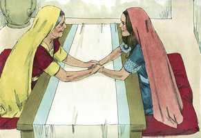
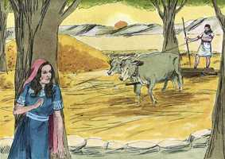
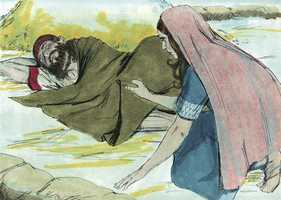
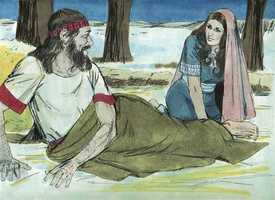
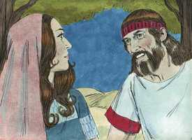

# Rute Cap 03

**1** 	E DISSE-LHE Noemi, sua sogra: Minha filha, não hei de buscar descanso, para que fiques bem?

> **Cmt MHenry**: *Versículos 1-5* O estado matrimonial deve ser um descanso, tanto como poderia sê-lo todo na terra, já que deve deixar fixo o afeto e estabelecer uma relação para toda a vida. portanto, deve empreender-se com grande seriedade, com oração sincera, pedindo direção, a bênção de Deus, e com submissão a Seus preceitos. Os pais devem aconselhar cuidadosamente a seus filhos neste importante assunto para que todo dê certo a eles e a suas almas. Lembre-se sempre que o melhor para nossa alma é o melhor para nós. O procedimento que aconselhou Noemi nos parecerá estranho, mas era conforme às leis e costumes de Israel. Se a medida proposta tiver parecido má, Noemi não a teria sugerido. A lei e o costume deram a Rute, que agora era prosélita da verdadeira religião, um direito legal sobre Boaz. Era costume que as viúvas exercessem esse direito ([Dt 25.5-10](../05A-Dt/25.md#5)). Maturidade, isto não se registra para que seja imitado em outras épocas, e não deve ser julgado segundo as regras modernas. Se tiver havido algo de errado nisso, Rute era mulher altamente virtuosa e sensata como para tê-lo evitado.

 

**2** 	Ora, pois, não é Boaz, com cujas moças estiveste, de nossa parentela? Eis que esta noite padejará a cevada na eira.

**3** 	Lava-te, pois, e unge-te, e veste os teus vestidos, e desce à eira; porém não te dês a conhecer ao homem, até que tenha acabado de comer e beber.

> **Cmt MHenry**: *CAPÍTULO 30A-Am 31A-Ob 32A-Jn 33A-Mq 34A-Na 35A-Hc 36A-Sf 37A-Ag 38A-Zc 39A-Ml

**4** 	E há de ser que, quando ele se deitar, notarás o lugar em que se deitar; então entrarás, e descobrir-lhe-ás os pés, e te deitarás, e ele te fará saber o que deves fazer.

**5** 	E ela lhe disse: Tudo quanto me disseres, farei.

**6** 	Então foi para a eira, e fez conforme a tudo quanto sua sogra lhe tinha ordenado.

> **Cmt MHenry**: *Versículos 6-13* O que seria inapropriado numa nação ou numa época, não sempre é assim em outra época ou nação. Sendo juiz de Israel, Boaz diria a Rute o que devia fazer; também se ele tinha o direito de redenção, os métodos que devia adotar e os ritos que devia utilizar para consumar seu matrimônio com ele ou com outra pessoa. A conduta de Boaz é digna de grande elogio. Não tentou aproveitar-se de Rute; não a desprezou por ser estrangeira, necessitada e pobre, nem suspeitou que ela tivesse má intenção. Falou em forma honorável dela como mulher virtuosa, lhe fez uma promessa e, assim que amanheceu, a despediu com um presente para sua sogra. Boaz condicionou sua promessa porque havia um parente mais próximo que ele, a quem correspondia o direito de redenção.

 

**7** 	Havendo, pois, Boaz comido e bebido, e estando já o seu coração alegre, veio deitar-se ao pé de um monte de grãos; então veio ela de mansinho, e lhe descobriu os pés, e se deitou.

 

**8** 	E sucedeu que, pela meia-noite, o homem estremeceu, e se voltou; e eis que uma mulher jazia a seus pés.

 

**9** 	E disse ele: Quem és tu? E ela disse: Sou Rute, tua serva; estende pois tua capa sobre a tua serva, porque tu és o remidor.

**10** 	E disse ele: Bendita sejas tu do Senhor, minha filha; melhor fizeste esta tua última benevolência do que a primeira, pois após nenhum dos jovens foste, quer pobre quer rico.

 

**11** 	Agora, pois, minha filha, não temas; tudo quanto disseste te farei, pois toda a cidade do meu povo sabe que és mulher virtuosa.

**12** 	Porém agora é verdade que eu sou remidor, mas ainda outro remidor há mais chegado do que eu.

**13** 	Fica-te aqui esta noite, e será que, pela manhã, se ele te redimir, bem está, que te redima; porém, se não quiser te redimir, vive o Senhor, que eu te redimirei. Deita-te aqui até amanhã.

**14** 	Ficou-se, pois, deitada a seus pés até pela manhã, e levantou-se antes que pudesse um conhecer o outro, porquanto ele disse: Não se saiba que alguma mulher veio à eira.

> **Cmt MHenry**: *Versículos 14-18* Rute fez todo o correto, devendo esperar com paciência os feitos. Boaz, tendo empreendido este assunto, se asseguraria de manejá-lo bem. Muita maior razão têm os crentes verdadeiros para lançar seus pesares sobre Deus, porque Ele tem prometido ocupar-se deles. Nossa força está em ficarmos quietos ([Is 30.7](../23A-Is/30.md#7)). este relato pode estimular-nos a que pela fé nos prostremos aos pés de Cristo: Ele é nosso parente próximo; tendo assumido nossa natureza sobre si, tem o direito de redimir. Procuremos receber as instruções dEle: Senhor, que desejas que faça? ([At 9.6](../44N-At/09.md#6)). Nunca nos culpará de fazer isto importunamente. Desejemos e busquemos fervorosamente o mesmo repouso para nossos filhos e amigos, para que também lhes vá bem.

**15** 	Disse mais: Dá-me a capa que tens sobre ti, e segura-a. E ela a segurou; e ele mediu seis medidas de cevada, e lhas pôs em cima; então foi para a cidade.

**16** 	E foi à sua sogra, que lhe disse: Como foi, minha filha? E ela lhe contou tudo quanto aquele homem lhe fizera.

**17** 	Disse mais: Estas seis medidas de cevada me deu, porque me disse: Não vás vazia à tua sogra.

**18** 	Então disse ela: Espera, minha filha, até que saibas como irá o caso, porque aquele homem não descansará até que conclua hoje este negócio.

> **Cmt MHenry** Intro: *• Versículos 1-5*> *As instruções que Noemi deu a Rute*> *• Versículos 6-13*> *Boaz reconhece seu dever de parente*> *• Versículos 14-18*> *O regresso de Rute a sua sogra*