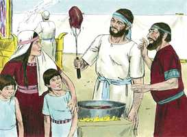
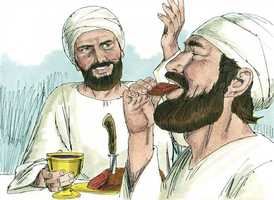
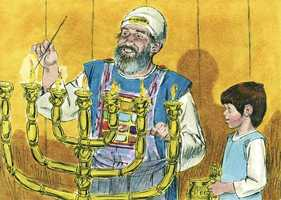
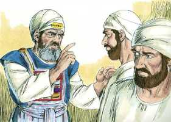

# 1Samuel Cap 02

**1** 	ENTÃO orou Ana, e disse: O meu coração exulta ao Senhor, o meu poder está exaltado no Senhor; a minha boca se dilatou sobre os meus inimigos, porquanto me alegro na tua salvação.

> **Cmt MHenry**: *Versículos 1-10* O coração de Ana se regozijava, não em Samuel, senão no Senhor. ela olha além da dádiva e louva o Doador. Se regozija na salvação do Senhor e na expectativa de sua vinda, a dAquele que é toda a salvação de Seu povo. Os fortes logo são debilitados e os fracos logo são fortalecidos, quando a Deus lhes apraz. Somos pobres? Deus nos fez pobres, o qual é uma boa razão para que estejamos contentes, e aceitemos nossa condição. Somos ricos? Deus nos fez ricos, o qual é uma boa razão para que estejamos agradecidos, o sirvamos jubilosamente e façamos o bem com a abundância que Ele nos dá. Ele não respeita a sabedoria do homem nem suas supostas excelências, senão que escolhe aos que o mundo considera néscios, e lhes ensina a sentir sua culpa e a valorizar sua salvação preciosa e gratuita. Esta profecia olha para o Reino de Cristo, esse reino de graça do qual Ana fala, depois de ter falado longamente do reino da providência. E aqui é a primeira vez que nos encontramos com o título *Messias* ou seu Ungido. Os súbditos do Reino de Cristo estarão a salvo e seus inimigos serão destruídos, pois o Ungido, o Senhor Jesus, é capaz de salvar e destruir.

**2** 	Não há santo como o Senhor; porque não há outro fora de ti; e rocha nenhuma há como o nosso Deus.

> **Cmt MHenry**: *CAPÍTULO 20A-Pv 21A-Ec 22A-Ct 23A-Is 24A-Jr 25A-Lm 26A-Ez 27A-Dn 28A-Os 29A-Jl

**3** 	Não multipliqueis palavras de altivez, nem saiam coisas arrogantes da vossa boca; porque o Senhor é o Deus de conhecimento, e por ele são as obras pesadas na balança.

**4** 	O arco dos fortes foi quebrado, e os que tropeçavam foram cingidos de força.

**5** 	Os fartos se alugaram por pão, e cessaram os famintos; até a estéril deu à luz sete filhos, e a que tinha muitos filhos enfraqueceu.

**6** 	O Senhor é o que tira a vida e a dá; faz descer à sepultura e faz tornar a subir dela.

**7** 	O Senhor empobrece e enriquece; abaixa e também exalta.

**8** 	Levanta o pobre do pó, e desde o monturo exalta o necessitado, para o fazer assentar entre os príncipes, para o fazer herdar o trono de glória; porque do Senhor são os alicerces da terra, e assentou sobre eles o mundo.

**9** 	Os pés dos seus santos guardará, porém os ímpios ficarão mudos nas trevas; porque o homem não prevalecerá pela força.

**10** 	Os que contendem com o Senhor serão quebrantados, desde os céus trovejará sobre eles; o Senhor julgará as extremidades da terra; e dará força ao seu rei, e exaltará o poder do seu ungido.

**11** 	Então Elcana foi a Ramá, à sua casa; porém o menino ficou servindo ao Senhor, perante o sacerdote Eli.
\n> **Cmt MHenry**: *Versículos 11-26* Por estar consagrado ao Senhor de forma especial, Samuel foi desde criança empregado no santuário para os serviços que era capaz de realizar. Como fez isto com uma santa disposição mental, foi chamado a ministrar ao Senhor. recebeu uma bênção do Senhor. Ele capacita os jovens que servem a Deus o melhor que podem, para que melhorem e o sirvam melhor.\ Eli evitava os problemas e o esforço, coisa que o levou a educar mal a seus filhos e não usou da autoridade paterna para restringi-los e corrigi-los quando eram crianças. Fazia a vista gorda ante os abusos do serviço do santuário até que virou costume, o que conduziu a abominações; seus filhos, que deveriam ter sido exemplo do que era bom aos que estavam dedicados ao serviço do santuário, os conduziam à maldade. A ofensa alcançava até a oferta dos sacrifícios pelos pecados, que eram um tipo da expiação feita pelo Salvador! Os pecados contra o remédio, a expiação mesma, são os mais perigosos, porque pisoteiam o sangue da aliança.\ A repreensão de Eli era demasiado suave e amável. Em geral, ninguém mais abandonado que os filhos degenerados das pessoas santas quando quebrantam todos os freios.

**12** 	Eram, porém, os filhos de Eli filhos de Belial; não conheciam ao Senhor.

**13** 	Porquanto o costume daqueles sacerdotes com o povo era que, oferecendo alguém algum sacrifício, estando-se cozendo a carne, vinha o moço do sacerdote, com um garfo de três dentes em sua mão;

**14** 	E enfiava-o na caldeira, ou na panela, ou no caldeirão, ou na marmita; e tudo quanto o garfo tirava, o sacerdote tomava para si; assim faziam a todo o Israel que ia ali a Siló.

 

**15** 	Também antes de queimarem a gordura vinha o moço do sacerdote, e dizia ao homem que sacrificava: Dá essa carne para assar ao sacerdote; porque não receberá de ti carne cozida, mas crua.

**16** 	E, dizendo-lhe o homem: Queime-se primeiro a gordura de hoje, e depois toma para ti quanto desejar a tua alma, então ele lhe dizia: Não, agora a hás de dar, e, se não, por força a tomarei.

**17** 	Era, pois, muito grande o pecado destes moços perante o Senhor, porquanto os homens desprezavam a oferta do Senhor.

 

**18** 	Porém Samuel ministrava perante o Senhor, sendo ainda jovem, vestido com um éfode de linho.

 

**19** 	E sua mãe lhe fazia uma túnica pequena, e de ano em ano lha trazia, quando com seu marido subia para oferecer o sacrifício anual.

**20** 	E Eli abençoava a Elcana e a sua mulher, e dizia: O Senhor te dê descendência desta mulher, pela petição que fez ao Senhor. E voltavam para o seu lugar.

**21** 	Visitou, pois, o Senhor a Ana, que concebeu, e deu à luz três filhos e duas filhas; e o jovem Samuel crescia diante do Senhor.

**22** 	Era, porém, Eli já muito velho, e ouvia tudo quanto seus filhos faziam a todo o Israel, e de como se deitavam com as mulheres que em bandos se ajuntavam à porta da tenda da congregação.

**23** 	E disse-lhes: Por que fazeis tais coisas? Pois ouço de todo este povo os vossos malefícios.

 

**24** 	Não, filhos meus, porque não é boa esta fama que ouço; fazeis transgredir o povo do Senhor.

**25** 	Pecando homem contra homem, os juízes o julgarão; pecando, porém, o homem contra o Senhor, quem rogará por ele? Mas não ouviram a voz de seu pai, porque o Senhor os queria matar.

**26** 	E o jovem Samuel ia crescendo, e fazia-se agradável, assim para com o Senhor, como também para com os homens.

**27** 	E veio um homem de Deus a Eli, e disse-lhe: Assim diz o Senhor: Não me manifestei, na verdade, à casa de teu pai, estando eles ainda no Egito, na casa de Faraó?

**28** 	E eu o escolhi dentre todas as tribos de Israel por sacerdote, para oferecer sobre o meu altar, para acender o incenso, e para trazer o éfode perante mim; e dei à casa de teu pai todas as ofertas queimadas dos filhos de Israel.

**29** 	Por que pisastes o meu sacrifício e a minha oferta de alimentos, que ordenei na minha morada, e honras a teus filhos mais do que a mim, para vos engordardes do principal de todas as ofertas do meu povo de Israel?

**30** 	Portanto, diz o Senhor Deus de Israel: Na verdade tinha falado eu que a tua casa e a casa de teu pai andariam diante de mim perpetuamente; porém agora diz o Senhor: Longe de mim tal coisa, porque aos que me honram honrarei, porém os que me desprezam serão desprezados.

**31** 	Eis que vêm dias em que cortarei o teu braço e o braço da casa de teu pai, para que não haja mais ancião algum em tua casa.

**32** 	E verás o aperto da morada de Deus, em lugar de todo o bem que houvera de fazer a Israel; nem haverá por todos os dias ancião algum em tua casa.

**33** 	O homem, porém, a quem eu não desarraigar do meu altar será para te consumir os olhos e para te entristecer a alma; e toda a multidão da tua casa morrerá quando chegar à idade varonil.

**34** 	E isto te será por sinal, a saber: o que acontecerá a teus dois filhos, a Hofni e a Finéias; ambos morrerão no mesmo dia.

**35** 	E eu suscitarei para mim um sacerdote fiel, que procederá segundo o meu coração e a minha alma, e eu lhe edificarei uma casa firme, e andará sempre diante do meu ungido.

**36** 	E será que todo aquele que restar da tua casa virá a inclinar-se diante dele por uma moeda de prata e por um bocado de pão, e dirá: Rogo-te que me admitas a algum ministério sacerdotal, para que possa comer um pedaço de pão.

> **Cmt MHenry** Intro: *• Versículos 1-10*> *O cântico de gratidão de Ana*> *• Versículos 11-26*> *A maldade dos filhos de Eli – O ministério de Samuel*> *• Versículos 27-36*> *A profecia contra a família de Eli*> \ Versículos 27-36\ Os que permitem que seus filhos andem em todo caminho mau sem usar sua autoridade para refreá-los e castigá-los, em realidade honram a eles mais que a Deus. que o exemplo de Eli anime os pais a lutar fervorosamente contra os primeiros indícios de maldade, e a educar a seus filhos na disciplina e admoestação do Senhor.\ Em meio da condena sentenciada contra a casa de Eli, se promete misericórdia a Israel. A obra de Deus nunca cairá por terra por falta de mãos para executá-la.\ Cristo é o Sumo Sacerdote misericordioso e fiel a quem Deus levantou quando o sacerdócio levítico foi deposto, e é quem em todas as coisas fez a vontade de seu Pai, e para quem Deus edificará uma casa segura, cimentada sobre uma rocha de modo que o inferno não possa prevalecer contra ela.