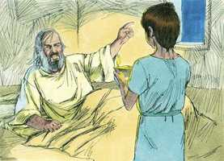
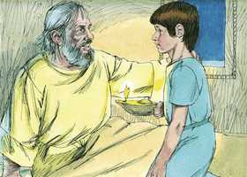
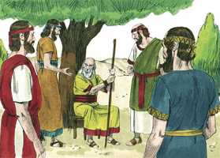

# 1Samuel Cap 03

**1** 	E O JOVEM Samuel servia ao Senhor perante Eli; e a palavra do Senhor era de muita valia naqueles dias; não havia visão manifesta.

> **Cmt MHenry**: *Versículos 1-10* O chamamento que se faz segundo o propósito da graça divina é eficaz; será repetido até que assim seja, até que respondamos ao chamado. Ao perceber que era a voz de Deus o que Samuel tinha ouvido, Eli o instrui acerca do que devia dizer. Embora fosse uma desgraça para Eli, porque o chamado de Deus estava dirigido a Samuel, lhe ensinou a responder. Desse modo, o ancião deve fazer o melhor e o que mais possa para ajudar e melhorar os mais novos que vão surgindo. Não deixemos nunca de ensinar aos que vêm após de nós, ainda que eles logo possam ser preferidos em nosso lugar ([Jo 1.30](../43N-Joa/01.md#30)). As boas palavras devem ser colocadas oportunamente na boca das crianças, para que estejam preparados a aprender coisas divinas e a serem educados para levá-las em consideração.

**2** 	E sucedeu, naquele dia, que, estando Eli deitado no seu lugar (e os seus olhos começavam a escurecer, pois não podia ver),

**3** 	E estando também Samuel já deitado, antes que a lâmpada de Deus se apagasse no templo do Senhor, onde estava a arca de Deus,

> **Cmt MHenry**: *CAPÍTULO 30A-Am 31A-Ob 32A-Jn 33A-Mq 34A-Na 35A-Hc 36A-Sf 37A-Ag 38A-Zc 39A-Ml

**4** 	O Senhor chamou a Samuel, e disse ele: Eis-me aqui.

**5** 	E correu a Eli, e disse: Eis-me aqui, porque tu me chamaste. Mas ele disse: Não te chamei eu, torna a deitar-te. E foi e se deitou.

 

**6** 	E o Senhor tornou a chamar outra vez a Samuel, e Samuel se levantou, e foi a Eli, e disse: Eis-me aqui, porque tu me chamaste. Mas ele disse: Não te chamei eu, filho meu, torna a deitar-te.

**7** 	Porém Samuel ainda não conhecia ao Senhor, e ainda não lhe tinha sido manifestada a palavra do Senhor.

**8** 	O Senhor, pois, tornou a chamar a Samuel terceira vez, e ele se levantou, e foi a Eli, e disse: Eis-me aqui, porque tu me chamaste. Então entendeu Eli que o Senhor chamava o jovem.

**9** 	Por isso Eli disse a Samuel: Vai deitar-te e há de ser que, se te chamar, dirás: Fala, Senhor, porque o teu servo ouve. Então Samuel foi e se deitou no seu lugar.

 

**10** 	Então veio o Senhor, e pôs-se ali, e chamou como das outras vezes: Samuel, Samuel. E disse Samuel: Fala, porque o teu servo ouve.

 

**11** 	E disse o Senhor a Samuel: Eis que vou fazer uma coisa em Israel, a qual todo o que ouvir lhe tinirão ambos os ouvidos.

> **Cmt MHenry**: *Versículos 11-18* Quão grande quantidade de culpa e corrupção há em nós, acerca do que podemos dizer: é a iniqüidade que nosso coração conhece; nós mesmos estamos cientes dela! Os que não reprimem os pecados do próximo, quando podem, se fazem partícipes da culpa e lhes será carregada por unir-se a eles. Em sua notável resposta a esta espantosa sentença, Eli reconhece que o Senhor tinha o direito de fazer o que bem achasse, estando seguro de que nada de errado faria. A mansidão, a paciência e a humildade contidas nestas palavras demonstraram que ele está verdadeiramente arrependido; ele aceitou o castigo de seu pecado.

**12** 	Naquele mesmo dia suscitarei contra Eli tudo quanto tenho falado contra a sua casa, começarei e acabarei.

**13** 	Porque eu já lhe fiz saber que julgarei a sua casa para sempre, pela iniqüidade que ele bem conhecia, porque, fazendo-se os seus filhos execráveis, não os repreendeu.

**14** 	Portanto, jurei à casa de Eli que nunca jamais será expiada a sua iniqüidade, nem com sacrifício, nem com oferta de alimentos.

**15** 	E Samuel ficou deitado até pela manhã, e então abriu as portas da casa do Senhor; porém temia Samuel relatar esta visão a Eli.

**16** 	Então chamou Eli a Samuel, e disse: Samuel, meu filho. E disse ele: Eis-me aqui.

**17** 	E ele disse: Qual é a palavra que te falou? Peço-te que não ma encubras; assim Deus te faça, e outro tanto, se me encobrires alguma palavra de todas as que te falou.

**18** 	Então Samuel lhe contou todas aquelas palavras, e nada lhe encobriu. E disse ele: Ele é o Senhor; faça o que bem parecer aos seus olhos.

 

**19** 	E crescia Samuel, e o Senhor era com ele, e nenhuma de todas as suas palavras deixou cair em terra.

> **Cmt MHenry**: *Versículos 19-21* Todo incremento de sabedoria e graça deve-se à presença de Deus junto a nós. Deus repetirá bondosamente suas visitas aos que as recebem bem. A piedade precoce será a maior honra da juventude. Deus honrará aos que o honram. Que a gente jovem considere a piedade de Samuel e dele aprendam a lembrar-se de seu Criador nos dias da juventude. As crianças pequenas podem ser religiosas. Samuel é a prova de que agrada ao Senhor que os meninos o escutem e esperem nEle. Samuel é um padrão de todos os temperamentos amáveis que são o ornamento mais esplendoroso da juventude, e fonte segura de felicidade.

**20** 	E todo o Israel, desde Dã até Berseba, conheceu que Samuel estava confirmado por profeta do Senhor.

 

**21** 	E continuou o Senhor a aparecer em Siló; porquanto o Senhor se manifestava a Samuel em Siló pela palavra do Senhor.

> **Cmt MHenry** Intro: *• Versículos 1-10*> *A palavra do Senhor revelada a Samuel por primeira vez*> *• Versículos 11-18*> *Deus fala a Samuel da destruição da casa de Eli*> *• Versículos 19-21*> *Samuel é estabelecido para ser profeta*