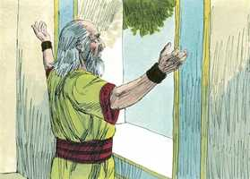
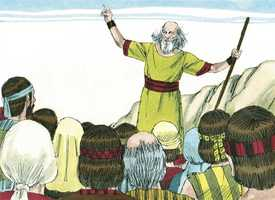
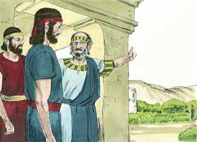
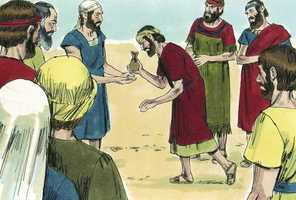
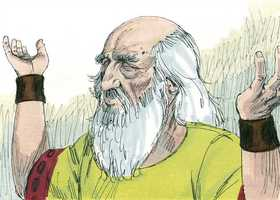

# 1Samuel Cap 08

**1** 	E SUCEDEU que, tendo Samuel envelhecido, constituiu a seus filhos por juízes sobre Israel.

> **Cmt MHenry**: *Versículos 1-3* Não parece que os filhos de Samuel fossem tão profanos e ferozes como os filhos de Eli, contudo eram juízes corruptos que se deixaram levar pelo afã de lucro. Samuel não aceitava subornos, porém seus filhos sim, e então perverteram o direito. aumentava o sofrimento do povo a ameaça de invasão por Naás, rei dos amonitas.

**2** 	E o nome do seu filho primogênito era Joel, e o nome do seu segundo, Abia; e foram juízes em Berseba.

**3** 	Porém seus filhos não andaram pelos caminhos dele, antes se inclinaram à avareza, e aceitaram suborno, e perverteram o direito.

**4** 	Então todos os anciãos de Israel se congregaram, e vieram a Samuel, a Ramá,

> **Cmt MHenry**: *Versículos 4-9* Samuel estava desconforme; podia tolerar pacientemente o que o afetasse pessoalmente e a sua própria família, porém lhe desagradou quando lhe pediram: Constitui-nos agora um rei que nos julgue, porque isso era contra Deus. isto o fez ajoelhar-se. Quando algo nos perturba, é nosso dever e interesse apresentar nosso problema ante Deus. Samuel deve dizer-lhes que terão um rei. Não porque Deus estiver contente com o pedido deles, senão que, assim como às vezes nos contraria com amor, em outras ocasiões nos satisfaz com ira; assim fez aqui. Deus sabe dar-se glória e serve a seu propósito sábio até com os conselhos néscios dos homens.

**5** 	E disseram-lhe: Eis que já estás velho, e teus filhos não andam pelos teus caminhos; constitui-nos, pois, agora um rei sobre nós, para que ele nos julgue, como o têm todas as nações.

**6** 	Porém esta palavra pareceu mal aos olhos de Samuel, quando disseram: Dá-nos um rei, para que nos julgue. E Samuel orou ao Senhor.

 

**7** 	E disse o Senhor a Samuel: Ouve a voz do povo em tudo quanto te dizem, pois não te têm rejeitado a ti, antes a mim me têm rejeitado, para eu não reinar sobre eles.

**8** 	Conforme a todas as obras que fizeram desde o dia em que os tirei do Egito até ao dia de hoje, a mim me deixaram, e a outros deuses serviram, assim também fazem a ti.

> **Cmt MHenry**: *CAPÍTULO 8*

**9** 	Agora, pois, ouve à sua voz, porém protesta-lhes solenemente, e declara-lhes qual será o costume do rei que houver de reinar sobre eles.

**10** 	E falou Samuel todas as palavras do Senhor ao povo, que lhe pedia um rei.

> **Cmt MHenry**: *Versículos 10-22* Se tivessem um rei que os governasse, como os reis orientais governavam a seus súbditos, teriam achado excessivamente pesado o jugo. Aos que se submetem ao governo do mundo e da carne, lhes é dito claramente quão duros são seus amos e quão tirano é o domínio do pecado. A *lei* de Deus e o *estilo* dos homens diferem amplamente entre sim; a primeira deve ser nossa regra nas diversas relações da vida; o último deve ser a medida do que podemos esperar dos outros. Estas seriam suas penas e, quando se queixassem a Deus, Ele não os ouviria. Quando nos metemos em angústias por nossos maus desejados e projetos errados, abandonados precisamente o consolo da oração e o benefício da ajuda divina. O povo foi obstinado e insistente em suas demandas. As resoluções súbitas e os desejos precipitados operam um arrependimento longo e sem pressa. É sabedoria nossa agradecer as vantagens, e termos paciência com as desvantagens do governo sob o qual estejamos; orar continuamente por nossos governantes, para que nos dirijam com temor de Deus e que possamos viver sob seu mandado com toda santidade e honestidade. Sintoma esperançador é poder suportar nossos desejos de objetos mundanos, e quando possamos, deixar à providência de Deus o tempo e a forma de satisfazê-los.

**11** 	E disse: Este será o costume do rei que houver de reinar sobre vós; ele tomará os vossos filhos, e os empregará nos seus carros, e como seus cavaleiros, para que corram adiante dos seus carros.

 

**12** 	E os porá por chefes de mil, e de cinqüenta; e para que lavrem a sua lavoura, e façam a sua sega, e fabriquem as suas armas de guerra e os petrechos de seus carros.

 

**13** 	E tomará as vossas filhas para perfumistas, cozinheiras e padeiras.

**14** 	E tomará o melhor das vossas terras, e das vossas vinhas, e dos vossos olivais, e os dará aos seus servos.

**15** 	E as vossas sementes, e as vossas vinhas dizimará, para dar aos seus oficiais, e aos seus servos.

 

**16** 	Também os vossos servos, e as vossas servas, e os vossos melhores moços, e os vossos jumentos tomará, e os empregará no seu trabalho.

**17** 	Dizimará o vosso rebanho, e vós lhe servireis de servos.

**18** 	Então naquele dia clamareis por causa do vosso rei, que vós houverdes escolhido; mas o Senhor não vos ouvirá naquele dia.

**19** 	Porém o povo não quis ouvir a voz de Samuel; e disseram: Não, mas haverá sobre nós um rei.

 

**20** 	E nós também seremos como todas as outras nações; e o nosso rei nos julgará, e sairá adiante de nós, e fará as nossas guerras.

**21** 	Ouvindo, pois, Samuel todas as palavras do povo, as repetiu aos ouvidos do Senhor.

 

**22** 	Então o Senhor disse a Samuel: Dá ouvidos à sua voz, e constitui-lhes rei. Então Samuel disse aos homens de Israel: Volte cada um à sua cidade.

> **Cmt MHenry** Intro: *• Versículos 1-3*> *O governo malvado dos filhos de Samuel*> *• Versículos 4-9*> 28A-Os israelitas pedem rei*> *• Versículos 10-22*> *O estilo de um rei*