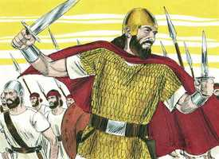

# 1Samuel Cap 13

**1** 	SAUL reinou um ano; e no segundo ano do seu reinado sobre Israel,

> **Cmt MHenry**: *Versículos 1-7* Saul reinou um ano sem que nada particular acontecesse, porém em seu segundo ano sucederam os feitos registrados neste capítulo. Durante mais de um ano deu tempo aos filisteus para preparar-se para a guerra e debilitar e desarmar os israelitas. Quando os homens crescem em auto-suficiência, amiúde são levados à estultícia. As vantagens principais dos inimigos da igreja derivam da má conduta de seus amigos confessos. Quando por fim Saul fez soar o alarme, o povo não foi com ele, desertou rapidamente, insatisfeito com sua administração, ou aterrorizados pelo poder do inimigo.

 

**2** 	Saul escolheu para si três mil homens de Israel; e estavam com Saul dois mil em Micmás e na montanha de Betel, e mil estavam com Jônatas em Gibeá de Benjamim; e o resto do povo despediu, cada um para sua casa.

**3** 	E Jônatas feriu a guarnição dos filisteus, que estava em Gibeá, o que os filisteus ouviram; pelo que Saul tocou a trombeta por toda a terra, dizendo: Ouçam os hebreus.

**4** 	Então todo o Israel ouviu dizer: Saul feriu a guarnição dos filisteus, e também Israel se fez abominável aos filisteus. Então o povo foi convocado para junto de Saul em Gilgal.

**5** 	E os filisteus se ajuntaram para pelejar contra Israel, trinta mil carros, e seis mil cavaleiros, e povo em multidão como a areia que está à beira do mar; e subiram, e se acamparam em Micmás, ao oriente de Bete-Áven.

**6** 	Vendo, pois, os homens de Israel que estavam em apuros (porque o povo estava angustiado), o povo se escondeu pelas cavernas, e pelos espinhais, e pelos penhascos, e pelas fortificações, e pelas covas.

**7** 	E alguns dos hebreus passaram o Jordão para a terra de Gade e Gileade; e, estando Saul ainda em Gilgal, todo o povo ia atrás dele tremendo.

**8** 	E esperou Saul sete dias, até ao tempo que Samuel determinara; não vindo, porém, Samuel a Gilgal, o povo se dispersava dele.

> **Cmt MHenry**: *Versículos 8-14* Saul violou a ordem expressa de Samuel (ver capítulo 10.8), sobre que fazer em casos extremos. Quando foi acusado de desobedecer, justificou a si mesmo pelo que tinha feito, sem dar sinais de arrependimento. Queria que este ato de desobediência passasse como exemplo de sua prudência e prova de sua piedade. Os homens despojados de piedade interior, amiúde ressaltam muito os atos religiosos externos. Samuel acusa a Saul de ser seu inimigo. Os que desobedecem os mandamentos de Deus o fazem nesciamente contra si mesmos. O pecado é insensatez, e os maiores pecadores são os maiores néscios. Nossa disposição para obedecer ou desobedecer a Deus será freqüentemente demonstrada por nossa conduta em coisas que parecem pequenas. Os homens não vêem senão o ato externo de Saul, que parece pequeno, porém Deus vê que o fez por incredulidade e desconfiança de Sua providência, com desprezo de Sua autoridade e justiça, e com rebelião contra a luz de sua própria consciência. Bendito Salvador, que nunca levemos nossas pobres ofertas ou nossas supostas ofertas de paz, sem olhar teu precioso sacrifício todo-suficiente! Somente tu, oh Senhor, podes fazer ou fizeste nossa paz no sangue da cruz.

**9** 	Então disse Saul: Trazei-me aqui um holocausto, e ofertas pacíficas. E ofereceu o holocausto.

**10** 	E sucedeu que, acabando ele de oferecer o holocausto, eis que Samuel chegou; e Saul lhe saiu ao encontro, para o saudar.

**11** 	Então disse Samuel: Que fizeste? Disse Saul: Porquanto via que o povo se espalhava de mim, e tu não vinhas nos dias aprazados, e os filisteus já se tinham ajuntado em Micmás,

**12** 	Eu disse: Agora descerão os filisteus sobre mim a Gilgal, e ainda à face do Senhor não orei; e constrangi-me, e ofereci holocausto.

**13** 	Então disse Samuel a Saul: Procedeste nesciamente, e não guardaste o mandamento que o Senhor teu Deus te ordenou; porque agora o Senhor teria confirmado o teu reino sobre Israel para sempre;

> **Cmt MHenry**: *CAPÍTULO 13A-1Cr

**14** 	Porém agora não subsistirá o teu reino; já tem buscado o Senhor para si um homem segundo o seu coração, e já lhe tem ordenado o Senhor, que seja capitão sobre o seu povo, porquanto não guardaste o que o Senhor te ordenou.

**15** 	Então se levantou Samuel, e subiu de Gilgal a Gibeá de Benjamim; e Saul contou o povo que se achava com ele, uns seiscentos homens.

> **Cmt MHenry**: *Versículos 15-23* Veja-se quão políticos foram os filisteus quando tiveram poder; não só impediram que o povo de Israel fabricasse armas de guerra, além disso os obrigaram a depender de seus inimigos até para os instrumentos de lavoura. Que pouco político foi Saul, que ao começar seu reinado não arranjou isso. A falta do sentido verdadeiro sempre acompanha a falta de graça. Os pecados que nos parecem muito pequenos, têm conseqüências perigosas. Miserável é uma nação indefensa e culpável; muito mais os desprovidos de toda a armadura de Deus.

**16** 	E Saul e Jônatas, seu filho, e o povo que se achou com eles, ficaram em Gibeá de Benjamim; porém os filisteus se acamparam em Micmás.

**17** 	E os saqueadores saíram do campo dos filisteus em três companhias; uma das companhias foi pelo caminho de Ofra à terra de Sual.

**18** 	Outra companhia seguiu pelo caminho de Bete-Horom, e a outra companhia foi pelo caminho do termo que dá para o vale Zeboim na direção do deserto.

**19** 	E em toda a terra de Israel nem um ferreiro se achava, porque os filisteus tinham dito: Para que os hebreus não façam espada nem lança.

**20** 	Por isso todo o Israel tinha que descer aos filisteus para amolar cada um a sua relha, e a sua enxada, e o seu machado, e o seu sacho.

**21** 	Tinham porém limas para os seus sachos, e para as suas enxadas, e para as forquilhas de três dentes, e para os machados, e para consertar as aguilhadas.

**22** 	E sucedeu que, no dia da peleja, não se achou nem espada nem lança na mão de todo o povo que estava com Saul e com Jônatas; porém acharam-se com Saul e com Jônatas seu filho.

**23** 	E saiu a guarnição dos filisteus ao desfiladeiro de Micmás.

> **Cmt MHenry** Intro: *• Versículos 1-7*> *A invasão dos filisteus*> *• Versículos 8-14*> *Saul sacrifica – Samuel o repreende*> *• Versículos 15-23*> *A política dos filisteus*