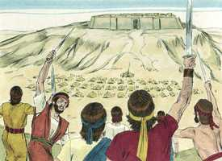
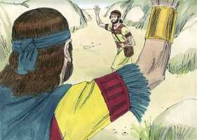
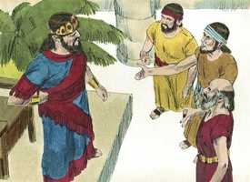
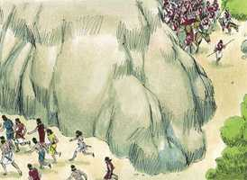
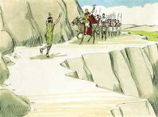

# 1Samuel Cap 23

**1** 	E FOI anunciado a Davi, dizendo: Eis que os filisteus pelejam contra Queila, e saqueiam as eiras.

> **Cmt MHenry**: *Versículos 1-6* Quando um príncipe persegue o povo de Deus, deve esperar tribulações de todas partes. A forma em que um país tem tranqüilidade é deixar que a igreja de Deus esteja tranqüila: se Saul peleja contra Davi, os filisteus pelejam contra seu país. Davi se considerava protetor de sua terra. Assim fez o Salvador Jesus e nos deixou um exemplo. Não são como Davi os que porfiadamente se negam a fazer o bem se não são recompensados seus serviços.

**2** 	E consultou Davi ao Senhor, dizendo: Irei eu, e ferirei a estes filisteus? E disse o Senhor a Davi: Vai, e ferirás aos filisteus, e livrarás a Queila.

**3** 	Porém os homens de Davi lhe disseram: Eis que tememos aqui em Judá, quanto mais indo a Queila contra os esquadrões dos filisteus.

**4** 	Então Davi tornou a consultar ao Senhor, e o Senhor lhe respondeu, e disse: Levanta-te, desce a Queila, porque te dou os filisteus na tua mão.

**5** 	Então Davi partiu com os seus homens a Queila, e pelejou contra os filisteus, e levou os gados, e fez grande estrago entre eles; e Davi livrou os moradores de Queila.

 

**6** 	E sucedeu que, quando Abiatar, filho de Aimeleque, fugiu para Davi, a Queila, desceu com o éfode na mão.

**7** 	E foi anunciado a Saul que Davi tinha ido a Queila, e disse Saul: Deus o entregou nas minhas mãos, pois está encerrado, entrando numa cidade de portas e ferrolhos.

> **Cmt MHenry**: *Versículos 7-13* Bem poderia Davi queixar-se de seus inimigos, que lhe devolviam mal por bem, e em troca de seu amor se tornavam seus adversários. Assim, Cristo foi tratado com vileza. Davi pedia direção a seu grande Protetor. Assim que lhe traziam o éfode, ele o usava. Temos as Escrituras em nossas mãos, busquemos conselho delas nos casos duvidosos. Digam: "Tragam-me a Bíblia". A forma em que Davi se dirige a Deus é muito solene, mas também muito particular. Deus permite que sejamos assim em nossas conversas com Ele: Senhor, guia-me neste assunto sobre o qual estou agora totalmente perdido. Deus sabe não só o que será, senão o que deveria ser, se não houver impedimento; portanto, Ele sabe livrar o piedoso da tentação e como dar a cada homem conforme a suas obras.

 

**8** 	Então Saul mandou chamar a todo o povo à peleja, para que descessem a Queila, para cercar a Davi e os seus homens.

**9** 	Sabendo, pois, Davi, que Saul maquinava este mal contra ele, disse a Abiatar, sacerdote: Traze aqui o éfode.

**10** 	E disse Davi: Ó Senhor, Deus de Israel, teu servo tem ouvido que Saul procura vir a Queila, para destruir a cidade por causa de mim.

**11** 	Entregar-me-ão os cidadãos de Queila na sua mão? Descerá Saul, como o teu servo tem ouvido? Ah! Senhor Deus de Israel! Faze-o saber ao teu servo. E disse o Senhor: Descerá.

**12** 	Disse mais Davi: Entregar-me-ão os cidadãos de Queila, a mim e aos meus homens, nas mãos de Saul? E disse o Senhor: Entregarão.

**13** 	Então Davi se levantou com os seus homens, uns seiscentos, e saíram de Queila, e foram-se aonde puderam; e sendo anunciado a Saul, que Davi escapara de Queila, cessou de sair contra ele.

**14** 	E Davi permaneceu no deserto, nos lugares fortes, e ficou em um monte no deserto de Zife; e Saul o buscava todos os dias, porém Deus não o entregou na sua mão.

> **Cmt MHenry**: *Versículos 14-18* Davi não cometeu atentados contra Saul; guardou o caminho de Deus, esperou o tempo de Deus, e contentou-se com ocultar-se nos bosques e no deserto. Pensamos o pior deste mundo, que freqüentemente trata tão mal a seus melhores homens: que nos faça anelar esse reino onde a bondade estará por sempre na glória e a santidade em honra. Encontramos a Jônatas consolando a Davi. Como amigo *piedoso* o dirigiu a Deus, o fundamento de seu consolo. Como amigo *abnegado*, se compraz na perspectiva do Ascenso de Davi ao trono. Como amigo *constante* renova sua amizade com ele. Nossa aliança com Deus deveria ser renovada por nós freqüentemente e, assim, manter nossa comunhão com Ele. se o que diz um amigo numa reunião consola e fortalece nossos corações, que não pode esperar-se do respaldo contínuo e do amor poderoso do Salvador dos pecadores, o Amigo dos crentes na aliança!

**15** 	Vendo, pois, Davi, que Saul saíra à busca da sua vida, permaneceu no deserto de Zife, num bosque.

**16** 	Então se levantou Jônatas, filho de Saul, e foi para Davi no bosque, e confortou a sua mão em Deus;

**17** 	E disse-lhe: Não temas, que não te achará a mão de Saul, meu pai; porém tu reinarás sobre Israel, e eu serei contigo o segundo; o que também Saul, meu pai, bem sabe.

**18** 	E ambos fizeram aliança perante o Senhor; Davi ficou no bosque, e Jônatas voltou para a sua casa.

 

**19** 	Então subiram os zifeus a Saul, a Gibeá, dizendo: Não se escondeu Davi entre nós, nos lugares fortes no bosque, no outeiro de Haquilá, que está à mão direita de Jesimom?

> **Cmt MHenry**: *Versículos 19-29* Em meio de sua maldade, Saul fingiu falar a linguagem da piedade. Tais expressões, sem efeitos apropriados, podem somente divertir ou enganar aos que as ouvem e aos que as usam. Esta montanha era um emblema da providência divina interposta entre Davi e o destruidor. Não desmaiemos ante a perspectiva de futuras dificuldades, antes permaneçamos nAquele que é maravilhoso em conselho e excelente em obra. Antes que faltar a sua promessa, Ele encarregará aos filisteus que se ocupem de fazer-nos escapar, no momento mesmo em que nosso caso pareça mais desesperado. Deus exige dependência completa dEle: *"Se não o crerdes, certamente não haveis de permanecer"* ([Is 7.9](../23A-Is/07.md#9), ACF). "

 

**20** 	Agora, pois, ó rei, apressadamente desce conforme a todo o desejo da tua alma; a nós cumpre entregá-lo nas mãos do rei.

**21** 	Então disse Saul: Bendito sejais vós do Senhor, porque vos compadecestes de mim.

**22** 	Ide, pois, e diligenciai ainda mais, e sabei e notai o lugar que freqüenta, e quem o tenha visto ali; porque me foi dito que é astutíssimo.

**23** 	Por isso atentai bem, e informai-vos acerca de todos os esconderijos, em que ele se esconde; e então voltai para mim com toda a certeza, e ir-me-ei convosco; e há de ser que, se estiver naquela terra, o buscarei entre todos os milhares de Judá.

> **Cmt MHenry**: *CAPÍTULO 23A-Is

**24** 	Então se levantaram eles e se foram a Zife, adiante de Saul; Davi, porém, e os seus homens estavam no deserto de Maom, na campina, à direita de Jesimom.

**25** 	E Saul e os seus homens se foram em busca dele; o que anunciaram a Davi, que desceu para aquela penha, e ficou no deserto de Maom; o que ouvindo Saul, seguiu a Davi para o deserto de Maom.

**26** 	E Saul ia deste lado do monte, e Davi e os seus homens do outro lado do monte; e, temeroso, Davi se apressou a escapar de Saul; Saul, porém, e os seus homens cercaram a Davi e aos seus homens, para lançar mão deles.

 

**27** 	Então veio um mensageiro a Saul, dizendo: Apressa-te, e vem, porque os filisteus com ímpeto entraram na terra.

 

**28** 	Por isso Saul voltou de perseguir a Davi, e foi ao encontro dos filisteus; por esta razão aquele lugar se chamou Rochedo das Divisões.

**29** 	E subiu Davi dali, e ficou nos lugares fortes de En-Gedi.

> **Cmt MHenry** Intro: *• Versículos 1-6*> *Davi livra a Queila*> *• Versículos 7-13*> *Deus lhe adverte para que fuja de Queila*> *• Versículos 14-18*> *Jônatas consola a Davi*> *• Versículos 19-29*> *Livrado de Saul por uma invasão dos filisteus*