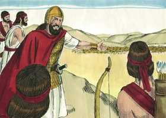
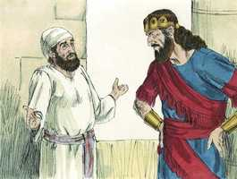
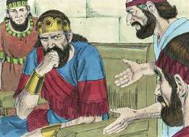
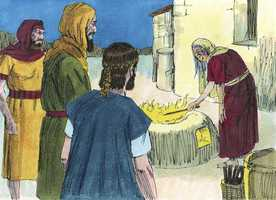

# 1Samuel Cap 28

**1** 	E SUCEDEU naqueles dias que, juntando os filisteus os seus exércitos à peleja, para fazer guerra contra Israel, disse Aquis a Davi: Sabe de certo que comigo sairás ao arraial, tu e os teus homens.

> **Cmt MHenry**: *Versículos 1-6* Davi não podia rejeitar a Áquis sem perigar. Se prometesse ajudar e, depois, ficava neutral ou se passava para o bando dos israelitas, se conduziria ingrata e traiçoeiramente. Se pelejasse contra Israel, pecaria gravemente. Parecia impossível que saísse desta dificuldade com a consciência limpa, mas sua resposta evasiva, pensada para ganhar tempo, sem dúvida não harmonizava com o caráter de um israelita. Os problemas são terríficos para os filhos da desobediência. Saul, em seu mal-estar, inquiriu do Senhor. não o buscou com fé, senão com mente dupla e instável. Saul tinha colocado em vigência uma lei contra a feitiçaria ([Êx 22.18](../02A-Ex/22.md#18)). Muitos parecem zelosos opositores do pecado quando são feridos de alguma forma por este, mas não se interessam pela glória de Deus, nem sentem desgosto pelo pecado por ser pecado. muitos parecem inimigos do pecado alheio, todavia se satisfazem a si mesmos. Saul lançará fora o diabo de seu reino, porém o alberga em seu coração por inveja e rancor. Quão néscio é consultar os que, conforme com a lei de Deus, tinha-se proposto eliminar!

**2** 	Então disse Davi a Aquis: Assim saberás o que fará o teu servo. E disse Aquis a Davi: Por isso te terei por guarda da minha pessoa para sempre.

**3** 	E Samuel já estava morto, e todo o Israel o tinha chorado, e o tinha sepultado em Ramá, que era a sua cidade; e Saul tinha desterrado os adivinhos e os encantadores.

**4** 	E ajuntaram-se os filisteus, e vieram, e acamparam-se em Suném; e ajuntou Saul a todo o Israel, e se acamparam em Gilboa.

**5** 	E, vendo Saul o arraial dos filisteus, temeu, e estremeceu muito o seu coração.

 

**6** 	E perguntou Saul ao Senhor, porém o Senhor não lhe respondeu, nem por sonhos, nem por Urim, nem por profetas.

 

**7** 	Então disse Saul aos seus criados: Buscai-me uma mulher que tenha o espírito de feiticeira, para que vá a ela, e consulte por ela. E os seus criados lhe disseram: Eis que em En-Dor há uma mulher que tem o espírito de adivinhar.

> **Cmt MHenry**: *Versículos 7-19* Quando nos saímos da clara senda do dever, todo nos desvia mais e acrescenta nossa confusão e tentação. Saul deseja que a mulher invoque a alguém dentre os mortos com quem ele desejava falar; isto está expressamente proibido ([Dt 18.11](../05A-Dt/18.md#11)). Toda bruxaria ou conjuro, real ou simulado, é uma tentativa má ou ignorante de obter conhecimento ou ajuda de alguma criatura, quando não se obtém do Senhor indo pela senda do dever. Não lemos que Saul tenha ido a Samuel quando este vivia para que o aconselhasse em suas dificuldades; teria sido bom que o tivesse feito. Mas agora que morreu: "Faze-me subir a Samuel". Muitos que desprezam e perseguem os santos e ministros de Deus enquanto vivem, se alegrariam de tê-los com eles quando já partiram. Todo mostra que não foi uma fraude ou truque humano. Ainda que a mulher não podia fazer que Samuel fosse enviado, a busca de Saul seria a ocasião para isso. a surpresa e o terror da mulher provou que esta era uma aparição inesperada e desacostumada. Saul tinha desprezado as solenes advertências de Samuel durante sua vida, mas agora que esperava, como desafiando a Deus, conseguir algum conselho e alento de parte dele, não iria Deus a permitir que a alma de seu profeta já ido se aparecesse a Saul, para confirmar sua sentença anterior e proclamar sua condena? A expressão "tu e teus filhos estareis comigo" não significa outra coisa que estarão no mundo eterno. Reflete muita solenidade o fato de que Deus permitisse que a alma de seu profeta falecido viesse como testemunha desde o céu para confirmar o que tinha falado na terra.

 

**8** 	E Saul se disfarçou, e vestiu outras roupas, e foi ele com dois homens, e de noite chegaram à mulher; e disse: Peço-te que me adivinhes pelo espírito de feiticeira, e me faças subir a quem eu te disser.

 

**9** 	Então a mulher lhe disse: Eis aqui tu sabes o que Saul fez, como tem destruído da terra os adivinhos e os encantadores; por que, pois, me armas um laço à minha vida, para me fazeres morrer?

**10** 	Então Saul lhe jurou pelo Senhor, dizendo: Vive o Senhor, que nenhum mal te sobrevirá por isso.

 

**11** 	A mulher então lhe disse: A quem te farei subir? E disse ele: Faze-me subir a Samuel.

**12** 	Vendo, pois, a mulher a Samuel, gritou com alta voz, e falou a Saul, dizendo: Por que me tens enganado? Pois tu mesmo és Saul.

**13** 	E o rei lhe disse: Não temas; que é que vês? Então a mulher disse a Saul: Vejo deuses que sobem da terra.

**14** 	E lhe disse: Como é a sua figura? E disse ela: Vem subindo um homem ancião, e está envolto numa capa. Entendendo Saul que era Samuel, inclinou-se com o rosto em terra, e se prostrou.

 

**15** 	Samuel disse a Saul: Por que me inquietaste, fazendo-me subir? Então disse Saul: Mui angustiado estou, porque os filisteus guerreiam contra mim, e Deus se tem desviado de mim, e não me responde mais, nem pelo ministério dos profetas, nem por sonhos; por isso te chamei a ti, para que me faças saber o que hei de fazer.

**16** 	Então disse Samuel: Por que, pois, me perguntas a mim, visto que o Senhor te tem desamparado, e se tem feito teu inimigo?

**17** 	Porque o Senhor tem feito para contigo como pela minha boca te disse, e o Senhor tem rasgado o reino da tua mão, e o tem dado ao teu próximo, a Davi.

**18** 	Como tu não deste ouvidos à voz do Senhor, e não executaste o fervor da sua ira contra Amaleque, por isso o Senhor te fez hoje isto.

**19** 	E o Senhor entregará também a Israel contigo na mão dos filisteus, e amanhã tu e teus filhos estareis comigo; e o arraial de Israel o Senhor entregará na mão dos filisteus.

**20** 	E imediatamente Saul caiu estendido por terra, e grandemente temeu por causa daquelas palavras de Samuel; e não houve força nele; porque não tinha comido pão todo aquele dia e toda aquela noite.

> **Cmt MHenry**: *Versículos 20-25* Os que esperam algum conselho bom o consolo de outra fonte que não Deus, e no caminho de suas instituições, se desiludirão terrivelmente, como Saul. embora aterrado até o desespero, não se humilhou. Não confessou seus pecados, não ofereceu sacrifícios e não apresentou súplicas. Não parece ter-se preocupado pelos seus filhos ou por seu povo, nem ter tentado alguma saída, mas em seu triste desespero se precipitou a seu final. Deus, às vezes, permite algum faro como este, para advertir os homens que não apaguem suas convicções de pecado, nem desprezem Sua Palavra. Porém, enquanto restar um pensamento de arrependimento, que nenhum pecador ache que esse é seu caso. Que se humilhe ante Deus, decidido a viver e morrer rogando seu favor, e terá êxito. "

 

**21** 	Então veio a mulher a Saul e, vendo que estava tão perturbado, disse-lhe: Eis que a tua criada deu ouvidos à tua voz, e pus a minha vida na minha mão, e ouvi as palavras que disseste.

**22** 	Agora, pois, ouve também tu as palavras da tua serva, e porei um bocado de pão diante de ti, e come, para que tenhas forças para te pores a caminho.

**23** 	Porém ele o recusou, e disse: Não comerei. Porém os seus criados e a mulher o constrangeram; e deu ouvidos à sua voz; e levantou-se do chão, e se assentou sobre uma cama.

**24** 	E tinha a mulher em casa um bezerro cevado, e se apressou, e o matou, e tomou farinha, e a amassou, e a cozeu em bolos ázimos.

**25** 	E os trouxe diante de Saul e de seus criados, e comeram; depois levantaram-se e partiram naquela mesma noite.

> **Cmt MHenry** Intro: *CAPÍTULO 28A-Os> *• Versículos 1-6*> *Áquis confia em Davi – O medo de Saul*> *• Versículos 7-19*> *Saul consulta a adivinha de En-Dor*> *• Versículos 20-25*> *O temor de Saul*