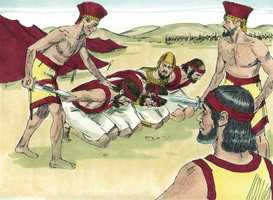
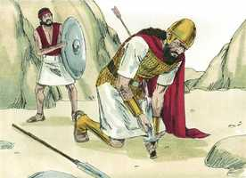
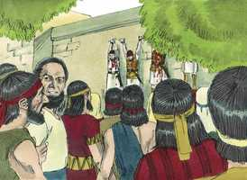
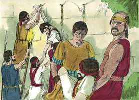

# 1Samuel Cap 31

**1** 	OS filisteus, pois, pelejaram contra Israel; e os homens de Israel fugiram de diante dos filisteus, e caíram mortos na montanha de Gilboa.

> **Cmt MHenry**: *Versículos 1-7* Não podemos julgar o estado espiritual ou eterno de ninguém pela forma em que morre, porque nesta, um mesmo fato acontece para o justo e para o ímpio. Saul não expressou preocupação por sua alma eterna quando estava mal ferido e incapaz de resistir ou de fugir; senão que somente desejou que os filisteus não o insultassem nem lhe provocassem dor, e se tornou seu próprio assassino. Como o grande engano do diabo é convencer os pecadores, submetidos a grandes dificuldades, que se refugiem neste último ato de desespero, bom é fortalecer a mente contra isso, considerando seriamente sua grave concupiscência ante Deus, e suas conseqüências desgraçadas para a sociedade. Porque nossa seguridade não está em nós mesmos. Busquemos a proteção do que guarda a Israel. Estejamos alerta e orando, e coloquemo-nos toda a armadura de Deus para suportar no dia mau e, tendo feito tudo isso, resistirmos.

**2** 	E os filisteus perseguiram a Saul e a seus filhos; e mataram a Jônatas, e a Abinadabe, e a Malquisua, filhos de Saul.

 

**3** 	E a peleja se agravou contra Saul, e os flecheiros o alcançaram; e muito temeu por causa dos flecheiros.

**4** 	Então disse Saul ao seu pajem de armas: Arranca a tua espada, e atravessa-me com ela, para que porventura não venham estes incircuncisos, e me atravessem e escarneçam de mim. Porém o seu pajem de armas não quis, porque temia muito; então Saul tomou a espada, e se lançou sobre ela.

 

**5** 	Vendo, pois, o seu pajem de armas que Saul já era morto, também ele se lançou sobre a sua espada, e morreu com ele.

**6** 	Assim faleceu Saul, e seus três filhos, e o seu pajem de armas, e também todos os seus homens morreram juntamente naquele dia.

**7** 	E, vendo os homens de Israel, que estavam deste lado do vale e deste lado do Jordão, que os homens de Israel fugiram, e que Saul e seus filhos estavam mortos, abandonaram as cidades, e fugiram; e vieram os filisteus, e habitaram nelas.

**8** 	Sucedeu, pois, que, vindo os filisteus no outro dia para despojar os mortos, acharam a Saul e a seus três filhos estirados na montanha de Gilboa.

> **Cmt MHenry**: *Versículos 8-13* A Escritura não menciona que aconteceu com as almas de Saul e de seus filhos depois que morreram; somente se refere a seus corpos: as coisas secretas não nos correspondem. Tem pouca importância saber por que meios morremos ou o que é feito com nossos corpos mortos. Se nossas almas são salvas, nossos corpos ressuscitarão incorruptíveis e gloriosos; mas não temer Sua ira, que é capaz de destruir corpo e alma no inferno, é a suprema estultícia e maldade. Que inútil é o respeito dos congêneres dos que estão sofrendo a ira de Deus! ainda que funerais pomposos, grandes monumentos e louvores humanos honrem a memória do defunto, a alma pode estar sofrendo nas regiões das trevas e da desesperação! Procuremos aquela honra que somente vem de Deus.

**9** 	E cortaram-lhe a cabeça, e o despojaram das suas armas, e enviaram pela terra dos filisteus, em redor, a anunciá-lo no templo dos seus ídolos e entre o povo.

**10** 	E puseram as suas armas no templo de Astarote, e o seu corpo o afixaram no muro de Bete-Sã.

 

**11** 	Ouvindo então os moradores de Jabes-Gileade, o que os filisteus fizeram a Saul,

**12** 	Todo o homem valoroso se levantou, e caminharam toda a noite, e tiraram o corpo de Saul e os corpos de seus filhos do muro, de Bete-Sã, e, vindo a Jabes, os queimaram.

 

**13** 	E tomaram os seus ossos, e os sepultaram debaixo de um arvoredo, em Jabes, e jejuaram sete dias.

> **Cmt MHenry** Intro: *CAPÍTULO 31A-Ob> *• Versículos 1-7*> *Derrota e morte de Saul*> *• Versículos 8-13*> *O corpo de Saul resgatado pelos homens de Jabes-Gileade*