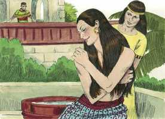
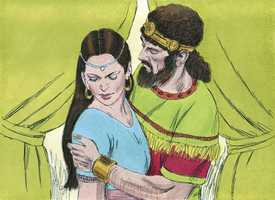
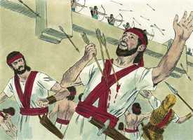
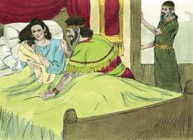

# 2 Samuel Cap 11

**1** 	E ACONTECEU que, tendo decorrido um ano, no tempo em que os reis saem à guerra, enviou Davi a Joabe, e com ele os seus servos, e a todo o Israel; e eles destruíram os filhos de Amom, e cercaram a Rabá; porém Davi ficou em Jerusalém.

> **Cmt MHenry**: *Versículos 1-5* Observe-se a ocasião do pecado de Davi; o que o conduziu a cair: 1) *Descuidou sua ocupação.* Ficou em Jerusalém. Quando nos saímos do caminho de nosso dever, estamos em tentação. 2) *Amor ao ócio:* a preguiça dá muita vantagem ao tentador. 3) *Um olho errante.* Não tinha feito aliança com seus olhos, como Jó, ou se esqueceu no momento. Notem-se os passos do pecado. Veja-se como o caminho do pecado é em declive, quando os homens começam a fazer o mal, não podem deter-se. Percebam-se os agravantes do pecado: Como pôde Davi repreender ou castigar nos outros aquilo mesmo do qual tinha consciência de que ele mesmo era culpado?

**2** 	E aconteceu que numa tarde Davi se levantou do seu leito, e andava passeando no terraço da casa real, e viu do terraço a uma mulher que se estava lavando; e era esta mulher mui formosa à vista.

 

**3** 	E mandou Davi indagar quem era aquela mulher; e disseram: Porventura não é esta Bate-Seba, filha de Eliã, mulher de Urias, o heteu?

**4** 	Então enviou Davi mensageiros, e mandou trazê-la; e ela veio, e ele se deitou com ela (pois já estava purificada da sua imundícia); então voltou ela para sua casa.

 

**5** 	E a mulher concebeu; e mandou dizer a Davi: Estou grávida.

**6** 	Então Davi mandou dizer a Joabe: Envia-me Urias, o heteu. E Joabe enviou Urias a Davi.

> **Cmt MHenry**: *Versículos 6-13* Dar lugar ao pecado endurece o coração e provoca a partida do Espírito Santo. Roubar sua razão ao homem é pior que roubar seu dinheiro; e atraí-lo ao pecado é pior que atraí-lo a qualquer outro problema mundano.

**7** 	Vindo, pois, Urias a ele, perguntou Davi como passava Joabe, e como estava o povo, e como ia a guerra.

**8** 	Depois disse Davi a Urias: Desce à tua casa, e lava os teus pés. E, saindo Urias da casa real, logo lhe foi mandado um presente da mesa do rei.

**9** 	Porém Urias se deitou à porta da casa real, com todos os servos do seu senhor; e não desceu à sua casa.

**10** 	E fizeram saber isto a Davi, dizendo: Urias não desceu à sua casa. Então disse Davi a Urias: Não vens tu duma jornada? Por que não desceste à tua casa?

**11** 	E disse Urias a Davi: A arca, e Israel, e Judá ficaram em tendas; e Joabe, meu senhor, e os servos de meu senhor estão acampados no campo; e hei de eu entrar na minha casa, para comer e beber, e para me deitar com minha mulher? Pela tua vida, e pela vida da tua alma, não farei tal coisa.

> **Cmt MHenry**: *CAPÍTULO 11A-1Rs

**12** 	Então disse Davi a Urias: Demora-te aqui ainda hoje, e amanhã te despedirei. Urias, pois, ficou em Jerusalém aquele dia e o seguinte.

**13** 	E Davi o convidou, e comeu e bebeu diante dele, e o embebedou; e à tarde saiu a deitar-se na sua cama com os servos de seu senhor; porém não desceu à sua casa.

**14** 	E sucedeu que pela manhã Davi escreveu uma carta a Joabe; e mandou-lha por mão de Urias.

> **Cmt MHenry**: *Versículos 14-27* O adultério costuma ocasionar homicídio ao tratar de ocultar uma maldade com outra. Deve temer-se o começo do pecado, porque, quem sabe onde terminará? Pode um crente verdadeiro andar por esta senda? Pode tal pessoa ser um verdadeiro filho de Deus? Ainda que a graça não se perca num caso tão espantoso, a seguridade e o consolo dela são reduzidos. Podemos ter a plena certeza de que se perdeu da vida de Davi toda a espiritualidade e o consolo na religião. Nenhum homem, em tal caso, pode ter evidência que o satisfaça de que é crente. Quanto maior seja a confiança de um homem que se afundou na maldade, maiores serão sua presunção e hipocrisia. Ninguém que se pareça em nada a Davi, senão em suas transgressões, deve estimular sua confiança com este exemplo. Que siga a Davi em sua humilhação, arrependimento e suas outras graças eminentes; é preferível que pense de sim como de um descaminhado, e não seja um hipócrita. Que ninguém que se oponha à verdade diga: Este é o fruto da fé! Não, são os efeitos da natureza corrupta. Vigiemos os começos da auto-complacência e mantenhamo-nos na maior distância de todo mal. Contudo, no Senhor há misericórdia e abundante redenção. Ele não lançará fora a nenhum crente arrependido e humilde; tampouco suportará que Satanás arrebate suas ovelhas de Sua mão. Não obstante, o Senhor fará que seu povo se recupere do dano em forma tal que marcará o aborrecimento de seus crimes, para impedir que os que têm consideração por Sua Palavra, abusem das palavras da graça.

**15** 	Escreveu na carta, dizendo: Ponde a Urias na frente da maior força da peleja; e retirai-vos de detrás dele, para que seja ferido e morra.

**16** 	Aconteceu, pois, que, tendo Joabe observado bem a cidade, pôs a Urias no lugar onde sabia que havia homens valentes.

**17** 	E, saindo os homens da cidade, e pelejando com Joabe, caíram alguns do povo, dos servos de Davi; e morreu também Urias, o heteu.

 

**18** 	Então enviou Joabe, e fez saber a Davi todo o sucesso daquela peleja.

**19** 	E deu ordem ao mensageiro, dizendo: Acabando tu de contar ao rei todo o sucesso desta peleja,

**20** 	E sucedendo que o rei se encolerize, e te diga: Por que vos chegastes tão perto da cidade a pelejar? Não sabíeis vós que haviam de atirar do muro?

**21** 	Quem feriu a Abimeleque, filho de Jerubesete? Não lançou uma mulher sobre ele do muro um pedaço de uma mó corredora, de que morreu em Tebes? Por que vos chegastes ao muro? Então dirás: Também morreu teu servo Urias, o heteu.

**22** 	E foi o mensageiro, e entrou, e fez saber a Davi tudo o que Joabe o enviara a dizer.

**23** 	E disse o mensageiro a Davi: Na verdade que mais poderosos foram aqueles homens do que nós, e saíram a nós ao campo; porém nós fomos contra eles, até à entrada da porta.

**24** 	Então os flecheiros atiraram contra os teus servos desde o alto do muro, e morreram alguns dos servos do rei; e também morreu o teu servo Urias, o heteu.

**25** 	E disse Davi ao mensageiro: Assim dirás a Joabe: Não te pareça isto mal aos teus olhos; pois a espada tanto consome este como aquele; esforça a tua peleja contra a cidade, e a derrota; esforça-o tu assim.

**26** 	Ouvindo, pois, a mulher de Urias que seu marido era morto, lamentou a seu senhor.

**27** 	E, passado o luto, enviou Davi, e a recolheu em sua casa, e lhe foi por mulher, e deu-lhe à luz um filho. Porém esta coisa que Davi fez pareceu mal aos olhos do Senhor.

 

> **Cmt MHenry** Intro: *• Versículos 1-5*> *O adultério de Davi*> *• Versículos 6-13*> *Trata de esconder seu delito*> *• Versículos 14-27*> *Urias é assassinado*