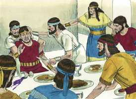

# 2 Samuel Cap 13

**1** 	E ACONTECEU depois disto que, tendo Absalão, filho de Davi, uma irmã formosa, cujo nome era Tamar, Amnom, filho de Davi, amou-a.

> **Cmt MHenry**: *Versículos 1-20* Daqui para frente Davi teve um problema após outro. O adultério e o assassinato foram os pecados de Davi, e pecados similares de seus filhos foram os começos de seu castigo: foi demasiado indulgente com seus filhos. Assim, Davi pôde distribuir os pecados de seus filhos a sua própria má conduta, coisa que deve ter piorado a angústia do castigo. Que ninguém tenha a expectativa de ser bem tratado por quem são capazes de fazê-los cair em tentação; todavia, é melhor suportar o maior dos males que cometer o menor dos pecados.

**2** 	E angustiou-se Amnom, até adoecer, por Tamar, sua irmã, porque era virgem; e parecia aos olhos de Amnom dificultoso fazer-lhe coisa alguma.

**3** 	Tinha, porém, Amnom um amigo, cujo nome era Jonadabe, filho de Siméia, irmão de Davi; e era Jonadabe homem mui sagaz.

**4** 	O qual lhe disse: Por que tu de dia em dia tanto emagreces, sendo filho do rei? Não mo farás saber a mim? Então lhe disse Amnom: Amo a Tamar, irmã de Absalão, meu irmão.

**5** 	E Jonadabe lhe disse: Deita-te na tua cama, e finge-te doente; e, quando teu pai te vier visitar, dize-lhe: Peço-te que minha irmã Tamar venha, e me dê de comer pão, e prepare a comida diante dos meus olhos, para que eu a veja e coma da sua mão.

**6** 	Deitou-se, pois, Amnom, e fingiu-se doente; e, vindo o rei visitá-lo, disse Amnom, ao rei: Peço-te que minha irmã Tamar venha, e prepare dois bolos diante dos meus olhos, para que eu coma de sua mão.

**7** 	Mandou então Davi à casa, a Tamar, dizendo: Vai à casa de Amnom, teu irmão, e faze-lhe alguma comida.

**8** 	E foi Tamar à casa de Amnom, seu irmão (ele porém estava deitado), e tomou massa, e a amassou, e fez bolos diante dos seus olhos, e cozeu os bolos.

**9** 	E tomou a frigideira, e os tirou diante dele; porém ele recusou comer. E disse Amnom: Fazei retirar a todos da minha presença. E todos se retiraram dele.

**10** 	Então disse Amnom a Tamar: Traze a comida ao quarto, e comerei da tua mão. E tomou Tamar os bolos que fizera, e levou-os a Amnom, seu irmão, no quarto.

**11** 	E chegando-lhos, para que comesse, pegou dela, e disse-lhe: Vem, deita-te comigo, minha irmã.

**12** 	Porém ela lhe disse: Não, meu irmão, não me forces, porque não se faz assim em Israel; não faças tal loucura.

**13** 	Porque, aonde iria eu com a minha vergonha? E tu serias como um dos loucos de Israel. Agora, pois, peço-te que fales ao rei, porque não me negará a ti.

> **Cmt MHenry**: *CAPÍTULO 13A-1Cr

**14** 	Porém ele não quis dar ouvidos à sua voz; antes, sendo mais forte do que ela, a forçou, e se deitou com ela.

**15** 	Depois Amnom sentiu grande aversão por ela, pois maior era o ódio que sentiu por ela do que o amor com que a amara. E disse-lhe Amnom: Levanta-te, e vai-te.

**16** 	Então ela lhe disse: Não há razão de me despedires assim; maior seria este mal do que o outro que já me tens feito. Porém não lhe quis dar ouvidos.

**17** 	E chamou a seu moço que o servia, e disse: Ponha fora a esta, e fecha a porta após ela.

**18** 	E trazia ela uma roupa de muitas cores (porque assim se vestiam as filhas virgens dos reis); e seu servo a pôs para fora, e fechou a porta após ela.

**19** 	Então Tamar tomou cinza sobre a sua cabeça, e a roupa de muitas cores que trazia rasgou; e pôs as mãos sobre a cabeça, e foi andando e clamando.

**20** 	E Absalão, seu irmão, lhe disse: Esteve Amnom, teu irmão, contigo? Ora, pois, minha irmã, cala-te; é teu irmão. Não se angustie o teu coração por isto. Assim ficou Tamar, e esteve solitária em casa de Absalão seu irmão.

**21** 	E, ouvindo o rei Davi todas estas coisas, muito se lhe acendeu a ira.

> **Cmt MHenry**: *Versículos 21-29* Observem-se os agravantes do pecado de Absalão: ele quis matar a Amnom quando estiver menos apto para ir-se deste mundo. Comprometeu a seus servos na culpa. São servos mal ensinados os que obedecem a um amo malvado contra os mandamentos de Deus. as crianças malcriadas sempre resultam ser cruzes para os pais piedosos, cujo néscio amor os leva a descuidar seu dever para com Deus.

**22** 	Porém Absalão não falou com Amnom, nem mal nem bem; porque Absalão odiava a Amnom, por ter forçado a Tamar sua irmã.

**23** 	E aconteceu que, passados dois anos inteiros, Absalão tinha tosquiadores em Baal-Hazor, que está junto a Efraim; e convidou Absalão a todos os filhos do rei.

**24** 	E foi Absalão ao rei, e disse: Eis que teu servo tem tosquiadores; peço que o rei e os seus servos venham com o teu servo.

**25** 	O rei, porém, disse a Absalão: Não, filho meu, não vamos todos juntos, para não te sermos pesados. E instou com ele; porém não quis ir, mas o abençoou.

**26** 	Então disse Absalão: Quando não, deixa ir conosco Amnom, meu irmão. Porém o rei disse: Para que iria contigo?

**27** 	E, instando Absalão com ele, deixou ir com ele a Amnom, e a todos os filhos do rei.

**28** 	E Absalão deu ordem aos seus servos, dizendo: Tomai sentido; quando o coração de Amnom estiver alegre do vinho, e eu vos disser: Feri a Amnom, então o matareis; não temais: porque porventura não sou eu quem vo-lo ordenei? Esforçai-vos, e sede valentes.

**29** 	E os servos de Absalão fizeram a Amnom como Absalão lho havia ordenado. Então todos os filhos do rei se levantaram, e montaram cada um no seu mulo, e fugiram.

 

**30** 	E aconteceu que, estando eles ainda no caminho, chegou a nova a Davi, dizendo-se: Absalão feriu a todos os filhos do rei, e nenhum deles ficou.

> **Cmt MHenry**: *Versículos 30-39* Jonadabe foi tão culpado da morte de Amnom como de seu pecado; amigos falsos resultam ser os que nos aconselham que façamos o mal. Depois de um tempo, Davi anelava ver a Absalão em lugar de aborrecê-lo por assassino: esta era a debilidade de Davi. Deus viu algo em seu coração que marcava a diferença, pois do contrário, teríamos pensado que ele, como Eli, honrava mais a seus filhos que a Deus.

**31** 	Então o rei se levantou, e rasgou as suas vestes, e se lançou por terra; da mesma maneira todos os seus servos estavam com vestes rotas.

**32** 	Mas Jonadabe, filho de Siméia, irmão de Davi, respondeu, e disse: Não diga o meu senhor que mataram a todos os moços filhos do rei, porque só morreu Amnom; porque assim tinha resolvido fazer Absalão, desde o dia em que forçou a Tamar sua irmã.

**33** 	Não se lhe ponha, pois, agora no coração do rei meu senhor tal coisa, dizendo: Morreram todos os filhos do rei; porque só morreu Amnom.

**34** 	E Absalão fugiu; e o moço que estava de guarda, levantou os seus olhos, e olhou; e eis que muito povo vinha pelo caminho por detrás dele, pelo lado do monte.

**35** 	Então disse Jonadabe ao rei: Eis aqui vêm os filhos do rei; conforme à palavra de teu servo, assim sucedeu.

**36** 	E aconteceu que, como acabou de falar, os filhos do rei vieram, e levantaram a sua voz, e choraram; e também o rei e todos os seus servos choraram amargamente.

**37** 	Assim Absalão fugiu, e foi a Talmai, filho de Amiur, rei de Gesur. E Davi pranteava por seu filho todos aqueles dias.

**38** 	Assim Absalão fugiu, e foi para Gesur; esteve ali três anos.

**39** 	Então tinha o rei Davi saudades de Absalão; porque já se tinha consolado acerca da morte de Amnom.

 

> **Cmt MHenry** Intro: *• Versículos 1-20*> *A violência de Amnom com sua irmã*> *• Versículos 21-29*> *Absalão assassina a seu irmão Amnom*> *• Versículos 30-39*> *A tristeza de Davi – Absalão foge a Gesur*