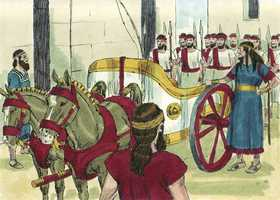
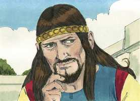
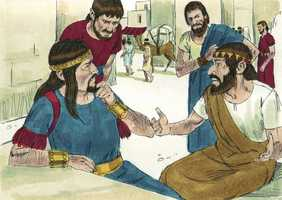
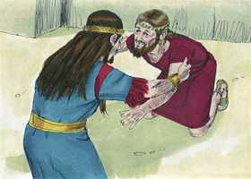
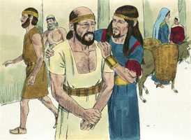
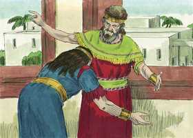
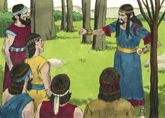
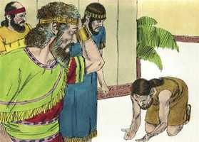
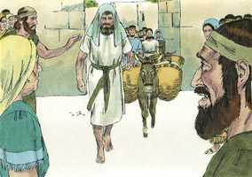

# 2 Samuel Cap 15

**1** 	E ACONTECEU depois disto que Absalão fez aparelhar carros e cavalos, e cinqüenta homens que corressem adiante dele.

> **Cmt MHenry**: *Versículos 1-6* Davi permite a pompa de Absalão. Os pais que permitem a atitude orgulha de seus filhos não sabem o que fazem: muitos jovens são destruídos pelo orgulho. Correntemente, os que mais anelam a autoridade são os que menos entendem seus deveres.

  

**2** 	Também Absalão se levantou pela manhã, e parava a um lado do caminho da porta. E sucedia que a todo o homem que tinha alguma demanda para vir ao rei a juízo, o chamava Absalão a si, e lhe dizia: De que cidade és tu? E, dizendo ele: De uma das tribos de Israel é teu servo;

**3** 	Então Absalão lhe dizia: Olha, os teus negócios são bons e retos, porém não tens quem te ouça da parte do rei.

 

**4** 	Dizia mais Absalão: Ah, quem me dera ser juiz na terra, para que viesse a mim todo o homem que tivesse demanda ou questão, para que lhe fizesse justiça!

**5** 	Sucedia também que, quando alguém se chegava a ele para se inclinar diante dele, ele estendia a sua mão, e pegava dele, e o beijava.

 

**6** 	E desta maneira fazia Absalão a todo o Israel que vinha ao rei para juízo; assim furtava Absalão o coração dos homens de Israel.

 

**7** 	Aconteceu, pois, ao cabo de quarenta anos, que Absalão disse ao rei: Deixa-me ir pagar em Hebrom o meu voto que fiz ao Senhor.

> **Cmt MHenry**: *Versículos 7-12* Veja-se quão dispostos estão os pais tenros a acreditarem o melhor de seus filhos. Todavia, quão fácil e perverso é que os filhos se aproveitem de seus bons pais e os enganem com um alarde de religião! Os principais homens de Jerusalém se uniram à festa de Absalão por seu sacrifício. As pessoas piedosas se alegram ao ver que os outros parecem religiosos e isto dá ocasião para o engano. A política dos homens maus, e a sutileza de Satanás são exercidas para fazer que as pessoas boas apóiem seus maus desígnios.

 

**8** 	Porque, morando eu em Gesur, na Síria, fez o teu servo um voto, dizendo: Se o Senhor outra vez me fizer tornar a Jerusalém, servirei ao Senhor.

**9** 	Então lhe disse o rei: Vai em paz. Levantou-se, pois, e foi para Hebrom.

**10** 	E enviou Absalão espias por todas as tribos de Israel, dizendo: Quando ouvirdes o som das trombetas, direis: Absalão reina em Hebrom.

 

**11** 	E de Jerusalém foram com Absalão duzentos homens convidados, porém iam na sua simplicidade, porque nada sabiam daquele negócio.

**12** 	Também Absalão mandou vir Aitofel, o gilonita, do conselho de Davi, à sua cidade de Giló, estando ele oferecendo os seus sacrifícios; e a conjuração se fortificava, e vinha o povo, e ia crescendo com Absalão.

**13** 	Então veio um mensageiro a Davi, dizendo: O coração de cada um em Israel segue a Absalão.

> **Cmt MHenry**: *Versículos 13-23* Davi decidiu partir de Jerusalém. Resolveu isto como um penitente que se submete à vara. Ante o ímpio Absalão podia justificar-se e resistir, porém ante o justo Deus devia condenar-se e render-se a Seus juízos. Assim, aceita o castigo de seu pecado. quando os homens bons sofrem, anelam que os outros não sejam levados a sofrerem com eles. Não obrigou a ninguém; deixou que se fossem com Absalão os que tinham seu coração colocado nele, e assim será sua condena. Cristo alista somente os seguidores voluntários. Davi não pôde tolerar a idéia de que Itai, um estrangeiro, prosélito e novo convertido, que deveria ter sido animado e a quem se deveriam ter facilitado as coisas, tivera de encontrar tão duro tratamento. Porém Itai valorizava tanto a sabedoria e bondade de Davi que não o deixaria. Sem dúvida, em todo o tempo ama o amigo, e é como um irmão em épocas de angústia. Aferremo-nos ao Filho de Davi, com pleno propósito de coração, e nem a vida nem a morte nos separarão de seu amor.

 

**14** 	Disse, pois, Davi a todos os seus servos que estavam com ele em Jerusalém: Levantai-vos, e fujamos, porque não poderíamos escapar diante de Absalão. Dai-vos pressa a caminhar, para que porventura não se apresse ele, e nos alcance, e lance sobre nós algum mal, e fira a cidade a fio de espada.

**15** 	Então os servos do rei disseram ao rei: Eis aqui os teus servos, para tudo quanto determinar o rei, nosso senhor.

> **Cmt MHenry**: *CAPÍTULO 15A-Es

**16** 	E saiu o rei, com toda a sua casa, a pé; deixou, porém, o rei dez mulheres concubinas, para guardarem a casa.

 

**17** 	Tendo, pois, saído o rei com todo o povo a pé, pararam num lugar distante.

**18** 	E todos os seus servos iam a seu lado, como também todos os quereteus e todos os peleteus; e todos os giteus, seiscentos homens que vieram de Gate a pé, caminhavam diante do rei.

**19** 	Disse, pois, o rei a Itai, o giteu: Por que irias tu também conosco? Volta-te, e fica-te com o rei, porque és estrangeiro, e também desterrado de teu lugar.

**20** 	Ontem vieste, e te levaria eu hoje conosco a caminhar? Pois eu vou para onde puder ir; volta, pois, e torna a levar teus irmãos contigo, com beneficência e fidelidade.

**21** 	Respondeu, porém, Itai ao rei, e disse: Vive o Senhor, e vive o rei meu senhor, que no lugar em que estiver o rei meu senhor, seja para morte seja para vida, aí certamente estará também o teu servidor.

**22** 	Então Davi disse a Itai: Vem, pois, e passa adiante. Assim passou Itai, o giteu, e todos os seus homens, e todas as crianças que havia com ele.

**23** 	E toda a terra chorava a grandes vozes, passando todo o povo; também o rei passou o ribeiro de Cedrom, e passou todo o povo na direção do caminho do deserto.

**24** 	Eis que também Zadoque ali estava, e com ele todos os levitas que levavam a arca da aliança de Deus; e puseram ali a arca de Deus, e subiu Abiatar, até que todo o povo acabou de passar da cidade.

> **Cmt MHenry**: *Versículos 24-30* Davi é muito cuidadoso da seguridade da arca. Bom é preocupar-se mais pela prosperidade da igreja que pela própria; preferir o êxito do evangelho por acima de nossa própria riqueza, crédito, comodidade e seguridade. Observe com que satisfação e submissão fala Davi da disposição divina. Interesse e dever nosso é assentir com regozijo à vontade de Deus, seja o que for que nos aconteça. Vejamos a mão de Deus em todos os acontecimentos; e para que não temamos o que será, vejamos todos os acontecimentos na mão de Deus. O pecado de Davi estava sempre diante dele ([Sl 51.3](../19A-Sl/51.md#3)), mas nunca tão evidente nem tão preto como agora. Nunca chorou assim quando Saul o perseguia, mas a má consciência faz que os problemas sejam gravosos ([Sl 38.4](../19A-Sl/38.md#4)).

**25** 	Então disse o rei a Zadoque: Torna a levar a arca de Deus à cidade; que, se achar graça nos olhos do Senhor, ele me tornará a trazer para lá e me deixará ver a ela e a sua habitação.

**26** 	Se, porém, disser assim: Não tenho prazer em ti; eis-me aqui, faça de mim como parecer bem aos seus olhos.

**27** 	Disse mais o rei a Zadoque, o sacerdote: Não és tu porventura vidente? Torna, pois, em paz para a cidade, e convosco também vossos dois filhos, Aimaás, teu filho, e Jônatas, filho de Abiatar.

**28** 	Olhai que me demorarei nas campinas do deserto até que tenha notícias vossas.

**29** 	Zadoque, pois, e Abiatar, tornaram a levar para Jerusalém a arca de Deus; e ficaram ali.

**30** 	E seguiu Davi pela encosta do monte das Oliveiras, subindo e chorando, e com a cabeça coberta; e caminhava com os pés descalços; e todo o povo que ia com ele cobria cada um a sua cabeça, e subiam chorando sem cessar.

**31** 	Então fizeram saber a Davi, dizendo: Também Aitofel está entre os que se conjuraram com Absalão. Pelo que disse Davi: Ó Senhor, peço-te que torne em loucura o conselho de Aitofel.

> **Cmt MHenry**: *Versículos 31-37* Davi não ora contra a pessoa de Aitofel, senão contra seu conselho. Orou crendo firmemente que Deus tem todos os corações em Sua mão, e também as línguas. Porém nós devemos secundar nossas orações com esforço, e assim fez Davi, de outro modo tentamos a Deus. todavia, não achamos a sabedoria nem a simplicidade tão unidas num só homem, que não percebamos nada que necessite perdão. Contudo, quando o Filho de Davi foi tratado traiçoeiramente e com toda a crueldade que era possível, sua sabedoria, mansidão, franqueza e paciência foram profetisas. Sigamo-lo a Ele, aferremo-nos a Ele e sirvamo-lo a Ele na vida e na morte.

**32** 	E aconteceu que, chegando Davi ao cume, para adorar ali a Deus, eis que Husai, o arquita, veio encontrar-se com ele com a roupa rasgada e terra sobre a cabeça.

**33** 	E disse-lhe Davi: Se passares comigo, ser-me-ás pesado.

**34** 	Porém se voltares para a cidade, e disseres a Absalão: Eu serei, ó rei, teu servo; bem fui antes servo de teu pai, mas agora serei teu servo; dissipar-me-ás então o conselho de Aitofel.

**35** 	E não estão ali contigo Zadoque e Abiatar, sacerdotes? E será que todas as coisas que ouvires da casa do rei, farás saber a Zadoque, e a Abiatar, sacerdotes.

**36** 	Eis que estão também ali com eles seus dois filhos, Aimaás filho de Zadoque, e Jônatas filho de Abiatar; pela mão deles aviso me mandareis, de todas as coisas que ouvirdes.

**37** 	Husai, pois, amigo de Davi, veio para a cidade; e Absalão entrou em Jerusalém.

> **Cmt MHenry** Intro: *• Versículos 1-6*> *A ambição de Absalão*> *• Versículos 7-12*> *Sua conspiração*> *• Versículos 13-23*> *Davi abandona Jerusalém*> *• Versículos 24-30*> *Davi devolve a arca*> *• Versículos 31-37*> *Ora contra o conselho de Aitofel*