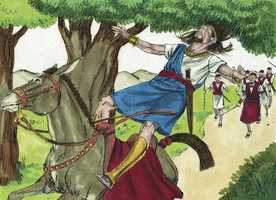
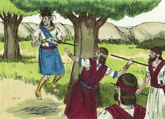
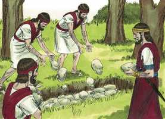
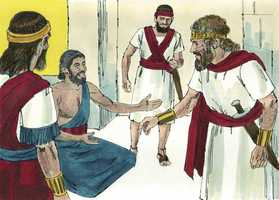
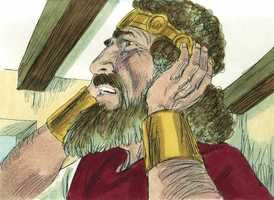

# 2 Samuel Cap 18

**1** 	E DAVI contou o povo que tinha consigo, e pôs sobre eles capitães de mil e capitães de cem.

> **Cmt MHenry**: *Versículos 1-8* Como devolve Davi bem por mal! Absalão somente teria dado morte a Davi; Davi somente teria salvado a Absalão. Isto é semelhante à maldade do homem para com Deus, e à misericórdia de Deus para com o homem, do qual custa muito dizer qual é mais assombrosa. Agora os israelitas vêem o resultado de ficar contra Jeová e seu ungido.

**2** 	E Davi enviou o povo, um terço sob o mando de Joabe, e outro terço sob o mando de Abisai, filho de Zeruia, irmão de Joabe, e outro terço sob o mando de Itai, o giteu; e disse o rei ao povo: Eu também sairei convosco.

**3** 	Porém o povo disse: Não sairás, porque, se formos obrigados a fugir, não se importarão conosco; e, ainda que metade de nós morra, não farão caso de nós, porque ainda, tais como nós somos, ajuntarás dez mil; melhor será, pois, que da cidade nos sirvas de socorro.

**4** 	Então disse-lhe Davi: O que bem parecer aos vossos olhos, farei. E o rei se pôs do lado da porta, e todo o povo saiu em centenas e em milhares.

**5** 	E o rei deu ordem a Joabe, e a Abisai, e a Itai, dizendo: Brandamente tratai, por amor de mim, ao jovem Absalão. E todo o povo ouviu quando o rei deu ordem a todos os capitães acerca de Absalão.

**6** 	Saiu, pois, o povo ao campo, a encontrar-se com Israel, e deu-se a batalha no bosque de Efraim.

**7** 	E ali foi ferido o povo de Israel, diante dos servos de Davi; e naquele mesmo dia houve ali uma grande derrota de vinte mil.

**8** 	Porque ali se derramou a batalha sobre a face de toda aquela terra; e foram mais os do povo que o bosque consumiu do que os que a espada consumiu naquele dia.

**9** 	E Absalão se encontrou com os servos de Davi; e Absalão ia montado num mulo; e, entrando o mulo debaixo dos espessos ramos de um grande carvalho, pegou-se-lhe a cabeça no carvalho, e ficou pendurado entre o céu e a terra; e o mulo, que estava debaixo dele, passou adiante.

> **Cmt MHenry**: *Versículos 9-18* Jovens, olhem para Absalão, pendurado de uma árvore, amaldiçoado, abandonado pelo céu e a terra; leiam nisto quanto aborrece o Senhor a rebelião contra os pais. Nada pode resguardar aos homens da desgraça e do desprezo, senão a sabedoria do alto e a graça de Deus.

 

**10** 	O que vendo um homem, fez saber a Joabe, e disse: Eis que vi a Absalão pendurado num carvalho.

**11** 	Então disse Joabe ao homem que lho fizera saber: Pois que o viste, por que o não feriste logo ali em terra? E forçoso seria o eu dar-te dez moedas de prata e um cinto.

**12** 	Disse, porém, aquele homem a Joabe: Ainda que eu pudesse pesar nas minhas mãos mil moedas de prata, não estenderia a minha mão contra o filho do rei, pois bem ouvimos que o rei te deu ordem a ti, e a Abisai, e a Itai, dizendo: Guardai-vos, cada um de vós, de tocar no jovem Absalão.

**13** 	Ainda que cometesse mentira a risco da minha vida, nem por isso coisa nenhuma se esconderia ao rei; e tu mesmo te oporias.

**14** 	Então disse Joabe: Não me demorarei assim contigo aqui. E tomou três dardos, e traspassou com eles o coração de Absalão, estando ele ainda vivo no meio do carvalho.

 

**15** 	E o cercavam dez moços, que levaram as armas de Joabe. E feriram a Absalão, e o mataram.

**16** 	Então tocou Joabe a buzina, e voltou o povo de perseguir a Israel, porque Joabe deteve o povo.

**17** 	E tomaram a Absalão, e o lançaram no bosque, numa grande cova, e levantaram sobre ele um mui grande montão de pedras; e todo o Israel fugiu, cada um para a sua tenda.

 

**18** 	Ora, Absalão, quando ainda vivia, tinha tomado e levantado para si uma coluna, que está no vale do rei, porque dizia: Filho nenhum tenho para conservar a memória do meu nome. E chamou aquela coluna pelo seu próprio nome; por isso até ao dia de hoje se chama o Pilar de Absalão.

> **Cmt MHenry**: *CAPÍTULO 18A-Jo

**19** 	Então disse Aimaás, filho de Zadoque: Deixa-me correr, e denunciarei ao rei que já o Senhor o vingou da mão de seus inimigos.

> **Cmt MHenry**: *Versículos 19-33* Aimaás preparou a Davi para a notícia da morte de seu filho, guiando-o a dar graças a Deus por sua vitória. Quanto mais se prepara e engrandece nosso coração para agradecer a Deus suas misericórdias, melhor dispostos estaremos a suportar com paciência as aflições que vêm com elas. Alguns pensam que o desejo de Davi surgiu da preocupação pelo estado eterno de Absalão; porém pareceria mais que ele falou sem pensar devidamente. Deve ser culpado por mostrar grande carinho por um filho carente de bondade; além disso, por pelejar com a justiça divina e opor-se à justiça nacional que tinha que administrar em sua qualidade de rei, e a qual deveu preferir por acima do afeto natural. Os melhores não sempre têm o enfoque correto; somos dados a contristar-nos excessivamente pelo que amamos com exagero. Todavia, ainda que deste exemplo aprendamos a vigiar e orar contra a indulgência pecaminosa ou o descuido de nossos filhos, não podemos notar em Davi uma sombra do amor do Salvador que chorou, orou e até sofreu a morte pela humanidade, embora esta estava composta de rebeldes e vis inimigos?

**20** 	Mas Joabe lhe disse: Tu não serás hoje o portador de novas, porém outro dia as levarás; mas hoje não darás a nova, porque é morto o filho do rei.

**21** 	E disse Joabe a Cusi: Vai tu, e dize ao rei o que viste. E Cusi se inclinou a Joabe, e correu.

**22** 	E prosseguiu Aimaás, filho de Zadoque, e disse a Joabe: Seja o que for deixa-me também correr após Cusi. E disse Joabe: Para que agora correrias tu, meu filho, pois não tens mensagem conveniente?

**23** 	Seja o que for, disse Aimaás, correrei. E Joabe lhe disse: Corre. E Aimaás correu pelo caminho da planície, e passou a Cusi.

**24** 	E Davi estava assentado entre as duas portas; e a sentinela subiu ao terraço da porta junto ao muro; e levantou os olhos, e olhou, e eis que um homem corria só.

**25** 	Gritou, pois, a sentinela, e o disse ao rei: Se vem só, há novas em sua boca. E vinha andando e chegando.

**26** 	Então viu a sentinela outro homem que corria, e a sentinela gritou ao porteiro, e disse: Eis que lá vem outro homem correndo só. Então disse o rei: Também traz este novas.

**27** 	Disse mais a sentinela: Vejo o correr do primeiro, que parece ser o correr de Aimaás, filho de Zadoque. Então disse o rei: Este é homem de bem, e virá com boas novas.

**28** 	Gritou, pois, Aimaás, e disse ao rei: Paz. E inclinou-se ao rei com o rosto em terra, e disse: Bendito seja o Senhor, que entregou os homens que levantaram a mão contra o rei meu senhor.

**29** 	Então disse o rei: Vai bem com o jovem, com Absalão? E disse Aimaás: Vi um grande alvoroço, quando Joabe mandou o servo do rei, e a mim teu servo; porém não sei o que era.

**30** 	E disse o rei: Vira-te, e põe-te aqui. E virou-se, e parou.

**31** 	E eis que vinha Cusi; e disse Cusi: Anunciar-se-á ao rei meu senhor que hoje o Senhor te vingou da mão de todos os que se levantaram contra ti.

 

**32** 	Então disse o rei a Cusi: Vai bem com o jovem, com Absalão? E disse Cusi: Sejam como aquele jovem os inimigos do rei meu senhor, e todos os que se levantam contra ti para mal.

 

**33** 	Então o rei se perturbou, e subiu à sala que estava por cima da porta, e chorou; e andando, dizia assim: Meu filho Absalão, meu filho, meu filho, Absalão! Quem me dera que eu morrera por ti, Absalão, meu filho, meu filho!

 

> **Cmt MHenry** Intro: *• Versículos 1-8*> *O exército de Absalão é derrotado*> *• Versículos 9-18*> *Ele morre*> *• Versículos 19-33*> *A pena excessiva de Davi*