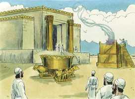

# 1 Reis Cap 06

**1** 	E SUCEDEU que no ano de quatrocentos e oitenta, depois de saírem os filhos de Israel do Egito, no ano quarto do reinado de Salomão sobre Israel, no mês de Zive (este é o mês segundo), começou a edificar a casa do Senhor.

> **Cmt MHenry**: *Versículos 1-10* O templo foi chamado casa de Jeová porque foi ordenado e concebido por Ele, e seria utilizado em Seu serviço. Isto lhe dava a beleza da santidade, pois era a casa de Jeová, a que supera toda outra beleza. Seria o templo do Deus de paz, pelo qual não devia ouvir-se o som de ferramentas de ferro; a quietude e o silêncio convêm e ajudam aos exercícios religiosos. a obra de Deus deve realizar-se com muito cuidado e sem barulho. O clamor e a violência costumam estorvar, mas nunca adiantam a obra de Deus. assim, o Reino de Deus no coração do homem cresce em silêncio ([Mc 5.27](../41N-Mc/05.md#27)).

**2** 	E a casa que o rei Salomão edificou ao Senhor era de sessenta côvados de comprimento, e de vinte côvados de largura, e de trinta côvados de altura.

**3** 	E o pórtico diante do templo da casa era de vinte côvados de comprimento, segundo a largura da casa, e de dez côvados de largura diante da casa.

**4** 	E fez para a casa janelas de gelósias fixas.

**5** 	E edificou câmaras junto ao muro da casa, contra as paredes da casa, em redor, tanto do templo como do oráculo; e assim lhe fez câmaras laterais em redor.

**6** 	A câmara de baixo era de cinco côvados de largura, e a do meio de seis côvados de largura, e a terceira de sete côvados de largura; porque pela parte de fora da casa, em redor, fizera encostos, para que as vigas não se apoiassem nas paredes da casa.

> **Cmt MHenry**: *CAPÍTULO 60N-1Pe 61N-2Pe 62N-1Jo 63N-2Jo 64N-3Jo 65N-Jd 66N-Ap

**7** 	E edificava-se a casa com pedras preparadas, como as traziam se edificava; de maneira que nem martelo, nem machado, nem nenhum outro instrumento de ferro se ouviu na casa quando a edificavam.

**8** 	A porta da câmara do meio estava ao lado direito da casa, e por caracóis se subia à do meio, e da do meio à terceira.

**9** 	Assim, pois, edificou a casa, e a acabou; e cobriu a casa com pranchões e tabuados de cedro.

**10** 	Também edificou as câmaras em volta de toda a casa, de cinco côvados de altura, e as ligou à casa com madeira de cedro.

**11** 	Então veio a palavra do Senhor a Salomão, dizendo:

> **Cmt MHenry**: *Versículos 11-14* Ninguém se emprega na obra de Deus sem que Ele tenha seu olho colocado sobre eles. Todavia, Deus dá a conhecer claramente a Salomão que toda a carga da edificação do templo não o escusaria de obedecer a lei de Deus, nem o protegeria de Seus juízos em caso de desobediência.

**12** 	Quanto a esta casa que tu edificas, se andares nos meus estatutos, e fizeres os meus juízos, e guardares todos os meus mandamentos, andando neles, confirmarei para contigo a minha palavra, a qual falei a Davi, teu pai;

**13** 	E habitarei no meio dos filhos de Israel, e não desampararei o meu povo de Israel.

**14** 	Assim edificou Salomão aquela casa, e a acabou.

 

**15** 	Também cobriu as paredes da casa por dentro com tábuas de cedro; desde o soalho da casa até ao teto tudo cobriu com madeira por dentro; e cobriu o soalho da casa com tábuas de cipreste.

> **Cmt MHenry**: *Versículos 15-38* Veja-se o que tipifica o templo: 1) Cristo é o Templo *verdadeiro*. NEle habita toda a plenitude da divindade corporalmente; nEle se reúne todo o Israel espiritual de Deus; por meio dEle temos entrada a Deus com confiança. 2) Todo crente é um templo *vivo* em quem habita o Espírito de Deus ([1 Co 3.16](../46N-1Co/03.md#16)). Este templo vivo é edificado sobre o fundamento de Cristo e será aperfeiçoado em seu devido momento. 3) A igreja do evangelho é o templo *místico*. Cresce como templo santo no Senhor, enriquecida e embelezada com os dons e as graças do Espírito. Este templo está firmemente edificado sobre a Rocha. 4) O céu é o templo *eterno*. Ali ficará estabelecida a igreja. Todos os que serão pedras desse edifício, no estado presente de preparação devem acomodar-se e preparar-se para tudo isto. Que os pecadores acudam a Jesus como fundamento vivo para serem edificados nEle, como parte desta casa espiritual, consagrados em corpo e alma à glória de Deus.

**16** 	Edificou mais vinte côvados de tábuas de cedro nos lados da casa, desde o soalho até às paredes; e por dentro lhas edificou para o oráculo, para o Santo dos Santos.

**17** 	A casa, isto é, o templo anterior tinha quarenta côvados.

**18** 	E o cedro da casa por dentro era lavrado de botões e flores abertas; tudo era cedro, pedra nenhuma se via.

**19** 	E por dentro da casa, na parte mais interior, preparou o oráculo, para pôr ali a arca da aliança do Senhor.

**20** 	E o oráculo no interior era de vinte côvados de comprimento, e de vinte côvados de largura, e de vinte côvados de altura; e o revestiu de ouro puro; também revestiu de cedro o altar.

**21** 	E revestiu Salomão a casa por dentro de ouro puro; e com cadeias de ouro pôs uma cortina diante do oráculo, e o revestiu com ouro.

**22** 	Assim cobriu de ouro toda a casa, inteiramente; também cobriu de ouro todo o altar que estava diante do oráculo.

 

**23** 	E no oráculo fez dois querubins de madeira de oliveira, cada um da altura de dez côvados.

 

**24** 	E uma asa de um querubim era de cinco côvados, e a outra asa do querubim de outros cinco côvados; dez côvados havia desde a extremidade de uma das suas asas até à extremidade da outra das suas asas.

**25** 	Assim era também de dez côvados o outro querubim; ambos os querubins eram de uma mesma medida e de um mesmo talhe.

**26** 	A altura de um querubim era de dez côvados, e assim a do outro querubim.

**27** 	E pôs a estes querubins no meio da casa de dentro; e os querubins estendiam as asas, de maneira que a asa de um tocava na parede, e a asa do outro querubim tocava na outra parede; e as suas asas no meio da casa tocavam uma na outra.

**28** 	E revestiu de ouro os querubins.

**29** 	E todas as paredes da casa, em redor, lavrou de esculturas e entalhes de querubins, e de palmas, e de flores abertas, por dentro e por fora.

**30** 	Também revestiu de ouro o soalho da casa, por dentro e por fora.

**31** 	E à entrada do oráculo fez portas de madeira de oliveira; o umbral de cima com as ombreiras faziam a quinta parte da parede.

**32** 	Também as duas portas eram de madeira de oliveira; e lavrou nelas entalhes de querubins, e de palmas, e de flores abertas, os quais revestiu de ouro; também estendeu ouro sobre os querubins e sobre as palmas.

**33** 	E assim fez à porta do templo ombreiras de madeira de oliveira, da quarta parte da parede.

**34** 	E eram as duas portas de madeira de cipreste; e as duas folhas de uma porta eram dobradiças, assim como eram também dobradiças as duas folhas entalhadas das outras portas.

**35** 	E as lavrou de querubins e de palmas, e de flores abertas, e as revestiu de ouro acomodado ao lavor.

**36** 	Também edificou o pátio interior de três ordens de pedras lavradas e de uma ordem de vigas de cedro.

**37** 	No ano quarto se pôs o fundamento da casa do Senhor, no mês de Zive.

**38** 	E no ano undécimo, no mês de Bul, que é o mês oitavo, se acabou esta casa com todas as suas coisas, e com tudo o que lhe convinha; e a edificou em sete anos.

> **Cmt MHenry** Intro: *• Versículos 1-10*> *Edificação do templo de Salomão*> *• Versículos 11-14*> *Promessas dadas em quanto ao templo*> *• Versículos 15-38*> *Detalhes acerca do templo*