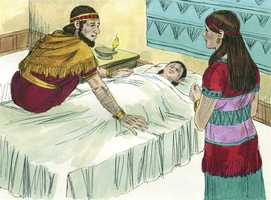
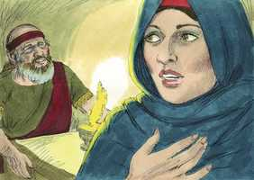
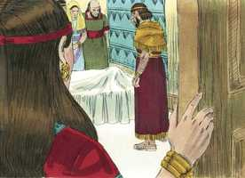
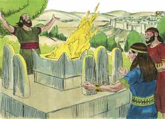
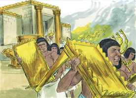

# 1 Reis Cap 14

**1** 	NAQUELE tempo adoeceu Abias, filho de Jeroboão.

> **Cmt MHenry**: *Versículos 1-6* "Naquele tempo", quando Jeroboão fez o errado, seu filho adoeceu. Quando a doença chega a nossa família, devemos perguntar-nos se não haverá algum pecado específico que se albergue em nossa casa, pelo qual se envia a aflição para acusar-nos e reclamar-nos desse pecado. Teria sido mais piedoso se tivesse desejado saber por que Deus contendia com ele; se tiver pedido as orações do profeta e rejeitado seus ídolos; mas a maioria da gente prefere que lhes seja dita a sorte, e não suas faltas ou seu dever. Mandou buscar a Aías, porque este lhe tinha dito que seria rei. Os que pelo pecado se desqualificam para as consolações e, contudo, esperam que seus ministros, porque são homens bons, lhes falem de paz e consolo, enganam a si mesmos e a seus ministros. Mandou a sua esposa disfarçada para que o profeta lhe respondesse somente a pergunta sobre seu filho. Assim, alguns limitam a seus ministros para que suavizem as coisas, e não se interessam de que lhes seja declarado todo o conselho de Deus, não seja que se profetize algo não bom para eles, mas mau. Mas ela sabe, na primeira palavra, em que tem de confiar. As notícias para quem tem uma porção com os hipócritas serão notícias espantosas. Deus julgará os homens conforme o que são, não pelo que parecem ser.

**2** 	E disse Jeroboão à sua mulher: Levanta-te agora, e disfarça-te, para que não conheçam que és mulher de Jeroboão; e vai a Siló. Eis que lá está o profeta Aías, o qual falou de mim, que eu seria rei sobre este povo.

 

**3** 	E leva contigo dez pães, e bolos, e uma botija de mel, e vai a ele; ele te declarará o que há de suceder a este menino.

**4** 	E a mulher de Jeroboão assim fez, e se levantou, e foi a Siló, e entrou na casa de Aías; e já Aías não podia ver, porque os seus olhos estavam já escurecidos por causa da sua velhice.

**5** 	Porém o Senhor disse a Aías: Eis que a mulher de Jeroboão vem consultar-te sobre seu filho, porque está doente; assim e assim lhe falarás; porque há de ser que, entrando ela, fingirá ser outra.

**6** 	E sucedeu que, ouvindo Aías o ruído de seus pés, entrando ela pela porta, disse-lhe ele: Entra, mulher de Jeroboão; por que te disfarças assim? Pois eu sou enviado a ti com duras novas.

 

**7** 	Vai, dize a Jeroboão: Assim diz o Senhor Deus de Israel: Porquanto te levantei do meio do povo, e te pus por príncipe sobre o meu povo de Israel,

> **Cmt MHenry**: *Versículos 7-20* Seja que levemos ou não em conta as misericórdias de Deus, Ele sim as leva; as colocará em ordem diante nosso para nossa maior confusão, se formos ingratos. Aías anuncia a próxima morte do menino doente, por misericórdia para ele. esta criança era a única, na casa de Jeroboão, que teve afecção pela adoração verdadeira de Deus, e se desgostava da adoração dos bezerros. Para mostrar o poder e a soberania de Sua graça, Deus salva a alguns membros das piores famílias, nos quais há *algo* de bom para o Senhor Deus de Israel. Os justos são livrados do mal que vem deste mundo, e levados ao bem de um mundo melhor. Costuma ser um mau sinal para uma família quando se sepultam os melhores dela. Porém sua morte não é perda para eles. Era uma aflição presente para a família e para o reino, aflição que devia servir de instrução, ao reino e à família. Deus, também, anuncia os juízos que sobrevirão ao povo de Israel por conformar-se com a adoração estabelecida por Jeroboão. Depois que saiu da casa de Davi, o governo nunca durou muito em outra família; uma sabotava e destruía a outra. As famílias e os reinos são arruinados pelo pecado. se os grandes homens fazem o errado, arrastam a muitos outros à culpa e ao castigo. A condena deles será muito severa, porque devem responder não só por seus pecados, senão pelos pecados a que arrastaram e nos quais mantiveram a outrem.

**8** 	E rasguei o reino da casa de Davi, e o dei a ti, e tu não foste como o meu servo Davi, que guardou os meus mandamentos e que andou após mim com todo o seu coração para fazer somente o que era reto aos meus olhos,

**9** 	Antes tu fizeste o mal, pior do que todos os que foram antes de ti; e foste, e fizeste outros deuses e imagens de fundição, para provocar-me à ira, e me lançaste para trás das tuas costas;

**10** 	Portanto, eis que trarei mal sobre a casa de Jeroboão; destruirei de Jeroboão todo o homem até ao menino, tanto o escravo como o livre em Israel; e lançarei fora os descendentes da casa de Jeroboão, como se lança fora o esterco, até que de todo se acabe.

**11** 	Quem morrer dos de Jeroboão, na cidade, os cães o comerão, e o que morrer no campo as aves do céu o comerão, porque o Senhor o disse.

**12** 	Tu, pois, levanta-te, e vai para tua casa; entrando os teus pés na cidade, o menino morrerá.

**13** 	E todo o Israel o pranteará, e o sepultará; porque de Jeroboão só este entrará em sepultura, porquanto se achou nele coisa boa para com o Senhor Deus de Israel em casa de Jeroboão.

**14** 	O Senhor, porém, levantará para si um rei sobre Israel, que destruirá a casa de Jeroboão no mesmo dia. Que digo eu? Há de ser já.

> **Cmt MHenry**: *CAPÍTULO 14A-2Cr

**15** 	Também o Senhor ferirá a Israel como se agita a cana nas águas; e arrancará a Israel desta boa terra que tinha dado a seus pais, e o espalhará para além do rio; porquanto fizeram os seus ídolos, provocando o Senhor à ira.

**16** 	E entregará a Israel por causa dos pecados de Jeroboão, o qual pecou, e fez pecar a Israel.

**17** 	Então a mulher de Jeroboão se levantou, e foi, e chegou a Tirza; chegando ela ao limiar da porta, morreu o menino.

 

**18** 	E o sepultaram, e todo o Israel o pranteou, conforme a palavra do Senhor, a qual dissera pelo ministério de seu servo Aías, o profeta.

**19** 	Quanto ao mais dos atos de Jeroboão, como guerreou, e como reinou, eis que está escrito no livro das crônicas dos reis de Israel.

**20** 	E foram os dias que Jeroboão reinou vinte e dois anos; e dormiu com seus pais; e Nadabe, seu filho, reinou em seu lugar.

**21** 	E Roboão, filho de Salomão, reinava em Judá; de quarenta e um anos de idade era Roboão quando começou a reinar, e dezessete anos reinou em Jerusalém, na cidade que o Senhor escolhera de todas as tribos de Israel para pôr ali o seu nome; e era o nome de sua mãe Naamá, amonita.

> **Cmt MHenry**: *Versículos 21-31* Aqui, nada de bom é dito de Roboão, e se diz muito para desvantagem de seus súbditos. A abundância dos piores crimes, do pior dos pagãos, em Jerusalém, a cidade que o Senhor tinha escolhido para seu templo e para ser adorado, demonstra que nada pode melhorar o coração dos homens caídos, senão a graça santificadora do Espírito Santo. Nela somente podemos confiar; portanto, oremos diariamente por ela, para nós e para todos os que nos rodeiam. O esplendor de seu templo, a pompa de seu sacerdócio, e todas as vantagens com que estava associada sua religião, não foram suficientes para mantê-los perto dela; nada, senão o derramamento do Espírito, manterá a lealdade do Israel de Deus. O pecado deixa ao descoberto, empobrece e debilita a toda pessoa. Sisaque, rei do Egito, veio e levou os tesouros. O pecado faz que o ouro se apague, que mude o ouro mais fino e se torne em bronze. "

**22** 	E fez Judá o que era mau aos olhos do Senhor; e com os seus pecados que cometeram, provocaram-no a zelos, mais do que todos os seus pais fizeram.

**23** 	Porque também eles edificaram altos, e estátuas, e imagens de Aserá sobre todo o alto outeiro e debaixo de toda a árvore verde.

 

**24** 	Havia também sodomitas na terra; fizeram conforme a todas as abominações dos povos que o Senhor tinha expulsado de diante dos filhos de Israel.

**25** 	Ora, sucedeu que, no quinto ano do rei Roboão, Sisaque, rei do Egito, subiu contra Jerusalém,

 

**26** 	E tomou os tesouros da casa do Senhor e os tesouros da casa do rei; e levou tudo. Também tomou todos os escudos de ouro que Salomão tinha feito.

**27** 	E em lugar deles fez o rei Roboão escudos de cobre, e os entregou nas mãos dos chefes da guarda que guardavam a porta da casa do rei.

**28** 	E todas as vezes que o rei entrava na casa do Senhor, os da guarda os levavam, e depois os tornavam à câmara da guarda.

**29** 	Quanto ao mais dos atos de Roboão, e a tudo quanto fez, porventura não está escrito no livro das crônicas dos reis de Judá?

**30** 	E houve guerra entre Roboão e Jeroboão todos os seus dias.

**31** 	E Roboão dormiu com seus pais, e foi sepultado com seus pais na cidade de Davi; e era o nome de sua mãe Naamá, amonita; e Abias, seu filho, reinou em seu lugar.

> **Cmt MHenry** Intro: *• Versículos 1-6*> *Abias adoece e sua mãe consulta a Aías*> *• Versículos 7-20*> *A destruição da casa de Jeroboão*> *• Versículos 21-31*> *O reino malvado de Roboão*