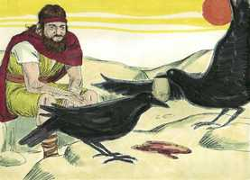
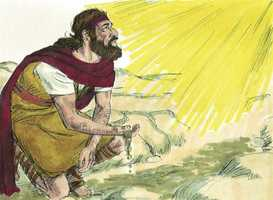
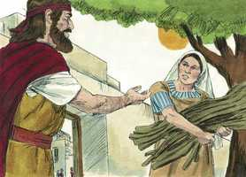
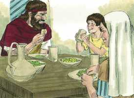
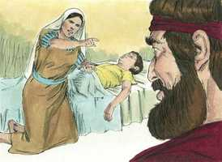
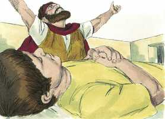
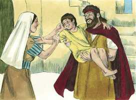

# 1 Reis Cap 17

**1** 	ENTÃO Elias, o tisbita, dos moradores de Gileade, disse a Acabe: Vive o Senhor Deus de Israel, perante cuja face estou, que nestes anos nem orvalho nem chuva haverá, senão segundo a minha palavra.

> **Cmt MHenry**: *Versículos 1-7* Deus adapta maravilhosamente os homens para a obra a que os chama. Os tempos eram adequados para um Elias; Elias era apto para esses tempos. O Espírito do Senhor sabe equipar os homens para cada ocasião. Elias informou a Acabe que Deus estava desgostado com os idólatras, e que os castigaria com a falta de chuva, coisa que os deuses que eles serviam não podia dar. Foi dada a Elias ordem de esconder-se. Se a providência nos chama à solidão e retiro, nos corresponde irmos: quando não podemos ser úteis, devemos ser pacientes; e quando não podemos trabalhar para Deus, devemos sentar-nos quietos e em silêncio para Ele. Foram designados os corvos para que lê levassem alimento, e assim fizeram. Que os que vivem ao dia, aprendam a viver da Providência, confiando nela para o pão diário. Deus pôde enviar anjos para que o atendessem, mas preferiu mostrar que pode servir seus propósitos com as criaturas mais baixas, tão eficazmente como com as mais poderosas. Elias parece ter continuado assim por mais de um ano. Falhou a provisão natural de água, que vinha pela providência, mas a miraculosa provisão de comida, assegurada a ele por uma promessa, não faltou. Se os céus falham, naturalmente falha a terra; tal é todo nosso consolo como criaturas: os perdemos quando mais os necessitamos, como os riachos no verão. Mas há um rio que alegra a cidade de Deus, que nunca seca, um manancial de água do qual brota vida eterna. Senhor, dá-nos dessa água viva!

**2** 	Depois veio a ele a palavra do Senhor, dizendo:

**3** 	Retira-te daqui, e vai para o oriente, e esconde-te junto ao ribeiro de Querite, que está diante do Jordão.

**4** 	E há de ser que beberás do ribeiro; e eu tenho ordenado aos corvos que ali te sustentem.

**5** 	Foi, pois, e fez conforme a palavra do Senhor; porque foi, e habitou junto ao ribeiro de Querite, que está diante do Jordão.

**6** 	E os corvos lhe traziam pão e carne pela manhã; como também pão e carne à noite; e bebia do ribeiro.

 

**7** 	E sucedeu que, passados dias, o ribeiro se secou, porque não tinha havido chuva na terra.

**8** 	Então veio a ele a palavra do Senhor, dizendo:

> **Cmt MHenry**: *Versículos 8-16* Havia muitas viúvas em Israel na época de Elias, e é provável que algumas o tivessem acolhido em sua casa, mas é enviado a honrar e abençoar com sua presença uma cidade de Sidom, um povo gentio, e assim chega a ser o primeiro profeta aos gentios. Jezabel era a maior inimiga de Elias, mas para mostrar quão impotente era sua maldade, Deus encontra um esconderijo para ele no próprio país dela. A pessoa designada para acolher a Elias não é um dos ricos ou grandes de Sidom, senão uma viúva pobre, necessitada e desolada, à qual lhe é dada a capacidade e a disposição de mantê-lo. é o caminho de Deus e é sua glória usar e honrar o néscio e o fraco do mundo. Oh, mulher, grande é tua fé; que nem sequer em Israel se tenha achado igual. Ela acreditou na palavra do profeta, que não sairia perdendo. Os que se aventuram baseados na promessa de Deus, não encontram difícil expor-se e despojar a si mesmos em seu serviço, dando-lhe primeiro sua parte. Certamente o aumento da fé da viúva, para capacitá-la a negar a si mesma e a depender da promessa divina, foi um milagre na esfera da graça, como o aumento de sua comida e óleo na esfera da providência. Bem-aventurados todos os que, contra toda esperança, podem crer e obedecer em esperança. Esta viúva deu ao profeta uma comida de pobre; como recompensa, ela e seu filho comeram por mais de dois anos em tempos de fome. Ter comida do especial favor de Deus, e em tão boa companhia como a de Elias, fazia todo duplamente doce. Aos que confiam em Deus lhes é prometido que não serão envergonhados no dia mau; em dias de fome serão satisfeitos.

 

**9** 	Levanta-te, e vai para Sarepta, que é de Sidom, e habita ali; eis que eu ordenei ali a uma mulher viúva que te sustente.

**10** 	Então ele se levantou, e foi a Sarepta; e, chegando à porta da cidade, eis que estava ali uma mulher viúva apanhando lenha; e ele a chamou, e lhe disse: Traze-me, peço-te, num vaso um pouco de água que beba.

 

**11** 	E, indo ela a trazê-la, ele a chamou e lhe disse: Traze-me agora também um bocado de pão na tua mão.

 

**12** 	Porém ela disse: Vive o Senhor teu Deus, que nem um bolo tenho, senão somente um punhado de farinha numa panela, e um pouco de azeite numa botija; e vês aqui apanhei dois cavacos, e vou prepará-lo para mim e para o meu filho, para que o comamos, e morramos.

**13** 	E Elias lhe disse: Não temas; vai, faze conforme à tua palavra; porém faze dele primeiro para mim um bolo pequeno, e traze-mo aqui; depois farás para ti e para teu filho.

**14** 	Porque assim diz o Senhor Deus de Israel: A farinha da panela não se acabará, e o azeite da botija não faltará até ao dia em que o Senhor dê chuva sobre a terra.

**15** 	E ela foi e fez conforme a palavra de Elias; e assim comeu ela, e ele, e a sua casa muitos dias.

 

**16** 	Da panela a farinha não se acabou, e da botija o azeite não faltou; conforme a palavra do Senhor, que ele falara pelo ministério de Elias.

**17** 	E depois destas coisas sucedeu que adoeceu o filho desta mulher, dona da casa; e a sua doença se agravou muito, até que nele nenhum fôlego ficou.

> **Cmt MHenry**: *Versículos 17-24* Nem a fé nem a obediência eliminam as aflições e a morte. Estando morto seu filho, a mãe falou ao profeta, antes de dar rédea solta a sua tristeza, mas com esperança de alívio. Quando nos tira nossas consolações, Deus nos lembra dos pecados que são contra nós, talvez os pecados de nossa juventude, ainda que faça muito tempo se passaram. Quando nos lembra nossos pecados, se propõe ensinar-nos a lembrá-los contra nós mesmos para arrepender-nos deles. A oração de Elias filho sem dúvida dirigida pelo Espírito Santo. O menino tornou a viver. veja-se o poder da oração e o poder dAquele que escuta a oração.

> **Cmt MHenry**: *CAPÍTULO 17A-Et

**18** 	Então ela disse a Elias: Que tenho eu contigo, homem de Deus? vieste tu a mim para trazeres à memória a minha iniqüidade, e matares a meu filho?

 

**19** 	E ele disse: Dá-me o teu filho. E ele o tomou do seu regaço, e o levou para cima, ao quarto, onde ele mesmo habitava, e o deitou em sua cama,

**20** 	E clamou ao Senhor, e disse: Ó Senhor meu Deus, também até a esta viúva, com quem me hospedo, afligiste, matando-lhe o filho?

 

**21** 	Então se estendeu sobre o menino três vezes, e clamou ao Senhor, e disse: Ó Senhor meu Deus, rogo-te que a alma deste menino torne a entrar nele.

 

**22** 	E o Senhor ouviu a voz de Elias; e a alma do menino tornou a entrar nele, e reviveu.

**23** 	E Elias tomou o menino, e o trouxe do quarto à casa, e o deu à sua mãe; e disse Elias: Vês aí, teu filho vive.

 

**24** 	Então a mulher disse a Elias: Nisto conheço agora que tu és homem de Deus, e que a palavra do Senhor na tua boca é verdade.

> **Cmt MHenry** Intro: *• Versículos 1-7*> *Elias alimentado pelos corvos*> *• Versículos 8-16*> *Elias enviado a Sarepta*> *• Versículos 17-24*> *Elias ressuscita o filho da viúva*