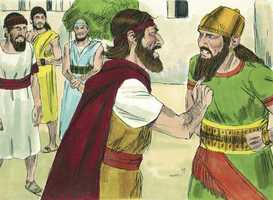
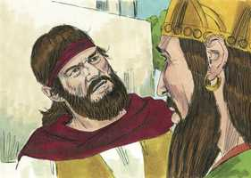
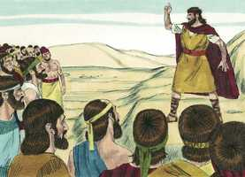
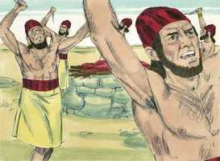
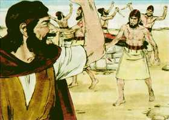
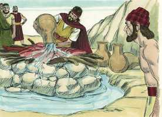
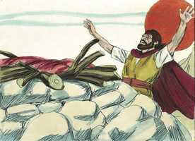
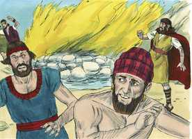
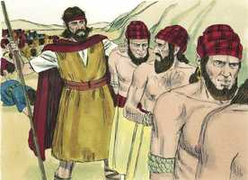
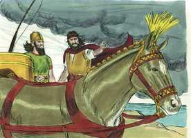

# 1 Reis Cap 18

**1** 	E SUCEDEU que, depois de muitos dias, a palavra do Senhor veio a Elias, no terceiro ano, dizendo: Vai, apresenta-te a Acabe; porque darei chuva sobre a terra.

> **Cmt MHenry**: *Versículos 1-16* Os juízos mais severos, de por si, não humilham nem mudam o coração dos pecadores; nada, exceto o sangue de Jesus Cristo, pode expiar a culpa do pecado; nada, exceto o Espírito santificador de Deus pode purgar sua imundícia. Os sacerdotes e os levitas tinham ido a Judá e Jerusalém ([2 Cr 11.13-14](../47N-2Co/11.md#13)), porém, em lugar deles, Deus levantou profetas que liam e expunham a Palavra. Provavelmente eles eram da escola de profetas organizada por Samuel. Não tinham o espírito de profecia como Elias, mas ensinavam à gente a manter-se perto do Deus de Israel. Jezabel procurava destruí-los. Os poucos que escapavam da morte eram forçados a esconder-se. Deus tem seu remanescente entre todas as classes, altas e baixas; e a fé, o temor e o amor de seu Nome, que são fruto do Espírito Santo, serão aceitos por meio do Redentor. Veja-se quão maravilhosamente levanta Deus amigos para seus ministros e seu povo, para ampará-los em épocas difíceis. Pão e água escasseavam agora, mas Obadias encontrará suficiente para os profetas de Deus, para mantê-los vivos. A preocupação de Acabe era não perder todas os animais, mas não se preocupava em perder sua alma. Esforçava-se muito em procura de pastagem, porém nada em procura do favor de Deus; lutava contra o efeito, sem perguntar como eliminar a causa. Todavia, é um bom sinal para o povo, quando Deus chama a seus ministros a pôr-se em pé e mostrar-se. Podemos tolerar o pão da aflição muito melhor quando nossos olhos vêem os nossos mestres.

**2** 	E foi Elias apresentar-se a Acabe; e a fome era extrema em Samaria.

**3** 	E Acabe chamou a Obadias, o mordomo; e Obadias temia muito ao Senhor,

**4** 	Porque sucedeu que, destruindo Jezabel os profetas do Senhor, Obadias tomou cem profetas, e de cinqüenta em cinqüenta os escondeu numa cova, e os sustentou com pão e água.

**5** 	E disse Acabe a Obadias: Vai pela terra a todas as fontes de água, e a todos os rios; pode ser que achemos erva, para que em vida conservemos os cavalos e mulas, e não percamos todos os animais.

**6** 	E repartiram entre si a terra, para a percorrerem: Acabe foi à parte por um caminho, e Obadias também foi sozinho por outro caminho.

**7** 	Estando, pois, Obadias já em caminho, eis que Elias o encontrou; e Obadias, reconhecendo-o, prostrou-se sobre o seu rosto, e disse: És tu o meu senhor Elias?

**8** 	E disse-lhe ele: Eu sou; vai, e dize a teu senhor: Eis que Elias está aqui.

**9** 	Porém ele disse: Em que pequei, para que entregues a teu servo na mão de Acabe, para que me mate?

**10** 	Vive o Senhor teu Deus, que não houve nação nem reino aonde o meu senhor não mandasse em busca de ti; e dizendo eles: Aqui não está, então fazia jurar os reinos e nações, que não te haviam achado.

**11** 	E agora dizes tu: Vai, dize a teu senhor: Eis que aqui está Elias.

**12** 	E poderia ser que, apartando-me eu de ti, o Espírito do Senhor te tomasse, não sei para onde, e, vindo eu a dar as novas a Acabe, e não te achando ele, me mataria; porém eu, teu servo, temo ao Senhor desde a minha mocidade.

**13** 	Porventura não disseram a meu senhor o que fiz, quando Jezabel matava os profetas do Senhor? Como escondi a cem homens dos profetas do Senhor, de cinqüenta em cinqüenta, numa cova, e os sustentei com pão e água?

**14** 	E agora dizes tu: Vai, dize a teu senhor: Eis que Elias está aqui; ele me mataria.

**15** 	E disse Elias: Vive o Senhor dos Exércitos, perante cuja face estou, que deveras hoje me apresentarei a ele.

**16** 	Então foi Obadias encontrar-se com Acabe, e lho anunciou; e foi Acabe encontrar-se com Elias.

**17** 	E sucedeu que, vendo Acabe a Elias, disse-lhe: És tu o perturbador de Israel?

> **Cmt MHenry**: *Versículos 17-20* Pode-se imaginar qual era o afeto que a gente tem por Deus, observando o afeto por seu povo e por seus ministros. Tem sido destino dos homens mais úteis, como Elias, serem chamados e contados como os agitadores da terra. Porém os que fazem o mal são os que provocam os juízos de Deus, e não os que os anunciam e advertem a nação que se arrependa.

**18** 	Então disse ele: Eu não tenho perturbado a Israel, mas tu e a casa de teu pai, porque deixastes os mandamentos do Senhor, e seguistes a Baalim.

> **Cmt MHenry**: *CAPÍTULO 18A-Jo

 

**19** 	Agora, pois, manda reunir-se a mim todo o Israel no monte Carmelo; como também os quatrocentos e cinqüenta profetas de Baal, e os quatrocentos profetas de Aserá, que comem da mesa de Jezabel.

**20** 	Então Acabe convocou todos os filhos de Israel; e reuniu os profetas no monte Carmelo.

 

**21** 	Então Elias se chegou a todo o povo, e disse: Até quando coxeareis entre dois pensamentos? Se o Senhor é Deus, segui-o, e se Baal, segui-o. Porém o povo nada lhe respondeu.

> **Cmt MHenry**: *Versículos 21-40* Muitos do povo vacilaram em seus juízos e mudaram de prática. Elias os chamou para que determinassem se Jeová ou Baal era o supremo Deus, que existe por si mesmo, Criador, Rei e Juiz deste mundo, e que o seguissem somente a Ele. Perigoso é claudicar entre o serviço de Deus e o serviço do pecado, o domínio de Cristo e o domínio de nossas concupiscências. Se Jesus é o único Salvador, aferremo-nos somente a Ele para tudo; se a Bíblia é a palavra de Deus, reverenciemo-la, recebamo-la e submetamos nosso entendimento a seu ensino divino. Elias se propôs levar a juízo o assunto. Baal tinha todas as vantagens externas, porém o sucesso estimula a todas as testemunhas e defensores de Deus para que não temam o rosto do homem. O que responde com fogo, seja Deus: era necessário fazer a expiação com o sacrifício, antes que a condenação fosse tirada por misericórdia. Portanto, o Deus que tem poder para perdoar o pecado, e para demonstrá-lo consumindo a oferta pelo pecado, deve ser por necessidade o Deus que pode aliviar a calamidade. Deus nunca requereu de seus adoradores que o honrassem na forma dos adoradores de Baal; mas o serviço do diabo, ainda que às vezes compraz e agrada o corpo, em outras coisas, contudo, é realmente cruel com o corpo, como a inveja e a embriaguez. Deus exige que mortifiquemos nossas concupiscências e corrupções; mas as penitências e severidades corporais não o agradam. Quem tem pedido estas coisas de suas mãos? Umas poucas palavras emitidas com fé certeira, com fervoroso afeto pela glória de Deus, e amor pelas almas dos homens, ou sedento da imagem do Senhor e de seu favor, formam a fervorosa e eficaz oração do justo, que muito pode. Elias não procurou sua própria glória, senão a de Deus, pelo bem do povo. o povo está por completo de acordo, convencido e satisfeito: Jeová, Ele é o Deus. alguns, esperamos, tiveram uma mudança em seu coração, mas a maioria somente se convenceu, não se converteu. Bem-aventurados os que não viram o que estes viram e, contudo, creram, e têm trabalhado por isso mais que os que o viram.

 

**22** 	Então disse Elias ao povo: Só eu fiquei por profeta do Senhor, e os profetas de Baal são quatrocentos e cinqüenta homens.

 

**23** 	Dêem-se-nos, pois, dois bezerros, e eles escolham para si um dos bezerros, e o dividam em pedaços, e o ponham sobre a lenha, porém não lhe coloquem fogo, e eu prepararei o outro bezerro, e o porei sobre a lenha, e não lhe colocarei fogo.

**24** 	Então invocai o nome do vosso deus, e eu invocarei o nome do Senhor; e há de ser que o deus que responder por meio de fogo esse será Deus. E todo o povo respondeu, dizendo: É boa esta palavra.

**25** 	E disse Elias aos profetas de Baal: Escolhei para vós um dos bezerros, e preparai-o primeiro, porque sois muitos, e invocai o nome do vosso deus, e não lhe ponhais fogo.

**26** 	E tomaram o bezerro que lhes dera, e o prepararam; e invocaram o nome de Baal, desde a manhã até ao meio-dia, dizendo: Ah! Baal, responde-nos! Porém nem havia voz, nem quem respondesse; e saltavam sobre o altar que tinham feito.

 

**27** 	E sucedeu que ao meio-dia Elias zombava deles e dizia: Clamai em altas vozes, porque ele é um deus; pode ser que esteja falando, ou que tenha alguma coisa que fazer, ou que intente alguma viagem; talvez esteja dormindo, e despertará.

**28** 	E eles clamavam em altas vozes, e se retalhavam com facas e com lancetas, conforme ao seu costume, até derramarem sangue sobre si.

 

**29** 	E sucedeu que, passado o meio-dia, profetizaram eles, até a hora de se oferecer o sacrifício da tarde; porém não houve voz, nem resposta, nem atenção alguma.

**30** 	Então Elias disse a todo o povo: Chegai-vos a mim. E todo o povo se chegou a ele; e restaurou o altar do Senhor, que estava quebrado.

**31** 	E Elias tomou doze pedras, conforme ao número das tribos dos filhos de Jacó, ao qual veio a palavra do Senhor, dizendo: Israel será o teu nome.

**32** 	E com aquelas pedras edificou o altar em nome do Senhor; depois fez um rego em redor do altar, segundo a largura de duas medidas de semente.

**33** 	Então armou a lenha, e dividiu o bezerro em pedaços, e o pôs sobre a lenha.

 

**34** 	E disse: Enchei de água quatro cântaros, e derramai-a sobre o holocausto e sobre a lenha. E disse: Fazei-o segunda vez; e o fizeram segunda vez. Disse ainda: Fazei-o terceira vez; e o fizeram terceira vez;

**35** 	De maneira que a água corria ao redor do altar; e até o rego ele encheu de água.

**36** 	Sucedeu que, no momento de ser oferecido o sacrifício da tarde, o profeta Elias se aproximou, e disse: Ó Senhor Deus de Abraão, de Isaque e de Israel, manifeste-se hoje que tu és Deus em Israel, e que eu sou teu servo, e que conforme à tua palavra fiz todas estas coisas.

 

**37** 	Responde-me, Senhor, responde-me, para que este povo conheça que tu és o Senhor Deus, e que tu fizeste voltar o seu coração.

**38** 	Então caiu fogo do Senhor, e consumiu o holocausto, e a lenha, e as pedras, e o pó, e ainda lambeu a água que estava no rego.

 

**39** 	O que vendo todo o povo, caíram sobre os seus rostos, e disseram: Só o Senhor é Deus! Só o Senhor é Deus!

**40** 	E Elias lhes disse: Lançai mão dos profetas de Baal, que nenhum deles escape. E lançaram mão deles; e Elias os fez descer ao ribeiro de Quisom, e ali os matou.

 

**41** 	Então disse Elias a Acabe: Sobe, come e bebe, porque há ruído de uma abundante chuva.

> **Cmt MHenry**: *Versículos 41-46* Israel, reformado a ponto de reconhecer que o Senhor é Deus, e para consentir que se executassem os profetas de Baal, foi aceito ao ponto que Deus derramou bênçãos sobre a terra. Elias continuou orando longo tempo. embora a resposta a nossas súplicas fervorosas e de fé não cheguem logo, devemos continuar orando fervorosos, sem desmaiar nem nos rendermos. Uma nuvenzinha apareceu por fim; logo se espalhou pelos céus e regou a terra. As grandes bênçãos costumam surgirem de pequenos começos, as chuvas abundantes de uma nuvem como a palma da mão. Que nunca desprezemos o dia das pequenas coisas, antes, esperemos com esperança que delas surjam grandes coisas. De que pequenos começos têm surgido grandes coisas! Assim é em todos os bondosos procedimentos de Deus com a alma. escassamente se percebem as primeiras obras de seu Espírito no coração, porém crescem e deixam maravilhados os homens, e conseguem o aplauso dos anjos. Elias pediu a Acabe que voltasse a casa e o esperasse. Deus fortalece a seu povo para todo serviço ao qual seus mandamentos e Sua providência o chamam. As terríveis mostras da justiça e santidade divina fazem desfalecer o pecador, suscitam confissões e dispõem para a obediência externa enquanto dura a impressão; mas a visão disto com misericórdia, amor e confiança em Cristo Jesus é necessária para levar a alma a humilhar-se, confiar e amar. O Espírito Santo emprega ambas as coisas na conversão dos pecadores; quando os pecadores se impressionam com as verdades divinas. Devem ser exortados a dedicar-se aos deveres a que o Salvador chama a seus discípulos.

  

**42** 	E Acabe subiu a comer e a beber; mas Elias subiu ao cume do Carmelo, e se inclinou por terra, e pôs o seu rosto entre os seus joelhos.

**43** 	E disse ao seu servo: Sobe agora, e olha para o lado do mar. E subiu, e olhou, e disse: Não há nada. Então disse ele: Volta lá sete vezes.

**44** 	E sucedeu que, à sétima vez, disse: Eis aqui uma pequena nuvem, como a mão de um homem, subindo do mar. Então disse ele: Sobe, e dize a Acabe: Aparelha o teu carro, e desce, para que a chuva não te impeça.

**45** 	E sucedeu que, entretanto, os céus se enegreceram com nuvens e vento, e veio uma grande chuva; e Acabe subiu ao carro, e foi para Jizreel.

**46** 	E a mão do Senhor estava sobre Elias, o qual cingiu os lombos, e veio correndo perante Acabe, até à entrada de Jizreel.

> **Cmt MHenry** Intro: *• Versículos 1-16*> *Elias manda notícia a Acabe de sua chegada*> *• Versículos 17-20*> *Elias se encontra com Acabe*> *• Versículos 21-40*> *Juízo de Elias contra os falsos profetas*> *• Versículos 41-46*> *Elias faz chover por meio da oração*