# 2 Reis Cap 04

**1** 	E UMA mulher, das mulheres dos filhos dos profetas, clamou a Eliseu, dizendo: Meu marido, teu servo, morreu; e tu sabes que o teu servo temia ao Senhor; e veio o credor, para levar os meus dois filhos para serem servos.

> **Cmt MHenry**: *Versículos 1-7* Os milagres de Eliseu foram atos de verdadeira caridade: os de Cristo assim foram; não só grandes maravilhas, senão grandes favores para os que foram feitos. Deus magnifica sua bondade com seu poder. Eliseu recebeu facilmente a queixa de uma viúva pobre. Os que deixam a sua família sob uma grande carga de dívidas não sabem os problemas que lhes causam. Dever de todos os que professam seguir o Senhor é não tentá-lo com o descuido ou a extravagância, nem endividar-se, enquanto confiam em Deus para o pão diário; pois nada tende mais que trazer repreensão sobre o evangelho ou a afligir mais a família quando eles se foram. Eliseu pôs a viúva na senda para pagar sua dívida, e para manter-se ela e sua família. Isto foi feito por milagre, porém para mostrar qual é o melhor método para ajudar os que estão afligidos, a saber, ajudá-los a melhorar o pouco que têm com sua própria laboriosidade. O azeite, enviado por milagre, continuou fluindo enquanto ela teve vasilhas vazias em que recebê-lo. Nunca temos pouco em Deus ou nas riquezas de Sua graça; toda nossa estreiteza está em nós mesmos. O que falha é a nossa fé, não Sua promessa. Ele dá mais do que pedimos: se houver mais vasilhas, haveria bastante em Deus para enchê-las; suficiente para tudo, suficiente para cada um; e a suficiência absoluta do Redentor somente será detida de suprir as necessidades dos pecadores e de salvar suas almas quando mais ninguém acuda a Ele para salvação. A viúva devia pagar sua dívida com o dinheiro que recebera pelo azeite. Ainda que seus credores fossem muito duros com ela, devia, ainda assim, pagá-lhes ainda antes de fazer provisão para seus filhos. Uma das principais leis da religião cristã é que paguemos toda dívida justa e demos a cada qual o seu, ainda que deixemos muito pouco para nós mesmos; e isso, não pela força senão por causa da consciência. Os que têm mente honesta não podem comer com prazer seu pão diário a menos que seja seu próprio pão. Ela e seus filhos devem viver com o que sobrar: isto é, com o dinheiro recebido pelo azeite, com que eles se encaminharam rumo à obtenção de uma vida honesta. Não podemos agora esperar milagres, mas podemos esperar misericórdias, se atentamos a Deus e o buscamos. Em particular, que as viúvas dependam dEle. Quem tem os corações em Sua mão pode, sem milagres, enviar tão efetivamente Sua provisão.

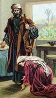 

**2** 	E Eliseu lhe disse: Que te hei de fazer? Dize-me que é o que tens em casa. E ela disse: Tua serva não tem nada em casa, senão uma botija de azeite.

**3** 	Então disse ele: Vai, pede emprestadas, de todos os teus vizinhos, vasilhas vazias, não poucas.

**4** 	Então entra, e fecha a porta sobre ti, e sobre teus filhos, e deita o azeite em todas aquelas vasilhas, e põe à parte a que estiver cheia.

> **Cmt MHenry**: *CAPÍTULO 40N-Mt 41N-Mc 42N-Lc 43N-Joa 44N-At 45N-Rm 46N-1Co 47N-2Co 48N-Gl 49N-Ef

**5** 	Partiu, pois, dele, e fechou a porta sobre si e sobre seus filhos; e eles lhe traziam as vasilhas, e ela as enchia.

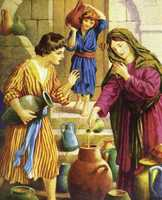 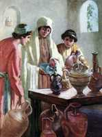 

**6** 	E sucedeu que, cheias que foram as vasilhas, disse a seu filho: Traze-me ainda uma vasilha. Porém ele lhe disse: Não há mais vasilha alguma. Então o azeite parou.

**7** 	Então veio ela, e o fez saber ao homem de Deus; e disse ele: Vai, vende o azeite, e paga a tua dívida; e tu e teus filhos vivei do resto.

**8** 	Sucedeu também um dia que, indo Eliseu a Suném, havia ali uma mulher importante, a qual o reteve para comer pão; e sucedeu que todas as vezes que passava por ali entrava para comer pão.

> **Cmt MHenry**: *Versículos 8-17* O rei de Israel pensava bem de Eliseu por seus últimos serviços; um homem bom pode comprazer-se tanto em servir os outros como em elevar a si mesmo. mas a sunamita não necessitava nenhum bom ofício desta classe. Felicidade é habitar com nossa própria gente, que nos amam e respeitam, e aos que podemos fazer o bem. Bom seria para muitos se tão somente soubessem quanto estão realmente bem. O Senhor vê o desejo secreto que é suprimido por obediência a sua vontade, e Ele ouvirá as orações de seus servos por seus benfeitores, enviando misericórdias não pedidas e inesperadas; tampouco deve supor-se que as profissões dos homens de Deus sejam enganosas, como as dos homens de mundo.

 

**9** 	E ela disse a seu marido: Eis que tenho observado que este que sempre passa por nós é um santo homem de Deus.

**10** 	Façamos-lhe, pois, um pequeno quarto junto ao muro, e ali lhe ponhamos uma cama, uma mesa, uma cadeira e um candeeiro; e há de ser que, vindo ele a nós, para ali se recolherá.

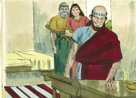 

**11** 	E sucedeu que um dia ele chegou ali, e recolheu-se àquele quarto, e se deitou.

**12** 	Então disse ao seu servo Geazi: Chama esta sunamita. E chamando-a ele, ela se pôs diante dele.

**13** 	Porque ele tinha falado a Geazi: Dize-lhe: Eis que tu nos tens tratado com todo o desvelo; que se há de fazer por ti? Haverá alguma coisa de que se fale por ti ao rei, ou ao capitão do exército? E disse ela: Eu habito no meio do meu povo.

**14** 	Então disse ele: Que se há de fazer por ela? E Geazi disse: Ora ela não tem filho, e seu marido é velho.

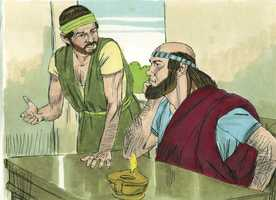 

**15** 	Por isso disse ele: Chama-a. E, chamando-a ele, ela se pôs à porta.

**16** 	E ele disse: A este tempo determinado, segundo o tempo da vida, abraçarás um filho. E disse ela: Não, meu senhor, homem de Deus, não mintas à tua serva.

**17** 	E concebeu a mulher, e deu à luz um filho, no tempo determinado, no ano seguinte, segundo Eliseu lhe dissera.

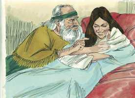 

**18** 	E, crescendo o filho, sucedeu que um dia saiu para ter com seu pai, que estava com os segadores,

> **Cmt MHenry**: *Versículos 18-37* Aqui figura a morte súbita do menino. Toda a ternura de uma mãe não pode manter vivo a um filho da promessa, a um filho de oração, um dado com amor, mas quão admiravelmente guarda seus lábios a mãe piedosa e prudente submetida a esta súbita aflição! Nem uma palavra néscia escapa dela. Ela tinha tal confiança na bondade de Deus que estava prestes a crer que Ele restauraria o que agora tinha tirado. Oh, mulher, grande é tua fé! O que a trouxe não a decepcionará. A mãe triste pediu permissão a seu marido para ir logo ao profeta. Ela não tinha pensado que era suficiente ter a ajuda de Eliseu às vezes em sua própria família, porém, ainda que era mulher comum, assistia ao culto público. Aos homens de Deus lhes faz bem pedir pelo bem-estar de seus amigos e de sua família. A resposta foi: Está bem. Tudo bem e, contudo, o menino estava morto em casa! Sim! Tudo o que Deus faz está bem; tudo está bem com os que se forma, se foram para o céu; e tudo está bem conosco que ficamos para trás, se pela aflição avançamos em nosso caminho para lá. Quando nos é tirado todo consolo nas criaturas, está bem se pudermos dizer, pela graça, que não pusemos nossos corações nelas, porque se o fizemos, temos razão para temer que nos foi dado com ira e tirado com ira. Eliseu clamou com fé a Deus, e o filho amado foi restaurado vivo a sua mãe. Os que dão vida espiritual às almas mortas devem sentir profundamente o caso delas e devem labutar fervorosamente em oração por elas. Embora o ministro não possa dar vida divina a seus congêneres pecadores, deve usar todos os médios com tanto zelo como se pudesse fazê-lo.

**19** 	E disse a seu pai: Ai, a minha cabeça! Ai, a minha cabeça! Então disse a um moço: Leva-o à sua mãe.

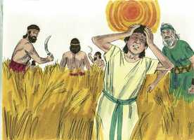 

**20** 	E ele o tomou, e o levou à sua mãe; e esteve sobre os seus joelhos até ao meio-dia, e morreu.

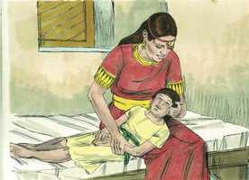 

**21** 	E subiu ela, e o deitou sobre a cama do homem de Deus; e fechou a porta, e saiu.

**22** 	E chamou a seu marido, e disse: Manda-me já um dos moços, e uma das jumentas, para que eu corra ao homem de Deus, e volte.

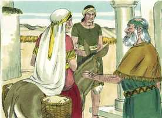 

**23** 	E disse ele: Por que vais a ele hoje? Não é lua nova nem sábado. E ela disse: Tudo vai bem.

**24** 	Então albardou a jumenta, e disse ao seu servo: Guia e anda, e não te detenhas no caminhar, senão quando eu to disser.

**25** 	Partiu ela, pois, e foi ao homem de Deus, ao monte Carmelo; e sucedeu que, vendo-a o homem de Deus de longe, disse a Geazi, seu servo: Eis aí a sunamita.

**26** 	Agora, pois, corre-lhe ao encontro e dize-lhe: Vai bem contigo? Vai bem com teu marido? Vai bem com teu filho? E ela disse: Vai bem.

**27** 	Chegando ela, pois, ao homem de Deus, ao monte, pegou nos seus pés; mas chegou Geazi para retirá-la; disse porém o homem de Deus: Deixa-a, porque a sua alma está triste de amargura, e o Senhor me encobriu, e não me manifestou.

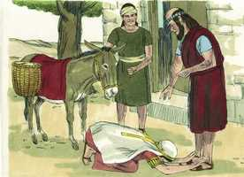 

**28** 	E disse ela: Pedi eu a meu senhor algum filho? Não disse eu: Não me enganes?

**29** 	E ele disse a Geazi: Cinge os teus lombos, toma o meu bordão na tua mão, e vai; se encontrares alguém não o saúdes, e se alguém te saudar, não lhe respondas; e põe o meu bordão sobre o rosto do menino.

**30** 	Porém disse a mãe do menino: Vive o Senhor, e vive a tua alma, que não te hei de deixar. Então ele se levantou, e a seguiu.

**31** 	E Geazi passou adiante deles, e pôs o bordão sobre o rosto do menino; porém não havia nele voz nem sentido; e voltou a encontrar-se com ele, e lhe trouxe aviso, dizendo: O menino não despertou.

**32** 	E, chegando Eliseu àquela casa, eis que o menino jazia morto sobre a sua cama.

**33** 	Então entrou ele, e fechou a porta sobre eles ambos, e orou ao Senhor.

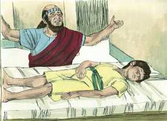 

**34** 	E subiu à cama e deitou-se sobre o menino, e, pondo a sua boca sobre a boca dele, e os seus olhos sobre os olhos dele, e as suas mãos sobre as mãos dele, se estendeu sobre ele; e a carne do menino aqueceu.

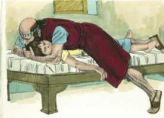 

**35** 	Depois desceu, e andou naquela casa de uma parte para a outra, e tornou a subir, e se estendeu sobre ele, então o menino espirrou sete vezes, e abriu os olhos.

**36** 	Então chamou a Geazi, e disse: Chama esta sunamita. E chamou-a, e veio a ele. E disse ele: Toma o teu filho.

**37** 	E entrou ela, e se prostrou a seus pés, e se inclinou à terra; e tomou o seu filho e saiu.

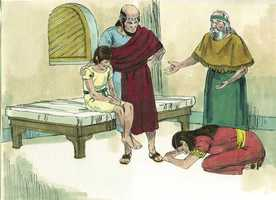 

**38** 	E, voltando Eliseu a Gilgal, havia fome naquela terra, e os filhos dos profetas estavam assentados na sua presença; e disse ao seu servo: Põe a panela grande ao lume, e faze um caldo de ervas para os filhos dos profetas.

> **Cmt MHenry**: *Versículos 38-44* Houve fome de pão, mas não de ouvir a palavra de Deus. porque Eliseu fez que os filhos dos profetas se assentassem diante dele para ouvir sua sabedoria. Eliseu fez que a comida má se tornasse boa e sadia. Se um pouco de guisado é toda nossa comida, lembrem-se que este grande profeta não teve melhor para si mesmo e seus convidados. A mesa costuma tornar-se em laço e o que deveria ser para nosso bem-estar resulta ser uma armadilha: esta é uma boa razão pela qual não devemos alimentar-nos sem temor. Quando recebemos o sustento e as consolações da vida, devemos manter a expectativa da morte e o temor do pecado. devemos reconhecer a bondade de Deus ao fazer sadio e alimentício nosso alimento: Eu sou o Senhor que sara. Eliseu também fez que um pouco de comida fosse muito. Tendo recebido de graça, deu de graça. Deus tem prometido a sua igreja que abençoará abundantemente a provisão dela e satisfará com pão a seus pobres ([Sl 132.15](../19A-Sl/132.md#15)); Ele enche aos que alimenta, e o que abençoa se torna em muito. A alimentação que fez Cristo dos que o escutavam foi um milagre muito maior que este, mas ambos nos ensinam que os que esperam em Deus na senda do dever, podem esperar que a Providência Divina os proveja.

**39** 	Então um deles saiu ao campo a apanhar ervas, e achou uma parra brava, e colheu dela enchendo a sua capa de colocíntidas; e veio, e as cortou na panela do caldo; porque não as conheciam.

**40** 	Assim deram de comer para os homens. E sucedeu que, comendo eles daquele caldo, clamaram e disseram: Homem de Deus, há morte na panela. Não puderam comer.

**41** 	Porém ele disse: Trazei farinha. E deitou-a na panela, e disse: Dai de comer ao povo. E já não havia mal nenhum na panela.

**42** 	E um homem veio de Baal-Salisa, e trouxe ao homem de Deus pães das primícias, vinte pães de cevada, e espigas verdes na sua palha, e disse: Dá ao povo, para que coma.

**43** 	Porém seu servo disse: Como hei de pôr isto diante de cem homens? E disse ele: Dá ao povo, para que coma; porque assim diz o Senhor: Comerão, e sobejará.

**44** 	Então lhos pôs diante, e comeram e ainda sobrou, conforme a palavra do Senhor.

> **Cmt MHenry** Intro: *• Versículos 1-7*> *Eliseu multiplica o azeite da viúva*> *• Versículos 8-17*> *A sunamita tem um filho*> *• Versículos 18-37*> *O filho da sunamita é ressuscitado*> *• Versículos 38-44*> *O milagre de sarar o guisado e de alimentar os filhos dos*