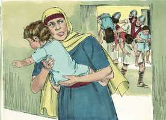
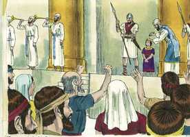
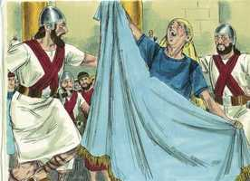
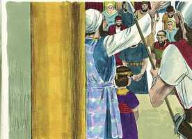
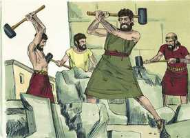

# 2 Reis Cap 11

**1** 	VENDO, pois, Atalia, mãe de Acazias, que seu filho era morto, levantou-se, e destruiu toda a descendência real.

> **Cmt MHenry**: *Versículos 1-12* Atalia destruiu tudo o que ela sabia estava relacionado com a coroa por parentesco. Joás, um dos filhos do rei, foi escondido. Agora a promessa feita a Davi estava amarrada a uma vida somente e, apesar disso, não falhou. Assim, o Filho de Davi, o Senhor, conforme a sua promessa, assegura a semente espiritual, às vezes oculta e invisível, porém ilesa no pavilhão de Deus. Atalia foi tirana durante seis anos. Então foi trazido o rei. Sem dúvida uma criança, mas tinha um bom tutor e, o que era melhor, um bom Deus ao qual recorrer. Com tal gozo e satisfação devem dar-se as boas-vindas ao Reino de Cristo em nosso coração, quando seu trono se instala, e é expulso Satanás, o usurpador. Digam: Que o Rei Jesus viva por sempre, viva e reine em minha alma e em todo o mundo.

**2** 	Mas Jeoseba, filha do rei Jorão, irmã de Acazias, tomou a Joás, filho de Acazias, furtando-o dentre os filhos do rei, aos quais matavam, e o pôs, a ele e à sua ama na recâmara, e o escondeu de Atalia, e assim não o mataram.

 

**3** 	E esteve com ela escondido na casa do Senhor seis anos; e Atalia reinava sobre o país.

**4** 	E no sétimo ano enviou Joiada, e tomou os centuriões, com os capitães, e com os da guarda, e os colocou consigo na casa do Senhor; e fez com eles uma aliança e ajuramentou-os na casa do Senhor; e mostrou-lhes o filho do rei.

**5** 	E deu-lhes ordem, dizendo: Isto é o que haveis de fazer: Uma terça parte de vós, que entrais no sábado, fará a guarda da casa do rei.

**6** 	E outra terça parte estará à porta de Sur; e a outra terça parte à porta detrás dos da guarda; assim fareis a guarda desta casa, afastando a todos.

**7** 	E as duas partes de vós, a saber, todos os que saem no sábado, farão a guarda da casa do Senhor junto ao rei.

**8** 	E rodeareis o rei, cada um com as suas armas na mão, e aquele que entrar entre as fileiras o matarão; e vós estareis com o rei quando sair e quando entrar.

**9** 	Fizeram, pois, os centuriões conforme tudo quanto ordenara o sacerdote Joiada, tomando cada um os seus homens, tanto os que entravam no sábado como os que saíam no sábado; e foram ao sacerdote Joiada.

**10** 	E o sacerdote deu aos centuriões as lanças e os escudos que haviam sido do rei Davi, que estavam na casa do Senhor.

**11** 	E os da guarda se puseram, cada um com as armas na mão, desde o lado direito da casa até ao lado esquerdo da casa, do lado do altar, e do lado da casa, em redor do rei.

> **Cmt MHenry**: *CAPÍTULO 11A-1Rs

**12** 	Então Joiada fez sair o filho do rei, e lhe pôs a coroa, e lhe deu o testemunho; e o fizeram rei, e o ungiram, e bateram as palmas, e disseram: Viva o rei!

 

**13** 	E Atalia, ouvindo a voz dos da guarda e do povo, foi ter com o povo, na casa do Senhor.

> **Cmt MHenry**: *Versículos 13-16* Atalia acelerou sua própria destruição. Ela mesma foi a maior traidora e, contudo, foi a primeira em clamar a grande voz: Traição, traição! Os mais culpáveis são correntemente os mais dispostos a repreender os outros.

**14** 	E olhou, e eis que o rei estava junto à coluna, conforme o costume, e os príncipes e os trombeteiros junto ao rei, e todo o povo da terra estava alegre e tocava as trombetas; então Atalia rasgou as suas vestes, e clamou: Traição! Traição!

 

**15** 	Porém o sacerdote Joiada deu ordem aos centuriões que comandavam as tropas, dizendo-lhes: Tirai-a para fora das fileiras, e a quem a seguir matai-o à espada. Porque o sacerdote disse: Não a matem na casa do Senhor.

**16** 	E lançaram mão dela; e ela foi, pelo caminho da entrada dos cavalos, à casa do rei, e ali a mataram.

**17** 	E Joiada fez uma aliança entre o Senhor e o rei e o povo, para que fosse o povo do Senhor; como também entre o rei e o povo.

> **Cmt MHenry**: *Versículos 17-21* O rei e o povo deveriam unir-se muito firmemente um ao outro quando ambos se tenham unido ao Senhor. Bom é para um povo quando as mudanças que passam por eles lhes sirvam para reviver, fortalecer-se e promover os interesses da fé entre eles. As alianças servem para lembrar-nos e amarrar-nos aos deveres já vigentes para nós. eles aboliram de imediato a idolatria e, conforme a aliança, expressaram sua mútua prontidão para ajudar uns aos outros. o povo se regozijou e Jerusalém teve paz. O método para que o povo tenha gozo e paz é que se dedique plenamente ao serviço de Deus; porque a voz do gozo e ação de graças está nas habitações do justo, mas não há paz para o ímpio.

 

**18** 	Então todo o povo da terra entrou na casa de Baal, e a derrubaram, como também os seus altares, e as suas imagens, totalmente quebraram, e a Matã, sacerdote de Baal, mataram diante dos altares; então o sacerdote pôs oficiais sobre a casa do Senhor.

 

**19** 	E tomou os centuriões, e os capitães, e os da guarda, e todo o povo da terra; e conduziram da casa do Senhor, o rei, e foram, pelo caminho da porta dos da guarda, à casa do rei, e ele se assentou no trono dos reis.

**20** 	E todo o povo da terra se alegrou, e a cidade repousou, depois que mataram a Atalia, à espada, junto à casa do rei,

**21** 	Era Joás da idade de sete anos quando o fizeram rei.

> **Cmt MHenry** Intro: *• Versículos 1-12*> *Atalia usurpa o governo de Judá – Joás é feito rei*> *• Versículos 13-16*> *Morte de Atalia*> *• Versículos 17-21*> *Restauração do culto de Jeová*