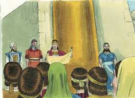
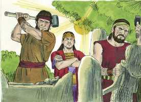
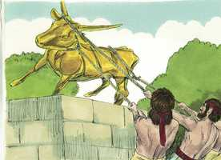

# 2 Reis Cap 23

**1** 	ENTÃO o rei ordenou, e todos os anciãos de Judá e de Jerusalém se reuniram a ele.

> **Cmt MHenry**: *Versículos 1-3* Josias recebeu uma mensagem de Deus, que não impediria a ruína de Jerusalém, mas que somente livraria sua própria alma; de todos modos, cumpre com seu dever e deixa o assunto a Deus. Ele comprometeu o povo da forma mais solene para abolir a idolatria e servir a Deus com justiça e santidade verdadeira. Embora a maioria foi formal ou hipócrita dali em diante, se evitou muita maldade externa e ficaram responsáveis diante de Deus pela sua conduta.

**2** 	O rei subiu à casa do Senhor, e com ele todos os homens de Judá, e todos os moradores de Jerusalém, os sacerdotes, os profetas e todo o povo, desde o menor até ao maior; e leu aos ouvidos deles todas as palavras do livro da aliança, que se achou na casa do Senhor.

**3** 	E o rei se pôs em pé junto à coluna, e fez a aliança perante o Senhor, para seguirem o Senhor, e guardarem os seus mandamentos, os seus testemunhos e os seus estatutos, com todo o coração e com toda a alma, confirmando as palavras desta aliança, que estavam escritas naquele livro; e todo o povo apoiou esta aliança.

 

**4** 	E o rei mandou ao sumo sacerdote Hilquias, aos sacerdotes da segunda ordem, e aos guardas do umbral da porta, que tirassem do templo do Senhor todos os vasos que se tinham feito para Baal, para o bosque e para todo o exército dos céus e os queimou fora de Jerusalém, nos campos de Cedrom e levou as cinzas deles a Betel.

> **Cmt MHenry**: *Versículos 4-14* Quanta abundância de maldade em Judá e Jerusalém! Ninguém acreditaria possível achar tais abominações em Judá, onde Deus era conhecido, em Israel onde seu Nome era grande, em Salém, em Sião, onde estava sua morada. Josias tinha reinado por dezoito anos, tinha dado um bem exemplo ao povo, e tinha guardado a religião conforme com a lei divina, porém quando se pôs a investigar a idolatria, sua profundeza e extensão eram muito grandes. A história comum e os registros da Palavra de Deus ensinam que toda a piedade ou bondade verdadeira que se achem na terra derivam do Espírito de Jesus Cristo, que faz novas todas as coisas.

 

**5** 	Também destituiu os sacerdotes que os reis de Judá estabeleceram para incensarem sobre os altos nas cidades de Judá e ao redor de Jerusalém, como também os que queimavam incenso a Baal, ao sol, à lua, e aos planetas, e a todo o exército dos céus.

**6** 	Também tirou da casa do Senhor o ídolo do bosque levando-o para fora de Jerusalém até ao ribeiro de Cedrom, e o queimou junto ao ribeiro de Cedrom, e o desfez em pó, e lançou o seu pó sobre as sepulturas dos filhos do povo.

**7** 	Também derrubou as casas dos sodomitas que estavam na casa do Senhor, em que as mulheres teciam casinhas para o ídolo do bosque.

 

**8** 	E a todos os sacerdotes trouxe das cidades de Judá, e profanou os altos em que os sacerdotes queimavam incenso, desde Geba até Berseba; e derrubou os altos que estavam às portas, junto à entrada da porta de Josué, o governador da cidade, que estava à esquerda daquele que entrava pela porta da cidade.

**9** 	Mas os sacerdotes dos altos não sacrificavam sobre o altar do Senhor em Jerusalém; porém comiam pães ázimos no meio de seus irmãos.

**10** 	Também profanou a Tofete, que está no vale dos filhos de Hinom, para que ninguém fizesse passar a seu filho, ou sua filha, pelo fogo a Moloque.

**11** 	Também tirou os cavalos que os reis de Judá tinham dedicado ao sol, à entrada da casa do Senhor, perto da câmara de Natã-Meleque, o camareiro, que estava no recinto; e os carros do sol queimou a fogo.

**12** 	Também o rei derrubou os altares que estavam sobre o terraço do cenáculo de Acaz, os quais os reis de Judá tinham feito, como também o rei derrubou os altares que fizera Manassés nos dois átrios da casa do Senhor; e esmiuçados os tirou dali e lançou o pó deles no ribeiro de Cedrom.

**13** 	O rei profanou também os altos que estavam defronte de Jerusalém, à mão direita do monte de Masite, os quais edificara Salomão, rei de Israel, a Astarote, a abominação dos sidônios, e a Quemós, a abominação dos moabitas, e a Milcom, a abominação dos filhos de Amom.

**14** 	Semelhantemente quebrou as estátuas, cortou os bosques e encheu o seu lugar com ossos de homens.

**15** 	E também o altar que estava em Betel, e o alto que fez Jeroboão, filho de Nebate, com que tinha feito Israel pecar, esse altar derrubou juntamente com o alto; queimando o alto, em pó o esmiuçou, e queimou o ídolo do bosque.

> **Cmt MHenry**: *Versículos 15-24* O zelo de Josias se estendeu às cidades de Israel que estavam a seu alcance. Ele conservou cuidadosamente o sepulcro do homem de Deus que veio desde Judá para anunciar o derrubamento do altar de Jeroboão. Quando tiveram limpado o país do antigo fermento da idolatria, então se aplicaram a observar a festa. Em nenhum dos reinados anteriores tinha-se guardado uma Páscoa assim. O despertar de uma ordenança longo tempo descuidada os encheu de santo gozo; e Deus recompensou seu zelo pela destruição deus idolatria com mostras extraordinárias de Sua presença e favor. Temos razão para pensar que a religião floresceu durante o resto do reino de Josias.

 

**16** 	E, virando-se Josias, viu as sepulturas que estavam ali no monte; e mandou tirar os ossos das sepulturas, e os queimou sobre aquele altar, e assim o profanou, conforme a palavra do Senhor, que profetizara o homem de Deus, quando anunciou estas palavras.

**17** 	Então disse: Que é este monumento que vejo? E os homens da cidade lhe disseram: É a sepultura do homem de Deus que veio de Judá, e anunciou estas coisas que fizeste contra este altar de Betel.

**18** 	E disse: Deixai-o estar; ninguém mexa nos seus ossos. Assim deixaram estar os seus ossos com os ossos do profeta que viera de Samaria.

**19** 	Demais disto também Josias tirou todas as casas dos altos que havia nas cidades de Samaria, e que os reis de Israel tinham feito para provocarem à ira o Senhor; e lhes fez conforme todos os atos que tinha feito em Betel.

**20** 	E sacrificou todos os sacerdotes dos altos, que havia ali, sobre os altares, e queimou ossos humanos sobre eles; depois voltou a Jerusalém.

**21** 	O rei deu ordem a todo o povo, dizendo: Celebrai a páscoa ao Senhor vosso Deus, como está escrito no livro da aliança.

 

**22** 	Porque nunca se celebrou tal páscoa como esta desde os dias dos juízes que julgaram a Israel, nem em todos os dias dos reis de Israel, nem tampouco dos reis de Judá.

**23** 	Porém no ano décimo oitavo do rei Josias esta páscoa se celebrou ao Senhor em Jerusalém.

> **Cmt MHenry**: *CAPÍTULO 23A-Is

**24** 	E também os adivinhos, os feiticeiros, os terafins, os ídolos, e todas as abominações que se viam na terra de Judá e em Jerusalém, os extirpou Josias, para confirmar as palavras da lei, que estavam escritas no livro que o sacerdote Hilquias achara na casa do Senhor.

 

**25** 	E antes dele não houve rei semelhante, que se convertesse ao Senhor com todo o seu coração, com toda a sua alma e com todas as suas forças, conforme toda a lei de Moisés; e depois dele nunca se levantou outro tal.

> **Cmt MHenry**: *Versículos 25-30* Ao lermos estes versículos devemos dizer, Senhor, que assim como Tua justiça é como as grandes montanhas, evidente, fácil de ser vista e indiscutível, Teus juízos são de grande profundidade, insondáveis e inescrutáveis. O rei reformador é cortado em meio de sua vida útil, com misericórdia para que não visse o mal que viria a seu reino: todavia com ira contra seu povo, porque sua morte foi a entrada da desolação deles.

 

**26** 	Todavia o Senhor não se demoveu do ardor da sua grande ira, com que ardia contra Judá, por todas as provocações com que Manassés o tinha provocado.

**27** 	E disse o Senhor: Também a Judá hei de tirar de diante da minha face, como tirei a Israel, e rejeitarei esta cidade de Jerusalém que escolhi, como também a casa de que disse: Estará ali o meu nome.

**28** 	Ora, o mais dos atos de Josias e tudo quanto fez, porventura não está escrito no livro das crônicas dos reis de Judá?

**29** 	Nos seus dias subiu Faraó Neco, rei do Egito, contra o rei da Assíria, ao rio Eufrates; e o rei Josias lhe foi ao encontro; e, vendo-o ele, o matou em Megido.

**30** 	E seus servos, num carro, o levaram morto, de Megido, e o trouxeram a Jerusalém, e o sepultaram na sua sepultura; e o povo da terra tomou a Jeoacaz, filho de Josias, e ungiram-no, e fizeram-no rei em lugar de seu pai.

**31** 	Tinha Jeoacaz vinte e três anos de idade quando começou a reinar, e três meses reinou em Jerusalém; e era o nome de sua mãe Hamutal, filha de Jeremias, de Libna.

> **Cmt MHenry**: *Versículos 31-37* Depois de pôr a Josias em seu túmulo, veio um problema após outro até Jerusalém foi destruída em vinte e dois anos. Os malvados pereceram em grandes quantidades, o remanescente foi purificado, e a reforma de Josias levantou uns quantos que se uniram aos poucos que foram a semente preciosa do futuro da igreja e da nação. Um pouco de tempo e fracas habilidades costumam bastar para desfazer o bem que homens piedosos têm efetuado no curso dos anos. todavia, bendito seja Deus que a boa obra que Ele começou por seu Espírito regenerador não poderá ser eliminada, antes resiste a todas as mudanças e tentações.

**32** 	E fez o que era mau aos olhos do Senhor, conforme tudo o que fizeram seus pais.

**33** 	Porém Faraó Neco o mandou prender em Ribla, em terra de Hamate, para que não reinasse em Jerusalém; e à terra impôs pena de cem talentos de prata e um talento de ouro.

**34** 	Também Faraó Neco constituiu rei a Eliaquim, filho de Josias, em lugar de seu pai Josias, e lhe mudou o nome para Jeoiaquim; porém a Jeoacaz tomou consigo, e foi ao Egito, e morreu ali.

**35** 	E Jeoiaquim deu aquela prata e aquele ouro a Faraó; porém tributou a terra, para dar esse dinheiro conforme o mandado de Faraó; a cada um segundo a sua avaliação exigiu a prata e o ouro do povo da terra, para o dar a Faraó Neco.

**36** 	Tinha Jeoiaquim vinte e cinco anos de idade quando começou a reinar, e reinou onze anos em Jerusalém; e era o nome de sua mãe Zebida, filha de Pedaías, de Ruma.

**37** 	E fez o que era mau aos olhos do Senhor, conforme tudo quanto fizeram seus pais.

> **Cmt MHenry** Intro: *• Versículos 1-3*> *Josias lê a lei e renova a aliança*> *• Versículos 4-14*> *Destrói a idolatria*> *• Versículos 15-24*> *A reforma se estende a Israel – Observância da Páscoa*> *• Versículos 25-30*> *O faraó Neco mata a Josias*> *• Versículos 31-37*> *Reinados malvados de Joacaz e Jeoiaquim*