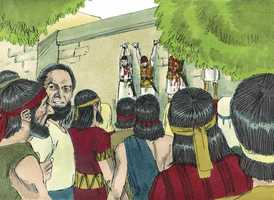

# 1 Crônicas Cap 10

**1** 	E OS filisteus pelejaram com Israel; e os homens de Israel fugiram de diante dos filisteus, e caíram mortos nas montanhas de Gilboa.

**2** 	E os filisteus perseguiram a Saul e aos seus filhos e mataram a Jônatas, a Abinadabe e a Malquisua, filhos de Saul.

**3** 	E a peleja se agravou contra Saul, e os flecheiros o alcançaram; e temeu muito aos flecheiros.

**4** 	Então disse Saul ao seu escudeiro: Arranca a tua espada, e atravessa-me com ela; para que porventura não venham estes incircuncisos e escarneçam de mim. Porém o seu escudeiro não quis, porque temia muito; então tomou Saul a espada, e se lançou sobre ela.

 

**5** 	Vendo, pois, o seu escudeiro que Saul estava morto, também ele se lançou sobre a espada e morreu.

**6** 	Assim morreram Saul e seus três filhos; e toda a sua casa morreu juntamente.

**7** 	E, vendo todos os homens de Israel, que estavam no vale, que haviam fugido, e que Saul e seus filhos eram mortos, deixaram as suas cidades, e fugiram; então vieram os filisteus, e habitaram nelas.

**8** 	E sucedeu que, no dia seguinte, vindo os filisteus a despojar os mortos, acharam a Saul e a seus filhos estirados nas montanhas de Gilboa.

**9** 	E o despojaram, e tomaram a sua cabeça e as suas armas, e as enviaram pela terra dos filisteus em redor, para o anunciarem a seus ídolos e ao povo.

**10** 	E puseram as suas armas na casa do seu deus, e a sua cabeça afixaram na casa de Dagom.

> **Cmt MHenry**: *CAPÍTULO 10A-2Sm

 

**11** 	Ouvindo, pois, toda a Jabes de Gileade tudo quanto os filisteus fizeram a Saul,

**12** 	Então todos os homens valorosos se levantaram, e tomaram o corpo de Saul, e os corpos de seus filhos, e os trouxeram a Jabes; e sepultaram os seus ossos debaixo de um carvalho em Jabes, e jejuaram sete dias.

 

**13** 	Assim morreu Saul por causa da transgressão que cometeu contra o Senhor, por causa da palavra do Senhor, a qual não havia guardado; e também porque buscou a adivinhadora para a consultar.

**14** 	E não buscou ao Senhor, que por isso o matou, e transferiu o reino a Davi, filho de Jessé.

> **Cmt MHenry** Intro: *A morte de Saul* O desígnio principalmente em vista nos livros das Crônicas parece ser o de preservar os registros da casa de Davi. Portanto, o escrito não repete a história do reino de Saul, senão somente a de sua morte, a qual abriu para Davi o caminho ao trono. E da ruína de Saul podemos aprender:\ 1) Que o pecado dos pecadores certamente os alcançará, cedo ou tarde; Saul morreu por sua transgressão.\ 1) Que a grandeza de homem nenhum pode excetuá-lo dos juízos de Deus.\ 3) Que a desobediência é homicida. Saul morreu por não guardar a palavra do Senhor.\ que sejamos liberados da incredulidade, impaciência e desesperação. Esperando no Senhor obteremos um reino incomovível.