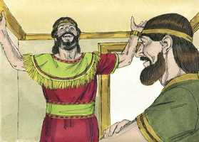

# 1 Crônicas Cap 17

**1** 	SUCEDEU, pois, que, morando Davi já em sua casa, disse ao profeta Natã: Eis que moro em casa de cedro, mas a arca da aliança do Senhor está debaixo de cortinas.

**2** 	Então Natã disse a Davi: Tudo quanto tens no teu coração faze, porque Deus é contigo.

**3** 	Mas sucedeu, na mesma noite, que a palavra de Deus veio a Natã, dizendo:

**4** 	Vai, e dize a Davi meu servo: Assim diz o Senhor: Tu não me edificarás uma casa para eu morar;

 

**5** 	Porque em casa nenhuma morei, desde o dia em que fiz subir a Israel até ao dia de hoje; mas fui de tenda em tenda, e de tabernáculo em tabernáculo.

**6** 	Por todas as partes por onde andei com todo o Israel, porventura falei alguma palavra a algum dos juízes de Israel, a quem ordenei que apascentasse o meu povo, dizendo: Por que não me edificais uma casa de cedro?

**7** 	Agora, pois, assim dirás a meu servo Davi: Assim diz o Senhor dos Exércitos: Eu te tirei do curral, de detrás das ovelhas, para que fosses chefe do meu povo Israel.

**8** 	E estive contigo por toda a parte, por onde foste, e de diante de ti exterminei todos os teus inimigos, e te fiz um nome como o nome dos grandes que estão na terra,

**9** 	E ordenarei um lugar para o meu povo Israel, e o plantarei, para que habite no seu lugar, e nunca mais seja removido de uma para outra parte; e nunca mais os filhos da perversidade o debilitarão como dantes,

**10** 	E desde os dias em que ordenei juízes sobre o meu povo Israel. Assim abaterei a todos os teus inimigos; também te faço saber que o Senhor te edificará uma casa.

**11** 	E há de ser que, quando forem cumpridos os teus dias, para ires a teus pais, suscitarei a tua descendência depois de ti, um dos teus filhos, e estabelecerei o seu reino.

**12** 	Este me edificará casa; e eu confirmarei o seu trono para sempre.

**13** 	Eu lhe serei por pai, e ele me será por filho; e a minha benignidade não retirarei dele, como a tirei daquele, que foi antes de ti.

**14** 	Mas o confirmarei na minha casa e no meu reino para sempre, e o seu trono será firme para sempre.

**15** 	Conforme todas estas palavras, e conforme toda esta visão, assim falou Natã a Davi.

**16** 	Então entrou o rei Davi, e ficou perante o Senhor; e disse: Quem sou eu, Senhor Deus? e qual é a minha casa, para que me tenhas trazido até aqui?

 

**17** 	E ainda isto, ó Deus, foi pouco aos teus olhos; pelo que falaste da casa de teu servo para tempos distantes; e trataste-me como a um homem ilustre, ó Senhor Deus.

> **Cmt MHenry**: *CAPÍTULO 17A-Et

**18** 	Que mais te dirá Davi, acerca da honra feita a teu servo? Porém tu conheces bem a teu servo.

**19** 	Ó Senhor, por amor de teu servo, e segundo o teu coração, fizeste toda esta grandeza, para fazer notória todas estas grandes coisas.

**20** 	Senhor, ninguém há como tu, e não há Deus fora de ti, segundo tudo quanto ouvimos com os nossos ouvidos.

**21** 	E quem há como o teu povo Israel, única gente na terra, a quem Deus foi resgatar para seu povo, fazendo-te nome com coisas grandes e temerosas, lançando as nações de diante do teu povo, que resgataste do Egito?

**22** 	E confirmaste o teu povo Israel para ser teu povo para sempre; e tu, Senhor, lhe foste por Deus.

**23** 	Agora, pois, Senhor, a palavra que falaste de teu servo, e acerca da sua casa, confirma-a para sempre; e faze como falaste.

**24** 	Confirme-se e engrandeça-se o teu nome para sempre, e diga-se: O Senhor dos Exércitos é o Deus de Israel, é Deus para Israel; e permaneça firme diante de ti a casa de Davi, teu servo.

**25** 	Porque tu, Deus meu, revelaste ao ouvido de teu servo que lhe edificarias casa; pelo que o teu servo achou confiança para orar em tua presença.

**26** 	Agora, pois, Senhor, tu és o mesmo Deus, e falaste este bem acerca de teu servo.

**27** 	Agora, pois, foste servido abençoar a casa de teu servo, para que permaneça para sempre diante de ti: porque tu, Senhor, a abençoaste, e ficará abençoada para sempre.

> **Cmt MHenry** Intro: 28A-Os propósitos de Davi; as bondosas promessas de Deus* Este capítulo é o mesmo que [2 Samuel 7](../10A-2Sm/07.md#0). Veja-se o que se diz ali do tema. É muito claro que o que se diz em Samuel como "Por causa da tua palavra" (versículo 21), aqui é "por amor de teu servo" (versículo 19). Jesus Cristo é a Palavra de Deus ([Ap 19.13](../66N-Ap/19.md#13)), e o Servo de Deus ([Is 42.1](../23A-Is/42.md#1)); e é por amor a Ele, por sua mediação, que se cumprem as promessas a todos os crentes; é nEle que são "sim" e "amém". Por amor a Ele se fazem, por amor a Ele se dão a conhecer; a Ele devemos toda esta grandeza, dEle temos que esperar todas as coisas grandiosas. Elas são as inescrutáveis riquezas de Cristo que, se pela fé as vemos em si mesmas e no Senhor Jesus, não podemos menos que magnificá-lo como a única grandeza verdadeira e falar honrosamente delas. Porque esta bênção é a que podemos esperar em meio das tribulações da vida, e quando sintamos sobre nós a mão da morte; e a procuremos para nossos filhos, depois de nós. "