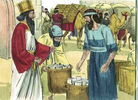

# Esdras Cap 01

**1** 	NO primeiro ano de Ciro, rei da Pérsia (para que se cumprisse a palavra do Senhor, pela boca de Jeremias), despertou o Senhor o espírito de Ciro, rei da Pérsia, o qual fez passar pregão por todo o seu reino, como também por escrito, dizendo:

> **Cmt MHenry**: *Versículos 1-4* O Senhor despertou o espírito de Ciro. Os corações dos reis estão na mão do Senhor. Deus governa o mundo por sua influência nos espíritos dos homens; qualquer seja o bem que façam, Deus estimula seus espíritos a fazê-lo. Durante o cativeiro dos judeus, Deus os empregou principalmente como meio para chamar a atenção dos pagãos sobre Ele. Ciro deu por sentado que entre os judeus capazes havia os que fariam ofertas de livre vontade para a casa de Deus. Ele também faria que os abastecessem desde seu reino. Os que *desejam bem* para o Templo, devem ser *os benfeitores* do Templo.

> **Cmt MHenry**: *CAPÍTULO 10A-2Sm 11A-1Rs 12A-2Rs 13A-1Cr 14A-2Cr 15A-Es 16A-Ne 17A-Et 18A-Jo 19A-Sl

**2** 	Assim diz Ciro, rei da Pérsia: O Senhor Deus dos céus me deu todos os reinos da terra, e me encarregou de lhe edificar uma casa em Jerusalém, que está em Judá.

 

**3** 	Quem há entre vós, de todo o seu povo, seja seu Deus com ele, e suba a Jerusalém, que está em Judá, e edifique a casa do Senhor Deus de Israel (ele é o Deus) que está em Jerusalém.

**4** 	E todo aquele que ficar atrás em algum lugar em que andar peregrinando, os homens do seu lugar o ajudarão com prata, com ouro, com bens, e com gados, além das dádivas voluntárias para a casa de Deus, que está em Jerusalém.

**5** 	Então se levantaram os chefes dos pais de Judá e Benjamim, e os sacerdotes e os levitas, com todos aqueles cujo espírito Deus despertou, para subirem a edificar a casa do Senhor, que está em Jerusalém.

> **Cmt MHenry**: *Versículos 5-11* O mesmo Deus que despertou o espírito de Ciro para proclamar a liberdade dos judeus, despertou seus espíritos para aceitar o benefício. A tentação de alguns foi ficar na Babilônia, mas outros temiam não retornar e foram seus espíritos os que Deus levantou, por seu Espírito e graça. Qualquer seja o bem que façamos, deve-se à graça de Deus. nosso espírito por natureza se inclina para esta terra e suas coisas; quando se move para o alto, em qualquer bom afeto ou boa ação, é Deus que os levanta. As chamadas e ofertas do evangelho são como a proclama de Ciro. Os que estão amarrados pelo poder do pecado podem ser libertos por Jesus Cristo. Quem desejar, arrependido e pela fé, tornar a Deus, Jesus Cristo lhe abre o caminho e o eleva da escravidão do pecado à gloriosa liberdade dos filhos de Deus. Muitos dos que ouvem este alegre som optam por ficar quietos na Babilônia; apaixonados por seus pecados não se aventuram a uma vida santa; porém alguns irrompem por entre todos os desalentos, qualquer seja o custo; esses são os espíritos que Deus tem levantado por acima do mundo e da carne, aos que Ele deu uma boa disposição. Assim se encherá a Canaã celestial, mesmo que muitos pereçam na Babilônia; e a oferta do evangelho não terá sido em vão. Trazer de volta os judeus do cativeiro representa a redenção dos pecadores feita por Jesus Cristo.

**6** 	E todos os que habitavam nos arredores lhes firmaram as mãos com vasos de prata, com ouro, com bens e com gado, e com coisas preciosas; além de tudo o que voluntariamente se deu.

**7** 	Também o rei Ciro tirou os utensílios da casa do Senhor, que Nabucodonosor tinha trazido de Jerusalém, e que tinha posto na casa de seus deuses.

**8** 	Estes tirou Ciro, rei da Pérsia, pela mão de Mitredate, o tesoureiro, que os entregou contados a Sesbazar, príncipe de Judá.

**9** 	E este é o número deles: trinta travessas de ouro, mil travessas de prata, vinte e nove facas,

**10** 	Trinta bacias de ouro, mais outras quatrocentas e dez bacias de prata, e mil outros utensílios.

**11** 	Todos os utensílios de ouro e de prata foram cinco mil e quatrocentos; todos estes levou Sesbazar, quando os do cativeiro subiram de Babilônia para Jerusalém.

> **Cmt MHenry** Intro: *• Versículos 1-4*> *Proclama de Ciro para reconstruir o Templo*> *• Versículos 5-11*> *O povo provê para seu retorno*