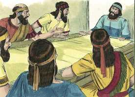

# Esdras Cap 09

**1** 	ACABADAS, pois, estas coisas, chegaram-se a mim os príncipes, dizendo: O povo de Israel, os sacerdotes e os levitas, não se têm separado dos povos destas terras, seguindo as abominações dos cananeus, dos heteus, dos perizeus, dos jebuseus, dos amonitas, dos moabitas, dos egípcios, e dos amorreus.

> **Cmt MHenry**: *Versículos 1-4* Muitas corrupções escapam da vista dos reis mais cuidadosos. Algumas pessoas desobedeceram a ordem expressa de Deus, que proibia todo matrimônio com pagãos ([Dt 7](../05A-Dt/07.md#0)). A incredulidade na suficiência de Deus está no fundo dos lamentáveis tombos que damos para ajudar a nós mesmos. Eles se expuseram a si mesmos e a seus filhos ao perigo da idolatria que tinha arruinado sua igreja e sua nação. Os professantes carnais podem tomar levianamente tais relações, e tratam de explicas as exortações à separação eliminando-a, porém os que estão mais familiarizados com a palavra de Deus tratam o tema de outra forma. Devem anunciar o pior de tais uniões. Os males escusados e até defendidos por muitos professantes assombram e provocam tristeza no crente verdadeiro. Todos os que dizem ser povo de Deus devem fortalecer os que se levantam e agem contra o vício e o profano.

 

**2** 	Porque tomaram das suas filhas para si e para seus filhos, e assim se misturou a linhagem santa com os povos dessas terras; e até os príncipes e magistrados foram os primeiros nesta transgressão.

**3** 	E, ouvindo eu tal coisa, rasguei as minhas vestes e o meu manto, e arranquei os cabelos da minha cabeça e da minha barba, e sentei-me atônito.

 

**4** 	Então se ajuntaram a mim todos os que tremiam das palavras do Deus de Israel por causa da transgressão dos do cativeiro; porém eu permaneci sentado atônito até ao sacrifício da tarde.

**5** 	E perto do sacrifício da tarde me levantei da minha aflição, havendo já rasgado as minhas vestes e o meu manto, e me pus de joelhos, e estendi as minhas mãos para o Senhor meu Deus;

> **Cmt MHenry**: *Versículos 5-15* O sacrifício, em especial o vespertino, era um tipo do bendito Cordeiro de Deus que, no entardecer do mundo, tiraria o pecado pelo sacrifício de si mesmo. O sermão de Esdras é uma confissão penitente do pecado, do pecado de seu povo. Todavia, que isto sirva de consolo aos penitentes benditos, que ainda que seus pecados cheguem até os céus, a misericórdia de Deus está nos céus. Esdras fala com muita vergonha ao mencionar o pecado. a vergonha santa é tão necessária no arrependimento verdadeiro como a tristeza santa. Esdras fala com assombro, o descobrimento da culpa causa estupefação; quanto mais pensamos no pecado, pior se vê. Pecador, diga: Deus, sê misericordioso comigo. Esdras fala como quem tem muito temor. Não há presságio mais seguro ou triste da ruína que voltar-se ao pecado depois dos grandes juízos e das grandes liberações. Cada um da igreja de Deus deve maravilhar-se de não ter esgotado a paciência do Senhor, e de não ter acarretado a destruição a si mesmo. Então, como será o caso do ímpio? Pois ainda que o penitente verdadeiro nada tem que defender de sua própria conduta, o Advogado celestial o defende com sumo poder.

**6** 	E disse: Meu Deus! Estou confuso e envergonhado, para levantar a ti a minha face, meu Deus; porque as nossas iniqüidades se multiplicaram sobre a nossa cabeça, e a nossa culpa tem crescido até aos céus.

 

**7** 	Desde os dias de nossos pais até ao dia de hoje estamos em grande culpa, e por causa das nossas iniqüidades somos entregues, nós e nossos reis e os nossos sacerdotes, na mão dos reis das terras, à espada, ao cativeiro, e ao roubo, e à confusão do rosto, como hoje se vê.

**8** 	E agora, por um pequeno momento, se manifestou a graça da parte do Senhor, nosso Deus, para nos deixar alguns que escapem, e para dar-nos uma estaca no seu santo lugar; para nos iluminar os olhos, ó Deus nosso, e para nos dar um pouco de vida na nossa servidão.

**9** 	Porque somos servos; porém na nossa servidão não nos desamparou o nosso Deus; antes estendeu sobre nós a sua benignidade perante os reis da Pérsia, para que nos desse vida, para levantarmos a casa do nosso Deus, e para restaurarmos as suas assolações; e para que nos desse uma parede de proteção em Judá e em Jerusalém.

> **Cmt MHenry**: *CAPÍTULO 9*

**10** 	Agora, pois, ó nosso Deus, que diremos depois disto? Pois deixamos os teus mandamentos,

**11** 	Os quais mandaste pelo ministério de teus servos, os profetas, dizendo: A terra em que entrais para a possuir, terra imunda é pelas imundícias dos povos das terras, pelas suas abominações com que, na sua corrupção a encheram, de uma extremidade à outra.

**12** 	Agora, pois, vossas filhas não dareis a seus filhos, e suas filhas não tomareis para vossos filhos, e nunca procurareis a sua paz e o seu bem; para que sejais fortes, e comais o bem da terra, e a deixeis por herança a vossos filhos para sempre.

**13** 	E depois de tudo o que nos tem sucedido por causa das nossas más obras, e da nossa grande culpa, porquanto tu, ó nosso Deus, impediste que fôssemos destruídos, por causa da nossa iniqüidade, e ainda nos deste um remanescente como este;

**14** 	Tornaremos, pois, agora a violar os teus mandamentos e a aparentar-nos com os povos destas abominações? Não te indignarias tu assim contra nós até de todo nos consumir, até que não ficasse remanescente nem quem escapasse?

**15** 	Ah! Senhor Deus de Israel, justo és, pois ficamos qual um remanescente que escapou, como hoje se vê; eis que estamos diante de ti, na nossa culpa, porque ninguém há que possa estar na tua presença, por causa disto.

> **Cmt MHenry** Intro: *• Versículos 1-4*> *Esdras se lamenta pela conduta dos judeus*> *• Versículos 5-15*> *A confissão de pecados de Esdras*