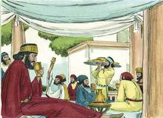
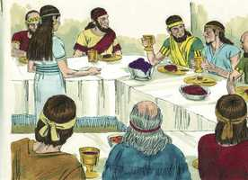
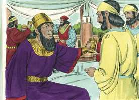
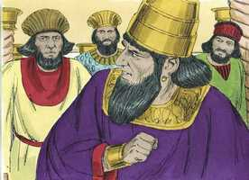
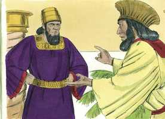
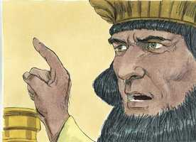

# Ester Cap 01

**1** 	E SUCEDEU nos dias de Assuero, o Assuero que reinou desde a Índia até a Etiópia, sobre cento e vinte e sete províncias,

> **Cmt MHenry**: *Vv. 1-9.* O orgulho do coração de Assuero é acrescentado pela grandeza de seu reino, ao organizar uma festa extravagante. Isto é vangloria. Melhor é comer ervas com tranqüilidade do que este banquete de vinho com todo o ruído e tumulto que o acompanharam. Se a graça não prevalece no coração, o princípio que o rege será de uma ou de outra forma favorável à exaltação e indulgência para consigo mesmo. Ninguém é obrigado a beber, de maneira que se alguém o faz excessivamente, a falta é sua. Esta precaução de um príncipe ímpio, ainda que demonstre sua generosidade, pode envergonhar a muitos que se dizem cristãos que, sob o pretexto de beber à sua saúde, bebem pecado e com ele, a morte. Este é um ai para os que assim fazem; que leiam [Habacuque 2.15](../35A-Hc/02.md#15),[16](../35A-Hc/02.md#16) e tremam.

> **Cmt MHenry**: *[Ester 1](../17A-Et/01.md#0)*

**2** 	Que, naqueles dias, assentando-se o rei Assuero no trono do seu reino, que estava na fortaleza de Susã,

**3** 	No terceiro ano do seu reinado, fez um banquete a todos os seus príncipes e seus servos, estando assim perante ele o poder da Pérsia e Média e os nobres e príncipes das províncias,

 

**4** 	Para mostrar as riquezas da glória do seu reino, e o esplendor da sua excelente grandeza, por muitos dias, a saber: cento e oitenta dias.

**5** 	E, acabados aqueles dias, fez o rei um banquete a todo o povo que se achava na fortaleza de Susã, desde o maior até ao menor, por sete dias, no pátio do jardim do palácio real.

**6** 	As tapeçarias eram de pano branco, verde, e azul celeste, pendentes de cordões de linho fino e púrpura, e argolas de prata, e colunas de mármore; os leitos de ouro e de prata, sobre um pavimento de mármore vermelho, e azul, e branco, e preto.

**7** 	E dava-se de beber em copos de ouro, e os copos eram diferentes uns dos outros; e havia muito vinho real, segundo a generosidade do rei.

 

**8** 	E o beber era por lei, sem constrangimento; porque assim tinha ordenado o rei expressamente a todos os oficiais da sua casa, que fizessem conforme a vontade de cada um.

**9** 	Também a rainha Vasti deu um banquete às mulheres, na casa real do rei Assuero.

**10** 	E ao sétimo dia, estando já o coração do rei alegre do vinho, mandou a Meumã, Bizta, Harbona, Bigtá, Abagta, Zetar e Carcas, os sete camareiros que serviam na presença do rei Assuero,

> **Cmt MHenry**: *Vv. 10-22.* A festa de Assuero termina mal por sua própria atitude néscia. As temporadas de festividades profanas costumam terminar em vexame, os superiores devem ter o cuidado de não dar ordens que não possam ser obedecidas dentro dos limites da razão. Porém, após terem ingerido vinho, a razão dos homens os abandona. Aquele que governava 127 províncias não dominava seu próprio espírito. Porém, se a paixão ou a política do rei foi beneficiada com este decreto, a providência de Deus abriu caminho para Ester até a coroa, e derrotou o malvado projeto de Hamã antes que entrasse em seu coração e ascendesse ao poder. Regozijemo-nos em saber que o Senhor reina e vence a loucura e a estupidez da humanidade, para promover sua própria glória e a segurança e felicidade de seu povo.

 

**11** 	Que introduzissem na presença do rei a rainha Vasti, com a coroa real, para mostrar aos povos e aos príncipes a sua beleza, porque era formosa à vista.

**12** 	Porém a rainha Vasti recusou vir conforme a palavra do rei, por meio dos camareiros; assim o rei muito se enfureceu, e acendeu nele a sua ira.

 

**13** 	Então perguntou o rei aos sábios que entendiam dos tempos (porque assim se tratavam os negócios do rei na presença de todos os que sabiam a lei e o direito;

**14** 	E os mais chegados a ele eram: Carsena, Setar, Admata, Társis, Meres, Marsena, e Memucã, os sete príncipes dos persas e dos medos, que viam a face do rei, e se assentavam como principais no reino),

**15** 	O que, segundo a lei, se devia fazer à rainha Vasti, por não ter obedecido ao mandado do rei Assuero, por meio dos camareiros.

**16** 	Então disse Memucã na presença do rei e dos príncipes: Não somente contra o rei pecou a rainha Vasti, porém também contra todos os príncipes, e contra todos os povos que há em todas as províncias do rei Assuero.

 

**17** 	Porque a notícia do que fez a rainha chegará a todas as mulheres, de modo que aos seus olhos desprezarão a seus maridos quando ouvirem dizer: Mandou o rei Assuero que introduzissem à sua presença a rainha Vasti, porém ela não veio.

**18** 	E neste mesmo dia as senhoras da Pérsia e da Média, ouvindo o que fez a rainha, dirão o mesmo a todos os príncipes do rei; e assim haverá muito desprezo e indignação.

**19** 	Se bem parecer ao rei, saia da sua parte um edito real, e escreva-se nas leis dos persas e dos medos, e não se revogue, a saber: que Vasti não entre mais na presença do rei Assuero, e o rei dê o reino dela a outra que seja melhor do que ela.

**20** 	E, ouvindo-se o mandado, que o rei decretará em todo o seu reino (porque é grande), todas as mulheres darão honra a seus maridos, desde a maior até à menor.

**21** 	E pareceram bem estas palavras aos olhos do rei e dos príncipes; e fez o rei conforme a palavra de Memucã.

 

**22** 	Então enviou cartas a todas as províncias do rei, a cada província segundo a sua escrita, e a cada povo segundo a sua língua; que cada homem fosse senhor em sua casa, e que se falasse conforme a língua do seu povo.

 

> **Cmt MHenry** Intro: *Versículos 1-9: A festa real de Assuero; 10-22: Vasti se nega a comparecer; o decreto do rei.*