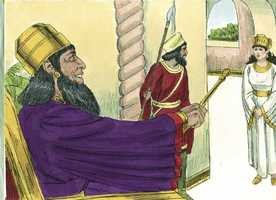
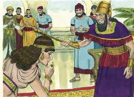
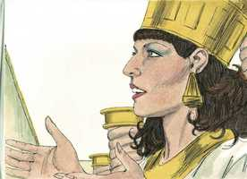
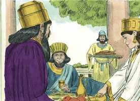
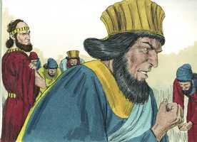
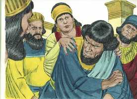
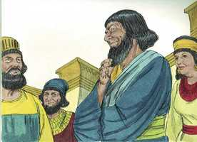

# Ester Cap 05

**1** 	SUCEDEU, pois, que ao terceiro dia Ester se vestiu com trajes reais, e se pôs no pátio interior da casa do rei, defronte do aposento do rei; e o rei estava assentado sobre o seu trono real, na casa real, defronte da porta do aposento.

> **Cmt MHenry**: *Vv. 1-8.* Após prevalecer diante de Deus, como fez Jacó, Ester teve também poder sobre os homens. O que perder sua vida por causa de Deus salvá-la-á, ou a encontrará em uma vida melhor. O rei lhe deu ânimo. Que nos sirva de estímulo para orarmos sempre a Deus e nunca desanimarmos. Ester apresentou-se diante de um homem soberbo e imperioso, mas nós nos apresentamos diante do Deus de amor e graça. Ela não foi chamada, mas nós sim; o Espírito diz: "vem", e a Esposa diz : "Vou". Ela possuía uma lei contra si, mas nós temos uma promessa a nosso favor; sim, muitas promessas: "Pedi e ser- vos-á dado". Ela não tinha um amigo que a acompanhasse ou rogasse por ela; pelo contrário, o favorito do rei era seu inimigo; mas nós temos um Advogado diante de Deus, o Pai, e este se compraz nEle. Portanto, aproximemo-nos com confiança ao trono da graça. Deus colocou no coração de Ester que demorasse mais um dia para lazer sua petição; ela não sabia o que ia acontecer naquela noite. Deus sabia.

**2** 	E sucedeu que, vendo o rei a rainha Ester, que estava no pátio, ela alcançou graça aos seus olhos; e o rei estendeu para Ester o cetro de ouro, que tinha na sua mão, e Ester chegou, e tocou a ponta do cetro.

  

**3** 	Então o rei lhe disse: Que é que queres, rainha Ester, ou qual é a tua petição? Até metade do reino se te dará.

 

**4** 	E disse Ester: Se parecer bem ao rei, venha hoje com Hamã ao banquete que lhe tenho preparado.

 

**5** 	Então disse o rei: Fazei apressar a Hamã, para que se atenda ao desejo de Ester. Vindo, pois, o rei e Hamã ao banquete, que Ester tinha preparado,

> **Cmt MHenry**: *[Ester 5](../17A-Et/05.md#0)*

**6** 	Disse o rei a Ester, no banquete do vinho: Qual é a tua petição? E ser-te-á concedida, e qual é o teu desejo? E se fará, ainda até metade do reino.

 

**7** 	Então respondeu Ester, e disse: Minha petição e desejo é:

**8** 	Se achei graça aos olhos do rei, e se bem parecer ao rei conceder-me a minha petição, e cumprir o meu desejo, venha o rei com Hamã ao banquete que lhes hei de preparar, e amanhã farei conforme a palavra do rei.

**9** 	Então saiu Hamã naquele dia alegre e de bom ânimo; porém, vendo Mardoqueu à porta do rei, e que ele não se levantara nem se movera diante dele, então Hamã se encheu de furor contra Mardoqueu.

> **Cmt MHenry**: *Vv. 9-14.* Este relato de Hamã é um comentário de[Provérbios 21.24](../20A-Pv/21.md#24). Os que se admiram e se afagam a si mesmos, enganam-se. Quanto mais alta é a ascensão de Hamã, mais ele se incomoda quando o tratam com desdém, e mais se enfurece por isso. A afronta de Mardoqueu colocou tudo a perder. Uma leve afronta que um homem humilde apenas notaria, atormenta o orgulhoso até a loucura, e põe a perder todas as suas alegrias. Aos que estão predispostos a incomodar-se, nunca lhes faltará algo pelo que irritar-se. Assim são os homens soberbos; mesmo que tenham muito com que ocupar-se, se não têm tudo conforme o seu gosto, lhes é como se não tivessem coisa alguma. Muitos dizem que o orgulhoso, com sua exibição de pompa e espetáculo, é feliz; porém, isto não é verdade. Muitos que moram em pobres cabanas sentem-se muito menos inquietos do que o rico com todas as fantasiosas vantagens que o rodeiam. O que não conhece a Cristo é pobre, ainda que seja rico, porque está completamente desprovido da única riqueza verdadeira. "

 

**10** 	Hamã, porém, se refreou, e foi para sua casa; e enviou, e mandou vir os seus amigos, e Zeres, sua mulher.

**11** 	E contou-lhes Hamã a glória das suas riquezas, a multidão de seus filhos, e tudo em que o rei o tinha engrandecido, e como o tinha exaltado sobre os príncipes e servos do rei.

**12** 	Disse mais Hamã: Tampouco a rainha Ester a ninguém fez vir com o rei ao banquete que tinha preparado, senão a mim; e também para amanhã estou convidado por ela juntamente com o rei.

 

**13** 	Porém tudo isto não me satisfaz, enquanto eu vir o judeu Mardoqueu assentado à porta do rei.

**14** 	Então lhe disseram Zeres, sua mulher, e todos os seus amigos: Faça-se uma forca de cinqüenta côvados de altura, e amanhã dize ao rei que nela seja enforcado Mardoqueu; e então entra alegre com o rei ao banquete. E este conselho bem pareceu a Hamã, que mandou fazer a forca.

 

> **Cmt MHenry** Intro: *Versículos 1-8. A solicitação de Ester é atendida; 9-14:Hamã prepara-se para enforcar a Mardoqueu.*