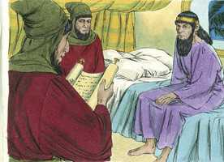
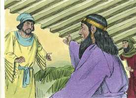
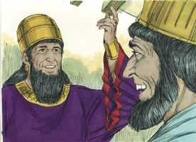
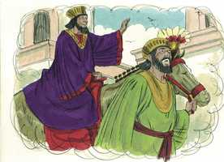
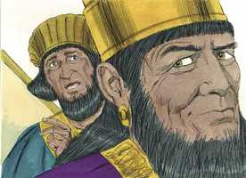
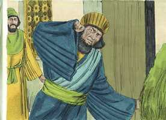

# Ester Cap 06

**1** 	NAQUELA mesma noite fugiu o sono do rei; então mandou trazer o livro de registro das crônicas, as quais se leram diante do rei.

> **Cmt MHenry**: *Vv. 1-3.* A providência de Deus reina até sobre as menores preocupações dos homens. Nem um pardal cai por terra sem a permissão dEle. Siga os passos que a providência estabeleceu para a ascensão de Mardoqueu. O rei não pôde dormir, pois Deus tinha um desígnio para cumprir; por isso o manteve acordado. Não lemos que foi uma enfermidade que tirou o seu sono, mas Deus, de quem o sono é um dom, o reteve. O que tinha poder sobre cento e vinte e sete províncias não teve uma hora de descanso e sono.

 

**2** 	E achou-se escrito que Mardoqueu tinha denunciado Bigtã e Teres, dois dos camareiros do rei, da guarda da porta, que tinham procurado lançar mão do rei Assuero.

**3** 	Então disse o rei: Que honra e distinção se deu por isso a Mardoqueu? E os servos do rei, que ministravam junto a ele, disseram: Coisa nenhuma se lhe fez.

 

**4** 	Então disse o rei: Quem está no pátio? E Hamã tinha entrado no pátio exterior da casa do rei, para dizer ao rei que enforcassem a Mardoqueu na forca que lhe tinha preparado.

> **Cmt MHenry**: *Vv. 4-11.* Observe como o orgulho do homem o seduz. O engano do coração se faz presente, nada menos que no alto conceito que temos de nós mesmos e de nossas realizações: devemos vigiar e orar contra isso constantemente. Hamã pensou que o rei somente amava e valorizava a ele, e se enganou. Devemos suspeitar que a estima que o nosso próximo tem por nós às vezes não é tão grande como parece, para que não tenhamos um conceito muito elevado de nós mesmos, nem confiemos excessivamente no próximo, como Hamã sentiu-se golpeado quando o rei ordenou que honrasse ao judeu Mardoqueu, o mesmíssimo homem que ele odiava sobre todos os homens, e cuja destruição planejara!

**5** 	E os servos do rei lhe disseram: Eis que Hamã está no pátio. E disse o rei que entrasse.

**6** 	E, entrando Hamã, o rei lhe disse: Que se fará ao homem de cuja honra o rei se agrada? Então Hamã disse no seu coração: De quem se agradaria o rei para lhe fazer honra mais do que a mim?

> **Cmt MHenry**: *[Ester 6](../17A-Et/06.md#0)*

 

**7** 	Assim disse Hamã ao rei: Para o homem, de cuja honra o rei se agrada,

**8** 	Tragam a veste real que o rei costuma vestir, como também o cavalo em que o rei costuma andar montado, e ponha-se-lhe a coroa real na sua cabeça.

**9** 	E entregue-se a veste e o cavalo à mão de um dos príncipes mais nobres do rei, e vistam delas aquele homem a quem o rei deseja honrar; e levem-no a cavalo pelas ruas da cidade, e apregoe-se diante dele: Assim se fará ao homem a quem o rei deseja honrar!

 

**10** 	Então disse o rei a Hamã: Apressa-te, toma a veste e o cavalo, como disseste, e faze assim para com o judeu Mardoqueu, que está assentado à porta do rei; e coisa nenhuma omitas de tudo quanto disseste.

 

**11** 	E Hamã tomou a veste e o cavalo, e vestiu a Mardoqueu, e o levou a cavalo pelas ruas da cidade, e apregoou diante dele: Assim se fará ao homem a quem o rei deseja honrar!

**12** 	Depois disto Mardoqueu voltou para a porta do rei; porém Hamã se retirou correndo à sua casa, triste, e de cabeça coberta.

> **Cmt MHenry**: *Vv. 12-14.* Mardoqueu não se ensoberbeceu com as honras, mas voltou ao seu lugar e a seu dever. Porém, Hamã não o pôde tolerar. Que dano ele lhe causou? O que é capaz de romper o coração do homem orgulhoso não tira sequer o sono do humilde, sua condenação, antes que houvesse ocorrido, lhe foi anunciada por sua esposa e seus amigos. Eles testificaram claramente que os judeus, ainda que espalhados por todas as nações, eram objeto do especial cuidado de Deus. Todos os conselheiros de Hamã eram consoladores maus. Não o admoestaram a arrepender-se; somente anunciaram o seu destino como inevitável. A sabedoria de Deus é vista na programação do tempo da libertação de sua igreja, para manifestar a sua própria glória.

**13** 	E contou Hamã a Zeres, sua mulher, e a todos os seus amigos, tudo quanto lhe tinha sucedido. Então os seus sábios e Zeres, sua mulher, lhe disseram: Se Mardoqueu, diante de quem já começaste a cair, é da descendência dos judeus, não prevalecerás contra ele, antes certamente cairás diante dele.

 

**14** 	E estando eles ainda falando com ele, chegaram os camareiros do rei, e se apressaram a levar Hamã ao banquete que Ester preparara.

> **Cmt MHenry** Intro: *Versículos 1- 3: A providência divina recomenda Mardoqueu ao favor do rei; 4-11: O conselho de Hamã honra Mardoqueu; 12-14: Os amigos de Hamã comentam sobre o que vai lhe acontecer.*