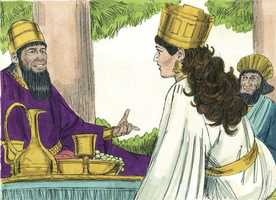
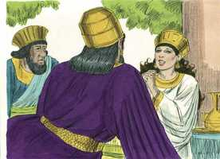
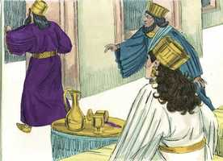
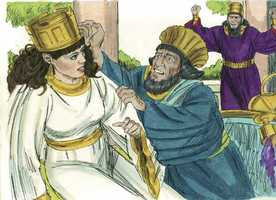
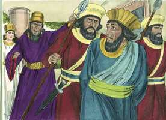

# Ester Cap 07

**1** 	VINDO, pois, o rei com Hamã, para beber com a rainha Ester,

> **Cmt MHenry**: *Vv. 1-6.* Se o amor pela vida nos faz rogar fervorosamente aos que só podem matar o corpo, quão fervorosas deveríam ser as nossas orações ao que pode destruir o corpo e a alma no inferno! Quanto deveriamos orar pela salvação de nossos parentes, amigos e de todos os que nos rodeiam! Quando apresentamos petições a grandes homens, somos cautelosos para não os ofendermos, até mesmo as queixas justas devem ser retidas. Quando nos aproximamos com reverência do Rei dos reis, podemos pedir e esperar muito. Ainda que só mereçamos ira, Deus é poderoso para fazer muito mais abundantemente do que aquilo que pedimos ou pensamos.

**2** 	Disse outra vez o rei a Ester, no segundo dia, no banquete do vinho: Qual é a tua petição, rainha Ester? E se te dará. E qual é o teu desejo? Até metade do reino, se te dará.

 

**3** 	Então respondeu a rainha Ester, e disse: Se, ó rei, achei graça aos teus olhos, e se bem parecer ao rei, dê-se-me a minha vida como minha petição, e o meu povo como meu desejo.

 

**4** 	Porque fomos vendidos, eu e o meu povo, para nos destruírem, matarem, e aniquilarem de vez; se ainda por servos e por servas nos vendessem, calar-me-ia; ainda que o opressor não poderia ter compensado a perda do rei.

**5** 	Então falou o rei Assuero, e disse à rainha Ester: Quem é esse e onde está esse, cujo coração o instigou a assim fazer?

**6** 	E disse Ester: O homem, o opressor, e o inimigo, é este mau Hamã. Então Hamã se perturbou perante o rei e a rainha.

**7** 	E o rei no seu furor se levantou do banquete do vinho e passou para o jardim do palácio; e Hamã se pôs em pé, para rogar à rainha Ester pela sua vida; porque viu que já o mal lhe estava determinado pelo rei.

> **Cmt MHenry**: *Vv. 7-10.* O rei estava irado: Os que fazem as coisas por vontade própria refletem depois, e reprovam-se a si mesmos. Quando estamos irados, devemos fazer uma pausa antes de tomarmos qualquer decisão e, assim, governar o nosso próprio espírito e demonstrar que somos dirigidos pela razão. Os que são mais altivos e insolentes, quando se encontram no poder e na prosperidade, como Hamã, se tornam os mais infames, vis e pobres de espírito quando são derribados. Chegará o dia em que os que odeiam e perseguem os eleitos de Deus estarão felizes por atendê-los. Orei se ira ainda mais contra Hamã. Os que estavam perto dele prontificaram-se a executar a sua ira. Quão pouco seguros podem estar os homens orgulhosos dos interesses que acreditam ter! Os inimigos da Igreja muitas vezes são surpreendidos em sua própria astúcia. O Senhor é conhecido por tais juízos. Apenas nesse momento, e não antes, a ira do rei foi aplacada. Quem tem pena de Hamã enforcado em seu próprio patíbulo? Antes, há regozijo pela destruição que a sua própria artimanha lhe acarretou. Que os que cometem iniqüidades tremam e voltem-se ao Senhor e busquem perdão através do sangue de Cristo.

> **Cmt MHenry**: *[Ester 7](../17A-Et/07.md#0)*

 

**8** 	Tornando, pois, o rei do jardim do palácio à casa do banquete do vinho, Hamã tinha caído prostrado sobre o leito em que estava Ester. Então disse o rei: Porventura quereria ele também forçar a rainha perante mim nesta casa? Saindo esta palavra da boca do rei, cobriram o rosto de Hamã.

 

**9** 	Então disse Harbona, um dos camareiros que serviam diante do rei: Eis que também a forca de cinqüenta côvados de altura que Hamã fizera para Mardoqueu, que falara em defesa do rei, está junto à casa de Hamã. Então disse o rei: Enforcai-o nela.

 

**10** 	Enforcaram, pois, a Hamã na forca, que ele tinha preparado para Mardoqueu. Então o furor do rei se aplacou.

> **Cmt MHenry** Intro: *Versículos 1-6: Ester acusa Hamã; 7-10: Hamã é enforcado em seu próprio patíbulo.*