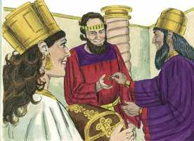
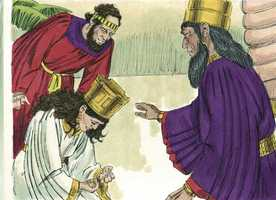
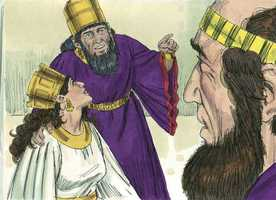
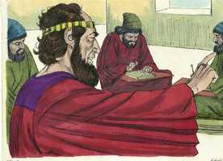
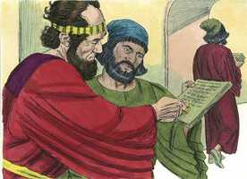
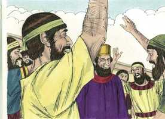
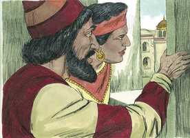

# Ester Cap 08

**1** 	NAQUELE mesmo dia deu o rei Assuero à rainha Ester a casa de Hamã, inimigo dos judeus; e Mardoqueu veio perante o rei, porque Ester tinha declarado quem ele era.

> **Cmt MHenry**: *Vv. 1,2.* O que Hamã usou para o mal Ester utilizou para o bem. Toda a confiança que o rei depositara em Hamã colocou agora sobre Mardoqueu, uma troca feliz. Observe aqui quão vão é adquirir tesouros na terra; o que amontoa riquezas não sabe quem as recolherá, com quão escasso prazer Hamã teria cuidado de seu patrimônio, se pudesse prever que Mardoqueu, o homem que ele odiava acima de todos os outros, viría a governar sobre tudo o que ele administrara! A nós interessa assegurarmos as riquezas que não ficarão para trás, mas irão conosco para o outro mundo.

**2** 	E tirou o rei o seu anel, que tinha tomado de Hamã, e o deu a Mardoqueu. E Ester encarregou Mardoqueu da casa de Hamã.

 

**3** 	Falou mais Ester perante o rei, e se lhe lançou aos seus pés; e chorou, e lhe suplicou que revogasse a maldade de Hamã, o agagita, e o intento que tinha projetado contra os judeus.

> **Cmt MHenry**: *Vv. 3-14.* Quando a Igreja corre perigo, é hora de sermos fervorosos. Ester, ainda que estivesse a salvo, prostrou-se e rogou a favor da libertação de seu povo. Não lemos que ela chorara quando rogava por sua vida; porém, ainda que estivesse segura, chorou por seu povo. As lágrimas de compaixão e ternura são as que mais se parecem com as de Cristo. Conforme a constituição do governo persa, nenhuma lei ou decreto era revogado ou anulado. Isto está muito distante de falar da sabedoria e honra dos medos e persas, e mostra claramente o seu orgulho, e quão néscios eles eram. Este fato é peculiar à velha presunção que arruinou tudo; seremos como deuses? E prerrogativa de Deus não arrepender-se, e dizer que algo jamais será modificado ou contradito. Porém, foi encontrada uma outra forma, através de um outro decreto, para autorizar os judeus a defender-se. O decreto foi publicado na língua de todas as províncias, se todos os súditos de um príncipe terreno terão seus decretos em idioma que compreendam, deveríam os oráculos e leis de Deus ficar ocultos de seus servos, e em língua desconhecida?

 

**4** 	E estendeu o rei para Ester o cetro de ouro. Então Ester se levantou, e pôs-se em pé perante o rei,

**5** 	E disse: Se bem parecer ao rei, e se eu achei graça perante ele, e se este negócio é reto diante do rei, e se eu lhe agrado aos seus olhos, escreva-se que se revoguem as cartas concebidas por Hamã filho de Hamedata, o agagita, as quais ele escreveu para aniquilar os judeus, que estão em todas as províncias do rei.

**6** 	Pois como poderei ver o mal que sobrevirá ao meu povo? E como poderei ver a destruição da minha parentela?

**7** 	Então disse o rei Assuero à rainha Ester e ao judeu Mardoqueu: Eis que dei a Ester a casa de Hamã, e a ele penduraram numa forca, porquanto estendera as mãos contra os judeus.

 

**8** 	Escrevei, pois, aos judeus, como parecer bem aos vossos olhos, em nome do rei, e selai-o com o anel do rei; porque o documento que se escreve em nome do rei, e que se sela com o anel do rei, não se pode revogar.

> **Cmt MHenry**: *[Ester 8](../17A-Et/08.md#0)*

**9** 	Então foram chamados os escrivães do rei, naquele mesmo tempo, no terceiro mês (que é o mês de Sivã), aos vinte e três dias; e se escreveu conforme a tudo quanto ordenou Mardoqueu aos judeus, como também aos sátrapas, e aos governadores, e aos líderes das províncias, que se estendem da Índia até Etiópia, cento e vinte e sete províncias, a cada província segundo o seu modo de escrever, e a cada povo conforme a sua língua; como também aos judeus segundo o seu modo de escrever, e conforme a sua língua.

 

**10** 	E escreveu-se em nome do rei Assuero e, selando-as com o anel do rei, enviaram as cartas pela mão de correios a cavalo, que cavalgavam sobre ginetes, que eram das cavalariças do rei.

 

**11** 	Nelas o rei concedia aos judeus, que havia em cada cidade, que se reunissem, e se dispusessem para defenderem as suas vidas, e para destruírem, matarem e aniquilarem todas as forças do povo e da província que viessem contra eles, crianças e mulheres, e que se saqueassem os seus bens,

**12** 	Num mesmo dia, em todas as províncias do rei Assuero, no dia treze do duodécimo mês, que é o mês de Adar;

**13** 	E uma cópia da carta seria divulgada como decreto em todas as províncias, e publicada entre todos os povos, para que os judeus estivessem preparados para aquele dia, para se vingarem dos seus inimigos.

**14** 	Os correios, sobre ginetes velozes, saíram apressuradamente, impelidos pela palavra do rei; e esta ordem foi publicada na fortaleza de Susã.

**15** 	Então Mardoqueu saiu da presença do rei com veste real azul-celeste e branca, como também com uma grande coroa de ouro, e com uma capa de linho fino e púrpura, e a cidade de Susã exultou e se alegrou.

> **Cmt MHenry**: *Vv. 15-17.* As vestes de Mardoqueu agora eram ricas. Estas coisas não são dignas de ser comentadas, mas servem de sinais do favor do rei e fruto do favor de Deus para a sua Igreja. E bom para um país quando os ornamentos da piedade constituem insígnias de dignidade. Quando a Igreja prospera muitos se unem à congregação, e retratam-se quando há problemas, Quando os crentes têm repouso e andam no temor do Senhor e no consolo do Espírito Santo, serão multiplicados. E os intentos de Satanás para destruir a Igreja sempre aumentará o número de verdadeiros cristãos.

**16** 	E para os judeus houve luz, e alegria, e gozo, e honra.

 

**17** 	Também em toda a província, e em toda a cidade, aonde chegava a palavra do rei e a sua ordem, havia entre os judeus alegria e gozo, banquetes e dias de folguedo; e muitos, dos povos da terra, se fizeram judeus, porque o temor dos judeus tinha caído sobre eles.

 

> **Cmt MHenry** Intro: *Versículos 1,2: Mardoqueu é elevado; 2-14: Ester intercede a favor dos judeus; 15-17. Mardoqueu recebe honras; o gozo dos judeus.*