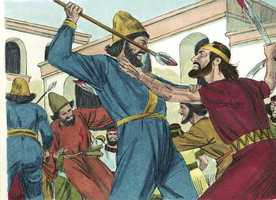
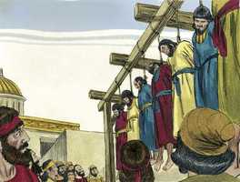
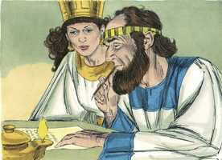
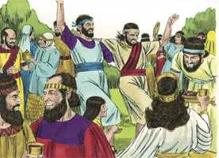

# Ester Cap 09

**1** 	E, NO duodécimo mês, que é o mês de Adar, no dia treze do mesmo mês em que chegou a palavra do rei e a sua ordem para se executar, no dia em que os inimigos dos judeus esperavam assenhorear-se deles, sucedeu o contrário, porque os judeus foram os que se assenhorearam dos que os odiavam.

> **Cmt MHenry**: *Vv. 1-19.* Os inimigos dos judeus esperavam ter poder sobre eles através do primeiro edito. Se não houvessem intentado algo contra o povo de Deus, ninguém teria sofrido. Ao atuar unidos, os judeus se fortaleceram. Aprendamos a resistir em um só espírito e com um só ânimo, a fim de vencermos unidos os inimigos da alma, cujo propósito é roubar a nossa fé, o bem mais precioso do que a nossa própria vida. Os judeus, para a honra de sua religião, demonstraram desprezo pela riqueza do mundo, para que fosse visto que eles desejavam apenas a sua preservação. Em todo o caso, o povo de Deus deve manifestar humanidade e desinteresse, e recusar freqüentemente as vantagens que poderíam obter legalmente. Os judeus celebraram sua festa no dia seguinte à conclusão de sua obra. Quando recebemos grandes misericórdias de Deus, devemos ser rápidos em dar-lhe graças.

**2** 	Porque os judeus nas suas cidades, em todas as províncias do rei Assuero, se ajuntaram para pôr as mãos naqueles que procuravam o seu mal; e ninguém podia resistir-lhes, porque o medo deles caíra sobre todos aqueles povos.

**3** 	E todos os líderes das províncias, e os sátrapas, e os governadores, e os que faziam a obra do rei, auxiliavam os judeus; porque tinha caído sobre eles o temor de Mardoqueu.

**4** 	Porque Mardoqueu era grande na casa do rei, e a sua fama crescia por todas as províncias, porque o homem Mardoqueu ia sendo engrandecido.

 

**5** 	Feriram, pois, os judeus a todos os seus inimigos, a golpes de espada, com matança e com destruição; e fizeram dos seus inimigos o que quiseram.

 

**6** 	E na fortaleza de Susã os judeus mataram e destruíram quinhentos homens;

**7** 	Como também a Parsandata, e a Dalfom e a Aspata,

 

**8** 	E a Porata, e a Adalia, e a Aridata,

**9** 	E a Farmasta, e a Arisai, e a Aridai, e a Vaisata;

> **Cmt MHenry**: *[Ester 9](../17A-Et/09.md#0)*

**10** 	Os dez filhos de Hamã, filho de Hamedata, o inimigo dos judeus, mataram, porém ao despojo não estenderam a sua mão.

**11** 	No mesmo dia foi comunicado ao rei o número dos mortos na fortaleza de Susã.

**12** 	E disse o rei à rainha Ester: Na fortaleza de Susã os judeus mataram e destruíram quinhentos homens, e os dez filhos de Hamã; nas mais províncias do rei que teriam feito? Qual é, pois, a tua petição? E dar-se-te-á. Ou qual é ainda o teu requerimento? E far-se-á.

**13** 	Então disse Ester: Se bem parecer ao rei, conceda-se aos judeus que se acham em Susã que também façam amanhã conforme ao mandado de hoje; e pendurem numa forca os dez filhos de Hamã.

**14** 	Então disse o rei que assim se fizesse; e publicou-se um edito em Susã, e enforcaram os dez filhos de Hamã.

**15** 	E reuniram-se os judeus que se achavam em Susã também no dia catorze do mês de Adar, e mataram em Susã trezentos homens; porém ao despojo não estenderam a sua mão.

**16** 	Também os demais judeus que se achavam nas províncias do rei se reuniram e se dispuseram em defesa das suas vidas, e tiveram descanso dos seus inimigos; e mataram dos seus inimigos setenta e cinco mil; porém ao despojo não estenderam a sua mão.

**17** 	Sucedeu isto no dia treze do mês de Adar; e descansaram no dia catorze, e fizeram, daquele dia, dia de banquetes e de alegria.

**18** 	Também os judeus, que se achavam em Susã se ajuntaram nos dias treze e catorze do mesmo; e descansaram no dia quinze, e fizeram, daquele dia, dia de banquetes e de alegria.

**19** 	Os judeus, porém, das aldeias, que habitavam nas vilas, fizeram do dia catorze do mês de Adar dia de alegria e de banquetes, e dia de folguedo, e de mandarem presentes uns aos outros.

**20** 	E Mardoqueu escreveu estas coisas, e enviou cartas a todos os judeus que se achavam em todas as províncias do rei Assuero, aos de perto, e aos de longe,

> **Cmt MHenry**: *Vv. 20-32.* A observância das festas judaicas é uma declaração pública da verdade das Escrituras do Antigo Testamento. E como as Escrituras do Antigo Testamento são verdade, o Messias esperado pelos judeus veio há muito tempo, e nenhum outro senão Jesus de Nazaré pode ser este Messias. A festa foi estabelecida por autoridade, mas sob a direção do Espírito de Deus. Foi chamada de Purim, por causa da palavra persa pur, que significa sorte. O nome desta festa os levaria a recordar-se da onipotência do Deus de Israel, que serviu aos seus propósitos por intermédio das superstições dos pagãos. Ao lembrarmo-nos das misericórdias recebidas, devemos nos referir a temores e angústias passadas. Quando as misericórdias que recebemos são pessoais, não devemos perder o consolo que elas nos trouxeram, esquecer delas nem deixar de dar ao Senhor a glória devida ao seu nome. Que o Senhor nos ensine a nos regozijarmos com esse gozo santo, que antecipa e prepara para a bênção do céu. cada caso alcançado de bondade divina é uma nova obrigação que recebemos de fazer o bem com a abundância que temos recebido, especialmente aos que mais necessitam de ajuda. Acima de tudo, a redenção através de Cristo nos obriga a ser misericordiosos ([2 Co 8.9](../47N-2Co/08.md#9))

 

**21** 	Ordenando-lhes que guardassem o dia catorze do mês de Adar, e o dia quinze do mesmo, todos os anos,

**22** 	Como os dias em que os judeus tiveram repouso dos seus inimigos, e o mês que se lhes mudou de tristeza em alegria, e de luto em dia de festa, para que os fizessem dias de banquetes e de alegria, e de mandarem presentes uns aos outros, e dádivas aos pobres.

**23** 	E os judeus encarregaram-se de fazer o que já tinham começado, como também o que Mardoqueu lhes tinha escrito.

**24** 	Porque Hamã, filho de Hamedata, o agagita, inimigo de todos os judeus, tinha intentado destruir os judeus, e tinha lançado Pur, isto é, a sorte, para os assolar e destruir.

**25** 	Mas, vindo isto perante o rei, mandou ele por cartas que o mau intento que Hamã formara contra os judeus, se tornasse sobre a sua cabeça; pelo que penduraram a ele e a seus filhos numa forca.

**26** 	Por isso àqueles dias chamam Purim, do nome Pur; assim também por causa de todas as palavras daquela carta, e do que viram sobre isso, e do que lhes tinha sucedido,

**27** 	Confirmaram os judeus, e tomaram sobre si, e sobre a sua descendência, e sobre todos os que se achegassem a eles, que não se deixaria de guardar estes dois dias conforme ao que se escrevera deles, e segundo o seu tempo determinado, todos os anos.

**28** 	E que estes dias seriam lembrados e guardados em cada geração, família, província e cidade, e que esses dias de Purim não fossem revogados entre os judeus, e que a memória deles nunca teria fim entre os de sua descendência.

 

**29** 	Então a rainha Ester, filha de Abiail, e Mardoqueu, o judeu, escreveram com toda autoridade uma segunda vez, para confirmar a carta a respeito de Purim.

**30** 	E mandaram cartas a todos os judeus, às cento e vinte e sete províncias do reino de Assuero, com palavras de paz e verdade.

**31** 	Para confirmarem estes dias de Purim nos seus tempos determinados, como Mardoqueu, o judeu, e a rainha Ester lhes tinham estabelecido, e como eles mesmos já o tinham estabelecido sobre si e sobre a sua descendência, acerca do jejum e do seu clamor.

**32** 	E o mandado de Ester estabeleceu os sucessos daquele Purim; e escreveu-se no livro.

> **Cmt MHenry** Intro: *Versículos 1-19: O êxito dos judeus; 20-32: A festa de Purim para comemorar o êxito.*