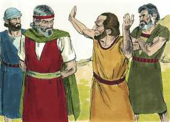

# Jó Cap 01

**1** 	HAVIA um homem na terra de Uz, cujo nome era Jó; e era este homem íntegro, reto e temente a Deus e desviava-se do mal.

> **Cmt MHenry**: *Vv. 1-5.* Jó era rico e, não obstante, piedoso. Ainda que difícil e incomum, não é impossível que um rico entre no reino dos céus, pois pela graça de Deus podemos vencer as tentações das riquezas deste mundo. O relato da piedade e prosperidade de Jó antecede a história de suas grandes aflições, e mostra que nada o salvará dos problemas. Ainda que Jó contemplasse com satisfação a harmonia e o bem-estar de seus filhos, seu conhecimento sobre o coração humano o fazia temer por eles. Ele os enviava e sacrificava por eles, a fim de lembrar-lhes que deveríam examinar-se a si mesmos, confessarem seus pecados, procurar o perdão e, como quem espera atenção da parte de Deus através do Salvador prometido, ele oferecia um holocausto para cada um deles. Percebemos o seu cuidado para com seus filhos, seu conhecimento sobre o pecado e sua dependência total da misericórdia de Deus, da maneira que Ele tem designado.

 

**2** 	E nasceram-lhe sete filhos e três filhas.

 

**3** 	E o seu gado era de sete mil ovelhas, três mil camelos, quinhentas juntas de bois e quinhentas jumentas; eram também muitíssimos os servos a seu serviço, de maneira que este homem era maior do que todos os do oriente.

 

**4** 	E iam seus filhos à casa uns dos outros e faziam banquetes cada um por sua vez; e mandavam convidar as suas três irmãs a comerem e beberem com eles.

**5** 	Sucedia, pois, que, decorrido o turno de dias de seus banquetes, enviava Jó, e os santificava, e se levantava de madrugada, e oferecia holocaustos segundo o número de todos eles; porque dizia Jó: Porventura pecaram meus filhos, e amaldiçoaram a Deus no seu coração. Assim fazia Jó continuamente.

**6** 	E num dia em que os filhos de Deus vieram apresentar-se perante o Senhor, veio também Satanás entre eles.

> **Cmt MHenry**: *Vv. 6-12.* As aflições de Jó começaram pela maldade de Satanás, com a permissão do Senhor para propósitos sábios e santos. O inimigo de Deus e de toda a justiça procura continuamente tirar do caminho e, se possível, destruir os que amam a Deus. Não sabemos até aonde a sua influência pode ir; porém, provavelmente muita instabilidade e infelicidade dos cristãos podem ser atribuídas a ele. Enquanto nos encontramos na terra, estamos ao seu alcance. Por isso, cabe a nós estar sóbrios e sempre atentos ([1 Pe 5.8](../60N-1Pe/05.md#8)). Observe aqui como Satanás censura a Jó. Esta é a maneira pela qual os caluniadores comum ente agem; eles sugerem algo do qual não têm motivo, para fazer pensar que a sua mentira é verdade. Assim como devemos abominar a hipocrisia, também não podemos ser contados e chamados de hipócritas. Nada há de mal em colocar os nossos olhos na recompensa eterna de nossa obediência; porém, é mau colocá-la nas vantagens terrenas de nossa religião. O povo de Deus e todos os que a Ele pertencem estão sob a sua proteção especial. A bênção de Deus enriquece, e o próprio Satanás admite isso. Foi Deus quem permitiu que Jó fosse provado. Nosso consolo é saber que Deus aprisionará o Diabo ([Ap 20.1](../66N-Ap/20.md#1),[2](../66N-Ap/20.md#2)). Ele não tem poder para forçar os homens a pecar, a menos que estes o permitam; nem tampouco tem meios para afligir os homens, se estes não vierem do alto. Tudo isto está aqui escrito para nós, conforme a maneira dos homens. A Escritura fala dessa forma para nos mostrar que Deus dirige todos os assuntos da humanidade.

 

**7** 	Então o Senhor disse a Satanás: Donde vens? E Satanás respondeu ao Senhor, e disse: De rodear a terra, e passear por ela.

**8** 	E disse o Senhor a Satanás: Observaste tu a meu servo Jó? Porque ninguém há na terra semelhante a ele, homem íntegro e reto, temente a Deus, e que se desvia do mal.

 

**9** 	Então respondeu Satanás ao Senhor, e disse: Porventura teme Jó a Deus debalde?

**10** 	Porventura tu não cercaste de sebe, a ele, e a sua casa, e a tudo quanto tem? A obra de suas mãos abençoaste e o seu gado se tem aumentado na terra.

**11** 	Mas estende a tua mão, e toca-lhe em tudo quanto tem, e verás se não blasfema contra ti na tua face.

**12** 	E disse o Senhor a Satanás: Eis que tudo quanto ele tem está na tua mão; somente contra ele não estendas a tua mão. E Satanás saiu da presença do Senhor.

 

**13** 	E sucedeu um dia, em que seus filhos e suas filhas comiam, e bebiam vinho, na casa de seu irmão primogênito,

> **Cmt MHenry**: *Vv. 13-19.* Satanás ocasionou os transtornos na vida de Jó em um dia em que os filhos deste patriarca começavam suas festas. Todos os problemas recaíram sobre ele de uma só vez; enquanto um mensageiro de más noticias falava, outro chegava. As possessões mais valiosas e queridas de Jó eram os seus dez filhos, e trazem-lhe a notícia que estes estão mortos. Foram arrebatados quando Jó mais necessitava deles para o consolar pelas outras perdas, somente em Deus encontramos ajuda real em todos os momentos.

**14** 	Que veio um mensageiro a Jó, e lhe disse: Os bois lavravam, e as jumentas pastavam junto a eles;

 

**15** 	E deram sobre eles os sabeus, e os tomaram, e aos servos feriram ao fio da espada; e só eu escapei para trazer-te a nova.

**16** 	Estando este ainda falando, veio outro e disse: Fogo de Deus caiu do céu, e queimou as ovelhas e os servos, e os consumiu, e só eu escapei para trazer-te a nova.

 

**17** 	Estando ainda este falando, veio outro, e disse: Ordenando os caldeus três tropas, deram sobre os camelos, e os tomaram, e aos servos feriram ao fio da espada; e só eu escapei para trazer-te a nova.

**18** 	Estando ainda este falando, veio outro, e disse: Estando teus filhos e tuas filhas comendo e bebendo vinho, em casa de seu irmão primogênito,

 

**19** 	Eis que um grande vento sobreveio dalém do deserto, e deu nos quatro cantos da casa, que caiu sobre os jovens, e morreram; e só eu escapei para trazer-te a nova.

**20** 	Então Jó se levantou, e rasgou o seu manto, e rapou a sua cabeça, e se lançou em terra, e adorou.

> **Cmt MHenry**: *Vv. 20-22.* Jó se humilhou debaixo da mão de Deus. Ele argumenta a partir do estado comum da vida humana, coisa que descreve. Nenhum dos bens que possuímos trouxemos ao mundo; trabalhamos por eles ou os recebemos de outras pessoas. Jó se encontra reduzido ao seu primeiro estado por causa de todas as suas perdas. Ele está justamente onde deveria encontrar-se no final, e somente é despojado, ou melhor, descarregado um pouco antes do que esperava. A pessoa que se despe muito antes de ir dormir sente-se menos confortável do que quem veste o seu pijama pouco antes de se deitar. Da mesma forma, o que o deu também o tirou, veja como Jó olha por cima dos instrumentos e mantém seus olhos fixos na causa principal. As aflições não devem nos desviar da fé, mas nos estimular a ela. se olharmos para o Senhor em todos os nossos problemas, Ele nos sustentará. O Senhor é justo. Tudo o que possuímos é por sua dádiva; podemos perdê-la por causa do pecado, e não deveriamos nos queixar se Ele nos tira uma parte. O nosso descontentamento e impaciência tornam-se uma acusação contra o Senhor. Jó vigiou-se cuidadosamente contra eles, e assim devemos também fazer quando reconhecemos que Deus tem agido sabiamente. Que a maldade e o poder de Satanás tornem mais precioso para nós este Salvador, que veio destruir as obras do Diabo. AquEle que, por nossa salvação, sofreu por parte desse inimigo muitíssimo mais do que sofreu Jó, ou do que podemos pensar.

 

**21** 	E disse: Nu saí do ventre de minha mãe e nu tornarei para lá; o Senhor o deu, e o Senhor o tomou: bendito seja o nome do Senhor.

**22** 	Em tudo isto Jó não pecou, nem atribuiu a Deus falta alguma.

> **Cmt MHenry** Intro: [jó 1](../43N-Joa/01.md#0)> *Versículos 1-5: A piedade e a prosperidade de Jó; 6-12: Satanás consegue permissão para provar a Jó; a perda das propriedades de Jó e a morte de seus filhos; 20-22: A paciência e a piedade de Jó.*