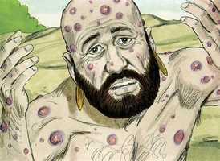

# Jó Cap 03

**1** 	DEPOIS disto abriu Jó a sua boca, e amaldiçoou o seu dia.

> **Cmt MHenry**: *Vv. 1-10.* Durante sete dias, os amigos de Jó sentaram-se ao seu lado em silêncio, sem oferecer-lhe consolo; ao mesmo tempo, Satanás assaltou a mente de Jó para cirandar sua confiança, e enchê-lo de pensamentos duros em relação a Deus. A permissão parece ter se estendido além da mente, e torturava seu corpo. Jó é um tipo especial de Cristo, cujos sofrimentos interiores, no jardim e na cruz, foram os mais espantosos; e os ataques de Satanás surgiram em grande medida nesta hora de trevas. Estas provações interiores mostram a razão da mudança na conduta de Jó, que passou da completa submissão à vontade de Deus à impaciência, que aparece aqui como também em outras partes do livro. O crente, sabedor de que umas poucas gotas deste cálice amargo são mais terríveis, e mais agudas do que as aflições exteriores, saberá também que enquanto estiver favorecido pela doce sensação do amor e presença de Deus, não se surpreenderá de achar que Jó foi um homem de paixões semelhantes às dos demais. Porém, regozijar-se-á, porque Satanás foi decepcionado, e não pôde demonstrar que Jó era um hipócrita, pois ainda que ele tenha amaldiçoado o dia em que nasceu, não blasfemou contra seu Deus. sem dúvida, Jó arrependeu-se depois por tais desejos, e podemos supor qual será o seu juízo a respeito, agora que está na felicidade eterna.

**2** 	E Jó, falando, disse:

 

**3** 	Pereça o dia em que nasci, e a noite em que se disse: Foi concebido um homem!

> **Cmt MHenry**: *[Jó 3](../18A-Jo/03.md#0)*

**4** 	Converta-se aquele dia em trevas; e Deus, lá de cima, não tenha cuidado dele, nem resplandeça sobre ele a luz.

**5** 	Contaminem-no as trevas e a sombra da morte; habitem sobre ele nuvens; a escuridão do dia o espante!

**6** 	Quanto àquela noite, dela se apodere a escuridão; e não se regozije ela entre os dias do ano; e não entre no número dos meses!

**7** 	Ah! que solitária seja aquela noite, e nela não entre voz de júbilo!

**8** 	Amaldiçoem-na aqueles que amaldiçoam o dia, que estão prontos para suscitar o seu pranto.

**9** 	Escureçam-se as estrelas do seu crepúsculo; que espere a luz, e não venha; e não veja as pálpebras da alva;

**10** 	Porque não fechou as portas do ventre; nem escondeu dos meus olhos a canseira.

**11** 	Por que não morri eu desde a madre? E em saindo do ventre, não expirei?

> **Cmt MHenry**: *Vv. 11-19.* Jó queixou-se dos que estiveram presentes em seu nascimento pela terna atenção que lhe deram. Nenhuma criatura vem a este mundo tão indefesa como o homem. O poder e a providência de Deus sustentam nossa frágil vida, e sua piedade e paciência salvam a nossa existência perdida. O afeto natural é colocado por Deus no coração dos pais. Desejar morrer para estar com Cristo, para estar livre do pecado, é o efeito e a evidência da graça; porém, desejar morrer somente para estar livre dos problemas desta vida tem sabor de corrupção. E nosso dever e sabedoria aproveitar o melhor do que existe, seja através da vida ou da morte, e assim, viver para o Senhor, e morrer para o Senhor, pois em ambos casos somos seus ([Rm 14.8](../45N-Rm/14.md#8)). Observe atentamente como Jó descreve o repouso do sepulcro: ali o ímpio tem os seus problemas terminados. Quando os perseguidores morrem, não podem mais prosseguir. Ali os esgotados estão em repouso: na sepultura repousam de todos os seus trabalhos. E o descanso do pecado, da tentação, do conflito, das dores e das dificuldades, é estar na presença de Deus e regozijar-se nEle. Ali, os crentes repousam em Jesus. A medida que confiamos no Senhor Jesus e lhe obedecemos, encontramos descanso para as nossas almas, ainda que no mundo tenhamos tribulações.

**12** 	Por que me receberam os joelhos? E por que os peitos, para que mamasse?

**13** 	Porque já agora jazeria e repousaria; dormiria, e então haveria repouso para mim.

**14** 	Com os reis e conselheiros da terra, que para si edificam casas nos lugares assolados,

**15** 	Ou com os príncipes que possuem ouro, que enchem as suas casas de prata,

**16** 	Ou como aborto oculto, não existiria; como as crianças que não viram a luz.

**17** 	Ali os maus cessam de perturbar; e ali repousam os cansados.

**18** 	Ali os presos juntamente repousam, e não ouvem a voz do exator.

**19** 	Ali está o pequeno e o grande, e o servo livre de seu senhor.

**20** 	Por que se dá luz ao miserável, e vida aos amargurados de ânimo?

> **Cmt MHenry**: *Vv. 20-26.* Jó era como um homem que perdeu seu caminho e não tinha perspectiva de escapar, nem esperança de épocas melhores. Porém, certamente, estava em má situação para morrer, dado que não estava disposto a viver. Que tenhamos constante cuidado em nos prepararmos para o outro mundo, e deixar que Deus ordene a nossa partida daqui conforme a sua vontade. A graça nos ensina que em meio às melhores situações de nossa vida, devemos estar preparados para morrer, e em meio aos maiores sofrimentos, devemos estar preparados para viver. O caminho de Jó estava oculto, e não sabia porque Deus contendia com ele. O cristão afligido e tentado sabe algo sobre este pesar; quando olha demasiadamente para as coisas que se vêem, uma disciplina de seu Pai celestial o levará a provar este desgosto da vida e deixá-lo-á lançar um rápido olhar nas tenebrosas regiões do desespero. Tampouco haverá alguma ajuda até que Deus lhe restaure a alegria da salvação. Bendito seja Deus, pois a terra, ainda que repleta da maldade do homem, está cheia da bondade divina. Esta vida poderá ser mais tolerável se cumprirmos o nosso dever. Buscamos misericórdia eterna, se estamos dispostos a receber a Cristo como nosso Salvador.

**21** 	Que esperam a morte, e ela não vem; e cavam em procura dela mais do que de tesouros ocultos;

**22** 	Que de alegria saltam, e exultam, achando a sepultura?

**23** 	Por que se dá luz ao homem, cujo caminho é oculto, e a quem Deus o encobriu?

**24** 	Porque antes do meu pão vem o meu suspiro; e os meus gemidos se derramam como água.

**25** 	Porque aquilo que temia me sobreveio; e o que receava me aconteceu.

**26** 	Nunca estive tranqüilo, nem sosseguei, nem repousei, mas veio sobre mim a perturbação.

> **Cmt MHenry** Intro: *Versículos 1-10: Jó queixa-se por haver nascido; 11-19: Jó lamenta-se; 20-26: Jó queixa-se de sua vida.*