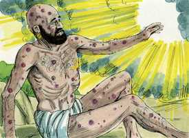

# Jó Cap 38

**1** 	DEPOIS disto o Senhor respondeu a Jó de um redemoinho, dizendo:

> **Cmt MHenry**: *Vv. 1-3.* Jó calou-se, mas não convenceu os seus amigos. Eliú o silenciara; porém, não o levara a reconhecer a sua culpa diante de Deus. Aprouve ao Senhor intervir. O Senhor humilha Jó em seu discurso, e o leva a arrepender-se de suas apaixonadas expressões sobre as providências para com ele. Faz tudo a fim de convidá-lo a que compare a existência de Deus de eternidade a eternidade, com o seu próprio tempo de vida; o conhecimento que Deus tem de todas as coisas é comparado à ignorância de Jó; e o poder de Deus, com a fraqueza de Jó. Obscurecer com nossas atitudes néscias os conselhos da sabedoria de Deus é uma grande provocação para Ele. A fé humilde e a obediência sincera enxergam a vontade de Deus melhor e mais longe.

**2** 	Quem é este que escurece o conselho com palavras sem conhecimento?

 

**3** 	Agora cinge os teus lombos, como homem; e perguntar-te-ei, e tu me ensinarás.

**4** 	Onde estavas tu, quando eu fundava a terra? Faze-mo saber, se tens inteligência.

> **Cmt MHenry**: *Vv. 4-11.* Aqui, Deus demonstra a ignorância de Jó acerca do mar e da terra, para humilhá-lo. Assim como não podemos encontrar defeitos nas obras de Deus, não devemos temê-la. A sua providência e a criação nunca podem ser desfeitas; a redenção não é menos firme, porque dela o mesmo Cristo é o Fundamento e a Pedra Angular. A Igreja está tão firme como a terra.

**5** 	Quem lhe pôs as medidas, se é que o sabes? Ou quem estendeu sobre ela o cordel?

**6** 	Sobre que estão fundadas as suas bases, ou quem assentou a sua pedra de esquina,

**7** 	Quando as estrelas da alva juntas alegremente cantavam, e todos os filhos de Deus jubilavam?

**8** 	Ou quem encerrou o mar com portas, quando este rompeu e saiu da madre;

**9** 	Quando eu pus as nuvens por sua vestidura, e a escuridão por faixa?

**10** 	Quando eu lhe tracei limites, e lhe pus portas e ferrolhos,

**11** 	E disse: Até aqui virás, e não mais adiante, e aqui se parará o orgulho das tuas ondas?

**12** 	Ou desde os teus dias deste ordem à madrugada, ou mostraste à alva o seu lugar;

> **Cmt MHenry**: *Vv. 12-24.* O Senhor interroga Jó, para convencê-lo de sua ignorância, envergonhá-lo por suas atitudes néscias e por dar receitas a Deus. Se desta maneira somos provados, logo reconheceremos que nada sabemos, comparado com o que não sabemos. Pela tema misericórdia de nosso Deus, a Aurora do alto nos visitou, e trouxe luz aos que estão em trevas, cujos corações se modelam com ela, como o barro toma a forma de seu molde ([2 Co 4.6](../47N-2Co/04.md#6)). Asseguremo-nos de que as portas do céu nos sejam abertas do outro lado da morte e, então, não teremos que temer que as portas da morte se abram. E presunçoso de nossa parte não conhecermos a largura da terra, nem nos metermos na profundidade dos conselhos de Deus. Não devemos contar como dia perpétuo o meio-dia mais esplendoroso, nem desejar que a manhã se converta na meia-noite mais tenebrosa; isto se aplica à nossa condição interior e exterior! Que atitude néscia é lutar contra Deus! Muito mais nos interessa procurar a paz com Ele e nos mantermos em seu amor!

**13** 	Para que pegasse nas extremidades da terra, e os ímpios fossem sacudidos dela;

**14** 	E se transformasse como o barro sob o selo, e se pusessem como vestidos;

**15** 	E dos ímpios se desvie a sua luz, e o braço altivo se quebrante;

**16** 	Ou entraste tu até às origens do mar, ou passeaste no mais profundo do abismo?

**17** 	Ou descobriram-se-te as portas da morte, ou viste as portas da sombra da morte?

**18** 	Ou com o teu entendimento chegaste às larguras da terra? Faze-mo saber, se sabes tudo isto.

**19** 	Onde está o caminho onde mora a luz? E, quanto às trevas, onde está o seu lugar;

**20** 	Para que as tragas aos seus limites, e para que saibas as veredas da sua casa?

**21** 	De certo tu o sabes, porque já então eras nascido, e por ser grande o número dos teus dias!

**22** 	Ou entraste tu até aos tesouros da neve, e viste os tesouros da saraiva,

**23** 	Que eu retenho até ao tempo da angústia, até ao dia da peleja e da guerra?

**24** 	Onde está o caminho em que se reparte a luz, e se espalha o vento oriental sobre a terra?

**25** 	Quem abriu para a inundação um leito, e um caminho para os relâmpagos dos trovões,

> **Cmt MHenry**: *Vv. 25-41.* Até aqui Deus fez perguntas a Jó para demonstrar-lhe a sua ignorância; agora, o Senhor mostra a sua fraqueza, como é pouco o que ele sabe, não deveria objetar os conselhos divinos; como é pouco o que pode fazer, não deveria se opor aos caminhos da providência. Observe a suficiente providência divina; ela possui todo o necessário para satisfazer os desejos de todo o ser vivente. O que cuida dos filhotes dos corvos certamente não faltará com o seu povo. Por ser este somente um dentre os muitos exemplos da compaixão divina, nos dá ocasião para pensar quanto bem nosso Deus nos faz a cada dia, muito além do que nos damos conta, cada vez que olhamos em direção às suas perfeições infinitas, deveriamos recordar o seu direito ao nosso amor, o mal de pecar contra Ele, e a necessidade que temos de sua misericórdia e salvação.

**26** 	Para chover sobre a terra, onde não há ninguém, e no deserto, em que não há homem;

**27** 	Para fartar a terra deserta e assolada, e para fazer crescer os renovos da erva?

**28** 	A chuva porventura tem pai? Ou quem gerou as gotas do orvalho?

**29** 	De que ventre procedeu o gelo? E quem gerou a geada do céu?

**30** 	Como debaixo de pedra as águas se endurecem, e a superfície do abismo se congela.

**31** 	Ou poderás tu ajuntar as delícias do Sete-estrelo ou soltar os cordéis do Órion?

**32** 	Ou produzir as constelações a seu tempo, e guiar a Ursa com seus filhos?

**33** 	Sabes tu as ordenanças dos céus, ou podes estabelecer o domínio deles sobre a terra?

**34** 	Ou podes levantar a tua voz até às nuvens, para que a abundância das águas te cubra?

**35** 	Ou mandarás aos raios para que saiam, e te digam: Eis-nos aqui?

**36** 	Quem pôs a sabedoria no íntimo, ou quem deu à mente o entendimento?

**37** 	Quem numerará as nuvens com sabedoria? Ou os odres dos céus, quem os esvaziará,

**38** 	Quando se funde o pó numa massa, e se apegam os torrões uns aos outros?

> **Cmt MHenry**: *[Jó 38](../18A-Jo/38.md#0)*

**39** 	Porventura caçarás tu presa para a leoa, ou saciarás a fome dos filhos dos leões,

**40** 	Quando se agacham nos covis, e estão à espreita nas covas?

**41** 	Quem prepara aos corvos o seu alimento, quando os seus filhotes gritam a Deus e andam vagueando, por não terem o que comer?

> **Cmt MHenry** Intro: *Versículos 1-3: Deus convida Jó a responder. 4-11: Deus interroga Jó; 12-24: Deus pergunta sobre a luz e as trevas; 25-41: Sobre outras obras poderosas.*